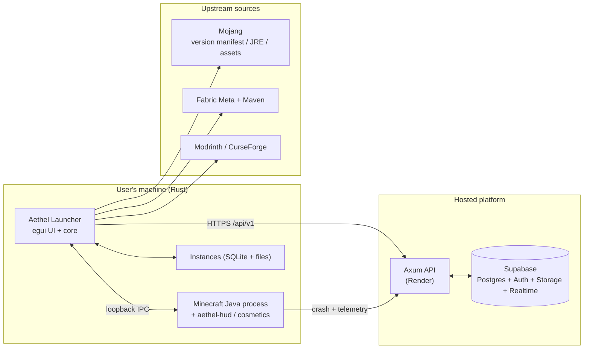
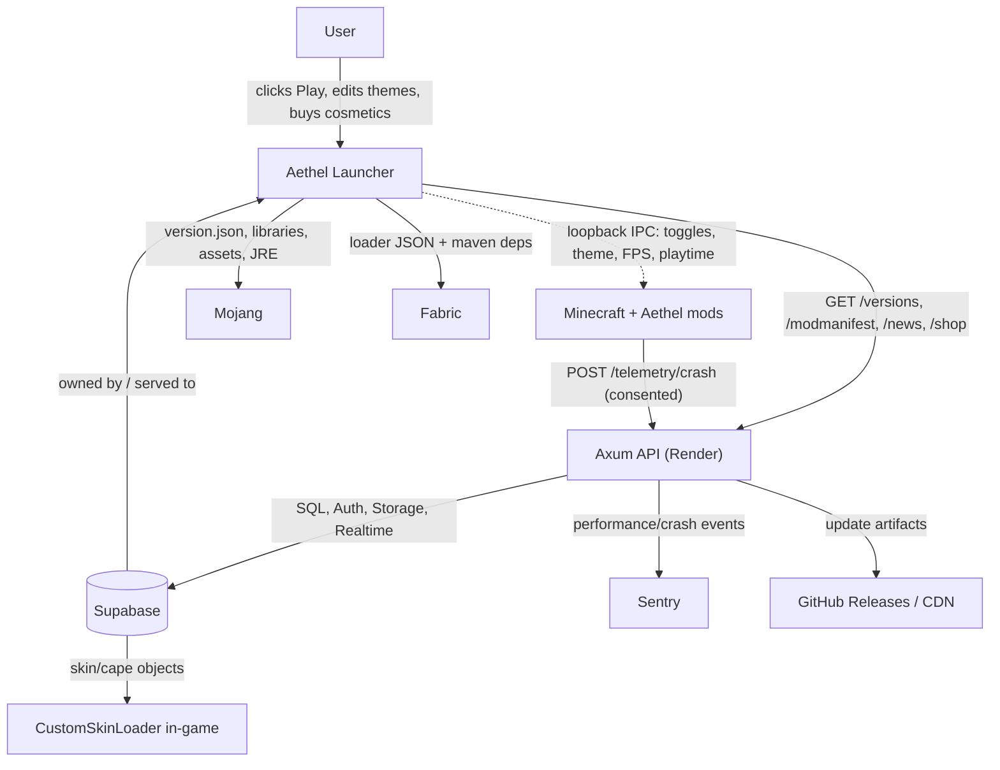
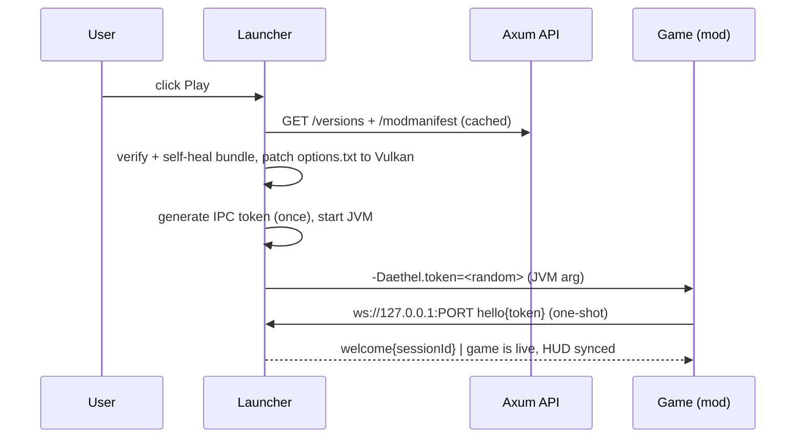

# 00 · Overview

> **Scope of this document.** The single entry point into the Aethel Launcher documentation set: what the
> product is, who it serves, what it deliberately does **not** do, the vocabulary used everywhere else in
> this folder, and the high-level shape of the whole system. Every other document here deepens one slice of
> what is introduced below — follow the `See also →` links to jump into an area.

## Vision

> "A proper Minecraft client like Feather / Lunar / Badlion — with extreme optimization, QoL content,
> an improved visual GUI, and Vulkan rendering that **cannot be removed** — that also runs well on a
> laggy laptop."

Aethel Launcher delivers that as three cooperating pieces:

1. **A Rust launcher** (native, fast, small) that manages everything *outside* the game.
2. **A bundled in-game client** (Fabric mods) that delivers performance, QoL, cosmetics and a custom HUD *inside* the game.
3. **A hosted platform** (Axum on Render + Supabase) that distributes metadata, mods, cosmetics, news, telemetry and updates.

### The three layers, expanded

| Layer | Subsystem | Process | Language | Spec |
|---|---|---|---|---|
| **Launcher** (owns the machine) | `launcher-bin` / `launcher-ui` / `launcher-core` | native binary (`Aethel-<ver>` per OS) | Rust — egui/eframe | [02 · Architecture](./02-architecture.md), [08 · UI design](./08-ui-design.md) |
| **In-game** (owns the render) | `aethel-hud`, `aethel-cosmetics`, perf bundle, CustomSkinLoader | JVM (Minecraft + Fabric loader) | Java / Kotlin via Stonecutter | [07 · Vulkan & performance](./07-vulkan-performance.md), [11 · In-game mods](./11-in-game-mods.md) |
| **Platform** (owns the data) | Axum API, Supabase (Postgres/Auth/Storage/Realtime), Sentry | containers on Render | Rust — Axum | [09 · Backend](./09-backend.md), [10 · Database](./10-database.md) |

The boundaries are deliberately **tidy**: the launcher never draws into the game, the game never talks to the
cloud directly except crash/telemetry endpoints, and the platform never ships code to users (only data —
manifests, hashes, cosmetic files). The one cross-boundary seam is the loopback **IPC channel** over which the
launcher and the game exchange HUD state, toggles, theme tokens and lifecycle events — specced in [12 · IPC](./12-ipc.md).

### The promise, in three bullet points

- **"It just runs the game faster."** A checksum-pinned optimization bundle + a Vulkan-capable renderer is
  selected per Minecraft version and **re-verified and restored on every launch** — the user cannot delete it
  by accident, and performance stays consistent.
- **"It looks and feels like one product."** The launcher and the in-game mod menu share one theme token set
  (`#0B0B0F` base, `#6C5CE7` violet accent, `#00D2FF` cyan) and the launcher pushes live theme changes over IPC.
  See [08 · UI design](./08-ui-design.md) and [18 · In-game click GUI](./18-client-gui.md).
- **"Any version, any time."** The launcher lists **every** Mojang version plus Fabric loader metadata and
  downloads on demand into isolated instances; nothing is pre-bundled except the launcher binary itself
  (installer target `< 15 MB`, see [15 · Updating & distribution](./15-updating-distribution.md)).

### Personas

| Persona | Motivation | Key needs | Success signal |
|---|---|---|---|
| **Casual player** | play with friends on a weak laptop | One-click play, low FPS stutter, familiar UI | Launch-to-title < 30 s cold; ≥ 60 FPS on integrated GPUs |
| **PvP player** | lowest input latency + keystroke/zoom QoL | Toggle sprint, zoom, ping/keystroke HUD, Vulkan renderer | +20% avg FPS over OpenGL baseline ([16 §5](./16-testing.md)) |
| **Cracked / offline user** | servers that allow offline accounts | Zero-effort offline login, skins/cosmetics still visible | Offline auth is the *default* path, no popups |
| **Mod-curious player** | wants Fabric mods without the launcher maze | Clean "Perf pack" toggle + curated bundle | Every bundled mod verified + restorable |
| **Cosmetic buyer** | expresses identity across servers | Store, equip, see items on other Aethel users | Shop round-trip works end-to-end ([09 §2](./09-backend.md)) |

## Goals

| Goal | How we hit it |
|---|---|
| Extreme performance on weak hardware | Vulkan rendering path + optimization mod bundle + auto-tuned JVM/GC flags + RAM detection |
| Vulkan built-in, "can't be deleted" | Bundled renderer pinned by SHA-256, verified on every launch, auto-restored if missing/modified |
| QoL content | Toggle-sprint, zoom, keystrokes, coordinates, FPS, freelook, fullbright, chat tweaks, and more (see [11 · In-game mods](./11-in-game-mods.md)) |
| Improved visual GUI | Custom egui theme, AMOLED dark design system, frameless window, custom fonts (see [08 · UI design](./08-ui-design.md)) |
| Any version, on demand | Versions are listed live from Mojang; a version is downloaded the moment you pick it (see [05 · Launch engine](./05-launch-engine.md)) |
| Works everywhere | Windows, macOS, Linux; x64 + ARM64 |
| Full platform | Accounts, cosmetic shop, news, admin panel, telemetry (see [09 · Backend](./09-backend.md) / [10 · Database](./10-database.md)) |

### Quantified goals (the numbers we defend)

| Metric | Target | Where measured |
|---|---|---|
| Launch-to-title (cold / warm) | < 30 s / < 10 s | `16-testing.md §5`, perf gate on reference laptop |
| Vulkan over OpenGL, same world | ≥ +20% avg FPS, no new micro-stutter class | `07-vulkan-performance.md §6` |
| Installer size | < 15 MB (bundles/jars fetched on demand) | `15-updating-distribution.md §1` |
| Backend idle memory | 5–15 MB RSS; < 50 MB under load | `09-backend.md §6` |
| Cached route throughput | 10k+ rps / hot-cache p50 < 10 ms | `09-backend.md §6` |
| Bundle verification pass | runs before *every* launch, sub-second on warm cache | `07-vulkan-performance.md §2` |
| Updates shipped without a launcher bump | 100 % of bundle/performance hotfixes | bundle is data, not code |

### Versioning model (what the launcher exposes)

| Aspect | Decision |
|---|---|
| Version catalogue | **All** Mojang versions (`release`, `snapshot`, `old_beta`, `old_alpha`) + Fabric loader metadata, refreshed from Mojang/Fabric on a schedule |
| Install trigger | Download-on-demand; nothing pre-fetched at install time |
| Isolation | One instance = one `minecraft/` game dir; shared content-addressed library/asset/runtime caches ([02 §4](./02-architecture.md)) |
| Legacy handling | 1.8.9–1.16.x: separate code path, `jre-legacy` (Java 8), OptiFine or vanilla renderer — no Vulkan ([05 §6](./05-launch-engine.md)) |
| Modern handling | 26.2+: Sodium's native Vulkan; 1.19.4–26.1.x: VulkanMod; both pinned + restored |

## Non-goals (v1)

- ❌ Serverside/cosmetic-enforcement (players who don't run Aethel won't see our cosmetics on other players' heads by default).
- ❌ Bedrock support.
- ❌ A re-host of Mojang content — client JARs, libraries and assets always come from Mojang/Fabric.
- ❌ Bypassing anti-cheat; some servers may reject modified clients (we ship a clean "Vanilla" mode).
- ❌ Full Forge/NeoForge *modded* instance management (only Fabric-optimization bundles; user mods are allowed as add-ons).

### Deferred to v2 / v3 (explicitly parked)

| Capability | Why deferred | Blocking dependency | Target horizon |
|---|---|---|---|
| Bedrock support | Different runtime, no Vulkan story | None — out of product identity | v3 |
| Server-side cosmetic enforcement | Requires all servers to run a mod/plugin | Aethel server plugin ecosystem | v3 |
| Full Forge / NeoForge instance manager | Huge matrix (version × loader × user mods) | Stable mod-dependency resolution | v2 |
| Bundled shader packs / Iris support | Render-fork churn with VulkanMod | Iris Vulkan backend maturity | v2 |
| Linux ARM AppImage + `.deb` | Packaging pipeline not yet built | `cargo-dist` targets | v1.1 |
| `aethel://` deeplink protocol | Security review flagged guessable-handshake risk class ([13 §1](./13-security.md)) | Hardened parser + allowlist | v2 |
| Rich presence (Discord) | Needs IPC → launcher → Discord wiring | — | v2 |
| Anti-cheat-friendly "Ionic"-style toggle for specific servers | Legal/product risk | — | v2 |

### Anti-goals (things we will never do)

- ❌ **No webview, ever.** egui is native; the entire drive-by-JS RCE class dies with it ([13 §1](./13-security.md)).
- ❌ **No server-side modification or "cheat-detect" evasion.** We ship transparent client QoL only.
- ❌ **No mining or reselling of user data.** Telemetry is opt-in and defaults to **off** ([14 · Telemetry](./14-telemetry.md)).
- ❌ **No bundling of Mojang artifacts in our repos or releases.** Everything upstream is fetched from Mojang/Fabric.

## In/Out of scope — coverage matrix

| Area | In scope (v1) | Out of scope (v1) |
|---|---|---|
| Launcher app | Rust/egui desktop app, frameless AMOLED UI, 3 OS | Web/Electron build, mobile |
| Version support | All Mojang versions, on-demand install, isolated instances | CurseForge/Modrinth pack *installs* (search optional) |
| Renderer | Vulkan via bundle + OpenGL fallback + self-heal | Days-one shader packs |
| Mods | Our Fabric mods + curated perf bundle + user `.jar` add-ons | Forge/NeoForge loader mgmt |
| Auth | Offline-first + optional Microsoft OAuth | Mojang (legacy session) auth |
| Platform | Axum API, Supabase, shop, news, telemetry, admin | Full forum/vote hosting (basic only) |
| Distribution | NSIS / dmg / AppImage + `self_update` auto-updater | Homebrew / Flathub (community later) |
| Cosmetics | Skins/capes/elytra via CustomSkinLoader + UniSkinAPI endpoint | Server-authoritative cosmetics |

## Glossary

| Term | Meaning |
|---|---|
| **Instance / Profile** | One isolated game directory (its own mods, saves, options). |
| **Bundle / Mod bundle** | The curated, checksum-pinned set of mods Aethel ships per Minecraft version. |
| **VulkanMod** | xCollateral's Fabric mod rewriting Minecraft's renderer from OpenGL 3.2 → Vulkan 1.2. |
| **Sodium-Vulkan** | Sodium 0.9+ on MC 26.2+, using Minecraft's native graphics-API selector to pick Vulkan. |
| **Manifest** | A JSON document describing what to download (Mojang version / Fabric / Aethel bundle). |
| **IPC** | Local loopback socket between the game process and the launcher. |
| **MSA** | Microsoft Account (OAuth) login, required for real online servers. |
| **Offline / cracked** | Launch without a Microsoft account; works only on offline-capable or cracked servers. |

### Secondary terms used across the docs

| Term | Meaning |
|---|---|
| `$AETHEL_HOME` | Root data dir — `~/.aethel` (Linux/mac) or `%APPDATA%/aethel` (Windows). |
| `managed.json` | Per-instance tamper list: every bundled file + SHA-256 pin + source URL ([07 §2](./07-vulkan-performance.md)). |
| **Self-heal** | Pre-launch restore of any bundled file that is missing or hash-mismatched. |
| **Renderer mode** | `Auto / Vulkan / OpenGL` — per-instance override stored in `instance.toml`. |
| **Install ID** | Random, persisted, non-personal id used for telemetry de-duplication ([14 §4](./14-telemetry.md)). |
| **UniSkinAPI** | Skin/cape JSON API dialect served by our backend for CustomSkinLoader ([09 §2](./09-backend.md)). |
| **Stonecutter** | Gradle plugin for multi-version Fabric mod builds from one source tree. |
| **GoTrue / PostgREST** | Supabase's auth service and auto-REST layer (both sit in front of Postgres). |
| **Update channel** | `stable` / `beta` manifest filter for launcher auto-updates ([15 §5](./15-updating-distribution.md)). |

### Abbreviations

| Abbrev | Full | Notes |
|---|---|---|
| MSA | Microsoft Account | OAuth identity provider for online Minecraft |
| XBL / XSTS | Xbox Live / Xbox Secure Token Service | MSA → Minecraft token chain ([06 §3](./06-auth.md)) |
| JWT | JSON Web Token | Supabase auth token consumed by Axum middleware |
| G1GC | Garbage-First Garbage Collector | default GC for the game JVM ([05 §4](./05-launch-engine.md)) |
| RLS | Row-Level Security | Postgres policy layer Supabase enforces |
| NFR | Non-functional Requirement | performance/reliability budget (§ below) |
| CSP | Content-Security-Policy | where the backend uses strict CORS/allowlists instead |
| SDK | Software Development Kit | e.g. Sentry Rust SDK |
| CDN | Content Delivery Network | Supabase Storage-backed static assets |

## Big picture

### System context (C4-lite)

The C4 system-context view — the same four actors flattened into one diagram, with the **data flows** each edge
carries (arrows labeled by payload, not by protocol):

**Where trust lives (two zones).**

| Zone | Actors | Trust assumptions | Security doc |
|---|---|---|---|
| **Local** (user's machine) | launcher process, game process, IPC socket, `$AETHEL_HOME` | We control install integrity; the user is already code-execution root | [13 · Security](./13-security.md) |
| **Remote** (cloud + upstream) | Axum, Supabase, Sentry, Mojang/Fabric | TLS + pinned hashes; backend never sees MS/MC tokens | [09 §5](./09-backend.md), [13 §2](./13-security.md) |

The launcher↔game IPC token is the only secret that crosses a *process* boundary, and it is random per launch
(32 bytes, `rand`/`getrandom`) — this directly encodes the Lunar-2026-RCE lesson ([01 §7](./01-research.md)):

### Non-functional requirements (NFR budget)

| NFR | Budget | Evidence / gate |
|---|---|---|
| **Latency** | UI input → repaint < 16 ms avg (egui); hot API routes p50 < 10 ms | `16-testing.md` perf gates |
| **Availability** | Launcher works fully **offline** (last-known manifests + cache); backend outage degrades, never blocks play | [02 §6](./02-architecture.md) failure table |
| **Resilience** | Any single download may fail/resume; any bundled file may be restored before launch | [02 §6](./02-architecture.md), [07 §2](./07-vulkan-performance.md) |
| **Privacy** | Telemetry opt-out default; no tokens/chat/world data ever collected | [14 §1](./14-telemetry.md), [13 §6](./13-security.md) |
| **Integrity** | Every artifact SHA-1 (Mojang) / SHA-256 (Aethel) verified before use | [13 §3](./13-security.md) |
| **Portability** | Windows 10+, macOS 12+, Linux (GLIBC 2.28+); x64 + ARM64 | CI matrix [16 §3](./16-testing.md) |
| **Size** | Installer < 15 MB; working set scales with used features | [15 §1](./15-updating-distribution.md) |

## System invariants

These are the rules that **must hold at every moment of every build**; any change that breaks one is a
hard-PR-block regardless of other merits.

| # | Invariant | Guard | Verified by |
|---|---|---|---|
| I-01 | No code ships to users except the launcher binary and our own mods — everything else is data | bundle = manifest + hashes; installer only carries the binary | `managed.json` policy + release pipeline |
| I-02 | Vulkan (or the chosen renderer) is re-established on every launch | verify + self-heal before `options.txt` patch + spawn | [07 §2](./07-vulkan-performance.md) |
| I-03 | The game never talks to the cloud except consented crash/telemetry | IPC-only surface in-game; skin API is content, not upload | [14 §1](./14-telemetry.md) |
| I-04 | No MS/MC tokens ever leave the machine | keyring + memory-only MC token; backend sees neither | [13 §2](./13-security.md) |
| I-05 | The IPC channel is unusable by any third party (including websites) | loopback bind, one-shot random token, no deeplinks | [12](./12-ipc.md), [13 §1](./13-security.md) |
| I-06 | Every file written locally lands either via atomic rename or a resume marker — never a partial read | download `temp` + rename; marker files | [13 §4](./13-security.md) |
| I-07 | Telemetry is opt-out-by-default and any upload payload echoes consent | consent flag in every payload; separate `install_id` | [14 §1](./14-telemetry.md) |
| I-08 | The launcher must remain fully playable with all clouds down | last-known caches + offline auth + local instances | [02 §6](./02-architecture.md) |
| I-09 | Mojang artifacts are never re-hosted or embedded in our repos/releases | downloads stream from Mojang/Fabric URLs only | [04 §3](./04-repository.md) |
| I-10 | One Minecraft session = one accepted IPC connection | one-shot token + single accepted socket | [12 §2](./12-ipc.md) |

**If a design discussion conflicts with an invariant, the invariant wins.** Deviations require a written
proposal that updates both this table and the owning spec (see *Revisiting a decision* below).

## Data inventory & retention

Everything the product touches, who owns it, where it lives, and how long it is kept.

| Data | Owner | Where | Retention / lifecycle |
|---|---|---|---|
| Launcher settings + offline username | local | `$AETHEL_HOME/config.toml` | kept until factory-reset by user |
| Instance configs + `managed.json` | local | `$AETHEL_HOME/instances/<id>/` | per-instance; deleted with instance |
| Mojang libraries / assets / JREs | local cache | shared content-addressed dirs | refcounted; GC'd when refs drop |
| MS refresh token | local keyring | OS keychain (Win Cred Mgr / Keychain / libsecret) | revoked on logout/rotation |
| MC access token | memory only | launch args | killed with JVM |
| Minecraft worlds / saves / mods | user | inside `minecraft/` | never touched by Aethel tooling |
| Platform account profile | Supabase | `profiles` | deleted on "Delete my data" (cascade) |
| Wallet + cosmetic ownership | Supabase | `wallet*`, `cosmetics_owned` | transactional; immutable move log |
| Telemetry/crash | Supabase + Sentry | `telemetry_crashes` + `attachments` | 90-day retention; consent-echoed |
| Skin/cape PNGs | Supabase Storage | `cosmetics` bucket | content-addressed; GC on item unpublish |
| Launcher crash minidumps | Sentry | Sentry project | default Sentry retention |
| Forum/news content | Supabase | `news`, forum tables(v2) | admin-managed |

**Retention principle:** local data belongs to the user and is never silently deleted; remote data is kept
only as long as the feature that created it needs it, and every remote tail (telemetry) is bounded and
deletable in one action ([13 §6](./13-security.md)).

## KPIs & product health

How we will know the product is delivering its vision — product-surface metrics (not just the engineering
NFRs above). Owned by admin dashboards ([10 §4](./10-database.md)).

| KPI | Definition | Indicative target (post-GA) |
|---|---|---|
| Install → first play | session-based funnel | ≥ 70 % reach title within 10 min |
| Crash-free session rate | sessions without a game crash | ≥ 99 % launcher, ≥ 97 % in-game |
| Change-rate of bundled files *before* self-heal | tamper signal | < 1 % of launches |
| Vulkan adoption | launches with renderer=Vulkan | ≥ 70 % of capable GPU launches |
| Offline vs MSA split | start mode distribution | expected ≤ 40 % MSA (honest crack-first) |
| Update adoptability | % of active installs moved to newest launcher version within 7 d | ≥ 80 % |
| Store conversion | shop page views → purchases | ≥ 5 % |
| Support load proxy | help-request turns on instance/renderer topics | trending down |

## Decision log (why we chose X)

Every architectural decision below is locked for v1. The full reasoning (and the research behind each) lives
in [01 · Research](./01-research.md); this table is the executive index.

| # | Decision | Chosen over | Why (1-line essence) | Governs |
|---|---|---|---|---|
| D-01 | **Rust + egui/eframe** | Electron, Tauri+web, QML | Native, tiny, no webview = no JS-RCE surface; themable to the AMOLED design | [03 §Launcher](./03-tech-stack.md), [08](./08-ui-design.md) |
| D-02 | **Vulkan via bundled mods** | Forking the game, Zink, waiting for Mojang | VulkanMod (≤26.1) / Sodium-native-Vulkan (26.2+) is the only *practical* forced path; pin it | [07](./07-vulkan-performance.md), [01 §1](./01-research.md) |
| D-03 | **Bundle is downloaded data, not shipped code** | Embedding mod jars in the installer | Hotfix renders/perf without a launcher release; single source of truth stays server-side | [07 §2](./07-vulkan-performance.md) |
| D-04 | **Tamper-proofing = verify + restore** | Moving game dir, read-only flags, hiding | Users keep full control of `minecraft/`; anything under `managed.json` is restored before launch | [07 §2](./07-vulkan-performance.md) |
| D-05 | **Offline auth first, MSA optional** | Forcing MS login | Cracked/offline is the default path; MS login is an opt-in upgrade, gated on Azure approval | [06](./06-auth.md) |
| D-06 | **Loopback WebSocket IPC + random per-launch token** | Fixed port, unix socket first-shot, HTTP polling | Random token kills guessable-handshake attacks; WS gives real-time incremental frames | [12](./12-ipc.md), [13 §1](./13-security.md) |
| D-07 | **All Mojang versions, on-demand install** | Curated 3-version list | Version-ago players expect any snapshot; on-demand keeps installer slim | [05 §1](./05-launch-engine.md) |
| D-08 | **Axum gateway over direct Supabase calls** | Launcher→Supabase direct | One typed, rate-limited, cached gateway; no DB secrets on clients | [09](./09-backend.md) |
| D-09 | **Supabase (managed Postgres)** | Self-hosted Postgres | Auth+Storage+Realtime+RLS out of the box at low ops cost | [10](./10-database.md) |
| D-10 | **Render (Docker, distroless)** | VPS, K8s | Trivial deploys; 5–15 MB RSS binary fits cheapest tier | [09 §6](./09-backend.md) |
| D-11 | **Fabric (not Forge/Quilt) for the bundle** | Forge, Quilt, Fabric alternatives | Optimization ecosystem (Sodium/VulkanMod/…) is Fabric-first | [07 §3](./07-vulkan-performance.md), [11](./11-in-game-mods.md) |
| D-12 | **CustomSkinLoader + UniSkinAPI endpoint** | Writing our own skin renderer | 15M-download mod already solves offline skins; we only serve the data | [11 §3](./11-in-game-mods.md) |
| D-13 | **`self_update`-style updater** | OS-level updaters, silent struts | Battle-tested binary swap + manifest channel support | [15 §2](./15-updating-distribution.md) |
| D-14 | **G1GC Aikar-style JVM flags; no ZGC** | ZGC, default flags | Measured: ZGC's overhead shows as FPS loss on laptops | [05 §4](./05-launch-engine.md), [01 §9](./01-research.md) |
| D-15 | **SQLite for instance/settings store** | JSON files, sled, redb | Simple, transactional, zero-infra; the real data (worlds/mods) lives in files | [02 §4](./02-architecture.md) |

### Revisiting a decision

Reconsidering a locked decision is a **first-class process**, not an accident:

1. Write the change as a new row in this table (`D-16…`) with "replaces: D-0X".
2. Update the affected spec files (at least the doc that owns the area and this overview).
3. Land the change only with the `16-testing.md` gate that direction re-passing.

No decision in this table may be silently changed inside a feature PR.

## Edge cases

The launcher lives in a messy real world; these are the *known non-happy* situations and the stance for each.
The deep operational variants live in [02 §6](./02-architecture.md) and [05](./05-launch-engine.md).

| Edge case | Stance / response |
|---|---|
| Mojang removes a version from the manifest | Version stays installed if already present; future installs for it show "unavailable with explainer" |
| New Minecraft release with no Vulkan renderer yet | Fall back to Sodium/OpenGL; UI shows renderer-mode badge; bundle manifest can hot-fix without launcher update |
| `managed.json` pin matches a file that is user-modified | Always restore (user mods live **outside** the managed set) |
| User deletes the whole instance folder | Treated as "unmanaged"; launcher offers reinstall or fresh instance |
| Disk full during install | Downloader stops, state persisted, resume on next launch (Range + marker) |
| Antivirus/Windows SmartScreen flags the mods | `.jar`s are data (no code signing for bundles); EULA/licensing notes + restore; launcher binary itself is code-signed |
| Offline username invalid (0 or > 3–16 chars) | Blocked at input; derived UUID stays deterministic ([06 §2](./06-auth.md)) |
| `keyring` unavailable (headless Linux / CI) | Fall back to encrypted file with warning; never plaintext in logs ([13 §2](./13-security.md)) |
| User adds a conflicting mod (e.g. Iris on a Vulkan instance) | Renderer mode + `managed.json` do not manage user jars; conflict surfaced in the "Mods" screen, not silently fixed |
| Two launcher instances start at once | Single-instance lock (`fs2`) — second instance shows "already running" and focuses the first ([13 §4](./13-security.md)) |
| Game launched, launcher closed/crashes | Graceful `shutdown` via IPC then force-kill after grace; on crash the game continues and IPC reconnects are refused (one-shot token) |
| Mojang/Fabric outage during browse | Cache last-known manifest for 15 min; show stale badge; offline play still allowed ([02 §6](./02-architecture.md)) |
| Link rot in upstream CDN (asset 404) | Re-pull canonical manifest; if a known-checksum object 404s, switch to mirror + alert |
| Locale/dir path with non-ASCII or spaces | Tested on CI; `$AETHEL_HOME` resolved via `directories`; no hard-coded separators |

## Failure modes & degraded operation

The product is designed to **fail softly**: play never blocks on the cloud, only on the machine.

| Failure | Severity | Degraded behaviour | Recovers via |
|---|---|---|---|
| Backend (Axum) down | Medium | Cached manifests/bundles/news; store/news disabled; play allowed | Retry + stale badge |
| Supabase down | Medium | Read-through cache serves stale versions/shop; auth (GoTrue) down → platform sign-in blocked, MS/offline Minecraft auth unaffected | Cached responses |
| Mojang/Fabric metadata down | Low–Med | Play from cache; verify-only launch | Lazy re-fetch |
| Bundle file tampered/missing | High (if unnoticed) | **Blocked before launch** — `managed.json` verify fails → self-heal from content cache/download | Auto-restore |
| Vulkan init crash | High | Detect missing renderer-init line → restart suggestion in safe (OpenGL) mode | One-click switch ([08 §Crash](./08-ui-design.md)) |
| MS refresh-token invalid/revoked | Low | Login screen fallback; offline still active | Re-auth |
| Asset/native extraction partial | High | Atomic temp + rename; incomplete = no launch, resume next time | Resume marker |
| Download corruption mid-stream | Low | Re-verify hash; refetch; never trust partial | Retry |

**Escalation paths** — see [14 §6](./14-telemetry.md) for alert routing and [17 §Risks](./17-roadmap.md) for
the tracked risk register.

## Acceptance criteria (v1 release checklist)

Consolidated from every spec file; each checkbox traces to its owning document.

**Launcher core**
- [ ] `cargo run -p launcher-bin -- play vanilla <stable>` launches offline on all 3 OS (CI smoke, [16 §2](./16-testing.md)).
- [ ] Version list shows all Mojang versions + Fabric metadata; on-demand install works cold ([05 §1](./05-launch-engine.md)).
- [ ] Instances are isolated; `managed.json` verify/restore pass; tamper test green ([07 §2](./07-vulkan-performance.md), [16 §4](./16-testing.md)).

**Rendering**
- [ ] Vulkan is the default on capable GPUs (26.2+ Sodium-native; ≤26.1 VulkanMod), OpenGL fallback selectable.
- [ ] Perf gate: Vulkan ≥ +20 % avg over OpenGL, no new stutter class ([07 §6](./07-vulkan-performance.md)).

**Auth**
- [ ] Offline account end-to-end (uuid3, args, no secrets on disk) ([06 §2](./06-auth.md)).
- [ ] Microsoft button presents disabled + "coming soon" tooltip until Azure app approval ([06 §3](./06-auth.md)).

**In-game**
- [ ] `Right Shift` opens mod menu < 150 ms; `Right Alt` enters HUD editor ([18 §9](./18-client-gui.md)).
- [ ] Theme pushed from launcher applies in-game without restart ([18 §6](./18-client-gui.md)).
- [ ] Cosmetics round-trip: equip in store → skin API → CustomSkinLoader → visible ([11 §3](./11-in-game-mods.md)).

**Platform**
- [ ] Axum live on Render, distroless image, healthcheck passing ([09 §4](./09-backend.md)).
- [ ] Shop purchase is idempotent (`request_id`), wallet moves transactional ([10 §6](./10-database.md)).

**Distribution & ops**
- [ ] Release pipeline tag → signed artifacts + `SHA256SUMS` + update manifest ([15 §3](./15-updating-distribution.md)).
- [ ] `cargo audit` clean, `clippy -D warnings` clean, telemetry default-off design verified ([13 §7](./13-security.md)).

## Next steps

- **Read the deep specs:** [01 · Research](./01-research.md) for the evidence base, then [02 · Architecture](./02-architecture.md).
- **Track delivery:** [17 · Roadmap](./17-roadmap.md) milestone map (M0 → M7), definition-of-done, and risk register.
- **Contribute:** repository conventions in [04 · Repository](./04-repository.md); test rules in [16 · Testing](./16-testing.md).