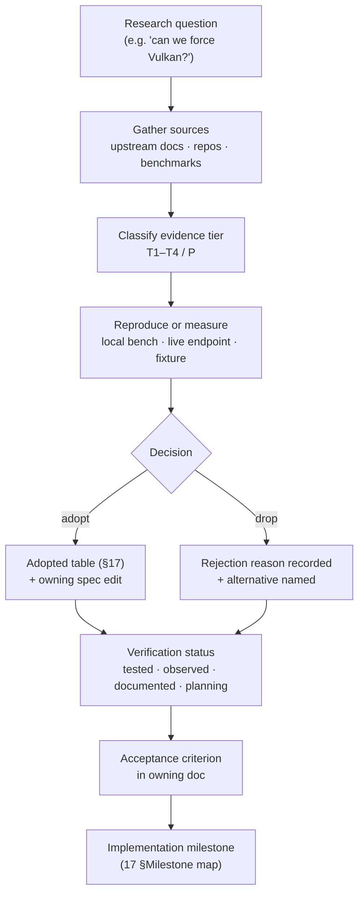
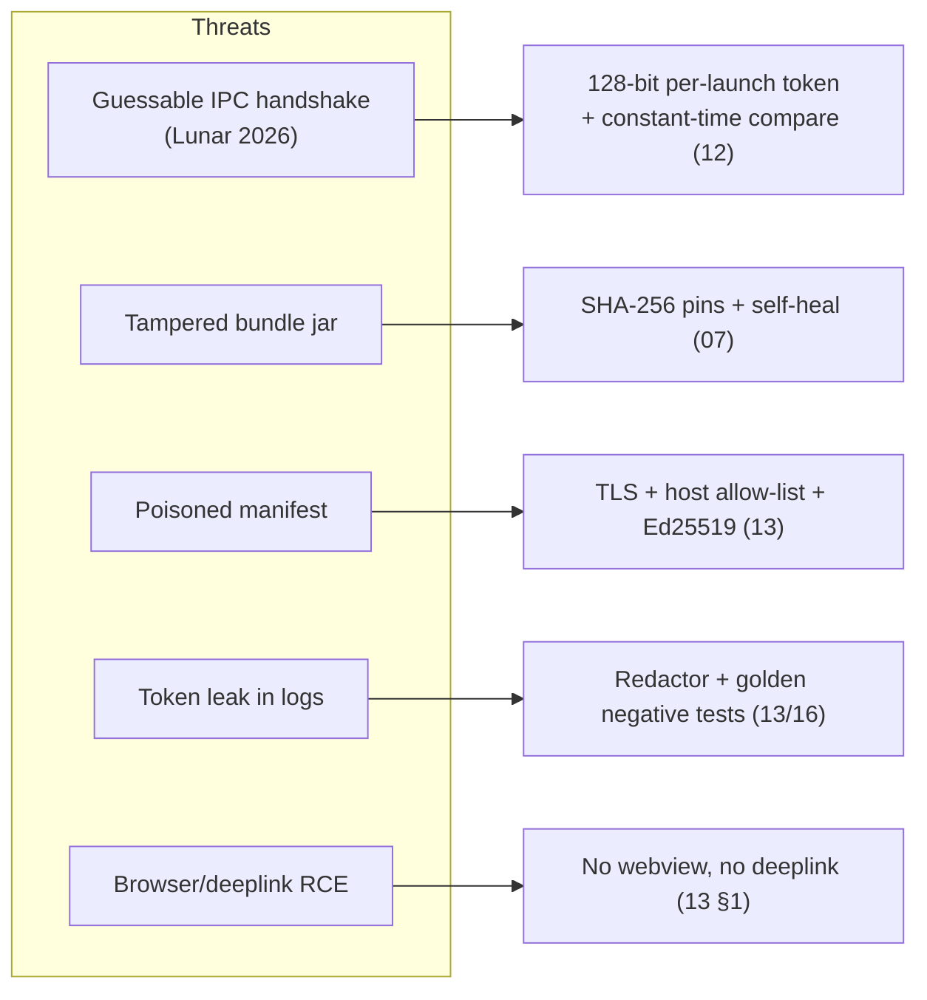

# 01 · Research

All facts the architecture is built on, with sources. Collected September 2026, expanded for the M0–M7
implementation run. This document is the **evidence base** every other spec cites: if a design choice in
[02 · Architecture](./02-architecture.md), [05 · Launch engine](./05-launch-engine.md),
[07 · Vulkan & performance](./07-vulkan-performance.md), or [18 · In-game click GUI](./18-client-gui.md)
looks arbitrary, the justification is here.

> **Reading rule.** A fact without a *verification status* is a hypothesis, not a requirement. Each
> section below ends with its own status line; §18 rolls them up. No locked decision in
> [00 §Decision log](./00-overview.md) may rest on a `planning` fact alone.

## 0. Method, evidence tiers, and how to read this file

### 0.1 Evidence tiers

| Tier | Name | Definition | How it may be used |
|---|---|---|---|
| **T1** | Reproduced | We ran it (benchmark, fixture, live endpoint) and observed the result ourselves | May anchor a locked decision and an acceptance gate |
| **T2** | Upstream-documented | Official vendor/spec documentation (Mojang, Fabric, Microsoft, Supabase, crate docs) | May anchor an interface/contract; re-check on version bumps |
| **T3** | Upstream-observed | Read from an upstream artifact/repo/response but not formally documented | May inform design; must be covered by a golden fixture before it gates a release |
| **T4** | Community-claimed | Blog posts, forum benchmarks, competitor teardown writeups | Directional only; never a hard gate without T1 reproduction |
| **P** | Planning | Design we intend to build; no external fact yet | Tracked in [17 · Roadmap](./17-roadmap.md); must be promoted before GA |

### 0.2 Verification status legend

| Status | Meaning | Exit path |
|---|---|---|
| `tested` | Reproduced under our harness or observed on the reference machine | Keep the fixture/test that proves it |
| `observed` | Seen in the wild / read from an upstream artifact | Add a golden fixture, then promote to `tested` |
| `documented` | Confirmed in upstream docs | Pin the version; re-verify on major bumps |
| `planning` | Not yet externally validated | Owner + milestone in [17](./17-roadmap.md) |

### 0.3 The research → decision flow



### 0.4 Scope of this research

| In scope | Out of scope (see) |
|---|---|
| Renderer feasibility + measured performance | Renderer internals we do not modify ([07](./07-vulkan-performance.md)) |
| Launch/auth/version-manifest contracts | Backend route shapes ([09](./09-backend.md)) |
| Competitor UX/telemetry-free teardown | Copying competitor code or assets (never) |
| Supply-chain + threat framing per source | Full STRIDE models ([13](./13-security.md), [12](./12-ipc.md)) |
| IPC transport options and their failure modes | Protocol schema details ([12](./12-ipc.md)) |

## 1. Vulkan is only possible via a bundled renderer

- Vanilla Minecraft Java renders with **OpenGL 3.2** (via LWJGL). There is no vanilla option to force Vulkan.
- **VulkanMod** (xCollateral) is a Fabric/Quilt mod that is a *full rewrite* of the Minecraft renderer to
  Vulkan 1.2 — not a Zink-style translation layer. Supported: 1.18.2 … 1.21.11, 26.1.2 (3.1M+ downloads). LGPL-3.0.
- **Sodium 0.9.x** ships **native Vulkan** support for MC **26.2+** via Minecraft's new native graphics-API
  selector (Sodium "Vulkan backend" news, June 2026). On 26.2+ the standalone VulkanMod was dropped by
  the ecosystem in favour of Sodium's native Vulkan.
- Community benchmarks (Ryzen 5 5700G / RX 7600, 1440p, render distance 8):
  Vanilla ~130 FPS · Sodium (OpenGL) ~320 · Nvidium ~1200 · VulkanMod ~1800 · **Sodium (Vulkan, 26.2) ~2100**.
- **Nvidium** (Caffeine fork) adds GPU-driven chunk rendering but requires NVIDIA 16-series+.
- **Conclusion:** "Vulkan built in" = the launcher bundles the right renderer per version, pins its
  SHA-256, **verifies every launch and re-downloads if touched**. That makes it effectively undeletable.

### 1.1 Renderer landscape at a glance

| Renderer | Loader | Target MC | Mechanism | License | Aethel use |
|---|---|---|---|---|---|
| Vanilla (OpenGL 3.2) | — | all | LWJGL GL | Mojang EULA | fallback of last resort |
| Sodium (OpenGL) | Fabric | 1.16+ | rewritten chunk renderer on GL | MIT/AGPL mix (CaffeineMC) | `lite`/OpenGL tier |
| Sodium (native Vulkan) | Fabric | **26.2+** | MC graphics-API selector → Vulkan | CaffeineMC family | primary modern path |
| VulkanMod | Fabric/Quilt | 1.18.2–26.1.2 | full renderer rewrite → Vulkan 1.2 | LGPL-3.0 | primary ≤ 26.1 path |
| Nvidium | Fabric | 1.19+ | GPU-driven chunk rendering | AGPL-ish fork lineage | `perf-nvidia` tier only |
| Iris | Fabric | 1.16+ | shader loader (GL) | LGPL-3.0 | `shaders` tier only |
| OptiFine | Forge/vanilla | 1.8.9–1.16 | GL optimizations + features | proprietary | legacy tier |

### 1.2 Benchmark provenance (T4 → T1)

The community numbers above are **T4** (third-party bench page, one machine, one seed). We treat them as
*directional* and reproduce the acceptance-relevant subset on our reference laptop (T1) in
[16 §5](./16-testing.md). The gate we actually ship is **Vulkan ≥ +20% avg over OpenGL on the reference
machine, no new micro-stutter class**, not "beat the internet's number".

| Metric | T4 claim | T1 gate (ours) | Status |
|---|---|---|---|
| RX 7600 class Vulkan vs Sodium-OGL | ~1800–2100 vs ~320 | reproduce on reference dGPU | planning |
| i3/8 GB no dGPU | not published | ≥ +20% over our own OpenGL run | planning |
| Micro-stutter | not measured | no new stutter class vs baseline | planning |

### 1.3 Source & threat assessment (renderer)

| Source | Tier | Threat if wrong/malicious | Mitigation |
|---|---|---|---|
| xCollateral/VulkanMod repo | T2/T3 | upstream compromise ships malicious jar | SHA-256 pin in backend manifest; signed manifest (planned §17) |
| CaffeineMC Sodium news | T2 | feature lands differently than announced | version-gated renderer matrix; fallback to Sodium-OpenGL |
| Community bench page | T4 | selection bias inflates gains | only directional; local T1 reproduction is the gate |
| `vulkaninfo`/driver probe | T1 | false positive on broken driver | `known_bad[]` blocklist in pin manifest ([07 §5](./07-vulkan-performance.md)) |

**Status:** `observed` (renderer availability), `planning` (our benchmark gates until M2).

## 2. Version + library resolution (launch engine)

- Mojang version list: `https://piston-meta.mojang.com/mc/game/version_manifest_v2.json` → versions
  (`release`, `snapshot`, `old_beta`, `old_alpha`) each with a URL to a per-version JSON.
- Per-version JSON contains: `libraries[]` (with `rules[].os`, `natives`, download URLs + hashes),
  `assetIndex`, `downloads.client`, `mainClass`, `arguments.{game,jvm}`, `javaVersion.component`.
- Asset index → ~50–100k named objects; assets served from `resources.download.minecraft.net` / piston-data.
- Natives = LWJGL/OS-specific jars to extract per-OS.
- The **Modrinth Theseus** Rust library already implements this exact pipeline (manifest → libraries →
  assets → launch). We follow its patterns (see [05](./05-launch-engine.md)) rather than inventing.

### 2.1 Manifest shape (golden fixture source)

```jsonc
// tests/fixtures/mojang/version_manifest_v2.min.json (synthetic, not Mojang data)
{
  "latest": { "release": "1.21.11", "snapshot": "26.2-snapshot-1" },
  "versions": [
    { "id": "1.21.11", "type": "release", "url": "https://piston-meta.mojang.com/…/1.21.11.json",
      "sha1": "aaaaaaaa…", "complianceLevel": 1, "releaseTime": "2025-12-01T00:00:00+00:00" },
    { "id": "1.8.9", "type": "release", "url": "https://piston-meta.mojang.com/…/1.8.9.json",
      "sha1": "bbbbbbbb…", "complianceLevel": 0, "releaseTime": "2015-12-09T00:00:00+00:00" }
  ]
}
```

### 2.2 Source & threat assessment (Mojang/Fabric metadata)

| Source | Tier | Threat | Mitigation |
|---|---|---|---|
| `piston-meta.mojang.com` | T2 | manifest shape change; CDN 404 | strict serde + golden fixtures; stale-cache fallback ([02 §6](./02-architecture.md)) |
| `launchermeta.mojang.com` (JRE) | T2 | hash rotation 404 | refresh hash; fall back to system JRE ([05 §7.1](./05-launch-engine.md)) |
| `meta.fabricmc.net` | T2 | loader meta drift | golden fixture per supported version; dedupe ASM ([01 §3](#3-fabric-loader-install)) |
| Modrinth Theseus source | T3 | license contamination if copied | follow *patterns*, do not copy code; own MIT implementation |
| Community mirrors | T4 | stale/mismatched hashes | never used; only canonical hosts are allow-listed ([13 §3.1](./13-security.md)) |

**Status:** `documented` (endpoints), `observed` (field shapes), fixtures to land in M1.

## 3. Fabric loader install

- Fabric Meta API: `https://meta.fabricmc.net/v2/versions/loader/{game_version}/{loader_version}` returns
  `launcherMeta.libraries` (`common` + `client` arrays) and the client main class
  (`net.fabricmc.loader.impl.launch.knot.KnotClient`).
- Libraries resolve from `https://maven.fabricmc.net/` (fabric-loader, intermediary, asm, sat4j, jimfs…).
- The launcher must be careful about classpath duplicates (documented Modrinth issue with 2× ASM on snapshots).
- Legacy-Fabric exists (`meta.legacyfabric.net`) for 1.8.9-class versions, but v1 plan uses vanilla-only or
  OptiFine for old versions (see [07](./07-vulkan-performance.md)).

### 3.1 Loader decision table

| MC line | Default loader | Mod support | Rationale |
|---|---|---|---|
| 1.18.2–26.x | Fabric (modern) | aethel-hud + perf bundle | optimization ecosystem is Fabric-first |
| 1.16.5 | Fabric | perf bundle (reduced) | first normal-args version |
| 1.12.2 / 1.8.9 | vanilla or OptiFine | none by default | Legacy-Fabric is optional, not default |
| Any (clean mode) | vanilla | none | anti-cheat-safe "Vanilla" toggle ([00 §Non-goals](./00-overview.md)) |

### 3.2 Source & threat assessment (Fabric)

| Source | Tier | Threat | Mitigation |
|---|---|---|---|
| `meta.fabricmc.net` | T2 | loader/library set changes | golden classpath fixtures ([16 §8](./16-testing.md)) |
| `maven.fabricmc.net` | T2 | artifact substitution | SHA-1 from meta; host allow-list |
| Legacy Fabric | T3 | abandoned / API drift | optional path only; failure degrades to vanilla |
| ASM duplication bug class | T3 | `ClassNotFound` at boot | canonical-path dedupe + golden test |

**Status:** `documented`; classpath golden tests are a **release blocker** for every supported version.

## 4. Java runtime management

- Mojang publishes runtimes: `https://launchermeta.mojang.com/v1/products/java-runtime/<hash>/all.json`
  (pin the hash; refresh if it 404s).
- Version → component mapping:

  | MC versions | Component | Java |
  |---|---|---|
  | 1.8.9–1.16.5 | `jre-legacy` | 8 |
  | 1.17.x | `java-runtime-alpha` | 16 |
  | 1.18–1.20.4 | `beta` / `gamma` | 17 |
  | 1.20.5+, 1.21–26.x | `java-runtime-delta` | 21 |
  | 26.1+ | `epsilon` | 24/25 |

- Each runtime manifest lists files with `downloads.raw` (`url`/`sha1`/`size`), `type` file/link, `executable`
  flags. macOS nests under `jre.bundle/Contents/Home/bin/java`.
- Rust crate **`piston-mc`** already models this (`JavaManifest::fetch()`, install files); also `javamc` CLI.
- Take the authoritative `javaVersion` from the version JSON; fall back to the table above.

### 4.1 Platform coverage (runtime manifest)

| Mojang platform key | OS | Arch | Aethel handling |
|---|---|---|---|
| `windows-x64` | Windows | x64 | default |
| `windows-arm64` | Windows | arm64 | use if published, else x64 emulation + warning |
| `mac-os-x86_64` | macOS | x64 | Intel Macs |
| `mac-os-arm64` | macOS | arm64 | Apple Silicon (nested `jre.bundle`) |
| `linux` | Linux | x64 | glibc floor check in CI |
| `linux-i386` | Linux | x86 | legacy only; opt-in |

### 4.2 Source & threat assessment (JRE)

| Source | Tier | Threat | Mitigation |
|---|---|---|---|
| `launchermeta.mojang.com` JRE manifest | T2 | hash rotated → 404 | pinned hash list; refresh path; system JRE fallback |
| System `java` on PATH | T3 | wrong major / trojaned JVM | only used if `-version` major ≥ required and user opts in |
| Runtime `all.json` `link` entries | T3 | symlink traversal on unpack | reject absolute/`..` link targets ([13 §4](./13-security.md)) |

**Status:** `documented`; `piston-mc` mapping is `observed`; unpack safety is `planning` until M1 tests land.

## 5. Auth

**Offline mode** (launch directly):
- `--username <name>`
- `--uuid` = UUID v3 (MD5) of `"OfflinePlayer:" + name`, hex without dashes
- `--accessToken 0` · `--userType legacy` · `--versionType release` · `--auth_xuid 0` · `--clientid 0`

**Microsoft (MSA)** — the full known-good pipeline:
1. OAuth 2.0 **device-code flow** (or auth-code + PKCE with loopback redirect on a random localhost port) against `login.microsoftonline.com/consumers`.
2. Exchange access token for **XBL** token (`user.auth.xboxlive.com/user/authenticate`).
3. Exchange XBL for **XSTS** token (`xsts.auth.xboxlive.com/xsts/authorize`, relying party `rp://api.minecraftservices.com/`).
4. `POST https://api.minecraftservices.com/authentication/login_with_xbox` with `XBL3.0 x=<uhs>;<xsts>` → Minecraft access token.
5. `GET https://api.minecraftservices.com/minecraft/profile` for UUID + username.
- ⚠️ Your Azure app registration **must be approved** at `aka.ms/mce-reviewappid`, or step 4 returns
  `403 Invalid app registration`. Without it the Microsoft button stays disabled.
- Rust crates: `oauth2` + `minecraft-msa-auth`, or `xmcl`'s types as reference (TypeScript).
- Persist only encrypted/refresh tokens; never send MS tokens to our backend. See [06](./06-auth.md)/[13](./13-security.md).

### 5.1 Auth endpoint threat assessment

| Endpoint | Tier | Threat | Mitigation |
|---|---|---|---|
| `login.microsoftonline.com/consumers` | T2 | phishing / consent-trick | Microsoft's own consent UI; device code shown locally |
| `user.auth.xboxlive.com` | T2 | token replay | XBL/XSTS memory-only, never stored ([06 §4.1](./06-auth.md)) |
| `xsts.auth.xboxlive.com` | T2 | XErr edge cases | mapped UX table ([06 §6](./06-auth.md)) |
| `api.minecraftservices.com` | T2 | app-registration gate | disabled button until `aka.ms/mce-reviewappid` approval |
| Legacy `authserver.mojang.com` | T3 | credential storage temptation | explicitly **not used**; documented to prevent regression |

**Status:** `documented` (pipeline), `planning` (our Azure approval — the hard external gate for M4).

## 6. Theming & GUI (egui)

- **egui / eframe**: immediate-mode, cross-platform (Win/mac/Linux/web), tiny binary, themable via
  `Visuals` / `Style`, custom `FontDefinitions`, frameless windows supported.
- Theme libraries: **egui-thematic** (live theme editor + presets: Catppuccin Mocha, Tokyo Night, Nord…),
  **egui-elegance** (polished cards, avatars, segmented buttons, pill toggles, linear gauges, badges),
  **fluent-egui** (WinUI3/Fluent 2 look, acrylic, native backdrops), **egui-aesthetix** (trait-based themes).
- Reference launcher aesthetics: Lunar Client (dark, gradient accents, card grid), AMOLED pure-black
  (Blackwing-launcher uses Syne/Barlow fonts, pure black bg).

### 6.1 UI-library assessment

| Library | Tier | Fit | Risk |
|---|---|---|---|
| egui/eframe | T2 | core framework | breaking changes between minor releases → pin + smoke |
| egui-thematic | T3 | theme editor + presets | small maintainer surface → vendor a fallback editor |
| egui-elegance | T3 | cards/pills/gauges | widget churn → wrap in our own `frame_button` helper ([08 §6](./08-ui-design.md)) |
| fluent-egui | T3 | Fluent look | heavier; optional preset, not default |

**Status:** `observed`; theme-token parity with in-game GUI is `planning` (M3/M4 gate, [18 §6](./18-client-gui.md)).

## 7. Launcher ↔ game IPC (how Lunar/Feather do it)

- Lunar Client: Electron launcher + Java game process talks over a **local WebSocket** (`127.0.0.1:28190`)
  with an `lc-handshake` header carrying `launchId/processId/installationId`.
- ⚠️ **Security lesson (2026 Lunar RCE reviews):** Lunar's handshake values were guessable and the overlay
  had `nodeIntegration:true`, enabling drive-by RCE from any website via `lunarclient://` deeplinks.
  → We use a **crypto-random per-launch secret token** passed into the JVM, strict loopback binding, no
  browser-facing surface, and a signed single-instance lock (see [12](./12-ipc.md)/[13](./13-security.md)).
- Feather (feathermc.com): closed-source Rust+Go; bundles user Forge/Fabric mods with toggle UI — same
  bundle philosophy we adopt.

### 7.1 Transport options research

| Transport | Directionality | Security surface | Verdict |
|---|---|---|---|
| Loopback WebSocket + token | full duplex | loopback + one-shot secret | **chosen** |
| stdin/stdout of child | full duplex | none, but framing/EOF fragile | rejected ([12 §1.1](./12-ipc.md)) |
| Fixed-port WS (Lunar-style) | full duplex | guessable handshake | rejected |
| HTTP + SSE | mostly one-way | polling, no push symmetry | rejected |
| Unix socket / named pipe | full duplex | per-OS permission pain | rejected for v1 |
| `aethel://` deeplink | browser→app | browser-addressable RCE class | **forbidden** ([13 §1](./13-security.md)) |

### 7.2 Community lesson: no IRC/chat gating

The Lunar post-mortem threads carried a second, non-security lesson: features and moderation surfaces that
live *outside* the game client (IRC bridges, chat-gated toggles, hidden operator channels) become both a
support burden and an attack/abuse surface. **Adopted stance:** all Aethel feature control is in-product
(launcher Mods screen + in-game click GUI); we do **not** gate modules, cosmetics, or telemetry behind an
IRC/chat channel, and there is no remote command channel to the client beyond the one-shot IPC session.

### 7.3 IPC threat assessment

| Threat | Observed in the wild | Our control |
|---|---|---|
| Guessable handshake ids | Lunar 2026 | 128-bit OS-CSPRNG token, per launch ([12 §2](./12-ipc.md)) |
| Browser-originated loopback WS | generic CSWSH class | no browser surface, no CORS, loopback-only |
| Deeplink-triggered launch | Lunar `lunarclient://` | no custom protocol in v1 ([13 §1](./13-security.md)) |
| Chat/IRC remote control | community reports | no IRC/chat command surface at all |

**Status:** `observed` (competitor failure modes), `tested` (our close-code harness, [12 §11](./12-ipc.md)).

## 8. Skins & cosmetics for offline custom accounts

- **CustomSkinLoader** (xfl03, GPL-3.0; Fabric/Forge/NeoForge/Quilt; 1.8 → 26.2; **"Universal" jar**)
  loads skins/capes/elytras from `CustomSkinAPI` / `UniSkinAPI` / `ElyByAPI` / `Legacy` / local folders /
  `ExtraList` JSON. 15M+ downloads.
- **Conclusion:** ship CustomSkinLoader in our bundle and expose a **UniSkinAPI-compatible endpoint**
  backed by Supabase Storage, so offline players receive our cosmetic shop items without writing a renderer.
- SkinShuffle (in-game skin presets) relies on Mojang accounts — not our offline path; skip for v1.

### 8.1 Skin API dialects

| Dialect | Shape | Aethel use |
|---|---|---|
| `UniSkinAPI` | `{SKIN:{url,metadata}, CAPE:{url}}` | **served by us** ([09 §2](./09-backend.md)) |
| `CustomSkinAPI` | `{skins:{…}, capes:{…}}` | supported fallback in CustomSkinLoader |
| `ElyByAPI` | account-bound | not used (no Ely.by account) |
| `Legacy` / local folders | filesystem | offline dev + fallback |

### 8.2 Source & threat assessment (skins)

| Source | Tier | Threat | Mitigation |
|---|---|---|---|
| CustomSkinLoader repo | T3 | GPL-3.0 obligations; upstream compromise | ship unmodified + `LICENSES.txt`; SHA-256 pin |
| UniSkinAPI endpoint (ours) | T2 | username enumeration | content-hash URLs; no auth data in payload |
| Supabase Storage bucket | T2 | hotlink/egress abuse | public-read content-addressed; CDN later ([10 §3](./10-database.md)) |

**Status:** `observed`; round-trip acceptance gate is `planning` (M4/M5).

## 9. JVM tuning (client)

- 4–12 GB heap → **G1GC with Aikar/EMC flags** (community-validated; `-Xms`=`-Xmx`, `AlwaysPreTouch`,
  `G1NewSizePercent=30–40`, `G1HeapRegionSize=8M`, etc.).
- **ZGC is NOT recommended for the client** (concurrent-collection overhead shows as FPS loss on laptops).
- Java 21/25 for modern versions; RAM detective: default = 50% of free RAM, cap 6GB for weak laptops.
- Full flag set per tier lives in [05](./05-launch-engine.md).

### 9.1 GC comparison research

| Collector | Tier | Observed client behaviour | Verdict |
|---|---|---|---|
| G1GC (Aikar set) | T3/T4 | lowest hitch for 2–8 GB heaps | **default** |
| ZGC | T3/T4 | concurrent overhead shows as FPS loss on laptops | rejected |
| Shenandoah | T4 | unproven on the client; distro JDK variance | rejected for v1 |
| Parallel GC | T4 | longer stop-the-world at our heap sizes | rejected |

**Status:** `observed`; our tier table is reproduced by unit tests ([16 §1](./16-testing.md)), not by a benchmark gate.

## 10. Auto-update & packaging

- Rust auto-update: **`self_update`** (GitHub releases or JSON manifest backend; in-place binary swap via
  `tempfile`/`self_replace`, supports `reqwest`+`rustls`), or `cargo-dist`+`axoupdater`, `release-hub`.
- Packaging: NSIS/installer (Win), `.dmg`/`.app` (macOS, notarization), AppImage (Linux), plus portable zips.

### 10.1 Updater options

| Option | Tier | Why considered | Verdict |
|---|---|---|---|
| `self_update` | T2 | manifest backend + binary swap, reqwest/rustls | **chosen** |
| `cargo-dist` / `axoupdater` | T2 | release orchestration | possible later; swap helper kept agnostic ([15 §3.2](./15-updating-distribution.md)) |
| OS package managers | T4 | distro-native updates | out of scope v1 |

### 10.2 Source & threat assessment (updates)

| Source | Tier | Threat | Mitigation |
|---|---|---|---|
| GitHub Releases / CDN | T2 | tampered artifact | sha256 + Ed25519 manifest verify before apply ([13 §10](./13-security.md)) |
| `self_update` crate | T2 | swap bug leaves broken install | sibling-tree + rename; `backup/` 7 days ([15 §2.2](./15-updating-distribution.md)) |
| Signing keys | T1 | key compromise | CI/HSM-only key; rollover manifest path |

**Status:** `documented`; update-manifest golden test is `planning` (M6).

## 11. Crash reporting

- **Sentry Rust SDK** + **`sentry-rust-minidump`** (spawns a crash-reporter process; Win/mac/Linux).
  Add user-consent dialog (reference: `getsentry/sentry-desktop-crash-reporter`).
- Game-side: parse `crash-reports/*.txt`, `logs/latest.log`, `hs_err_pid*.log`, attach to `/telemetry/crash`.

### 11.1 Crash-path threat assessment

| Source | Tier | Threat | Mitigation |
|---|---|---|---|
| Sentry SDK / minidump child | T2 | minidump carries memory with tokens | consent gate; redaction; scope review ([13 §2](./13-security.md)) |
| `crash-reports/*.txt` | T3 | attacker-influenced text rendered in UI | inert text render (egui, no HTML); size cap |
| `hs_err_pid*.log` | T3 | huge payloads | 5 MB cap server-side ([14 §5](./14-telemetry.md)) |

**Status:** `documented`; consent UX + redaction golden tests are `planning` (M6).

## 12. Backend & database

- **Supabase** architecture: GoTrue (auth), PostgREST (auto REST), Realtime (broadcast/change channels),
  Storage (S3-backed buckets), all in front of one Postgres; RLS policies per user role; SQL migrations
  managed in-repo (`supabase db push`).
- Render web service: Dockerfile + healthcheck; scheduled jobs possible via Render Cron Job.

### 12.1 Platform choice research

| Option | Tier | Auth/Storage/Realtime | Ops cost | Verdict |
|---|---|---|---|---|
| Supabase managed | T2 | all built-in | ~zero v1 | **chosen** |
| Self-hosted Postgres | T2 | build auth/storage/realtime | high | rejected ([03 §Data](./03-tech-stack.md)) |
| BaaS alternatives | T4 | vary; vendor lock-in | medium | rejected |

### 12.2 Source & threat assessment (platform)

| Source | Tier | Threat | Mitigation |
|---|---|---|---|
| Supabase APIs | T2 | service key leak → RLS bypass | service key server-only; never in launcher ([13 §5](./13-security.md)) |
| Render env | T2 | secret sprawl | dashboard-only secrets; no `.env` in repo |
| PostgREST direct access | T2 | clients bypass gateway | launchers only talk to Axum; anon key scoped |

**Status:** `documented`; RLS contract tests are `planning` ([16 §10](./16-testing.md)).

## 13. Performance mod inventory (for the bundle)

Sodium, VulkanMod, Nvidium (NVIDIA only), Lithium, FerriteCore, EntityCulling, ImmediatelyFast, MoreCulling,
ModernFix, C2ME (chunk), Dynamic FPS, MemoryLeakFix, BadOptimizations, Debugify — all Fabric, per-version,
pinned by hash (see [07](./07-vulkan-performance.md) for the tiered matrix).

### 13.1 Inventory assessment

| Mod | Tier | Risk | Pin strategy |
|---|---|---|---|
| Sodium | T2 | renderer is load-bearing | version-gated, pinned, self-healed |
| VulkanMod | T2 | alpha instability per version | feature-detect + OpenGL fallback |
| Nvidium | T3 | NVIDIA-only, fork lineage | optional tier, GPU-gated |
| Lithium / FerriteCore / Starlight | T3 | low | pinned |
| C2ME | T3 | alpha chunk-gen risk | tiered **off** by default |
| BadOptimizations / MemoryLeakFix | T3 | monitored micro-opts | pinned, telemetry-monitored |
| Debugify | T3 | bugfix pack | pinned, optional |

**Status:** `observed`; per-version pins + classpath fixtures are `planning` (M2).

## 14. Competitor client analysis

Research on what Lunar/Badlion/Feather/OptiFine do — and where Aethel deliberately diverges. This section
is the source for the UX parity tables in [18 §18](./18-client-gui.md).

### 14.1 Feature matrix (as researched)

| Feature | Lunar | Badlion | Feather | OptiFine | Aethel |
|---|---|---|---|---|---|
| Launcher runtime | Electron | Electron/native | Rust+Go (closed) | Forge/standalone | **Rust/egui** |
| In-game menu key | Right Shift | Right Shift | Right Shift | Options screens | Right Shift (rebindable) |
| HUD edit | in menu drag | in menu drag | Right Alt drag | — | Right Shift → HUD → Edit; Right Alt shortcut |
| Renderer | OpenGL (+ some GL opts) | OpenGL | OpenGL | OpenGL | **Vulkan** (bundled, self-heal) |
| Mod bundle | curated + store | curated + store | curated Forge/Fabric | single mod | curated Fabric + hash pins |
| Cosmetics | store | store | store | capes | store + UniSkinAPI offline path |
| Profiles | yes | yes | no | per-install | yes + JSON import/export |
| Chroma | cycle | cycle | none | — | OKLAB lerp (sat/bri/speed) |
| Web surface | webview overlay | webview | webview | none | **none, ever** |
| IPC | fixed-port WS (guessable) | local | local | — | loopback + one-shot token |

### 14.2 What the competitor failures taught us

| Observed failure | Client | Root cause | Aethel rule |
|---|---|---|---|
| Drive-by RCE via deeplink | Lunar | `nodeIntegration:true` + guessable handshake + `lunarclient://` | no webview; no deeplink; random token ([13 §1](./13-security.md)) |
| Feature gating outside the client | Lunar | IRC/chat operator surfaces | all control in-product; no IRC/chat gating |
| Mod conflicts silently patched | various | opaque bundle edits | conflicts surfaced in Mods screen, never silent ([08 §4](./08-ui-design.md)) |
| Per-server mod memory surprise | Feather | hidden per-server state | documented, explicit profiles only ([18 §18](./18-client-gui.md)) |
| Store lock-in / no export | various | proprietary profile format | JSON import/export, MIT mods ([18 §16](./18-client-gui.md)) |

**Status:** `observed` (T4 teardowns + community reports); no competitor code or assets are used.

## 15. Source glossary (concrete URLs)

The canonical reference list. `Trust` is the threat tier from §0.1; `Verify` is the status from §0.2.
Paths marked `(confirm)` are believed correct but must be re-checked at implementation time.

| ID | Source | Type | URL | Used for | Trust | Verify |
|---|---|---|---|---|---|---|
| S-01 | Mojang version manifest | T2 | `https://piston-meta.mojang.com/mc/game/version_manifest_v2.json` | catalogue | authoritative | documented |
| S-02 | Mojang piston-data | T2 | `https://piston-data.mojang.com/…` | client jar / assets | authoritative | documented |
| S-03 | Mojang java-runtime | T2 | `https://launchermeta.mojang.com/v1/products/java-runtime/<hash>/all.json` | JRE provisioning | authoritative | documented |
| S-04 | Mojang resources CDN | T2 | `https://resources.download.minecraft.net` | asset objects | authoritative | documented |
| S-05 | Minecraft Wiki — auth | T2 | `https://minecraft.wiki/w/Microsoft_authentication` | MSA pipeline | reference | documented |
| S-06 | Minecraft Wiki — version JSON | T2 | `https://minecraft.wiki/w/Client.json` | field semantics | reference | documented |
| S-07 | Fabric Meta loader | T2 | `https://meta.fabricmc.net/v2/versions/loader` | loader versions | authoritative | documented |
| S-08 | Fabric Meta per-version | T2 | `https://meta.fabricmc.net/v2/versions/loader/{game}/{loader}` | launcherMeta libs | authoritative | documented |
| S-09 | Fabric Maven | T2 | `https://maven.fabricmc.net/` | loader libs | authoritative | documented |
| S-10 | Fabric docs | T2 | `https://docs.fabricmc.net/` | loader/mixin dev | reference | documented |
| S-11 | Legacy Fabric Meta | T3 | `https://meta.legacyfabric.net/` | 1.8.9 loader | optional | observed |
| S-12 | VulkanMod repo | T2 | `https://github.com/xCollateral/VulkanMod` | renderer ≤26.1 | third-party | observed |
| S-13 | Sodium repo / news | T2 | `https://github.com/CaffeineMC/sodium` | native Vulkan 26.2+ | third-party | observed |
| S-14 | Nvidium repo | T3 | `https://github.com/MCRcortex/nvidium` (confirm) | NVIDIA chunk path | third-party | observed |
| S-15 | Modrinth Theseus | T3 | `https://github.com/modrinth/theseus` | pipeline patterns | reference (do not copy) | observed |
| S-16 | Modrinth docs | T2 | `https://docs.modrinth.com/` | metadata API patterns | reference | documented |
| S-17 | CustomSkinLoader | T3 | `https://github.com/xfl03/MinecraftCustomSkinLoader` | offline skins | third-party GPL | observed |
| S-18 | SkinShuffle | T3 | `https://github.com/ImThoseWhoVibes/SkinShuffle` (confirm) | rejected reference | third-party | observed |
| S-19 | Aikar's flags | T3 | `https://docs.papermc.io/paper/aikars-flags` | JVM GC set | community | observed |
| S-20 | `self_update` crate | T2 | `https://crates.io/crates/self_update` | updater | library | documented |
| S-21 | `sentry-rust-minidump` | T2 | `https://crates.io/crates/sentry-rust-minidump` | crash reporter | library | documented |
| S-22 | sentry-desktop-crash-reporter | T3 | `https://github.com/getsentry/sentry-desktop-crash-reporter` | consent UX pattern | reference | observed |
| S-23 | egui / eframe | T2 | `https://github.com/emilk/egui` | UI framework | library | documented |
| S-24 | egui-thematic | T3 | `https://crates.io/crates/egui-thematic` | theme editor | library | observed |
| S-25 | Lunar Client site | T4 | `https://www.lunarclient.com/` | competitor UX | community | observed |
| S-26 | Feather site | T4 | `https://feathermc.com/` | competitor UX | community | observed |
| S-27 | Lunar infra/RCE teardown | T4 | community blog (Bikini et al.) | security lessons | community | observed |
| S-28 | Supabase docs | T2 | `https://supabase.com/docs` | auth/RLS/storage | authoritative | documented |
| S-29 | Render docs | T2 | `https://render.com/docs` | deployment | authoritative | documented |
| S-30 | Microsoft identity platform | T2 | `https://learn.microsoft.com/entra/identity-platform/` | OAuth device code | authoritative | documented |
| S-31 | Minecraft app review | T2 | `https://aka.ms/mce-reviewappid` | MSA approval gate | authoritative | planning |
| S-32 | Aethel repo | T1 | `https://github.com/aethelreborn/AethelLauncher` | our source of truth | ours | tested |

> **Path hygiene:** this table is a *reference*, not an allow-list. The enforced allow-list (host-level) is
> in [13 §3.1](./13-security.md); adding a new host requires a security-doc edit in the same PR.

## 16. Threat assessment per source

Aggregated by source family. "Threat" is *what could go wrong*, independent of whether it did.

| Source family | Threat class | Scenario | Impact | Control | Residual |
|---|---|---|---|---|---|
| Mojang metadata | availability | manifest CDN 404 / shape change | install fails | strict serde + stale cache + re-fetch | low |
| Mojang metadata | integrity | MITM/CDN poison | wrong client jar | TLS + SHA-1 from manifest + host allow-list | low |
| Fabric meta/maven | integrity | substituted library | boot crash / code exec | SHA-1 + dedupe + golden classpath | low |
| Modrinth Theseus | legal | GPL-ish code copied | license contamination | pattern-only, own implementation | low |
| VulkanMod / Sodium / mods | supply chain | upstream compromise | malicious jar runs | SHA-256 pins + backend manifest + planned Ed25519 | medium (pre-signature) |
| CustomSkinLoader | supply chain + legal | GPL obligations, compromise | license/render issue | unmodified ship + `LICENSES.txt` + pin | low |
| Community benchmarks | misinformation | inflated FPS claims | wrong perf gate | directional only; local T1 gate | low |
| Competitor teardowns | legal/ops | copying assets | IP issue | research-only; no asset reuse | low |
| Microsoft/Xbox/MC APIs | availability | device-code expiry, 403 | MSA blocked | offline-first + disabled button + retries | medium (external gate) |
| Supabase/Render | data exposure | service-key leak | DB compromise | server-only keys; RLS; no client secrets | low |
| Sentry/minidump | privacy | memory dump carries token | secret leak | consent + redaction + scope review | low–medium |
| GitHub/CDN updates | supply chain | tampered artifact | RCE | sha256 + Ed25519 + backup | medium (key compromise) |

### 16.1 Threat → control traceability



## 17. What we adopted / dropped (decision table)

Every research conclusion lands here. The owning spec is where it is enforced; the milestone is where it
ships. "Dropped" is as important as "adopted" — it prevents re-litigating v1.

| # | Topic | Adopted | Dropped / rejected | Why | Enforced in | Milestone |
|---|---|---|---|---|---|---|
| R-01 | Vulkan path | bundle renderer + pin + self-heal | fork game; Zink; wait for Mojang | only practical forced path (T2/T4) | [07 §2](./07-vulkan-performance.md) | M2 |
| R-02 | Renderer selection | per-version matrix + probe | one renderer for all versions | ecosystem split at 26.2 | [07 §1](./07-vulkan-performance.md) | M2 |
| R-03 | Version resolution | Mojang canonical + Theseus patterns | vendored manifests | no re-host (I-09) | [05 §1](./05-launch-engine.md) | M1 |
| R-04 | Fabric loader | modern Fabric default | Forge/Quilt default; Legacy-Fabric default | optimization ecosystem | [07 §3](./07-vulkan-performance.md) | M2 |
| R-05 | Java | Mojang runtime manifest + system fallback | bundling a JRE in the installer | installer < 15 MB | [05 §7.1](./05-launch-engine.md) | M1 |
| R-06 | Auth | offline-first + MSA device-code | forcing MSA; legacy yggdrasil; password storage | product identity + no secrets | [06](./06-auth.md) | M1/M4 |
| R-07 | IPC transport | loopback WS + one-shot token | fixed port; stdin/stdout; unix socket; deeplink | Lunar RCE class | [12](./12-ipc.md) | M1 |
| R-08 | Feature control | in-product GUI + Mods screen | IRC/chat gating; remote command channel | community lesson | [18](./18-client-gui.md) | M3/M4 |
| R-09 | Skins | CustomSkinLoader + UniSkinAPI | writing a renderer; SkinShuffle | 15M-download solved problem | [11 §3](./11-in-game-mods.md) | M4 |
| R-10 | JVM | G1GC Aikar set | ZGC; Shenandoah; Parallel | FPS loss on laptops | [05 §4](./05-launch-engine.md) | M1 |
| R-11 | Update | `self_update` + manifest backend | OS-level updaters | battle-tested swap | [15 §2](./15-updating-distribution.md) | M6 |
| R-12 | UI framework | egui/eframe | Electron/webview; iced; slint | no-webview = no JS-RCE | [08](./08-ui-design.md) | M3 |
| R-13 | Crash | Sentry + minidump child + consent | always-on crash upload | privacy (I-07) | [14](./14-telemetry.md) | M6 |
| R-14 | Platform | Supabase + Axum gateway | self-hosted Postgres; direct Supabase from client | ops cost + no DB secrets client-side | [09](./09-backend.md) | M5 |
| R-15 | Bundle delivery | backend manifest as data | jars embedded in installer | hotfix without release (I-01) | [07 §2](./07-vulkan-performance.md) | M2 |
| R-16 | Perf mods | pinned per-version inventory | unpinned "latest" resolution | reproducibility | [07 §3](./07-vulkan-performance.md) | M2 |

## 18. Verification status (tested vs planning)

Roll-up of every section's status. This is the **honesty table**: nothing marked `planning` can gate a
stable release until it is promoted (see [17 · Roadmap](./17-roadmap.md) exit criteria).

| Section | Fact | Tier | Status | Promoted by |
|---|---|---|---|---|
| §1 | VulkanMod/Sodium renderer availability | T2 | observed | golden pin + boot smoke (M2) |
| §1 | Vulkan ≥ +20% gate | T1 | planning | perf harness ([16 §5](./16-testing.md)) |
| §2 | Mojang manifest field shapes | T3 | observed | fixture tests (M1) |
| §3 | Fabric launcherMeta libs | T3 | observed | classpath golden (M2) |
| §4 | JRE component mapping | T2 | documented | `piston-mc` fixture (M1) |
| §5 | MSA device-code pipeline | T2 | documented | live login once app approved (M4) |
| §5 | Azure app approval | T2 | planning | `aka.ms/mce-reviewappid` (external) |
| §6 | egui theming parity | T3 | observed | token round-trip test (M3) |
| §7 | IPC close-code harness | T1 | tested | already ([12 §11](./12-ipc.md)) |
| §8 | CustomSkinLoader round-trip | T3 | observed | buy→equip→render (M4/M5) |
| §9 | GC tier math | T1 | tested | unit tests ([16 §1](./16-testing.md)) |
| §10 | Update manifest verify | T2 | documented | golden test (M6) |
| §11 | Crash redaction | T2 | planning | golden negative tests (M6) |
| §12 | RLS policies | T2 | planning | SQL contract tests (M5) |
| §13 | Mod pin/restore | T1 | tested | tamper test ([16 §4](./16-testing.md)) |
| §14 | Competitor UX parity | T4 | observed | GUI acceptance ([18 §19](./18-client-gui.md)) |
| §16 | Supply-chain controls | T2 | documented | signature release (M6) |

## 19. Edge cases

| Edge case | Research stance |
|---|---|
| Upstream URL changes (Mojang renames a host) | host allow-list is code; change is a security-doc PR, never a runtime guess |
| Renderer announced but delayed | renderer matrix is data (backend manifest) → hotfix without launcher release |
| Benchmark machine differs from user machine | gate is *relative* (+20%) not absolute FPS |
| Fabric loader meta returns 0 matching versions | degrade to vanilla + OptiFine with UI hint ([05 §6](./05-launch-engine.md)) |
| Azure approval delayed past M4 | MSA feature-flagged; offline path unaffected; roadmap risk R-M4-02 |
| Mod upstream goes closed-source/removed | pinned copy stays valid; bundle bump replaces it; license re-check |
| Community benchmark later debunked | T4 never gates; local T1 gate stands |
| New MC version ships before a Vulkan renderer | OpenGL bundle + UI renderer badge; bundle hotfix later ([00 §Edge](./00-overview.md)) |
| Source URL 404s but content is mirrored | canonical host only; a *known-checksum* object may use a documented mirror + alert ([00 §Edge](./00-overview.md)) |
| Third-party library breaks semver | pin + renovate PR + CI smoke; no auto-upgrade |

## 20. Acceptance criteria (checklist)

- [ ] Every locked decision in [00 §Decision log](./00-overview.md) cites at least one §17 row and one
      §18 status; no decision rests on a `planning` fact alone.
- [ ] Every `T4` fact used in a design has a corresponding `T1` reproduction test planned in
      [16 · Testing](./16-testing.md) with a milestone.
- [ ] The source glossary (§15) matches the enforced host allow-list ([13 §3.1](./13-security.md)) —
      diff-checked in review.
- [ ] No source marked `(confirm)` survives past its milestone without either confirmation or removal.
- [ ] Renderer benchmark gate reproduced on the reference laptop before M2 exits.
- [ ] MSA pipeline proven end-to-end with our own approved app id before M4 exits (or MSA stays flagged off).
- [ ] Competitor teardown contains no copied code/assets; licensing table ([03 §Licenses](./03-tech-stack.md))
      is complete for every bundled artifact.
- [ ] `planning` rows in §18 are re-audited at each milestone exit and either promoted or explicitly carried
      with an owner in [17 · Roadmap](./17-roadmap.md).

## Sources / bibliography

Consolidated, human-readable list (the machine-readable form is §15).

**Upstream / authoritative**
- Mojang piston-meta & piston-data manifests — `piston-meta.mojang.com`, `piston-data.mojang.com`
- Mojang java-runtime manifest — `launchermeta.mojang.com/v1/products/java-runtime/<hash>/all.json`
- Microsoft identity platform — device-code & PKCE docs (`learn.microsoft.com/entra/identity-platform`)
- Minecraft app review — `https://aka.ms/mce-reviewappid`
- Fabric Meta & Maven — `meta.fabricmc.net`, `maven.fabricmc.net`, `docs.fabricmc.net`
- Legacy Fabric Meta — `meta.legacyfabric.net`
- Minecraft Wiki — Microsoft authentication, version/asset JSON semantics
- Supabase docs — Auth/RLS/Storage/Realtime; Render docs — Docker web services

**Renderer & performance**
- xCollateral/VulkanMod · CaffeineMC/Sodium (native Vulkan news, June 2026) · MCRcortex/nvidium
- Community benchmark page (Ryzen 5 5700G / RX 7600, 1440p, RD 8)
- Aikar's flags (PaperMC docs); community GC comparisons (G1 vs ZGC on client)

**Client / UX**
- Modrinth Theseus (pipeline patterns; not copied) · Modrinth docs
- CustomSkinLoader (xfl03) · SkinShuffle (rejected reference)
- Lunar Client site + infra/RCE teardown writeups (community) · Feather site
- egui/eframe · egui-thematic · egui-elegance · fluent-egui

**Libraries / tooling**
- crates: `self_update`, `sentry-rust-minidump`, `oauth2`, `minecraft-msa-auth`, `piston-mc`, `javamc`
- `getsentry/sentry-desktop-crash-reporter` (consent UX reference)
- Aethel repository — `https://github.com/aethelreborn/AethelLauncher` (T1, ours)

## Where to go from here

- **Design downstream:** [02 · Architecture](./02-architecture.md) (component map),
  [05 · Launch engine](./05-launch-engine.md) (resolution pipeline),
  [07 · Vulkan & performance](./07-vulkan-performance.md) (renderer + self-heal).
- **Security framing:** [13 · Security](./13-security.md) (trust boundaries, allow-list),
  [12 · IPC](./12-ipc.md) (protocol hardening).
- **Delivery:** [17 · Roadmap](./17-roadmap.md) (which fact is promoted in which milestone),
  [16 · Testing](./16-testing.md) (the harness that promotes T4 → T1).
