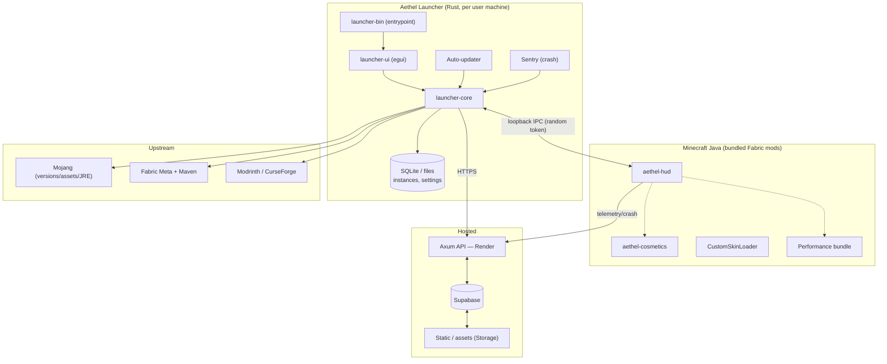
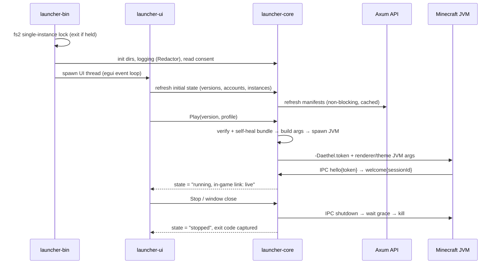
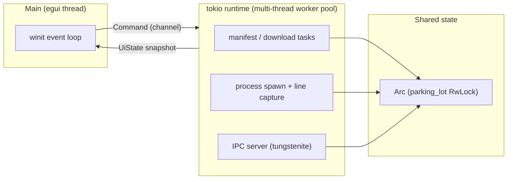
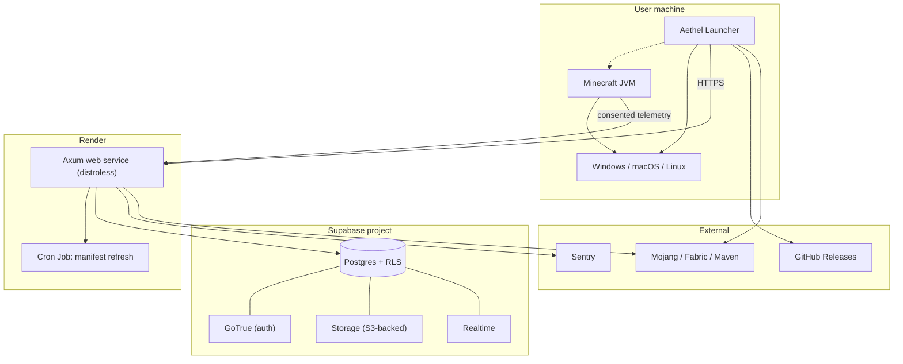
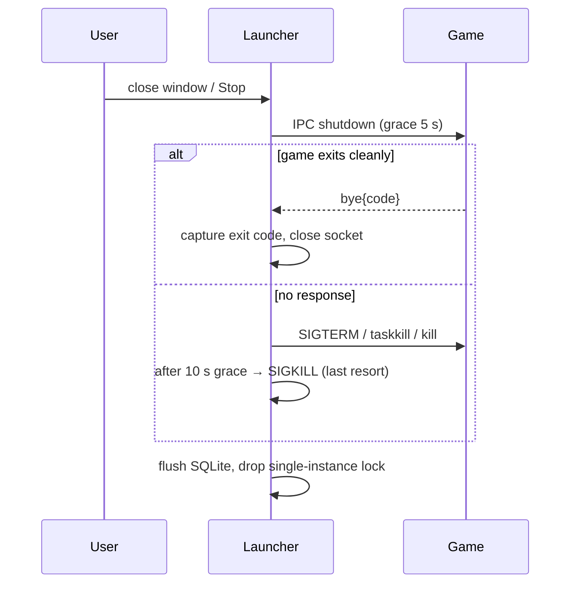

# 02 · Architecture

> **What this document is.** The wiring diagram of the whole product: which processes exist, what each
> owns, how data moves between them, how concurrency is structured, and what happens when any edge fails.
> The engineering detail of each region lives in its own spec (launch = [05 · Launch engine](./05-launch-engine.md),
> IPC = [12 · IPC](./12-ipc.md), backend = [09 · Backend](./09-backend.md), DB = [10 · Database](./10-database.md));
> here we show the shape.

## 1. System components



### Component → crate map

| Component | Crate / module | Doc ref | Heads-up |
|---|---|---|---|
| Window, screens, theme, input | `launcher-ui` | [08 · UI design](./08-ui-design.md) | depends on `launcher-core` only via a thin `UiState` bridge |
| Entrypoint, boot, single-instance lock, signals | `launcher-bin` | [04 §2](./04-repository.md) | `main()` only: wires `core` + `ui` |
| Manifests, install, launch, auth, IPC server, update, settings | `launcher-core` | [05](./05-launch-engine.md), [06](./06-auth.md), [07](./07-vulkan-performance.md) | **no egui dependency** (headless-testable) |
| Instance/settings persistence | `launcher-core::store` (+ `rusqlite`) | [04 §2](./04-repository.md) | the only local writer of config besides the game dir |
| HTTP gateway | `backend` (sibling crate) | [09](./09-backend.md) | deploy-only sibling; DTOs duplicated deliberately (v1) |
| HUD + QoL modules + IPC client | `gamesupport/aethel-hud` | [11](./11-in-game-mods.md) | Java/Kotlin, Fabric + Mixins, Stonecutter |
| Cosmetics + skin-api client | `gamesupport/aethel-cosmetics` | [11 §3](./11-in-game-mods.md) | reads equipped list via IPC or the skin API |
| Per-version mod set | backend-generated `modmanifest/{mc}/{bundle}` | [07 §2](./07-vulkan-performance.md) | data, not code |

### Component lifecycle (boot → running → exit)



### Inter-component contracts ("what crosses a boundary")

| Boundary | Payload shape | Serialization | Validation |
|---|---|---|---|
| UI ⇄ core (same process) | `Command` enum / `UiState` struct | in-memory channels + shared snapshot | one direction: UI issues commands, core emits state |
| core → JVM (game launch) | JVM args + `options.txt` patch + IPC token | command line + files | redaction before any logging ([13 §2](./13-security.md)) |
| core → game (runtime) | IPC JSON frames | `{"type":…}` over WS (`tokio-tungstenite`) | token handshake, schema-versioned ([12](./12-ipc.md)) |
| core → Axum | typed endpoints (`/api/v1/*`) | JSON with `reqwest`/`rustls` | allow-listed hosts + pinned hashes on downloads |
| game → Axum | crash/telemetry only | JSON/multipart | size cap + rate limit ([14 §5](./14-telemetry.md)) |
| core → Mojang/Fabric | version/lib/asset/JRE fetches | plain HTTPS JSON | SHA-1 verify on every artifact |

Example of the UI⇄core contract (`launcher-core` exposes it to `launcher-ui` and to a future CLI):

```rust
// launcher-core/src/api.rs (library facade; NO egui import)
pub enum Command {
    Play { version: MojangVersionId, profile: ProfileId },
    Install { version: MojangVersionId, variant: InstallVariant }, // bundle | vanilla
    ApplyRendererMode { profile: ProfileId, mode: RendererMode },  // Auto|Vulkan|OpenGL
    SetAuth(AccountRef),        // offline name or MSA account id
    SetTheme(ThemeDoc),         // pushed to the game over IPC too
    UpdateCheck { channel: Channel },
    ShutdownGame,
}

pub struct UiState {           // immutable snapshot, replaced wholesale per frame
    pub instances: Vec<InstanceSummary>,
    pub versions: VersionList,
    pub account: ActiveAccount,
    pub download: Option<ActiveTransfer>,  // {bytesDone, bytesTotal, phase}
    pub game: GameState,                   // Idle|Installing|Running(IpcLink)|Stopped(exit)
}
```

## 2. Responsibilities

| Component | Owns |
|---|---|
| `launcher-bin` | Boot order, single-instance lock, splash, wiring, signals |
| `launcher-ui` | All screens, theme, input, download progress UI |
| `launcher-core` | Version resolution, installer, mod bundle, auth, JVM tuning, process spawn, IPC server, settings, update |
| `aethel-hud` | In-game HUD + QoL modules + IPC client + telemetry pings |
| `aethel-cosmetics` | Cosmetic rendering + skin API client |
| Backend (Axum) | Version/mod manifests, news, shop, telemetry ingest, admin |
| Supabase | Auth, relational data, storage, realtime |

### Fine-grained ownership (& write permissions)

"Owning" means **only the owner may write**; reads are open to consumers. This table kills most race bugs.

| Resource | Writer | Readers | Notes |
|---|---|---|---|
| `$AETHEL_HOME/config.toml` | `launcher-core::settings` | UI (read), updater | written atomically via temp + rename |
| `instance.toml` | `launcher-core::install` | UI, IPC server | merged with GUI edits under one mutex |
| `managed.json` | backend-generated, written by installer | verifier | *pinned input*, never locally edited |
| `minecraft/` game dir | game process at runtime; launcher at heal-time | verifier | user mods may append **outside** `managed.json` |
| library/asset/runtime caches | downloader (content-addressed) | any instance | single mutable cache, refcounted |
| IPC session (token + socket) | `launcher-core` only | — | one-shot, cleared on exit |
| SQLite store | `launcher-core::store` | UI via core | single writer in-process (async lock) |
| Supabase rows | backend + RPC | launcher reads via Axum | RLS enforced server-side ([10 §2](./10-database.md)) |

### Concurrency model within the launcher



Rules:

- **UI thread** never blocks on I/O; it dispatches `Command`s and repaints from the newest `UiState`.
- **tokio runtime** owns all networking, the child-process handle and the IPC accept loop.
- Shared state sits behind `parking_lot::RwLock` (`Arc<AppRw>`); update rate is throttled (UI ~60 Hz,
  IPC FPS 1 Hz). **No lock is held across an await.**
- SQLite (`rusqlite`, `bundled` feature) runs on a dedicated thread via `tokio::task::spawn_blocking`,
  so storage can never stall the reactor or the UI.

## 3. Launch data flow (happy path)

```mermaid
sequenceDiagram
    participant U as UI
    participant C as launcher-core
    participant A as Axum API
    participant M as Mojang/Fabric

    U->>C: Play("1.21.11", profile)
    C->>A: GET /api/v1/versions
    A-->>C: list + bundle manifest (pinned hashes)
    C->>M: version json + libraries + assets + JRE manifest
    C-->>M: fetch (parallel, resumable)
    C->>C: verify SHA-1, extract natives, patch options.txt (Vulkan)
    C->>A: GET /modmanifest/{version}
    A-->>C: mod files (sha256)
    C->>C: install/verify mods → self-heal if tampered (SHA-256)
    C->>C: build JVM args (G1GC tier) + game args (auth)
    C->>C: generate IPC token, start java (tokio::process)
    C-->>U: game running, stream logs
    C<->>HUD: IPC handshake(token) → FPS/playtime/crash
```

### Phase table & gates

The launch is a **phase machine** — each phase idempotent and re-entrant.

| Phase | Trigger | Completes when | Timeout | Gate to next |
|---|---|---|---|---|
| P0 resolve manifests | `Play(...)` | version JSON + Fabric meta + bundle manifest in cache | 15 s | catalog has a renderer plan |
| P1 fetch | manifests resolved | all files hash-verified on disk | resumable, no hard cap | verify pass |
| P2 materialize | downloads done | natives extracted, JRE linked, `instance.toml` / `managed.json` written | 60 s | atomicity check |
| P3 harden | instance ready | bundle verify + `options.txt` patched to chosen renderer | 30 s | heal report clean |
| P4 spawn | hardened | `java` process started + IPC `hello` accepted | 90 s to title | token accepted or auto-fallback |
| P5 run | spawned | game exit or user stop | — | exit-code triage ([14 §3](./14-telemetry.md)) |

A crash at P1 → restart resumes; at P3 → re-verify; at P4 → the IPC token is **regenerated** so a stale
socket can never linger. See [05 · Launch engine](./05-launch-engine.md) for the same pipeline in download order.

### Why this order (writes after verification)

Launcher crashes mid-install are common on weak hardware, so the pipeline orders **the most corruption-prone
writes (natives extraction, `options.txt` patching) after every earlier artifact is hash-verified**, and every
write uses temp + atomic rename ([13 §4](./13-security.md)). A half-installed instance can never be launched —
the P2 gate requires both `instance.toml` and a clean `managed.json` verify.

## 4. Instance storage layout

```
$AETHEL_HOME/            (default: ~/.aethel on Linux/mac, %APPDATA%/aethel on Windows)
├── instances/
│   └── <profile-id>/
│       ├── instance.toml        # version, loader, RAM, JVM args, renderer mode, auth ref
│       ├── minecraft/           # = the "game dir" (mods/, saves/, options.txt…)
│       └── managed.json         # checksums the launcher enforces (tamper list)
├── runtimes/                    # Mojang JREs (per component/OS)
├── libraries/                   # shared Mojang+Fabric library cache (dedup, content-addressed)
├── assets/                      # asset objects (shared, refcounted)
├── icons/
├── crash-reports/               # staged game crash logs for upload
└── config.toml                  # app settings, updater channel, telemetry consent
```

### Who writes what, and how it stays consistent

| Blob | Write pattern | Corruption guard |
|---|---|---|
| `instance.toml` | full rewrite temp + rename | parse failure → treat corrupt, offer reinstall |
| `minecraft/` subfiles | launcher writes atomic; game writes are the game's | `managed.json` covers *only* bundled files |
| `managed.json` | backend-generated; written at install | root of trust; a `fingerprint` of its pins is stored in `instance.toml` |
| libraries/assets/runtimes | temp + rename + verify; skip-if-present | content-addressed path already encodes the hash |
| `config.toml` | temp + rename + `fsync` | `.bak` auto-recovered on parse failure |

**Concurrency on disk:** writers take `fs2` file locks per destination; the top-level single-instance lock
also guards the whole `$AETHEL_HOME` so two launcher processes can never fight over one instance
([13 §4](./13-security.md)).

### Garbage collection & retention

- Cache refcounts: a library/asset/runtime is freed only when no instance references it. V1 policy: GC runs
  only on the explicit "Manage storage" action in Settings.
- Instance deletion removes `<profile-id>/` after a two-step confirm.
- `crash-reports/` pruned to the last 20 entries ([14 §4](./14-telemetry.md)).

## 5. Key design decisions

1. **Version isolation** — each instance pins its own `minecraft/`; libraries/assets/runtimes are shared & content-addressed (hash-verified).
2. **Offline-first, MSA optional** — offline launch is a native feature; Microsoft login is an opt-in upgrade for online play.
3. **Bundle is data, not code** — the mod bundle is a *downloaded manifest*, so we hotfix renders/perf without shipping a launcher update.
4. **Tamper-proofing = verification** — `managed.json` pins SHA-256 of every bundled file; any file that fails verification is restored from cache/download before launch.
5. **Secret per launch, not guessable** — IPC auth uses a crypto-random token generated at launch (see [13 · Security](./13-security.md)).
6. **Everything on HTTPS with pinned certs** where feasible; tokens never at rest unencrypted (keyring).

### Alternatives rejected (and why)

| # | We chose… | Instead of… | Rejection reason |
|---|---|---|---|
| 1 | version isolation + shared caches | one global game dir | user mods/settings must stay per-profile; caches save disk while isolation saves sanity |
| 2 | offline-first | forced MSA | cracked-first is part of the product identity; MS is opt-in ([06](./06-auth.md)) |
| 3 | bundle-as-manifest | bundle-in-installer | installer stays < 15 MB and mod hotfixes ship without a launcher release |
| 4 | verify + restore | read-only game dir / trusted-flag | users keep full write control of their folders; "restore" is provable, "can't be deleted" is not |
| 5 | random per-launch IPC token | fixed port + predictable launch id | the literal bug class of the 2026 Lunar reviews ([01 §7](./01-research.md)) |
| 6 | HTTPS + keyring | plaintext token files | MS refresh tokens are high-value; keyring is the OS-native boundary ([13 §2](./13-security.md)) |

### The four architectural principles

1. **Fail soft.** Play must survive every cloud being down; the machine is the only hard dependency.
2. **Data over code.** Anything that can be a versioned, hashed, downloadable resource should be — it keeps
   the client dumb and the platform updatable.
3. **Small trusts.** Every cross-boundary secret is minimized (scope, lifetime, one-shotness); every other
   trust is replaced by verification (hashes, token handshake).
4. **Testable seams.** `launcher-core` has no UI; the backend has no ORM magic — every layer runs against
   fixture stubs independently ([16 §2](./16-testing.md)).

## 6. Failure & fallback paths

| Failure | Behaviour |
|---|---|
| Offline / backend down | Use last-known manifests + cached bundles; block store/news; allow launch |
| Download interrupted | Resume (HTTP Range/parallel), resume marker file |
| Hash mismatch | Re-fetch the file; if a *bundle* file mismatches → self-heal |
| Vulkan crashes at boot | Detect (no renderer-init log line / crash report) → suggest/fail-back to OpenGL mode |
| Game crash | Capture crash-reports/latest.log, offer upload, show crash screen |
| MS token expired | Silent refresh; if refresh fails → fall back to login screen keeping offline option |

### Failure taxonomy by layer

| Layer | Failure class | Detection | Response owner |
|---|---|---|---|
| **FS** | corrupt/partial instance, no disk space, `EACCES` | parse/verify failures, `fs2` errors | `launcher-core::store` → atomic rewrite or reinstall flow |
| **Network** | DNS/TLS failure, dropped body, stalls | `reqwest` errors, stream timeouts | downloader → retry/backoff, resume |
| **Upstream** | Mojang 404, Fabric down, manifest shape change | schema parse fail on golden fixtures | manifest refresh → stale cache + badge |
| **Renderer** | Vulkan init failure | missing expected init log / early crash | UI safe-mode suggestion ([08 · UI design](./08-ui-design.md)) |
| **Process** | JVM won't start, exits instantly, OOM | exit code, `*crash*` files, logs | crash-viewer + telemetry path |
| **IPC** | mod absent, wrong token, socket drop | handshake timeout, closed conn | silent degrade + retry/backoff ([12 §5](./12-ipc.md)) |
| **Cloud** | Axum/Supabase/Sentry down | timeouts, 5xx | soft degrade (served from cache), never block play |

### Self-healing ladder (ordered escalation)

1. **Retry** — same source, exponential backoff (base 500 ms, cap 30 s, jitter), N = 3.
2. **Resume** — HTTP `Range` from a marker file; assets resume by known size.
3. **Refetch elsewhere** — content-addressed artifact from another known-checksum URL.
4. **Self-heal** — bundled file missing/mismatched → restore from content cache → re-download from bundle URL.
5. **Degrade** — renderer falls to OpenGL; IPC silently disabled; store/news hidden; offline auth stands.
6. **Block + notify** — only when the launch *cannot* proceed (corrupt core JAR, contradictory pins); the UI
   states exactly what and why ([16 §4](./16-testing.md) tamper-flow).

### Backoff & retry policy (concrete)

- Downloads: 3 attempts/request; concurrency pool of 16 with per-file retry isolation.
- IPC reconnect: 500 ms → 2 s → 5 s, cap 30 s total ([12 §5](./12-ipc.md)).
- Backend calls: 2 quick retries on `5xx`/`429`; serve stale cache meanwhile.

## 7. Runtime & threading model

### Launcher (Rust) — one process, three concerns

| Thread | Role | Blocking? |
|---|---|---|
| main / egui | window event loop, paint, input | never on I/O |
| tokio multi-thread runtime | networking, child process, IPC accept loop, download pool | async only |
| SQLite worker | `rusqlite` via `spawn_blocking` | blocking, isolated |

### Game (JVM) — Minecraft threads + mod threads

| Thread | Role | Notes |
|---|---|---|
| Minecraft render/client | world render + menu | Aethel HUD draws post-render via mixin ([18 §8](./18-client-gui.md)) |
| IPC client | WebSocket frames → launcher | small Java WS lib; isolated from the main loop |
| Telemetry beat | 60 s pings | non-blocking, rides the IPC thread |

### Deployment view (nodes)



### Shutdown sequence (crash-safe)



## 8. Data flows (code-level, per feature)

| Feature | Flow |
|---|---|
| Version list | UI → `Command::ListVersions` → core (cache) → Axum `/versions` → merge Mojang status → `UiState.versions` |
| Install | `Command::Play` → P0–P2 → SQLite instance row + game dir → UI progress via `ActiveTransfer` |
| Renderer enforcer | P3 → read `managed.json` → verify → heal → write `options.txt` renderer key → renderer plan |
| Theme sync | `ThemeDoc` ([08 · UI design](./08-ui-design.md)) → core → IPC `setTheme` → mod applies live ([18 §6](./18-client-gui.md)) |
| Telemetry | game (60 s beat) → IPC → core queue → `POST /telemetry/crash` (consent echo) → Supabase |
| Update | `UpdateCheck` → backend `/launcher/update-check` → `self_update` swap → restart ([15 §2](./15-updating-distribution.md)) |
| Cosmetics | store equip → Supabase `cosmetics_owned` → skin API → CustomSkinLoader in-game → asset fetch ([11 §3](./11-in-game-mods.md)) |

### Schema of the two central files, concretely

```rust
// instance.toml is read by core at every launch; renderer_mode also read by the UI.
// (kdl/json equivalent shown in 05; here the Rust source-of-truth model.)
#[derive(serde::Deserialize, serde::Serialize)]
pub struct InstanceConfig {
    pub version: MojangVersionId,
    pub loader: LoaderConfig,          // Vanilla | Fabric { loader_version }
    pub renderer: RendererMode,        // Auto | Vulkan | OpenGL
    pub heap: Option<u32>,             // MiB; None = auto tier
    pub jvm_args: Vec<String>,         // user overlay, appended after our base flags
    pub auth_ref: AccountRef,          // Offline { name } | Msa(account_id)
    pub fingerprint: [u8; 32],         // sha256 of managed.json pins (root of trust)
    pub last_launched: chrono::DateTime<chrono::Utc>,
}
```

```jsonc
// managed.json — generated by the backend per (mc, bundle); installed unmodified.
{
  "bundle": "aethel-perf",
  "mcVersion": "1.21.11",
  "renderer": "VulkanMod",
  "files": [
    {"path": "mods/sodium-vulkan.jar", "sha256": "9f2c…", "url": "https://cdn.aethel.dev/…/9f2c…", "size": 183_421}
  ],
  "optionsGen": { "graphicsApi": "vulkan", "renderDistance": 10, "vsync": false }
}
```

## 9. Edge cases (architecture-level)

| Edge case | Architectural response |
|---|---|
| Launcher upgraded while a game session runs | `self_update` waits for a game session to end; updater takes a second single-instance lock ([15 §2](./15-updating-distribution.md)) |
| Two profiles share one version | Shared caches dedupe downloads; each profile keeps its own `minecraft/` |
| Game launches but IPC never connects | P4 proceeds without link; HUD toggles work locally; launcher shows "in-game link unavailable" ([12 §5](./12-ipc.md)) |
| `$AETHEL_HOME` moved/symlinked | Resolve once at boot via `directories`; document that symlinks work but must be absolute |
| Backend manifest bumps bundle mid-install | P1 pins the bundle *version* at P0; a mid-install bump affects only the *next* launch |
| Locale / non-ASCII path | No ASCII assumptions anywhere; all paths via `PathBuf` from `directories` ([03 · Tech stack](./03-tech-stack.md)) |
| Game writes into `mods/` during session (e.g. modmenu screenshots) | Heal step only enforces `managed.json` pins; unknown files are left alone |
| Clock skew breaks TLS (cert validation) | `reqwest` respects OS trust store; document PC-clock fix; no pinned leaf certs on mobile-grade hosts |

## 10. Decision log (why the architecture is shaped this way)

| # | Decision | Reason (one line) | Alternative that lost |
|---|---|---|---|
| A-01 | One launcher process, 3 threads | Simple lifecycle + crash-safe shutdown of the game | Multi-process UI/core split (overkill at v1 size) |
| A-02 | `launcher-core` is UI-free library | Headless tests + future CLI; UI is a thin consumer | UI-coupled core (testable, but only via GUI) |
| A-03 | Game talks to the internet **only** via consented telemetry | Hostile-process minimization; in-game surfaces are a favorite target | Rich in-game launcher-integrated UI over IPC |
| A-04 | All local writes are atomic (temp+rename) or content-addressed | A killed launcher must never leave a partial launchable state | In-place writes (resume nightmare) |
| A-05 | Backend is the single data source for versions/modmanifests | One stamp of truth for hashes; launcher never mixes vendor data | Launcher reading Mojang+Fabric+Modrinth independently |
| A-06 | Caches shared across instances; contents hashed | Disk footprint stays ~1× per library no matter how many profiles | Per-instance full copies (2–4× disk) |
| A-07 | IPC is a launcher-owned server on `127.0.0.1:0` | Ephemeral port + random token = no port races, no guessability | Fixed well-known port (Lunar's mistake, [01 §7](./01-research.md)) |
| A-08 | Renderer enforcement lives at *launch*, not at *install* | Tamper can happen any time — check must happen every time | Install-time-only hook |
| A-09 | Java is the game's renderer owner; Rust only feeds it | Forcing Rust into the game would require modding the JVM | A shared IPC/theme layer unifies the two worlds instead |

## 11. Acceptance criteria (architecture checklist)

- [ ] Every component in §1 maps to a crate/dir in [04 · Repository](./04-repository.md) with no orphans.
- [ ] `launcher-core` compiles with **no** egui dependency (`cargo tree -p launcher-core | rg egui` empty).
- [ ] One process = one UI thread + one tokio runtime + one SQLite worker; no blocking on the UI thread.
- [ ] P0–P5 phase machine reproducible headless against stubs ([16 §2](./16-testing.md)).
- [ ] Tamper test green: delete a bundled jar → relaunch → restored before spawn ([16 §4](./16-testing.md)).
- [ ] All six §6 failure rows have a working degraded path proven in CI (kill-mid-download, renderer fallback,
      backend down, IPC absent, no-disk-space, expired MS token).
- [ ] No architectural section contradicts [00 §Invariants](./00-overview.md) (I-01…I-10).
- [ ] Shutdown sequence leaves no zombie JVM and releases the single-instance lock.

## 12. Scale & load model

| View | Load | How it scales |
|---|---|---|
| Launcher | per-user, 1 instance + 1 game | no shared state between installs; caches are per-machine |
| Backend | read-heavy (manifests/news/shop) + write-light (telemetry) | `moka` cache absorbs reads; Supabase absorbs writes; batch tricks only where proven |
| RPS realism | v1: thousands of users, not millions | 10k rps cached routes on one Render instance ([09 §6](./09-backend.md)) |
| Concurrency | 16-way downloads, 1 IPC socket per game | tokio worker pool; no thread-per-connection anywhere |

## Glossary (architecture-specific)

| Term | Meaning in this doc |
|---|---|
| Phase machine | the deterministic P0–P5 launch pipeline with a gate per phase |
| Root of trust (local) | `instance.toml#fingerprint` → `managed.json` pins → actual file bytes |
| Content-addressed cache | file stored at `sha1[0:2]/sha1[0:4]/sha1`; the path IS the identity |
| Refcounted cache entry | count of instances that reference a cached library/asset/runtime |
| Degraded mode | a reduced-but-working state (stale manifest, OpenGL, no store) rather than a failure |
| Heal report | per-launch list of files restored (or re-downloaded) by the self-healer |
| Trust zone | local vs remote grouping that determines what secrets and assumptions exist ([00 §Big picture](./00-overview.md)) |

## Where to go from here

- **Downstream of this doc:** [05 · Launch engine](./05-launch-engine.md) (the P0–P5 detail),
  [07 · Vulkan & performance](./07-vulkan-performance.md) (renderer + heal), [12 · IPC](./12-ipc.md) (the seam).
- **Upstream:** [01 · Research](./01-research.md) for the evidence, [00 · Overview](./00-overview.md) for the invariants.