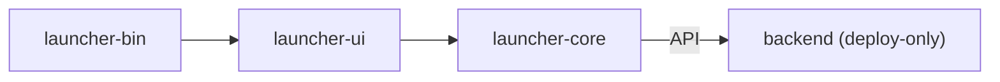
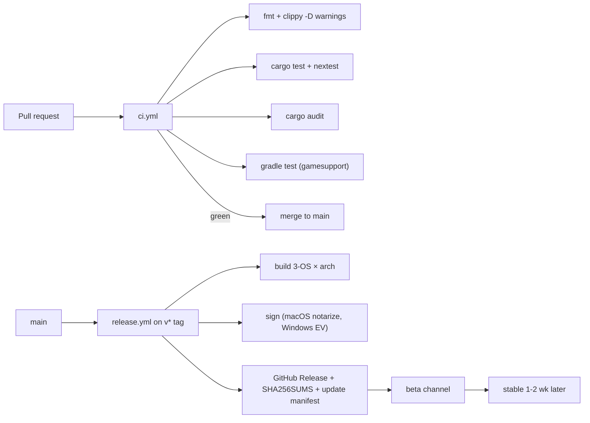

# 04 · Repository

> **What this document is.** Where everything lives, who is allowed to touch what, how code flows from a
> branch to a release, and the conventions that keep ~6 codebases (Rust workspace + Java mods + Supabase +
> packaging + docs) coherent. Rule of thumb: **if it reaches production, it must be reproducible from this repo.**

## 1. Workspace layout

```
Aethel-Launcher/
├── Cargo.toml                      # [workspace] members
├── rust-toolchain.toml
├── .github/
│   └── workflows/
│       ├── ci.yml                  # fmt + clippy + test, 3-OS matrix
│       └── release.yml             # tag → artifacts → GitHub Release + update manifest
├── crates/
│   ├── launcher-core/              # engine (no UI): manifests, install, auth, launch, ipc
│   ├── launcher-ui/                # egui screens + theme
│   ├── launcher-bin/               # splash, boot, orchestration
│   └── backend/                    # Axum server (deployed to Render)
├── gamesupport/
│   ├── aethel-hud/                 # Fabric mod: HUD + QoL modules + IPC
│   ├── aethel-cosmetics/           # Fabric mod: cosmetics + skin-api client
│   └── bundles/                    # per-version bundle definitions (checked-in dev copies)
├── supabase/
│   ├── migrations/                 # SQL, applied via supabase CLI
│   └── config.toml
├── docs/                           # (this folder)
├── packaging/                      # NSIS/dmg/AppImage scripts + icons
└── LICENSE                         # MIT
```

### Annotated tree (what each node *is*)

| Path | Kind | Responsibilities | Ops note |
|---|---|---|---|
| `Cargo.toml` | workspace manifest | members, shared `[workspace.dependencies]`, profile settings | shared versions = one knob per crate |
| `rust-toolchain.toml` | toolchain pin | MSRV + clippy/fmt components | CI reads the same file |
| `.github/workflows/ci.yml` | CI | fmt/clippy/test/audit on 3 OS | also gates PRs |
| `.github/workflows/release.yml` | CI/CD | tag → artifacts + signing + release manifest | the only place releases are made |
| `crates/launcher-core` | Rust lib | all product logic minus UI (headless-testable) | the biggest crate; gate for `unsafe` |
| `crates/launcher-ui` | Rust lib | screens, theme, widgets | depends only on core façade (`api.rs`) |
| `crates/launcher-bin` | Rust bin | `main()`: boot, single-instance lock, wiring | stays as thin as possible |
| `crates/backend` | Rust bin | Axum service, dockerized | sibling crate; separate deploy target |
| `gamesupport/aethel-hud` | Gradle (Stonecutter) | in-game HUD, QoL, IPC client, click GUI | Maven-local publication for versions |
| `gamesupport/aethel-cosmetics` | Gradle (Stonecutter) | cosmetics render + skin-api client | community artifact names |
| `gamesupport/bundles` | JSON/scripts | dev copies of bundle definitions | production source = backend/Supabase |
| `supabase/migrations` | SQL | schema, RLS policies, seed data | `supabase db push` applies them |
| `docs/` | markdown | this documentation set | code changes must update the docs (see drift rule) |
| `packaging/` | scripts + assets | NSIS script, dmg layout, AppImage recipe, icons | consumed by `release.yml` |

### What deliberately does NOT live in this repo

| Missing item | Where it lives instead | Reason |
|---|---|---|
| Bundled mod `.jar` files | backend manifest + Supabase Storage / CDN | bundle is data, not code; keeps installer < 15 MB ([00 §Decision D-03](./00-overview.md)) |
| Mojang client/libraries/assets | Mojang's own CDNs | we never re-host ([00 §Non-goals](./00-overview.md)) |
| MS refresh tokens / Supabase keys | OS keyring / Render env dashboard | never commit secrets ([13 §2](./13-security.md)) |
| User instance data / `$AETHEL_HOME` | user machine | local-only by design ([02 §4](./02-architecture.md)) |
| Sentry DSN / signing certs | CI secrets + Render env | infra, not code |
| `gamesupport/bundles` final pins | backend `bundles` tables | authoritative pins come from the deployed API |

### `.gitignore` essentials

```
/target          # Rust build output
!crates/*/target
/gamesupport/**/build/
/gamesupport/**/.gradle/
.clangd / .idea /
*.log / crash-reports /
.env
supabase/.temp/
*.dmp / *.minidump
backup/
*.part
```

### Crate set at a glance

| Member | Type | Provides to | Consumed by | Deploy target |
|---|---|---|---|---|
| `launcher-core` | library | engine facade (api.rs) | `launcher-ui`, `launcher-bin`, tests, future CLI | — |
| `launcher-ui` | library | egui screens/theme | `launcher-bin` | — |
| `launcher-bin` | binary | the app | end users | installer packaging |
| `backend` | binary | Axum service | launcher (HTTPS), admin web | Render container |
| `aethel-hud` (Java) | mod | in-game experience | Fabric loader | bundle manifest |
| `aethel-cosmetics` (Java) | mod | cosmetics rendering | Fabric loader | bundle manifest |

Dependency summary: Rust build graph is `bin → ui → core` + separate `backend`; no cycles; no `launcher-*`
crate depends on the `backend` crate, and vice versa.

## 2. Crate boundaries



- `launcher-core` has **no egui dependency** → it is a library testable headless and reusable by a future CLI.
- The backend is a sibling crate so manifests/schema can share model types via a small `common` module
  (avoid for v1; duplicate DTOs explicitly).

### Dependency direction rules

| Rule | Enforcement |
|---|---|
| `launcher-bin` → `launcher-ui` → `launcher-core` only | `cargo machete` / `cargo tree` check in CI |
| `launcher-core` imports **no** `egui`/`eframe`/winit | CI grep (`rg "egui" crates/launcher-core/`) — documented invariant in [00 §I-01](./00-overview.md) |
| `backend` shares **no runtime code** with the launcher in v1 | DTOs duplicated deliberately; a `common/` module rejected for v1 to avoid cross-deploy coupling |
| A crate may use crates from a *lower* layer, never upward | review checklist item |

### Cargo profiles (workspace release settings)

```toml
# Cargo.toml [workspace] profile (goal state)
[profile.release]
opt-level = 3
lto = "thin"                 # medium binary win on eframe/egui; thin keeps link speed sane
codegen-units = 1
panic = "unwind"             # sentry-rust-minidump relies on native crash (not abort)
strip = "symbols"
debug = 1                    # keep backtraces for panic reporting
```

Rationale: `panic=unwind` (not `abort`) because `sentry` captures panics and the crash-reporter needs a
walkable stack; `lto=thin` balances binary size vs incremental CI build time; `strip=symbols` keeps the
12 MB core-binary budget ([03 · Tech stack](./03-tech-stack.md)).

### Module map — `launcher-core` (the engine)

```
crates/launcher-core/src/
├── lib.rs                # facade re-exports; the ONLY public API surface
├── api.rs                # Command / UiState contract (see 02 §1)
├── config.rs             # layered settings (config crate) + app-dir bootstrap
├── manifests/
│   ├── mojang.rs         # version_manifest_v2 + per-version JSON parser
│   ├── fabric.rs         # fabric meta loader/versions + launcherMeta.libraries
│   └── java_runtime.rs   # java-runtime all.json + component resolution
├── install/
│   ├── plan.rs           # P0-P2 pipeline states (02 §3)
│   ├── downloader.rs     # reqwest pool, Range resume, markers
│   ├── verifier.rs       # sha1/sha256 check, content-addressed cache
│   ├── natives.rs        # zip extraction, per-OS classpath layout
│   └── assets.rs         # asset index parser + missing-only fetch
├── bundle/
│   ├── manifest.rs       # modmanifest parse (files, rendererMode, optionsGen)
│   ├── heal.rs           # managed.json verify → restore ladder (07 §2)
│   └── options.rs        # options.txt generator (renderer + perf defaults)
├── auth/
│   ├── offline.rs        # UUIDv3 derivation + legacy args
│   └── microsoft.rs      # oauth2 + minecraft-msa-auth flows, keyring
├── launch/
│   ├── args.rs           # JVM/GC tier builder (05 §4) + game args
│   ├── process.rs        # tokio::process spawn, line capture, exit triage
│   └── ipc.rs            # loopback WS server, token gen, frame codec (12)
├── store/
│   ├── sqlite.rs         # rusqlite connection + WAL + single writer
│   └── instances.rs      # instance CRUD, GC refcounts
├── update.rs             # self_update orchestration + channel filter
├── telemetry.rs          # consent echo, queue, upload (14 §5)
└── log.rs                # tracing init + Redactor layer (13 §2)
```

### Module map — backend (summary)

```
crates/backend/src/
├── main.rs               # tower router, state, trace, cors, metrics
├── config.rs             # env parsing (SUPABASE_URL, SERVICE_KEY, JWT_SECRET, SENTRY_DSN…)
├── error.rs              # thiserror → JSON error envelope
├── routes/{health,versions,manifests,news,servers,update,telemetry,skin_api,shop,admin}.rs
├── services/{supabase,manifest_refresh,skin_api}.rs
└── cache.rs              # moka TTL caches + Realtime invalidation
```

### Module map — gamesupport (summary)

```
gamesupport/aethel-hud/src/main/kotlin/dev/aethel/hud/
├── HudClient.kt          # hook in, render pass, HUD cache (18 §8)
├── modules/              # one Mixin implementer + config entry per module
├── click-gui/            # Right Shift menu + HUD editor screens (18)
├── ipc/IpcClient.kt      # WS client, hello handshake, frame codec
└── config/AethelConfig.kt# aethel.json schema + migration chain

gamesupport/aethel-cosmetics/src/main/kotlin/dev/aethel/cosmetics/
├── SkinApiClient.kt      # UniSkinAPI JSON client
├── render/               # cape/elytra/badge renderers
└── equip/                # equipped-set resolution from backend
```

### Versioning the workspace

- One `Cargo.lock` at workspace root; never per-crate lockfiles.
- Launcher version = SemVer in `Cargo.toml[package].version`; mirrored by the update manifest + `release.yml`.
- Backend version: independent but follows the same tag (repo single release train); AWS of one tag per release.
- Bundle versions live in `gamesupport/bundles` *and* Supabase; they are **not** launcher versions ([15 §4](./15-updating-distribution.md)).

## 3. Conventions

| Rule | Detail |
|---|---|
| `cargo fmt` | Always clean. |
| `cargo clippy -- -D warnings` | CI-enforced. |
| Errors | `anyhow` in binaries, typed `thiserror` in core/library. |
| Logging | `tracing`; never log tokens/passwords — a `Redactor` layer masks secrets (see [13 · Security](./13-security.md)). |
| Tests | Unit test pure logic; golden-file tests for manifest parsing; integration test launch with a stub. |
| Non-Goal | Do NOT commit secrets, user manifests, or bundled jars to the repo. Bundle artifacts live in backend/Supabase. |
| Commits | Conventional Commits (`feat:`, `fix:`, `docs:`) matching repo style. |

### Git & branch conventions

| Concern | Convention |
|---|---|
| Branching | GitHub Flow: `main` always releasable; short-lived `feat/`, `fix/`, `chore/`, `docs/` branches |
| PR size | focused; > 500 changed lines gets a review note + possible split |
| Commit message | `type(scope): summary` — e.g. `feat(core): resume interrupted library downloads` |
| Merge | squash-merge to keep `main` linear in history; never force-push `main` |
| Tagging | `v<MAJOR>.<MINOR>.<PATCH>[-beta.N]` annotated tags; tags move release pipeline only |
| Changelog | generated from merged conventional commits per release |

### Error-handling conventions

- `launcher-core` (library) → `thiserror` enums: `ManifestError`, `DownloadError`, `LaunchError`, `IpcError`,
  `StoreError`, each with a `#[error(transparent)]`-based composition. The UI maps variants → user-facing copy.
- Binaries (`launcher-bin`, `backend`) → `anyhow` at the top level only; a panic is caught by
  `panic_anyhow`/`sentry` and shows the crash screen, never a silent exit.
- Failed downloads return typed resume state; **no** `unwrap()` on network/IO paths (clippy `unwrap_used` lint
  enable where feasible).

### Test layout

| Where | Kind | Examples |
|---|---|---|
| `crates/*/tests/` | integration | launch-with-stub, downloader resume, updater swap |
| `crates/*/src/**/tests/` | unit + golden | manifest parsers, rule eval, uuid, redactor ([16 §1](./16-testing.md)) |
| `gamesupport/*/src/test/` | JVM unit | mixin registration, JSON codec, config migration |
| `supabase/tests/` | SQL contract tests (optional) | RLS expectations per policy |

Golden fixture JSONs are **tiny, synthetic** — never copies of Mojang data ([16 §6](./16-testing.md)).

### Linting & static-analysis policy

| Tool | Scope | Gate |
|---|---|---|
| `cargo fmt` | formatting | CI block |
| `cargo clippy -- -D warnings` | correctness + lint | CI block |
| `cargo audit` | dependency CVEs | CI block on RUSTSEC |
| `cargo machete` | unused deps (manual/periodic) | optional |
| `cargo-deny` | license + duplicate-dependency policy | planned v1.1 |
| `rg "unwrap()|expect("` | panic-on-error audit path | review-time rule in `launcher-core` only, never blocking in tests |

Note: `unwrap` is *allowed* in tests and in provably-infallible spots with a comment; the audit rule targets
the product code paths handling remote/disk data.

### Documentation rules (docs ↔ code drift)

| Rule | Detail |
|---|---|
| Behaviour change → docs change | any PR altering a documented invariant ships a `docs/` edit in the same PR |
| README index is the map | [README](../README.md) table + `00` overview must stay in sync with the 19 files |
| File naming | `NN-slug.md`, `##` numbered sections, `|---|` tables, Mermaid diagrams (existing set's conventions) |
| New dependencies | update [03 · Tech stack](./03-tech-stack.md) crate table with the version + a decision-log row |
| New env var | update §4 env-var contract table here |
| New IPC message | update [12 · IPC](./12-ipc.md) schema table |
| New DB table / RLS | update [10 · Database](./10-database.md) ER diagram + policy table |

## 4. Environment & deployment strategy

- **Local dev:** `cargo run -p launcher-bin` (frontend+core), `cargo run -p backend` + local Supabase stack (`supabase start`).
- **Staging:** backend on Render (staging service), Supabase staging project.
- **Production:** Render prod service; env-only config (`SUPABASE_URL`, `SUPABASE_SERVICE_KEY`, `SENTRY_DSN`, …).

### Environments matrix

| Environment | Launcher | Backend | Database | Who/When |
|---|---|---|---|---|
| **local** | `cargo run -p launcher-bin` | `cargo run -p backend` | Supabase CLI local | any dev |
| **dev/CI** | headless tests | tests against stubs | in-memory/SQLite fixtures | every PR |
| **staging** | `--channel=beta` nightly build | Render staging service | Supabase staging project | previews, soak |
| **production** | stable channel | Render prod service | Supabase prod project | releases |

Promotion rule: staging is a *clone* of prod data shape (seeded), never shares credentials; a release only
promotes after CI green + staging soak ([15 §5](./15-updating-distribution.md) channels).

### Env var contract

| Variable | Used by | Required? | Notes |
|---|---|---|---|
| `SUPABASE_URL` | backend | yes | project URL, not exposed to launcher |
| `SUPABASE_SERVICE_KEY` | backend | yes | service-role (bypasses RLS) — infra secret |
| `SUPABASE_ANON_KEY` | admin web (future) | no | public client key |
| `JWT_SECRET` | backend | yes (`jsonwebtoken` validation) | must match Supabase project secret |
| `SENTRY_DSN` | launcher/backend | no | blank disables capture in dev |
| `PUBLIC_BASE_URL` | backend | yes | used for absolute URLs in payloads |
| `AETHEL_STAGING` / `RENDER_*` | Render | no | env-provided by Render |

Never ship `.env` files; the repo keeps `.env.example` with placeholder names only ([§7](#7-secrets-handling)).

### Local vs container dev

| Concern | Local | Container (Render) |
|---|---|---|
| Backend | `cargo run` with env pointing at local Supabase | distroless image, `ENV` from dashboard |
| Database | `supabase start` (Postgres+Auth+Storage+Realtime in Docker) | managed Supabase project |
| Parity risk | low; CI additionally runs against a temp Supabase | full parity by definition |
| Launcher | `cargo run -p launcher-bin -- --staging-api` | N/A |

## 5. CI/CD pipelines



### `ci.yml` steps (per matrix cell)

1. `actions/checkout` + cache `~/.cargo` and `target` (sccache optional).
2. `rustup` from `rust-toolchain.toml`.
3. `cargo fmt --check` → `cargo clippy --all-targets -- -D warnings` → `cargo test` (with `--release` dev-path).
4. `cargo audit` (+ `cargo deny` if adopted for licenses).
5. `gradle test` in `gamesupport/` (matrix: one MC version per channel).
6. Artifact: CI builds the launcher per OS is a *release* concern; CI only proves tests.

### `release.yml` steps

1. Triggered by annotated `v*` tag.
2. `cargo build --release` per OS/arch via a jobs matrix.
3. Package: NSIS script (Win), `.app`+`dmg`+notarize (mac), AppImage+`tar.gz` (Linux), portable zips.
4. Generate `SHA256SUMS`; sign if key available (mac notary, Windows EV).
5. Publish GitHub Release artifacts + push update manifest to backend (or repo release asset).
6. Mark `beta` channel immediately; stable auto-promotes after soak window ([15 §5](./15-updating-distribution.md)).

## 6. Branching & release flow

- **Never release from a feature branch.** Only `main`;
- **Hotfix policy:** `docs/<tiny>` or `fix/<tiny>` merged fast with tests; emergency hotfixes bypass channels
  only with a mandatory flag in the manifest (`mandatory: true`) ([15 §2](./15-updating-distribution.md)).
- **Rollback:** previous binary retained 7 days + "Restore previous version" UI ([15 §6](./15-updating-distribution.md));
  backend keeps last-good deploy target ready.

## 7. Secrets handling

| Secret | Where it lives | Never in… |
|---|---|---|
| Supabase service key | Render env | repo, launcher binary, logs |
| JWT secret | Render env (Supabase dashboard match) | repo, launcher binary |
| MS refresh token | user keyring | repo, telemetry payloads, `config.toml` |
| Sentry DSN | Render env / build-time for launcher `env!` | repo values (DSN is public by design, but kept out of history) |
| Code-signing cert/key | CI secrets store / HSM action | repo, logs |
| Update-manifest signing key (if adopted) | CI secret + backend hint | repo |

Rules: `git secrets` or pre-commit scan blocks `SUPABASE_SERVICE_KEY=` and DSN-like strings in PRs; leaked
secrets are rotated the same day, never "revoked later" ([13 §7](./13-security.md)).

## 8. Code review & quality gates

| Gate | Enforced by | Blocking? |
|---|---|---|
| fmt + clippy + tests | `ci.yml` required check | yes |
| `cargo audit` | `ci.yml` | yes (RUSTSEC = fix or documented exception) |
| No egui in `launcher-core` | CI grep | yes (invariant I-01/[00](./00-overview.md)) |
| No secret in diff | pre-commit hook + manual review | yes |
| Docs updated with behaviour change | review checklist ("Does `docs/` need a companion edit?") | yes |
| Binary size budget | `release.yml` size assertions | yes (fail the job) |
| License scan of new deps | `cargo-deny` (optional v1.1) | planned |

### PR checklist template (summarized)

- [ ] `cargo clippy -- -D warnings` local clean
- [ ] tests written/updated for the change
- [ ] no secret/credential in the diff
- [ ] affected doc in `docs/` updated (see drift rule §4)
- [ ] changelog entry (if user-visible)

## 9. Edge cases (process-level)

| Case | Handling |
|---|---|
| CI matrix cell times out on a slow runner | per-job timeout 30 min; split heavy launches into a dedicated job |
| macOS runner missing for arm64 | use `macos-14` (arm64) + `macos-13` (x64) in matrix ([16 §3](./16-testing.md)) |
| `cargo` publishes a yanked crate mid-week | dependabot pins affected; CI audit blocks merge until patched |
| Supabase migration order conflicts between PRs | migrations are additive + numbered; reviewers check `supabase/migrations` ordering |
| Bundle pin bump twice in a day | `release.yml` and backend manifest both versioned; launcher treats bundle version as opaque |
| Docs folder renamed/restructured | README index (this set) is the source of truth; keep links in `00`/`04` synced |
| Windows path length (MAX_PATH) | test on `path\to\long\dir`; use `\\?\` where needed; document in `packaging/` |
| Two engineers editing the tree simultaneously | separate crates = merge-friendly; shared `gamesupport/bundles` JSON reviewed serially |

## 10. Decision log (repository-shape)

| # | Decision | Reason | Alternative rejected |
|---|---|---|---|
| R-01 | Monorepo (Rust + Java + Supabase) | one PR can touch launcher + mods + schema for a feature; CI shows the whole surface | multi-repo (drift, release coordination overhead) |
| R-02 | Cargo *workspace* with 4 members | shared dependency versions, one lock file, `cargo test --workspace` | separate builds (version skew) |
| R-03 | Backend as sibling crate (not `my-project/crates/`) equivalent | one tag, one release train per repo | separate backend repo |
| R-04 | `launcher-core` UI-free | headless tests + future CLI + invites the UI/engine split reviewers can audit | core-with-UI |
| R-05 | DTOs duplicated between launcher and backend (v1) | avoid a shared-crate coupling across two deploy artifacts; cost is small tables | `common/` crate now |
| R-06 | GitHub Flow over GitFlow | small team + continuous delivery; no long-lived release branches | GitFlow |
| R-07 | Conventional Commits | free changelog + automatic semantic-valid tagging | arbitrary messages |
| R-08 | `supabase/migrations` in repo | `supabase db push` reproducibility; schema diff reviewable in PRs | external SQL manager / dashboard-only edits |
| R-09 | Bundle definitions checked in (`gamesupport/bundles`) as dev copies | engineers iterate locally before the backend is authoritative | only-in-DB (no local iteration) |

## 11. Acceptance criteria (repository checklist)

- [ ] `git clone` → `just dev` boots the launcher (or a stub) on all 3 OS with no manual steps beyond env placeholders.
- [ ] `just test` runs the whole Rust workspace + `gamesupport` Gradle tests green locally.
- [ ] CI (`ci.yml`) blocks merges on fmt/clippy/tests/audit failures — verified on a deliberately-broken branch.
- [ ] Release pipeline produces artifacts that pass size assertions and publish `SHA256SUMS` + update manifest.
- [ ] No secrets, `.env`, or bundled jars in `git history` (scan tool green).
- [ ] The `docs/` index (00) and this file both point at live paths (`docs/00-overview.md` etc.).
- [ ] A feature touching `launcher-core` has a matching `docs/` update in the same PR.
- [ ] `crates/launcher-core` passes the no-egui CI grep.
- [ ] Supabase migrations apply cleanly from a fresh `supabase start` (drift-tested in CI).

## 12. Owned areas & expectations

| Area | Owner (default) | Review expectations |
|---|---|---|
| Rust launcher workspace | launcher maintainer | permission to merge after ci.yml green + review |
| Backend + Supabase schema | backend maintainer + reviewer | DB migration ordering + RLS review mandatory |
| `gamesupport/` mods | mods maintainer | per-version jar smoke on at least one version |
| Packaging / signing | release owner | artifact-signed + checksums verified |
| Docs (`docs/`) | docs editor (whoever edits code behaviour) | drift rule §3 |
| CI/release workflows | platform end | matrix must stay green for all 3 OS |
| Security-sensitive files (`auth/`, `ipc.rs`, `telemetry.rs`) | security owner | any change there is higher-scrutiny + linked to [13](./13-security.md) |

Escalation: SECURITY-flagged PRs bypass week-end approval; anything touching secrets handling requires a
line-item on the threat model ([13 §7](./13-security.md)).

## 13. Repository health metrics

| Metric | Definition | Threshold (warning) |
|---|---|---|
| CI green rate | merges with all checks passing | < 95 % |
| Time to fix CI | mean duration of a `ci.yml` red | > 24 h |
| Docs drift | stale code→docs mismatches found by reviewers | > 1 per 5 PRs |
| Dependency churn | crate upgrades/week | irregular + unbatched = flag |
| Release lead time | tag → stable channel | > 14 d without reason ([15 §5](./15-updating-distribution.md)) |
| Binary bloat | `release.yml` size assertion drift | +1 MB over budget in one release |

## Where to go from here

- **CI/test detail:** [16 · Testing](./16-testing.md) (matrix, fixtures) · release flow in [15 · Updating & distribution](./15-updating-distribution.md).
- **Contents of these folders:** `00-overview.md` for invariants, `02-architecture.md` for the component map,
  `03-tech-stack.md` for the crate list, `05-launch-engine.md` … `18-client-gui.md` for the per-area specs.