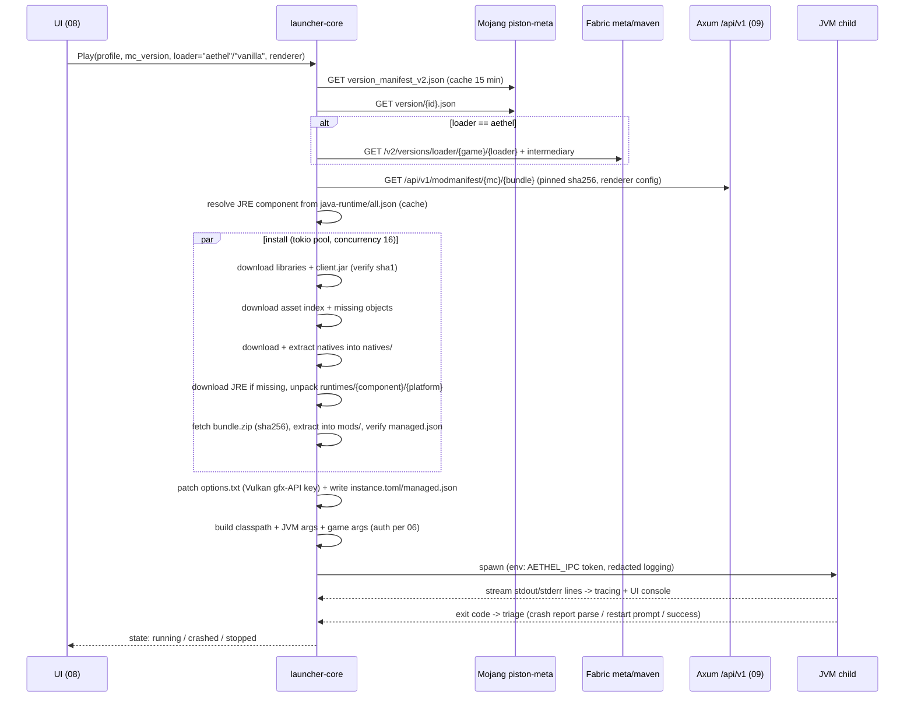
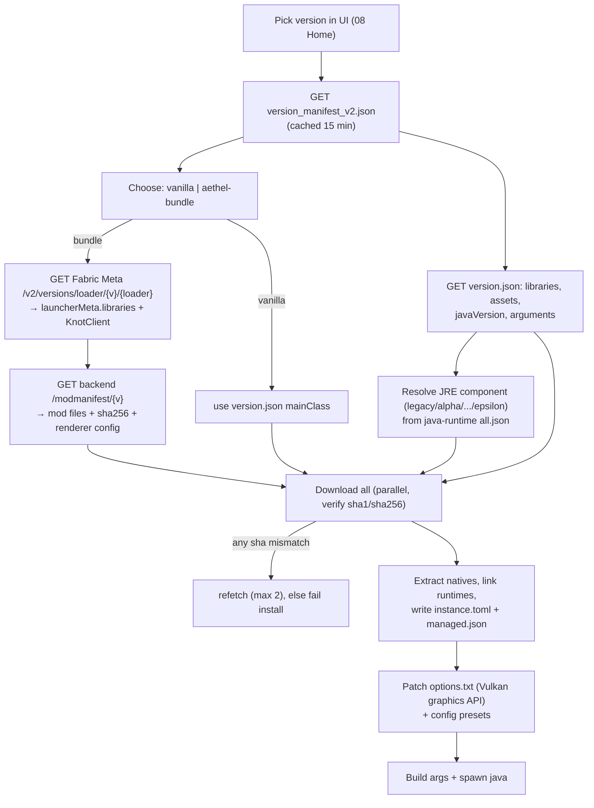

# 05 · Launch Engine

How a Minecraft version goes from "chosen in the UI" to "running with Aethel mods on Vulkan".

Owned by `launcher-core` (`crates/launcher-core/src/launch/`). No egui dependency — testable headless,
reusable by a future CLI. All network I/O is `tokio` + `reqwest`, all manifests `serde`-parsed.

## 0. Lines & responsibilities

| Part | Owner | Responsibility |
|---|---|---|
| Version resolution | `resolve/` | Mojang manifest → per-version JSON → Fabric loader/intermediary → bundle manifest |
| Resource installer | `install/` | Classpath jars, natives, assets, JREs; verify SHA-1/SHA-256; atomic writes |
| Java provisioning | `java/` | Runtime manifest fetch, per-OS JVM unpack/validate, cache + reuse |
| Args builder | `builder/` | Classpath assembly, JVM flags (tiered), game arg expansion, auth values |
| Process supervisor | `process/` | `tokio::process::Command` spawn, log capture, exit-code triage, restart decisions |

The happy path, end to end:



## 1. Resolution pipeline



Key points:

- The version picker in the UI ([08 · UI design](./08-ui-design.md)) is fed by `GET /api/v1/versions`
  (curated), but the **authoritative** list always comes from
  `https://piston-meta.mojang.com/mc/game/version_manifest_v2.json`. A version is installed the moment
  the user picks it; nothing is pre-downloaded.
- Two loader paths share everything except `mainClass` + extra libraries:
  - **vanilla** — `net.minecraft.client.main.Main`, Mojang libraries only.
  - **aethel-bundle** — Fabric loader (`net.fabricmc.loader.impl.launch.knot.KnotClient`) + Aethel mods
    (see [07 · Vulkan & performance](./07-vulkan-performance.md)).
- The backend bundle manifest is the **single source of truth** for which mod jars a version needs and
  their exact SHA-256 (`managed.json`); it re-selects VulkanMod vs Sodium-native-Vulkan per MC version
  without shipping a launcher update (bundle is *data, not code*).

### 1.1 Version support matrix (v1)

| MC version | Line | Loader | Renderer bundle | Java component | Java major | Notes |
|---|---|---|---|---|---|---|
| 1.8.9 | legacy | Legacy-Fabric (optional) or vanilla | OptiFine / vanilla | `jre-legacy` | 8 | no Vulkan; old `minecraftArguments` |
| 1.12.2 | legacy | Legacy-Fabric or vanilla | OptiFine / vanilla | `jre-legacy` | 8 | same legacy arg path |
| 1.16.5 | legacy | Fabric | VulkanMod (probe) / Sodium-OpenGL | `jre-legacy` | 8 | first version with normal `arguments` |
| 1.18.2 | modern | Fabric | VulkanMod / Sodium | `java-runtime-gamma` | 17 | render distance tiers kick in |
| 1.20.1 | modern | Fabric | VulkanMod / Sodium | `java-runtime-gamma` | 17 | most mod-compatible mid line |
| 1.21.x (1.21.11) | modern | Fabric | VulkanMod (≤ 26.1) | `java-runtime-delta` | 21 | bundled `client-extra` libs (see §2.2) |
| 26.x (26.1/26.2) | current | Fabric | Sodium 0.9+ native Vulkan (≥ 26.2) | `java-runtime-delta` (26.1); `epsilon` per research | 21 / 24–25 | 26.2+ drops VulkanMod in favour of Sodium |

> **Authority chain:** always trust `javaVersion.component` inside the per-version JSON first; fall back
> to the table above if the JSON omits it (very old betas). Never hardcode the JRE *inside* the instance —
> runtimes live in the shared `runtimes/` cache (see [02 · Architecture](./02-architecture.md)).

### 1.2 Rust model

```rust
// crates/launcher-core/src/manifest/mod.rs
#[derive(Debug, Clone, Deserialize, Serialize)]
#[serde(rename_all = "camelCase")]
pub struct VersionManifest {
    pub latest: Latest,
    pub versions: Vec<VersionRecord>,
}

#[derive(Debug, Clone, Deserialize, Serialize)]
#[serde(rename_all = "camelCase")]
pub struct Latest {
    pub release: String,
    pub snapshot: String,
}

#[derive(Debug, Clone, Deserialize, Serialize)]
#[serde(rename_all = "camelCase")]
pub struct VersionRecord {
    pub id: String,
    #[serde(rename = "type")]
    pub kind: VersionKind,           // release | snapshot | old_beta | old_alpha
    pub url: String,
    pub sha1: String,
    pub compliance_level: u8,
    pub release_time: String,
}

#[derive(Debug, Clone, Copy, PartialEq, Eq, Deserialize, Serialize)]
#[serde(rename_all = "lowercase")]
pub enum VersionKind { Release, Snapshot, OldBeta, OldAlpha }
```

Resolution errors are typed with `thiserror`:

```rust
#[derive(Debug, thiserror::Error)]
pub enum ResolveError {
    #[error("network: {0}")] Network(#[from] reqwest::Error),
    #[error("manifest json: {0}")] Parse(#[from] serde_json::Error),
    #[error("version {0} not found in manifest")] NotFound(String),
    #[error("no JRE component resolved for {0}")] NoJava(String),
    #[error("bundle manifest unavailable (offline, no cache): {0}")] BundleUnavailable(String),
}
```

### 1.3 Journal / resumability

Every install writes an append-only journal `<instance>/.aethel-install.log` before mutating files:

```
phase=version_json  journal=/instances/1.21.11/libraries/... sha1=... ok
```

On restart, phases marked `ok` are skipped (skip-if-present + hash verify). A hard kill mid-write is
harmless because all writes go to `*.part` then atomic `rename`.

## 2. `version.json` essentials (what we parse)

```jsonc
{
  "id": "1.21.11",
  "type": "release",
  "mainClass": "net.minecraft.client.main.Main",
  "assets": "5",
  "assetIndex": { "id": "5", "url": "https://piston-meta.mojang.com/.../5.json", "sha1": "...", "size": 0 },
  "javaVersion": { "component": "java-runtime-delta", "majorVersion": 21 },
  "libraries": [
    {
      "name": "org.lwjgl:lwjgl:3.3.3",
      "downloads": { "artifact": { "sha1": "...", "size": 4492, "url": "https://libraries.minecraft.net/..." } },
      "rules": [ { "action": "allow", "os": { "name": "osx" } } ]
    },
    {
      "name": "org.lwjgl:lwjgl:3.3.3",
      "natives": { "windows": "natives-windows", "linux": "natives-linux", "osx": "natives-macos" },
      "downloads": { "classifiers": { "natives-linux": { "sha1": "...", "size": 1, "url": "..." } } }
    }
  ],
  "arguments": {
    "game": [ "--username", "${auth_player_name}", "--version", "${version_name}" ],
    "jvm":  [ "-Djava.library.path=${natives_directory}", "-Dlog4j.configurationFile=log4j2.xml" ]
  },
  "downloads": { "client": { "sha1": "...", "size": 0, "url": "https://piston-data.mojang.com/.../client-1.21.11.jar" } }
}
```

- **Rules:** include/exclude libraries per OS (`.os.name`, `.os.arch`) → keep `windows`, `osx`, `linux`.
  Evaluate **in order**; the last matching rule wins, default allow.
- **Natives:** `libraries[].natives.<os>` names the classifier; download that classifier, extract into
  `<instance>/natives/` (Windows needs correct DLL files, macOS `.dylib`, Linux `.so`).
- **Old (≤1.16) format:** no `arguments` object — a single `minecraftArguments` string. See §6.
- **Asset index** is a separate fetch (see §3.2).

### 2.1 Rust model for the per-version meta

```rust
// crates/launcher-core/src/manifest/version_meta.rs
#[derive(Debug, Clone, Deserialize, Serialize)]
#[serde(rename_all = "camelCase")]
pub struct VersionMeta {
    pub id: String,
    #[serde(rename = "type")]
    pub kind: VersionKind,
    pub main_class: String,
    pub assets: Option<String>,
    pub asset_index: Option<AssetIndexRef>,
    pub java_version: Option<JavaVersion>,
    pub downloads: Downloads,
    pub libraries: Vec<Library>,
    pub arguments: Option<Arguments>,
    #[serde(default)]
    pub minecraft_arguments: Option<String>,   // legacy path
    #[serde(default, skip_serializing_if = "Option::is_none")]
    pub inherits_from: Option<String>,          // versions that inherit (rare, handled)
}

#[derive(Debug, Clone, Deserialize, Serialize)]
#[serde(rename_all = "camelCase")]
pub struct AssetIndexRef {
    pub id: String,
    pub url: String,
    pub sha1: String,
    pub size: u64,
    pub total_size: Option<u64>,
}

#[derive(Debug, Clone, Deserialize, Serialize)]
pub struct JavaVersion {
    pub component: String,      // e.g. "java-runtime-delta"
    pub major_version: u16,     // e.g. 21
}

#[derive(Debug, Clone, Deserialize, Serialize)]
pub struct Downloads {
    pub client: Option<Artifact>,          // absent on some old_alpha
    pub client_mappings: Option<Artifact>,
    pub server: Option<Artifact>,          // never installed by us
    pub windows_server: Option<Artifact>,  // never installed by us
}

#[derive(Debug, Clone, Deserialize, Serialize)]
pub struct Library {
    pub name: String,
    #[serde(default)] pub url: Option<String>,
    #[serde(default)] pub rules: Vec<Rule>,
    #[serde(default)] pub natives: HashMap<String, String>,
    #[serde(rename = "downloads", default)] pub dl: LibraryDownloads,
    #[serde(default)] pub extract: Option<Extract>,
}

#[derive(Debug, Clone, Deserialize, Serialize)]
#[serde(rename_all = "camelCase")]
pub struct LibraryDownloads {
    pub artifact: Option<Artifact>,
    #[serde(default)] pub classifiers: HashMap<String, Artifact>,
}
```

### 2.2 The `client-extra` nuance (1.21.x)

Since the 1.21 rewrite Mojang ships several libraries bundled **inside** `client.jar` (listed in the
version JSON with special handling). The Fabric installer logic records this state: we keep
`LauncherInstallerState`-style mirrors of `libsToStrip`/`importantLibs` so the classpath does **not**
include libraries that already exist under `META-INF/libraries/` inside the client jar. Concretely:

- `client.jar` is always taken **from Mojang** (`downloads.client`), never re-hosted.
- Libraries that Mojang bundles (`bundled-libraries`) are marked and **skipped on the classpath step**
  plus (optionally) removed from the jar by the same "strip" routine Fabric's installer performs.
- The guard is a golden-test fixture per supported 1.21.x (see [16 · Testing](./16-testing.md)); we
  assert the resolved classpath equals an expected manifest for `1.21.11 / 26.2`.

```jsonc
// subset flagged by the resolver, mirrors Fabric installer "client-extra" handling
{
  "bundledLibraries": [
    "com.mojang:netty-...",
    "io.netty:netty-handler:..."
  ],
  "libsToStrip": ["com.mojang.minecraft:client-extra"]
}
```

> This is the single most common cause of `ClassNotFoundException` at boot if implemented naively — do
> not ship a release without the classpath golden tests.

## 3. Library/memory strategy

### 3.1 Shared content-addressed cache

- **libraries/ is shared** across instances; file = `sha1[0:2]/sha1[0:4]/sha1`. A library present with
  a matching hash is reused by every instance. v1 policy: **skip-if-present + verify** (no refcounts).
- Same scheme for assets: `assets/objects/aa/bb/hash`.
- Bundle jars are **not** cached this way — they are extracted into each instance's `mods/` and pinned by
  `managed.json` (see [07 · Vulkan & performance](./07-vulkan-performance.md)).

### 3.2 Downloader

- `reqwest` over `tokio::task::spawn` pool, configurable concurrency (default **16**), per-item
  `Arc<(AtomicU64, AtomicU64)>` for `progress(bytes, total)` → UI Downloads screen (08).
- `Retry` policy: 3 attempts, exponential backoff (500 ms → 4 s), jittered; retry only idempotent `GET`s.
- Resume with `Range` header onto `*.part` files when the server advertises `Accept-Ranges`.
- All downloads verify the announced hash (SHA-1 for Mojang, SHA-256 for Aethel artifacts) before rename.
- Asset objects: parse `assetIndex` → `{ "objects": { "<virtual path>": { hash, size } } }`; only fetch
  missing entries, and keep a `known` hash-set in memory (loaded once per launch) instead of statting
  every file each time.

### 3.3 Rust model

```rust
// crates/launcher-core/src/manifest/asset_index.rs
#[derive(Debug, Clone, Deserialize, Serialize)]
pub struct AssetIndex {
    pub objects: BTreeMap<String, AssetObject>,
    pub map_to_resources: Option<bool>,
    pub virtual_: bool,   // serde field "virtual"
}

#[derive(Debug, Clone, Deserialize, Serialize)]
pub struct AssetObject {
    pub hash: String,     // lowercase sha1
    pub size: u64,
}
```

```rust
// crates/launcher-core/src/install/downloader.rs — pseudo-signature
pub struct DownloadRequest {
    pub url: String,
    pub dst: PathBuf,            // final location (post atomic-rename)
    pub expected_sha: Sha,       // enum { Sha1([u8;20]), Sha256([u8;32]) }
    pub size_hint: Option<u64>,
    pub cache_area: CacheArea,   // Library | Asset | Bundle | JavaRuntime
}

pub struct Downloader {
    pub concurrency: usize,
    pub client: reqwest::Client, // rustls, pinned roots
}

impl Downloader {
    /// returns the number of bytes fetched (0 == served from cache)
    pub async fn fetch(&self, req: &DownloadRequest) -> Result<u64, InstallError>;
    pub async fn fetch_many(&self, reqs: &[DownloadRequest]) -> Result<FetchReport, InstallError>;
}

pub struct FetchReport {
    pub fetched: u64,
    pub served_from_cache: u64,
    pub failed: Vec<DownloadRequest>,
}
```

## 4. JVM argument builder (client-tuned)

Tier by total system RAM (the "RAM detective" — default 50% of free, capped 6 GB):

| RAM | Heap (`-Xms`/`-Xmx`) | GC set | AlwaysPreTouch |
|---|---|---|---|
| ≤ 8 GB (weak laptop) | 2–3 GB (min 1 GB; `-Xms512M` floor) | short set, no PreTouch | off |
| 8–16 GB | 4 GB (default) | full Aikar-style G1GC set | on |
| > 16 GB | up to 6 GB (user-vetted, CPU-aware) | full set | on |

### 4.1 Full flag set (modern MC, Java 21/25)

| Cursor | Flag | Why |
|---|---|---|
| Heap | `-Xms{RAM}` `-Xmx{RAM}` | Equal to avoid resizes; `-Xmn` deliberately **omitted** — explicit new-gen sizing fights G1 ergonomics |
| GC | `-XX:+UseG1GC` | Default collector; best laptop behaviour (ZGC shows FPS loss, per 01 §9) |
| GC | `-XX:+ParallelRefProcEnabled` | Reference processing on parallel threads |
| GC | `-XX:MaxGCPauseMillis=200` | Pause goal; tuned off piglin-farm/server targets |
| GC | `-XX:G1NewSizePercent=30 -XX:G1MaxNewSizePercent=40` | Young-gen share bounds |
| GC | `-XX:G1HeapRegionSize=8M` | Region sizing for 2–6 GB heaps |
| GC | `-XX:G1ReservePercent=20` | Humongous/reserve headroom |
| GC | `-XX:G1MixedGCCountTarget=4` | Mixed cycles pacing |
| GC | `-XX:InitiatingHeapOccupancyPercent=15` | Start mixed GC early |
| GC | `-XX:G1MixedGCLiveThresholdPercent=90` | Only region-live above threshold |
| GC | `-XX:SurvivorRatio=32 -XX:MaxTenuringThreshold=1` | Very fast tenuring (MC churn is young-gen) |
| GC | `-XX:+DisableExplicitGC` | Ignore `System.gc()` calls from mods |
| GC | `-XX:+AlwaysPreTouch` (full tier only) | Commit pages at start → less mid-game hitch; risky on swap |
| Experimental | `-XX:+UnlockExperimentalVMOptions` | Required for the flags above |
| Security | `-Dlog4j2.formatMsgNoLookups=true` | Log4Shell hardening (still shipped defensively) |
| SDK | `-Djava.awt.headless=true` | The client never opens AWT windows |

Example assembled (8–16 GB tier, Java 21):

```
-Xms4G -Xmx4G
-XX:+UseG1GC -XX:+ParallelRefProcEnabled -XX:MaxGCPauseMillis=200
-XX:+UnlockExperimentalVMOptions -XX:+DisableExplicitGC -XX:+AlwaysPreTouch
-XX:G1NewSizePercent=30 -XX:G1MaxNewSizePercent=40 -XX:G1HeapRegionSize=8M
-XX:G1ReservePercent=20 -XX:G1MixedGCCountTarget=4 -XX:InitiatingHeapOccupancyPercent=15
-XX:G1MixedGCLiveThresholdPercent=90 -XX:SurvivorRatio=32 -XX:MaxTenuringThreshold=1
-Dlog4j2.formatMsgNoLookups=true
```

Then, in order: **framework JVM args** from `arguments.jvm` → **Aethel props** (`-Daethel.ipc=ws://…`,
IPC token) → **Fabric props** (`-Dloader.gameVersion` / `-Dfabric.skipMcProvider` when applicable) →
classpath → main class. For 1.8.9-class versions the JVM args are built differently (see §6).

### 4.2 Game-arg expansion table

`arguments.game` (or split `minecraftArguments`) are expanded token-for-token from this map. Unknown
tokens resolve to empty string and log a warning (never abort launch for a cosmetic token):

| Token | Value | Offline (06 §2) | Microsoft (06 §3) |
|---|---|---|---|
| `${auth_player_name}` | username | offline name | profile name |
| `${auth_uuid}` | UUID hex without dashes | uuid3(`OfflinePlayer:<name>`) | Mojang profile uuid |
| `${auth_access_token}` | access token | `0` | MC token |
| `${auth_xuid}` | X-string XUID | `0` | from XSTS identity |
| `${auth_session}` | `token:uuid:name` | `0` | derived |
| `${user_type}` | `legacy` \| `msa` | `legacy` | `msa` |
| `${version_name}` | display version | `"Aethel 1.21.11"` | same |
| `${game_directory}` | instance `minecraft/` | path | path |
| `${assets_root}` | shared `assets/` | path | path |
| `${assets_index_name}` | asset index id (`5`) | id | id |
| `${classpath_separator}` | `;` / `:` | per-OS | per-OS |
| `${natives_directory}` | `<instance>/natives/` | path | path |
| `${launcher_name}` | `"aethel"` | brand | brand |
| `${launcher_version}` | app version | semver | semver |
| `${resolution_width/height}` | window size | setting | setting |

Effective flags passed to the JVM beyond args:

```
--username <name> --version "Aethel 1.21.11" --gameDir <instance>/minecraft
--assetsDir <shared>/assets --assetIndex 5 --uuid <uuid> --accessToken <tok>
--userType legacy|msa --versionType release --quickPlaySingleplayer <world>
```

### 4.3 Auth builder (Rust)

```rust
// crates/launcher-core/src/launch/auth.rs
#[derive(Debug, Clone)]
pub struct AuthArgs {
    pub player_name: String,
    pub uuid: String,          // hex, no dashes
    pub access_token: String,  // "0" offline; MC token in memory only
    pub user_type: UserType,   // Legacy | Msa
    pub version_type: String,  // "release"
    pub client_id: String,     // "aethel" / oauth client id
    pub auth_xuid: String,
}

#[derive(Debug, Clone)]
pub enum UserType { Legacy, Msa }

impl AuthArgs {
    pub fn offline(name: &str) -> Self {
        let uuid = offline_uuid(name);              // uuid3("OfflinePlayer:" + name)
        Self {
            player_name: name.to_owned(),
            uuid,
            access_token: "0".into(),
            user_type: UserType::Legacy,
            version_type: "release".into(),
            client_id: "0".into(),
            auth_xuid: "0".into(),
        }
    }

    pub fn microsoft(p: &msa::Profile) -> Self {
        Self {
            player_name: p.name.clone(),
            uuid: p.uuid.clone(),                   // profile uuid, dashed -> stripped
            access_token: p.access_token.clone(),   // memory-only; see 06/13
            user_type: UserType::Msa,
            version_type: "release".into(),
            client_id: p.client_id.clone(),
            auth_xuid: p.xuid.clone().unwrap_or_default(),
        }
    }
}
```

### 4.4 Classpath assembly rules

1. **Libraries:** for each library, evaluate `rules` per OS/arch; pick artifact (or natives classifier);
   resolve cache or download; append jar path.
2. **Bundled-libraries stripping (§2.2):** when Mojang's 1.21.x list says a lib is inside `client.jar`,
   it is appended only if we ship a "stripped" client jar; otherwise append the jar and skip the lib.
3. **Fabric (aethel-bundle):** append `launcherMeta.libraries.common` + `libraries.client`
   (dedupe by resolved path — the known ASM-duplication pitfall on snapshots, per 01 §3) + `client.jar`;
   main class → `net.fabricmc.loader.impl.launch.knot.KnotClient` with `-Dloader.gameVersion=<mc>`.
4. **Order stability:** deterministic sort key = maven group/artifact, so classpath is reproducible
   across runs (helps golden tests in 16).

## 5. Offline vs online token values

| Arg | Offline | Microsoft |
|---|---|---|
| `--uuid` | UUIDv3(`OfflinePlayer:<name>`) hex-nodash | Mojang profile uuid |
| `--accessToken` | `0` | MC access token (from login_with_xbox) |
| `--userType` | `legacy` | `msa` |
| `--versionType` | `release` | `release` |
| `--clientid` / `--auth_xuid` | `0` / `0` | real values from auth |
| `--quickPlaySingleplayer/Server` | from Home tiles | from Home tiles |

## 6. Legacy versions (1.8.9–1.16)

- Separate code path: no `arguments` struct (old `minecraftArguments` string), natives via
  `-Djava.library.path=${natives_directory}` as a **JVM** (not game) arg, `jre-legacy` (Java 8).
- `mainClass` from the JSON (`net.minecraft.client.main.Main` for 1.8+); older betas use different
  main classes resolved via a legacy-main-class table.
- Vulkan: **not supported** for 1.8.x. Renderer = OptiFine (bundled) or vanilla; perf flags still apply.
- Legacy-Fabric (`meta.legacyfabric.net`) as the mod loader when aethel-hud is requested on these
  versions; absence of a matching loader version → degrade to vanilla + OptiFine with a UI hint.

## 7. Process management

- Spawn via `tokio::process::Command`; capture stdout/stderr lines → `tracing` + UI console (redacted,
  masks tokens — see [13 · Security](./13-security.md)).
- `child.wait()` → detect exit code; if non-zero parse `crash-reports/*.txt`, `logs/latest.log`,
  `hs_err_pid*.log`, hand to the crash viewer (08). A `crash` file appearing without expected renderer
  init lines while Vulkan is active triggers the "Restart in safe (OpenGL) mode" prompt (07 §6).
- Graceful stop: send `stop` over IPC first (see [12 · IPC](./12-ipc.md)), `SIGTERM`/`taskkill`, then
  hard-kill after 10 s grace.
- Exit-code triage table:

| Exit / observation | Meaning | Action |
|---|---|---|
| `0` | clean exit (user quit / IPC shutdown) | mark success, update last-played |
| `1` + `ClassNotFound…` | classpath/strip bug (`client-extra`) | log fatal; show "broken instance, reinstall" button |
| `1` + renderer-init absent | Vulkan boot failure | offer OpenGL safe-mode relaunch |
| `-6` / `SIGABRT` + `hs_err_pid*` | JVM crash | parse tail, offer crash upload (14) |
| `137` / `SIGKILL` | OOM-killer | re-check RAM tier; suggest lower heap |
| other | generic | crash screen + logs (14) |

### 7.1 JRE resolution order

1. `instance.toml` explicit `java.path` (user override, "Java path (auto)" field in 08).
2. Managed runtime cache `runtimes/{component}/{platform}/` (validated: `bin/java -version` on Linux/mac,
   `java.exe -version` on Windows).
3. System `which java` if and only if major ≥ `javaVersion.majorVersion` (checked from `-version` output).
4. Provision Mojang's runtime from `all.json` — platforms: **windows-x64, mac-os-arm64, mac-os-x86_64,
   linux, linux-i386** — unpack per manifest `type: file`/`link`, set `executable` bits.

The JVM processor itself has a watchdog: any managed runtime that fails `-version` twice in a session is
re-downloaded before the next launch.

### 7.2 `launcher_profiles.json` & instance IDs

The instance `minecraft/` (game dir) gets a minimal `launcher_profiles.json` (`{ profiles: { } }`) and
the `aethel.json` config (see [18 · In-game click GUI](./18-client-gui.md)) so third-party tools and the
in-game GUI behave as if the vanilla launcher produced it. `instance.toml` at the **instance root**
(`<instance>/instance.toml`) is ours and holds launcher-side state (version, loader, RAM, renderer,
auth ref) — never shipped into `minecraft/`.

## 8. Edge cases

| Case | Handling |
|---|---|
| Version picked, backend down | Use cached manifests + installed files; mark bundle "unverified"; allow vanilla launch |
| Mojang Java zone missing after cache is purged | `GET java-runtime/<hash>/all.json` 404s → refresh hash from docs/01 pinned list; fall back to system JRE if a valid major exists |
| Manifest mid-flight mutated (drift) | Everything is hash-pinned; SHA-1 mismatch → refetch twice → fail the item, not the install |
| Interrupted download / killed launcher | `.part` + Range resume; journal `<instance>/.aethel-install.log` skips `ok` phases |
| Same instance launched twice | Single-instance lock (`fs2` on `instance.toml`); second attempt focuses existing window (13 §4) |
| Asset index missing a hash | Object without hash → skip (legacy index entries have no hash) |
| Duplicate libraries (Fabric snapshots, ASM) | Dedupe by canonical path before classpath append, golden-tested (16) |
| Mojang strips/renames a client jar mid-version (`downloads.client` empty) | Fall back to inherits_from chain resolution |
| User adds their own mods / deletes ours | In-mod jacks are allowed (outside `managed.json`); removing/editing pinned ones → auto-restored (07) |
| `arguments.jvm` contains `-Xmx` conflict | Ours are appended **after** framework args; ours win. Warning logged if the JSON sets a fixed heap |
| Non-ASCII username paths | Ensure `--gameDir` etc. passed as UTF-8 args, never shell-joined |
| ARM64 Windows (Snapdragon) | `aarch64` native classifier selection; JRE `windows-arm64` if published, else x64 via emulation with warning |

## 9. Failure modes & recovery

| Failure | Detection | Recovery | User-facing (08) |
|---|---|---|---|
| Library hash mismatch | sha1 verify | refetch (≤2) | Downloads row goes error → Retry |
| Bundle jar mismatch | sha256 verify on launch | self-heal from cache / re-download + re-extract | "Restored N files", silent otherwise |
| Java missing / wrong major | `-version` probe | provision Mojang JRE | Java settings panel status |
| Client class not found at boot | exit code + log parse | "broken install" → reinstall libraries only | Reinstall button |
| Vulkan init crash | no renderer log line | relaunch with OpenGL | "Restart in safe mode" |
| No disk space | `fs::write` ENOSPC | abort item, report; suggest cleanup of `libraries/` shared cache | dialog + cleanup shortcut |
| Anti-virus quarantines our exe/jar | process refuses to start / missing bundle file | re-extract + checksum re-add; heuristic detours only documented, not coded | status banner |

Restart rules: missing-library boot → **automatic** reinstall of the *libraries* phase then relaunch once
(prompt before relaunching to avoid loops). Missing/edited **bundle** jar → always self-healed before any
prompt (07 §2). A loop guard allows max 2 auto-restarts per session.

## 10. Acceptance criteria (checklist)

- [ ] Cold install of 1.21.11 on 100 Mbit < 5 min; every download hash-verified; resume works after kill.
- [ ] `1.8.9 / 1.12.2 / 1.16.5 / 1.18.2 / 1.20.1 / 1.21.11 / 26.2` all launch offline on Linux dev box with zero manual steps.
- [ ] Classpath golden fixtures match for every supported version (no `client-extra` class-not-found).
- [ ] RAM detective picks correct tier per system; Manually set heap respected; `-Xmn` never emitted.
- [ ] Game args expand per §4.2 table; offline uuid = golden vector uuid3("OfflinePlayer:X").
- [ ] Managed JRE auto-provisioned per component/platform; `chmod +x` applied on Linux/mac.
- [ ] JVM crash → exit triage → crash viewer + safe-mode offer; no token in any captured log (redactor test).
- [ ] Single-instance lock, journal resume, atomic writes, `.part` cleanup all verified.
- [ ] Restart-download prompt appears on missing libs; capped at 2 auto-restarts per session.