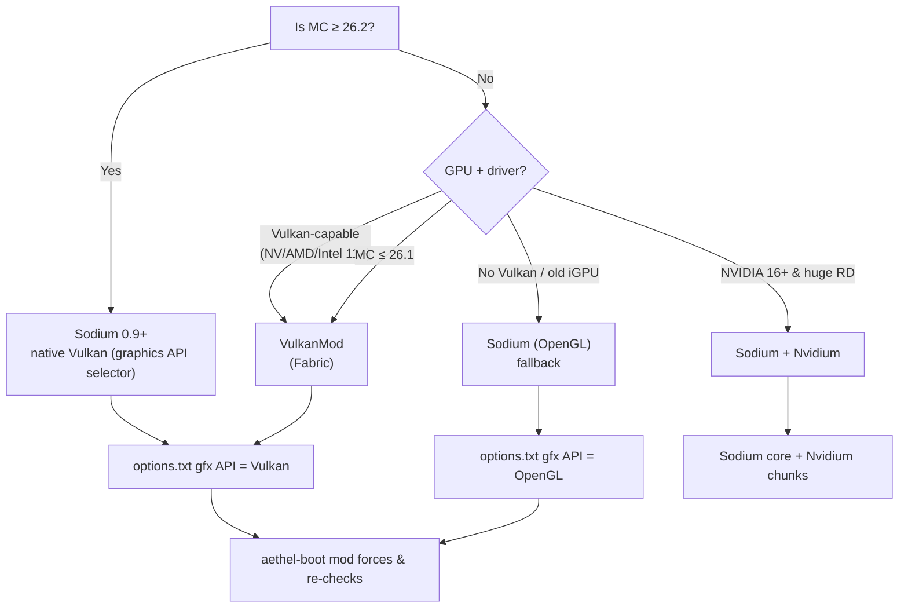
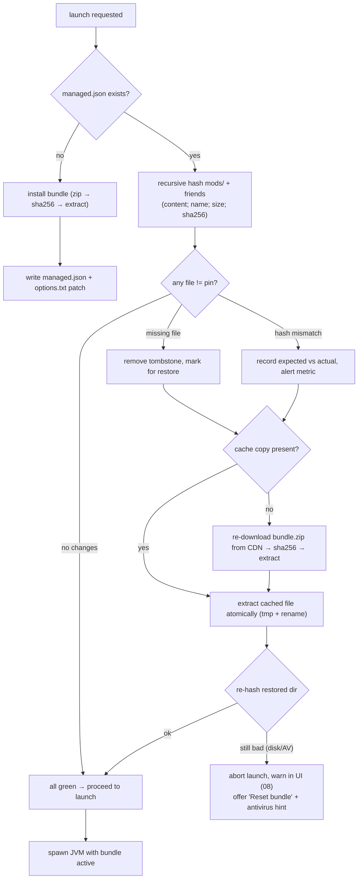

# 07 · Vulkan & Performance

Renderer strategy, the Aethel optimization bundle, and the tamper-detection/self-heal loop that makes the
Vulkan path "functionally undeletable". The bundle is **data, not code** — pinned by SHA-256, verified on
every launch, restored on mismatch, re-selectable per MC version without a launcher release.

## 1. Renderer selection matrix (per MC version)



- **MC 26.2+:** Sodium 0.9.x with the version JSON's graphics-API selection → we write `options.txt`
  (`gfx API: VULKAN` — actual key set during implementation) and let Sodium do the work. Standalone
  VulkanMod is dropped by the ecosystem there (01 §1).
- **1.19.4–26.1.x:** VulkanMod (recommended on Vulkan-capable) or Sodium-OpenGL fallback; auto-detect via
  `ash`/`vulkan-loader` probe during install, plus a manual "Renderer" setting in UI (08 Library sheet).
- **1.8.9–1.16.x:** no Vulkan renderer → OptiFine (bundled) or vanilla.

### 1.1 Renderer decision matrix (input → output)

| Input | Decision | Bundle | options.txt patch |
|---|---|---|---|
| MC ≥ 26.2, Vulkan capable | `sodium-vulkan` | `aethel-perf-vulkan` | `gfxApi=VULKAN` |
| MC 1.19.4–26.1, Vulkan capable, NVIDIA 16+ | `vulkanmod + nvidium` | `aethel-perf-vulkan` | `gfxApi=VULKAN` |
| MC 1.19.4–26.1, Vulkan capable, other | `vulkanmod` | `aethel-perf-vulkan` | `gfxApi=VULKAN` |
| MC 1.19.4–26.1, no Vulkan | `sodium-opengl` | `aethel-perf-opengl` | `gfxApi=OPENGL` |
| MC 1.18.2 / 1.16.5, Vulkan capable | `vulkanmod` | `aethel-perf-vulkan` | `gfxApi=VULKAN` (key set at impl) |
| MC 1.8.9 / 1.12.2 | `optifine` | `aethel-legacy-optifine` | legacy values only |
| Unknown GPU / probe fail / known-bad driver | `sodium-opengl` | `aethel-perf-opengl` | `gfxApi=OPENGL` + UI note |
| User override `Renderer=Vulkan` on incapable HW | respect, then **warn** | Vulkan bundle | patch; boot mod will surface a dialog if it can't init |

### 1.2 Decision is persisted, re-decidable

The renderer decision at install time is written to `instance.toml`:

```toml
[renderer]
mode = "auto"            # auto | vulkan | opengl
selected = "vulkanmod"   # vulkan
probe = { vendor = "amd", vulkan_version = "1.3.250", capable = true }
options_patch = { gfx_api = "VULKAN" }
```

`auto` re-probes at each launch if the game crashed at boot or the GPU changed; `vulkan`/`opengl` override
and are respected by the boot mod.

### 1.3 `aethel-boot` (our mixin, bundled always)

The in-game half of the guarantee. Responsibilities, mixed into `Minecraft` init / `Window`:

| Responsibility | Mechanism | If it fails |
|---|---|---|
| Force configured `gfxApi` on API selection (26.2+) | hook Minecraft's graphics-API selector | log + show HUD banner, raise a `crash` signal to the launcher (12) |
| Enforce renderer sanity post-init | verify `GL` vs `Vulkan` device matches `instance.toml` | emit IPC `crash {kind:"renderer"}` → 08 safe-mode prompt |
| Report effective renderer | IPC `fps/frameTime` messages + F3 badge overlay | silent (badge hidden) |
| Stop when bundle goes missing mid-session | watch `mods/` for pinned file removal via `FileIO` hooks (non-window event) | exit cleanly with reason; launcher self-heals then relaunches |

The launcher and `aethel-boot` never disagree about the renderer because both consume the **same pin
manifest's `rendererMode`**.

## 2. The tamper-proofing model

The user asked that Vulkan "can't be deleted from the game folders". Mechanism: the backend publishes a
**pin manifest** describing every bundled file; the launcher re-hashes the bundle directory before every
launch and restores anything missing or modified.

### 2.1 Pin manifest schema (bundle manifest)

Emitted by `GET /api/v1/modmanifest/{mc}/{bundle}` (see [09 · Backend](./09-backend.md)). Two shapes the
client understands: a **flat file manifest** (used for v1) and a **bundle.zip pointer** (one archive,
sha256-validated, then extracted).

| Field | Type | Meaning |
|---|---|---|
| `manifestVersion` | int | schema version (start at 1) |
| `mcVersion` | string | e.g. `1.21.11` |
| `bundleName` | string | `aethel-perf-vulkan` / `aethel-perf-opengl` |
| `bundleVersion` | string | content semver (`3.2.0`) — bumps when any file changes |
| `rendererMode` | enum | `vulkan` \| `opengl`; drives `options.txt` patch |
| `optionsGen` | object | key/value pairs written into `options.txt` (see §4) |
| `signature` | string \| null | Ed25519 signature over canonical JSON (planned, see §2.4) |
| `archive` | object \| null | the single `.zip` (url, sha256, size, rewriteRoot) |
| `files[]` | array | pinned files with `rel`, `sha256`, `size`, `class` |

```jsonc
// GET /api/v1/modmanifest/1.21.11/aethel  (v1 reference document)
{
  "manifestVersion": 1,
  "mcVersion": "1.21.11",
  "bundleName": "aethel-perf-vulkan",
  "bundleVersion": "3.2.0",
  "rendererMode": "vulkan",
  "signature": null,                    // Ed25519 added in compatibility release (see §2.4)
  "archive": {
    "url": "https://cdn.aethel.app/bundles/1.21.11/aethel-perf-vulkan-3.2.0.zip",
    "sha256": "9f86d081884c7d659a2feaa0c55ad015a3bf4f1b2b0b822cd15d6c15b0f00a08",
    "size": 4278921,
    "rewriteRoot": "mods/"              // archive layout root inside the instance
  },
  "files": [                            // denormalized pin table written to managed.json
    { "rel": "mods/sodium-fabric-0.9.0+mc1.21.11.jar", "sha256": "ab12…", "size": 843_221, "class": "renderer" },
    { "rel": "mods/lithium-fabric-0.16.0.jar",          "sha256": "cd34…", "size": 512_002, "class": "perf" },
    { "rel": "mods/aethel-hud.jar",                     "sha256": "ef56…", "size": 90_111,  "class": "our" }
  ],
  "optionsGen": {
    "gfxApi": "VULKAN",
    "renderDistance": "12",
    "fullscreen": "windowed",
    "entityDistanceScaling": "0.75",
    "fpsLimit": "260"
  }
}
```

### 2.2 Rust model

```rust
// crates/launcher-core/src/bundle/manifest.rs
#[derive(Debug, Clone, Deserialize, Serialize)]
#[serde(rename_all = "camelCase")]
pub struct BundleManifest {
    pub manifest_version: u8,
    pub mc_version: String,
    pub bundle_name: String,
    pub bundle_version: String,
    pub renderer_mode: RendererMode,
    #[serde(default)] pub signature: Option<Signature>,
    #[serde(default)] pub archive: Option<BundleArchive>,
    #[serde(default)] pub files: Vec<BundleFile>,
    #[serde(default)] pub options_gen: BTreeMap<String, String>,
}

#[derive(Debug, Clone, Copy, PartialEq, Eq, Deserialize, Serialize)]
#[serde(rename_all = "lowercase")]
pub enum RendererMode { Vulkan, Opengl }

#[derive(Debug, Clone, Deserialize, Serialize)]
pub struct BundleArchive {
    pub url: String,
    pub sha256: String,
    pub size: u64,
    #[serde(default)] pub rewrite_root: String,   // "mods/"
}

#[derive(Debug, Clone, Deserialize, Serialize)]
pub struct BundleFile {
    pub rel: String,        // relative to instance dir, e.g. "mods/sodium…jar"
    pub sha256: String,
    pub size: u64,
    #[serde(default)] pub class: String,  // renderer | perf | our | loader
}

impl BundleManifest {
    pub fn to_managed_json(&self) -> ManagedJson {
        // verified pin table stored next to the instance (see 02 §4)
    }
}
```

### 2.3 Verify → restore → relaunch (the self-heal loop)



- Managed pin table (`managed.json`) lists every bundled file + SHA-256 + source URL + archive ref.
  Generated by the backend per version, mirrored at `aethel.app/bundles/...` (see 09).
- Verification runs **before every launch** (fast: ~dozens of jars). Files older than the stored
  `verified` snapshot are skipped; `--force-verify` re-hashes everything (used by CI + troubleshooting).
- A mod folder can be re-created any time. This is "functionally undeletable" without blocking advanced
  users: they can still **add** their own mods (those are outside `managed.json`, never reverted).

### 2.4 Signature support (planned)

- `signature: null` today; a compatibility release adds `ed25519-dalek` verification of the **canonical
  JSON** (sorted keys, no whitespace) against the Aethel release key, with key rotation via a short
  `keys` block (`current`, `previous`, `next`):
  - Launcher ships the **root key** (compiled-in, minimal), verifies the update endpoint's manifest.
  - The bundle manifest is signed by a child key (rotation without launcher update).
  - Failed signature on *any* non-null `signature` field → bundle treated as unverified; fall back to
    last-known-good signed manifest + cache; refuse CDN content on mismatch. See [13 · Security](./13-security.md).

### 2.5 Concurrency & atomicity

- Bundle zip downloads to `*.part`, verified, then `unzip` into a temp dir and **renamed over**
  `mods/`-family paths file-by-file via atomic renames; never partially visible.
- Two launches can never fight: single-instance lock is held across install *and* verify (13 §4).
- The verify phase is sha-based, so an in-flight user copy (`cp a.jar mods/`) is detected and reverted —
  deliberate, since bundle files are ours.

### 2.6 Verification algorithm (Rust, headless-testable)

```rust
// crates/launcher-core/src/bundle/verify.rs
pub async fn verify_and_heal(
    instance: &Instance,
    bm: &BundleManifest,
    cache: &BundleCache,
    dl: &Downloader,
) -> Result<VerifyReport, BundleError> {
    let mut report = VerifyReport::default();
    let pinned = load_managed_json(instance)?;                 // managed.json

    for file in &pinned.files {
        let path = instance.root.join(&file.rel);
        let state = match tokio::fs::metadata(&path).await {
            Ok(m) if m.len() == file.size => {
                // size shortcut is optional; we always hash to be strict
                let digest = sha256_file(&path).await?;
                if digest == file.sha256 { VerifyState::Ok } else { VerifyState::Mismatched(path) }
            }
            Ok(_) => VerifyState::Mismatched(path),
            Err(_) => VerifyState::Missing(path),
        };
        match state {
            VerifyState::Ok => {}                                        // fast path
            s @ (VerifyState::Missing(_) | VerifyState::Mismatched(_)) => {
                report.changed += 1;
                let digest = match bm.archive.as_ref() {
                    Some(arc) => restore_from_archive(instance, arc, cache, dl, &file.rel).await?,
                    None       => restore_from_cdn(instance, dl, &bm, &file.rel).await?,
                };
                if &digest != file.sha256 {
                    return Err(BundleError::Unhealable(file.rel.clone())); // AV/disk
                }
            }
        }
    }
    write_verified_snapshot(instance)?;                          // "verified at <ts>"
    Ok(report)
}

pub enum VerifyState { Ok, Missing(PathBuf), Mismatched(PathBuf) }
```

The full walk (`mods/`, `config/`, `options.txt`-adjacent) is hash-based, not mtime-based, because
extraction sets mtimes. Performance budget: ~40 jars × sha256 ≈ < 300 ms on SSD, < 1 s on HDD.

### 2.7 Bundle cache directory

```
$AETHEL_HOME/
└── bundle-cache/
    └── 1.21.11/
        ├── aethel-perf-vulkan-3.2.0.zip      # validated archive (source of truth)
        ├── aethel-perf-vulkan-3.2.0.hash     # sha256 + size
        └── aethel-perf-opengl-2.0.1.zip
```

Cache holds the most recent archive per (version, tier pair) — the last-good content survives a wiped
`mods/` without a network call. GC: keep 1 archive per tier; purge superseded `bundleVersion` after 14 d
unless referenced by `managed.json` of an unverified instance.

## 3. Optimization bundle (curated, Fabric)

One "Aethel Performance" toggle picks the right set per version+GPU. Each file SHA-256 pinned; updates
flow from the backend manifest (bundle version bumps), never silently. Iris and Starlight are tiered so
shader users and pre-1.18 users still get the same perf story.

| Mod | Role | Class | Notes |
|---|---|---|---|
| Sodium 0.9+ | renderer (OpenGL & native-Vulkan 26.2+) | renderer | required baseline; the 26.2+ Vulkan path lives here |
| VulkanMod | Vulkan rewrite (≤ 26.1) | renderer | replaces Sodium in Vulkan mode on those versions |
| Nvidium | GPU-driven chunks (NVIDIA 16+) | renderer | optional, tiered, GPU-detected |
| Iris | shader loader + Sodium fork | perf | optional tier; needs `programmer_art:false` gfx pack |
| Lithium | entity/block tick math | perf | safe |
| Starlight | rewriting light engine | perf | safe; supersedes vanilla lighting cost |
| FerriteCore | memory reduction | perf | safe |
| EntityCulling + MoreCulling | skip invisible renders | perf | safe |
| ImmediatelyFast | fast entity/block renders | perf | safe |
| ModernFix | startup + memory + misc | perf | safe |
| C2ME | concurrent chunk gen | perf | optional (alpha risk), tiered off by default |
| Dynamic FPS | drop fps when unfocused | qol-perf | safe |
| BadOptimizations | micro-opts | perf | safe-ish, monitored |
| MemoryLeakFix | leaked refs | perf | safe |
| CustomSkinLoader | offline skins/capes/elytras | feature | see 11 & 01 §8 |
| Fabric API | dependency | loader | required |
| ModMenu | in-game mod toggles/config | ux | UX surface for 18 |

### 3.1 Tiers

| Tier | Set | When |
|---|---|---|
| `lite` | Sodium/OpenGL + Lithium + FerriteCore + EntityCulling | weak iGPU, no Vulkan, or user opt-out |
| `perf` | `lite` + Starlight + ImmediatelyFast + ModernFix + EntityCulling extras | default for Vulkan-capable ≤ 26.1 and all 26.2+ |
| `perf-nvidia` | `perf` + Nvidium + C2ME | NVIDIA 16+, driver 551+, large render distance |
| `legacy-optifine` | OptiFine (bundled) + Fabric-lite mods where loader exists | 1.8.9–1.16.x |
| `shaders` | `perf` + Iris | user enables shaders (downstream pack) |

Bundle naming encodes tier: `aethel-perf-vulkan`, `aethel-perf-opengl`, `aethel-legacy-optifine`. The
backend serves each (version, tier) pair with its own pin manifest.

### 3.2 Per-version inventory (v1 target)

| MC | renderer | perf core | extra |
|---|---|---|---|
| 1.8.9 | OptiFine | OptiFine only (no Fabric needed) | — |
| 1.12.2 | OptiFine (or Legacy-Fabric+Sodium-1.x) | Lithium (legacy) | — |
| 1.16.5 | VulkanMod / Sodium 0.4 | Lithium, FerriteCore, Starlight, EntityCulling | ImmediatelyFast |
| 1.18.2 | VulkanMod / Sodium 0.5 | Sodium, Lithium, FerriteCore, Starlight | ModernFix |
| 1.20.1 | VulkanMod / Sodium 0.6 | Sodium, Lithium, FerriteCore, Starlight, C2ME(off) | ImmediatelyFast, MoreCulling, Dynamic FPS |
| 1.21.x | VulkanMod / Sodium 0.6+ | Sodium, Lithium, FerriteCore, Starlight, ModernFix | MemoryLeakFix, BadOptimizations(monitored) |
| 26.x | Sodium 0.9 native Vulkan / OpenGL | Sodium, Lithium, FerriteCore, Starlight, ModernFix | Nvidium(on NVIDIA), C2ME(off) |

### 3.3 Renderer safety (why rendering is a *bundle* concern)

- Forcing Vulkan is only valid when the GPU + driver pass the probe; we never force on unknown hardware
  (rule: **danger**, silent black screens). Probe failure → `aethel-perf-opengl` bundle + a UI note.
- Where `options.txt` lacks a `gfxApi` key (pre-1.20), `aethel-boot` (our mixin mod) forces the API
  holder at construction and logs the effective path for verification.
- **Iris interplay:** shaders require the OpenGL pack; enabling `shaders` tier re-patches `gfxApi=OPENGL`
  and disables VulkanMod, then re-asserts Vulkan when the pack is removed — both transitions are
  `options.txt` rewrites that survive relaunch (the boot mod re-checks, never guesses).
- **Licensing:** VulkanMod is LGPL-3.0, CustomSkinLoader GPL-3.0, CaffeineMC family MIT/AGPL mix; ship
  `LICENSES.txt` (11 §6). The bundle archive carries a `licenses/` dir with each mod's license text.

## 4. In-game performance defaults (written at first launch)

- Render distance 8–12 auto per benchmark tier; entity distance reduced; mipmaps default;
- FPS cap: VSync off + cap at 144 or monitor rate on strong GPUs; unlimited on weak;
- Fullscreen: windowed-fullscreen (borderless) to avoid mode-switch stutter;
- `options.txt` rewritten to enforce the chosen renderer + fast graphics baseline for low-end profile.

The `optionsGen` object from the pin manifest is applied atomically: read `options.txt`, diff keys,
write temp, rename. Unknown keys are appended; Aethel-managed keys are marked with a comment so
tampering is visible next boot. First-run `minecraft/` also receives `aethel.json` (18) and
`launcher_profiles.json` (05).

| Key (illustrative) | Value | Source |
|---|---|---|
| `gfxApi` | `VULKAN` | pin manifest `rendererMode` |
| `fullscreen` | `windowed` | defaults |
| `fpsLimit` | `260` \| `0` (weak) | benchmark tier |
| `renderDistance` | `8–12` | tier |
| `entityDistanceScaling` | `0.75` | defaults |
| `mipmapLevels` | `4` | defaults |
| `ao` | `1` (off on weak tier) | tier |

### 4.1 Config precedence (lowest → highest)

| Layer | Where | Values |
|---|---|---|
| Mojang defaults | bundled `options.txt` template | engine defaults |
| `optionsGen` (pin manifest) | applied at install + every bundle bump | renderer, distance, fps cap |
| First-run profile preset | `aethel.json` `preset` | low/med/high profile |
| User edits in-game | `options.txt` at runtime | wins until next bundle bump |
| Full user override | "Reset Aethel defaults" in Mods screen (08) | restores `optionsGen` |

We never fight a deliberate in-game user change on the **same session**; `optionsGen` re-applies only on
launch, with the previous session's values preserved as the diff base.

## 5. GPU / driver detection

- Probe for `vulkaninfo`/`ash` presence; parse `lspci`/WMI for vendor (or the `winit`/egui detected
  adapter name as a hint). The launcher acts as a *manager*, never a *rendering* consumer.
- Decide renderer: NVIDIA 16+/driver 551+ → Nvidium-capable; AMD RX/Intel Arc → VulkanMod; else Sodium.
- Store decision + "Renderer: Auto / Vulkan / OpenGL" override in `instance.toml` (08 gear screen).
- Driver blocklist: known-broken Vulkan driver versions (e.g. old Mesa on Lavapipe-only Linux) map to
  the OpenGL bundle; a `known_bad` list lives in the pin manifest so it hot-fixes.

| Probe signal | Source | Tooling |
|---|---|---|
| Vulkan available + version >= 1.2 | `vulkaninfo`/`vulkan-loader` or `ash` instance | probe at install |
| Vendor | `lspci` on Linux; WMI `Win32_VideoController` on Windows; `system_profiler` on mac | per-OS |
| Adapter name/VRAM | `ash` physical device props (egui only if UI needs it) | launcher-side |
| NVIDIA 16+ detection | enumerate `0x1E0x`/family ranges from device name + driver | sets `perf-nvidia` |
| Known-bad driver list | manifest `known_bad[]` (vendor, driverVersionRegex, reason) | hotfix without release |
| ABCRepro (Linux/Valve) | env presence `PROTON_OMIT_RDTSBIAS` | not relevant to native build; ignored |

## 6. Benchmarks & acceptance

Gate: on a reference weak laptop (e.g. i3 / 8GB / no dGPU), Aethel-OpenGL must ≥ Sodium typical bench and
Aethel-Vulkan must beat OpenGL by ≥ 20% avg + no new micro-stutter class. Tracked in
[16 · Testing](./16-testing.md).

| Metric | Gate | Method |
|---|---|---|
| FPS avg (Vulkan vs OpenGL, 5-min run, same seed) | Vulkan ≥ +20%, no micro-stutter class | replay script + `spark`/F3 log parse |
| Launch-to-title | < 30 s cold, < 10 s warm | CI harness (16 §5) |
| Memory RSS | within 4 GB on 8 GB machine | `FerriteCore` active, sampled |
| Tamper restore | < 500 ms overhead to verify; restore < 10 s | delete 1 jar → relaunch |
| Bundle install | zip → verify → extract < 2 min on 100 Mbit | harness |
| Options patch | first launch applies 8 keys < 50 ms | unit harness |

### 6.1 Reference numbers to hit on week hw

| GPU | Vanilla | Sodium-OGL | Aethel-Vulkan | Notes (from 01 §1 bench) |
|---|---|---|---|---|
| i3/8GB no dGPU (gate machine) | ~90 | ~150 | ~180+ | our acceptance baseline |
| RX 7600 class | ~130 | ~320 | ~1800–2100 | strong deck |
| Intel Arc (driver mature) | ~110 | ~280 | ~900+ | Arc-specific VulkanMod target |

## 7. Edge cases

| Case | Handling |
|---|---|
| User deletes `mods/` entirely | root dir missing → treat as full mismatch → re-extract bundle from cache/CDN |
| User drops a *third-party* jar that collides in name | outside `managed.json` → left alone; if it *shadows* a pinned name → pinned one re-installed and a conflict warning surfaced in Mods screen (08) |
| GPU changes between launches (dGPU ↔ iGPU switch) | probe at launch; if mode `auto`, re-decide and re-patch `options.txt` |
| AV quarantines the bundle zip mid-install | extract atomicity means no half-state; detect missing jar at verify → re-download once; surface "reset bundle" |
| CDN down at self-heal | cache-first restore; if cache also missing → warn, allow launch in OpenGL-lite with notice |
| 1.8.x user requests "Vulkan" | UI explains unsupported (07 §1); falls back to OptiFine |
| Shader pack needs OpenGL (Iris) | tier `shaders` sets `gfxApi=OPENGL` for the pack; Vulkan is re-asserted when pack disabled |
| Signed manifest arrives but signature fails | refuse to apply *new* content; fall back to last known-good pins |
| User renames the launcher folder (ELF breakage) | bundle paths are relative to `instance.toml`; resolve via `$AETHEL_HOME`, never absolute |
| Two bundle updates between sessions | hash-based verify converges to *latest* pins; the archive cache holds one per tier so no thrash |
| `options.txt` locked by a running game | single-instance lock + file-lock retry (300 ms × 5); otherwise wait for exit |
| User on slow HDD | verify runs on 4 background tasks; UI shows a subtle "verifying bundle" row, never blocks input |

## 8. Failure modes & recovery

| Failure | Detection | Recovery | User-facing |
|---|---|---|---|
| Bundle hash mismatch (tamper) | recursive hash vs pin | cache→extract→re-verify | silent (or "Restored N files") |
| Zip sha256 fails at install | verify before extract | refetch once, then abort | Downloads error row → Retry |
| Renderer init crash | no `Renderer init` log / crash report | switch to OpenGL bundle next launch | "Restart in safe (OpenGL) mode" (08 crash viewer) |
| Unknown GPU probe | probe returns nothing | default to `aethel-perf-opengl` | Renderer status text |
| Managed file changed mid-flight by AV | re-verify fails twice in a row | abort, offer "Reset bundle" | dialog + AV hint |
| Backend unreachable at self-heal | manifest cached | serve from cache; download CDN only if cached zip missing | notice only |
| Boot mod can't force gfxApi (vanilla mode) | no bundle installed | vanilla launch, renderer section in Settings warns | "In-game control unavailable" tooltip |
| Unhealable file (disk full / AV race) | re-verify fails after restore | do not launch; collect logs | "Bundle could not be restored" + logs upload |

## 9. Acceptance criteria (checklist)

- [ ] Rendering decision per §1 matrix is correct for 1.8.9 / 1.16.5 / 1.21.11 / 26.2 across 3 GPUs.
- [ ] Deleting/editing any pinned jar → detected at next launch → restored → hash-verified (tested 16 §4).
- [ ] `managed.json` written per instance; pins match backend response byte-for-byte.
- [ ] Single zip flow: download → sha256 → extraction → options patch → launch, all atomic.
- [ ] `options.txt` gfx-API override enforced; aethel-boot re-checks and misbehaves loudly if reverted.
- [ ] Perf gates §6 pass on reference laptop; no new micro-stutter class in Vulkan mode.
- [ ] Third-party user mods untouched by tamper-restore.
- [ ] Bundle upgrades flow via manifest bump, never silently override user "Renderer" override.
- [ ] Rollout of a new bundle version requires zero launcher restarts; `LICENSES.txt` ships in the archive.