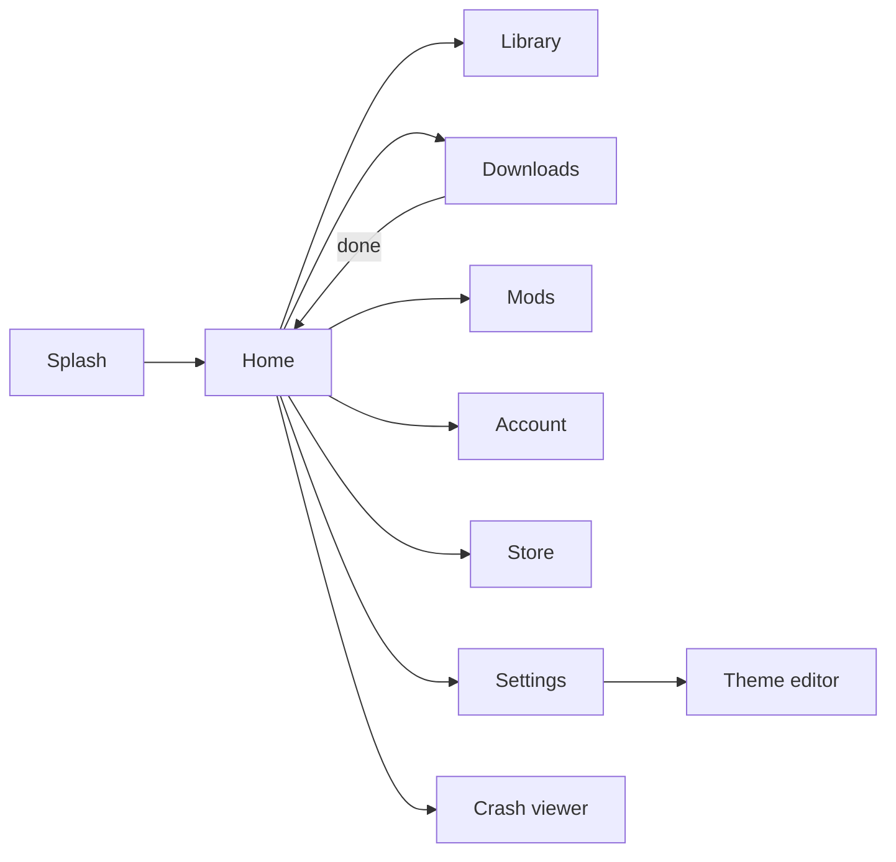
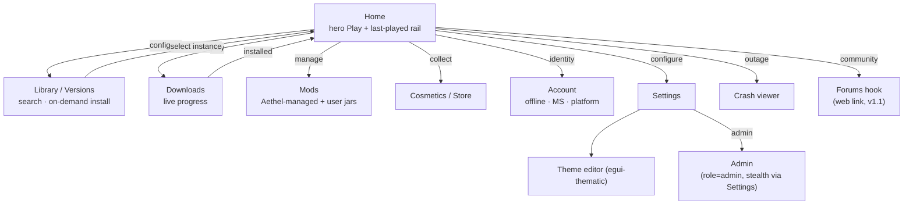
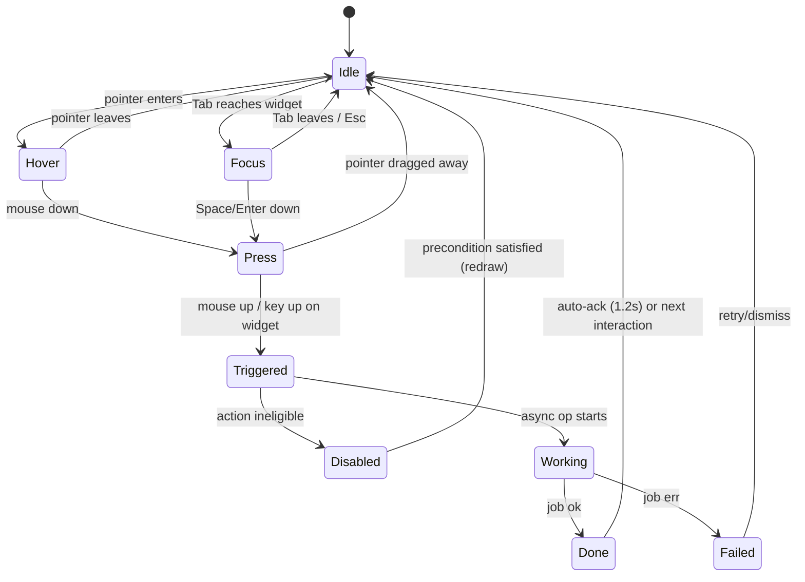

# 08 · UI Design

> Launcher-side frontend. The **in-game** counterpart of this design system is specified in
> [18 · In-game click GUI](./18-client-gui.md) — the same theme tokens are shared via IPC both ways.
> Theme **source of truth is this launcher** (08); the in-game GUI is a pure consumer of
> `theme.json` pushed live over [12 · IPC](./12-ipc.md).

## 1. Design principles

- **Fast & native:** egui, no webview; instant to ~2s splash.
- **Lunar/Feather feel but AMOLED:** pure black/dark surfaces, one strong accent, high contrast type.
- **Progressive disclosure:** huge Play button always visible; advanced settings tucked behind "Gear Icons".
- **Consistent states:** every async operation has declared idle / loading / error / success.
- **One surface reads as one product:** the launcher window and the in-game mod menu share the *same*
  token set; when a token changes here it changes in-game (18 §6) without a game restart.
- **Declarative over imperative:** screens are derived from `AppState`; widgets are theme-driven, never
  individually styled in place. There is exactly one place a color lives.

## 2. Design system (tokens)

All tokens are authored in one `ThemeSet` (Rust) and exported verbatim to `theme.json` for the in-game
GUI — the schema lives in [18 §6](./18-client-gui.md). The values below are the shipped default
(“Aethel Night”).

### 2.1 Color tokens

| Token | Value | Notes |
|---|---|---|
| `bg` | `#0B0B0F` | base |
| `bg-raise` | `#15151C` | cards/panels |
| `bg-hover` | `#1D1D28` | hover surfaces |
| `accent` | `#6C5CE7` (aethel violet) | primary, gradients to `#00D2FF` (cyan) |
| `accent-2` | `#00D2FF` | secondary glow |
| `success` | `#2ECC71` | play/ready |
| `warn` | `#F39C12` | mid-state |
| `danger` | `#E74C3C` | errors/delete |
| `text` | `#ECEFF4` | primary |
| `text-dim` | `#8A8FA3` | secondary |
| `radius` | 10px cards / 999px pills | egui `Rounding` |
| `font` | custom brand (e.g. "Syne"-style display) + system fallback for body | embedded via `FontDefinitions` |

Implementation notes:
- Use `egui::Visuals` overrides + `style.spacing`; `egui-thematic` provides the theme-editor screen;
  `egui-elegance`/`fluent-egui` for cards/pills/gauges if fitting.
- Frameless window (`decorations: false`) + custom title bar (drag region, min/max/close), like Lunar.
- Icons: egui's built-in glyphs or embedded `.ttf`; keep a small set.

### 2.2 Semantic roles (where the tokens are *used*)

| Role | Token | Surface |
|---|---|---|
| Window background | `bg` | every screen's root frame |
| Panel / card fill | `bg-raise` | cards, side rails, popover panels |
| Hover / lifted surface | `bg-hover` | hover rows, dropdown menus, drag-over targets |
| Primary action fill | `accent` | Play button, primary buttons, links, selected tab |
| Secondary emphasis | `accent-2` (`#00D2FF`) | hero glow, focus ring, live/online badges, gradient partner |
| Positive / ready | `success` | playable state, download complete, online |
| Interim / pending | `warn` | installing, queued, beta channel |
| Destructive | `danger` | failures, delete instance, crash actions |
| Body copy | `text` | all readable text ≥ 14px |
| Secondary copy | `text-dim` | captions, timestamps, disabled text, placeholders |
| Border (structural) | `bg-hover` at 1px | card outlines; AMOLED design uses borders, not shadows |

The launcher never paints a widget with a raw hex literal — every fill/stroke is a token lookup, so the
theme editor (M3, [17 §M3](./17-roadmap.md)) can remap at runtime and both frontends stay in sync.

### 2.3 Spacing & layout grid

The layout grid is **4px**. All gaps, paddings and card insets resolve to multiples of 4.

| Token | Value | Used for |
|---|---|---|
| `space-1` | 4px | inline icon–label gaps, checkbox marker inset |
| `space-2` | 8px | default `item_spacing`, pill padding, table cell gap |
| `space-3` | 12px | card inner padding (compact), row gaps in lists |
| `space-4` | 16px | card padding (default), rail margins |
| `space-5` | 24px | screen-level margin, section separation |
| `space-6` | 32px | section headers top/bottom orchestration |
| `space-7` | 48px | hero (Play) area separation, dialog gutters |

Hard rules:
- Cards: `radius 10px`, padding `12–16px`, inner gap `8px`, 1px border `#1D1D28`.
- Pills (toggle, badge, tab): `radius 999px`, height `28px`, horizontal padding `12px`.
- Screen margin: `24px` all sides on ≥ 960×600; drops to `16px` below 1280×720.
- Two-column panels break to single column below `720px` width (window is resizable).

### 2.4 Token → egui wiring (CSS-like mapping)

Every theme token maps to exactly one egui style key so the two never drift:

| Design token | egui field |
|---|---|
| `bg` | `Visuals::panel_fill`, `window_fill`, root `CentralPanel` frame fill |
| `bg-raise` | `Visuals::widgets.inactive.bg_fill`, `window_fill` of popups |
| `bg-hover` | `Visuals::widgets.hovered.bg_fill` |
| `accent` | `Visuals::selection.bg_fill`, hovered/active `fg_stroke.color` of primary buttons |
| `text` | `Visuals::noninteractive.fg_stroke.color`, `override_text_color` default |
| `text-dim` | caption `RichText::color` via helper `dim()` |
| `radius-card` | `Visuals::window_corner_radius`, card frames |
| `radius-pill` | button/toggle `rounding` when pill variant |
| `spacing` | `Style::spacing.item_spacing`, `button_padding` derived |
| `font` | `FontDefinitions::font_data` + `fonts.family` insert (display + body) |
| `glowHover` | `Visuals::widgets.hovered.bg_stroke` width 2 + `accent2` glow fill |

### 2.5 Typography

| Role | Family | Size (body=14 base) | Weight | Usage |
|---|---|---|---|---|
| Display | brand (“Syne”-style) | 28 | 800 | Play hero, screen titles ≥ 24px |
| Title | brand | 20 | 800 | card titles, tab labels |
| Body | system fallback | 14–16 | 500 | most content, buttons |
| Caption | system fallback | 12 | 400–500 | timestamps, dim text, badges |
| Mono | system mono fallback | 12 | 400 | JVM args, paths, IP, hex values |

- Fonts embedded via `FontDefinitions`; brand first, system fallback for every missing glyph (CJK,
  Cyrillic, emoji) — egui falls back per-glyph.
- `Ctrl +/-` rescales the *whole* base size (see §5); every size above is relative to that base.

### 2.6 Motion tokens

| Token | Value | Easing | Usage |
|---|---|---|---|
| `motion-fast` | 120ms | `ease-out` (cubic) | hover/press state frames, pill toggles |
| `motion-base` | 180ms | `ease-in-out` | panel fade/slide, toasts, dropdown reveal |
| `motion-slow` | 300–360ms | `ease-out` | screen transitions, modal enter |
| `motion-glow` | 2400ms | `linear` infinite | Play-button gradient sweep (disabled under reduced motion) |
| `motion-spinner` | 640ms/rev | `linear` infinite | indeterminate progress, refresh |

All durations are tokens readable by the in-game GUI (`effects.*` + `toggles` in theme.json) so the two
frontends animate on the same clock. Full mapping in [18 §13](./18-client-gui.md).

## 3. Screen map



### 3.1 Screen-role map (expanded)



### 3.2 Navigation state table

| Property | Value |
|---|---|
| Default landing | `Home` after splash completes |
| Back semantics | `Esc` pops a modal or returns to Home; `Backspace` in text fields edits, never navigates |
| Session memory | `last_screen` per logical session (splash → Home restores last tab in Library) |
| Deep links (v1) | none by design — `aethel://` deferred to v2 (see [00 §Deferred](./00-overview.md)) |
| Window min size | 960×600; panels reflow, never clip |
| Restore | window geometry + maximized state persisted in `config.toml` |

## 4. Screens in detail

### Splash
Branded logo animation (static for v1), app version, boot checks (dirs, backend reachability, updates),
auto-download latest manifest. → Home.

| Check | On failure |
|---|---|
| `$AETHEL_HOME` dirs writable | warn + “continue anyway”; store index in-memory |
| Backend reachable (`GET /api/v1/health`) | stale-cache mode; show dim “offline” badge on Home |
| Update check | non-blocking; prompt on Settings after Home |
| Single-instance lock | focus existing window ([13 §4](./13-security.md)) |

Splash is bounded: if checks exceed **2 s** they continue in the background and the window proceeds to
Home, which shows fine-grained status in the Downloads row.

### Home
- Left/top: version selector (dropdown = live list from manifest; search filter). Big **PLAY** button
  (state: Ready → "Installing 42%" → 🎮 Launched → busy), glow around accent on hover.
- "News" carousel fed by backend (cover image + title + url).
- "Servers" tiles (player counts from backend cache) — links pass `--server` for quick-join.
- Last-played instances rail.

**Play-button state machine:**

| State | Visual | Interaction |
|---|---|---|
| `ready` | accent fill + `accent2` glow (2400ms sweep) | click → resolve+launch |
| `resolving` | spinner + “Checking…” | no-op |
| `installing` | determinate progress ring, % in button | cancel available via Downloads |
| `launched` | success fill, “In game” | click → focus window, flash title bar |
| `error` | danger fill + tooltip | click → retry with prior config |
| `disabled` | bg-raise fill, dim text | tooltip explains why (no instance selected) |

**Home tiles:** each tile (news item, server, instance) is one card with declared
`idle/hover/loading/error`. A failed thumbnail shows a `warn` “image unavailable” placeholder with
retry affordance rather than a broken-frame icon.

### Library
Grid of instances; per-instance edit sheet: name/icon, MC version+loader, RAM slider, Java path (auto),
resolution, renderer (Auto/Vulkan/OpenGL), JVM args text field, folder open, delete (confirm), "Play".

Version browsing: full Mojang catalogue (`release` / `snapshot` / `old_beta` / `old_alpha`) + Fabric
loader metadata, refreshed on schedule ([05 §1](./05-launch-engine.md)). A version is **installed on
demand** the moment it is selected — nothing pre-fetched ([00 §Versioning](./00-overview.md)).

| Column | Content |
|---|---|
| Version list | filter chips (release/snapshot/old), search substring + fuzzy, sort by release date |
| Row actions | Install → Play → Add-to-profile; hover reveals “view details” |
| Installed badge | `success` dot; installed versions sort first |
| Unavailable | Mojang-removed versions show `warn` “unavailable” with explainer |

Search is instant on a virtualized list (rows capped to `viewport height / row height`, reuse render —
same technique as the in-game GUI, [18 §8](./18-client-gui.md)).

### Downloads
- Live per-file progress bars (speed, %), overall ETA, concurrency slider, pause/resume/retry/cancel.
- Speed sparkline (collect samples in an `Arc<VecDeque<f64>>`).

| Column | Content |
|---|---|
| Job rows | file name, progress bar, speed, ETA, state icon |
| Overall header | aggregate %, ETA, concurrency control (default 16, [05 §3.2](./05-launch-engine.md)) |
| Retry | exponential backoff badge (`warn` until attempt 3), auto-refetch on hash mismatch (max 2) |
| Resume | `Range` resume on `*.part` shown as “resuming from 42%” |
| Cancel | persists journal state; next launch skips `ok` phases ([05 §1.3](./05-launch-engine.md)) |

### Mods
Two sections — **Aethel-managed** (toggles: renderer tier, performance pack, HUD modules) and
**User mods** (.jar selection; validated against version/loader via Modrinth search optional for v1).

| Area | Behaviour |
|---|---|
| Aethel-managed | rendered from backend bundle manifest (`GET /modmanifest/{mc}/{bundle}`, [09 §2](./09-backend.md)); only toggles, never delete-able inline |
| Renderer tier | Auto / Vulkan / OpenGL per instance ([07 §1](./07-vulkan-performance.md)) |
| Performance pack | single “Aethel Performance” switch resolving the version+GPU tier set |
| HUD modules | mirrors in-game toggles; edits write `<instance>/config/aethel.json` and push live via IPC ([18 §7](./18-client-gui.md)) |
| User mods | `.jar` picker + “version bundle” note; conflicting jars surfaced (e.g. Iris on Vulkan instance) as `warn`, never silently fixed ([00 §Edge](./00-overview.md)) |
| Status banner | “Restored N files” from self-heal ([07 §2](./07-vulkan-performance.md)) with dismiss + log link |

### Account
- Offline: username input (validate 3–16 chars), preview derived UUID; set active.
- Microsoft: login button (disabled until app approved), last-signed-in name, logout.
- Platform sync: email/Discord sign-in (Supabase) for store/cosmetics (separate section).

| Row | States |
|---|---|
| Offline | empty → validating (`warn`) → valid (`success` + UUID preview) → invalid (danger, reason: length/charset) |
| Microsoft | `unapproved` (disabled + “coming soon” tooltip) / `signed-out` / `signed-in` (name + logout) / `token-expired` (silent refresh try → login fallback) ([06 §4](./06-auth.md)) |
| Platform | email/Discord CTA; links same login the Store uses ([10 §5](./10-database.md)) |

First-run menu shows username creation prominently; telemetry consent is a separate screen (default
**off**, [14 §1](./14-telemetry.md)) reachable from Settings → Privacy.

### Store
Cosmetic grid (skins, capes, elytra, badges) — images from Supabase Storage; "Equip"/"Buy" via wallet
(backend RPC). Equipped cosmetics resolve to username on our skin API (see 11).

| Item state | Visual |
|---|---|
| Affordable + owned | “Equip” (`success`) / “Unequip” toggle |
| Affordable + not owned | “Buy” with price |
| Unaffordable | price in `text-dim`, click → wallet hint tooltip |
| Equipped | `accent` tick badge + card outline |
| Purchase in flight | button → spinner → confirmation toast (idempotent `request_id`, [10 §6](./10-database.md)) |
| Backend down | cards from cache, purchases disabled with `warn` banner |
| Image missing | `accent2` silhouette placeholder, never broken frame |

### Settings (Gear)
- General (dir, language, theme, auto-update channel, telemetry consent)
- Java (auto-detect, managed JRE status, heap auto/manual)
- Renderer (Auto/Vulkan/OpenGL; override per instance)
- Game defaults (graphics preset: Low/Med/High; render distance; fps cap)
- Keyboard shortcuts + custom title-bar theme
- About / licenses page (bundled mod attribution)

| Sub-screen | Contents |
|---|---|
| General | language selector (localization plan extracted for in-game GUI, [18 §15](./18-client-gui.md)), dir path (editable), update channel `stable`/`beta` ([15 §5](./15-updating-distribution.md)), telemetry consent toggle |
| Java | detected/managed JRE rows with `success`/`warn` status, heap auto or slider (RAM detective bnds, [05 §4](./05-launch-engine.md)) |
| Renderer | global override + per-instance notes; Vulkan probe result |
| Game defaults | graphics preset, render distance, FPS cap — written to `options.txt` presets ([07 §4](./07-vulkan-performance.md)) |
| Shortcuts | launcher keymap (§5.1 table) rebindable, restore-defaults |
| About | version, licenses, `LICENSES.txt` viewer ([11 §6](./11-in-game-mods.md)) |

Hierarchical collapse: each group expands inline; no wizard flows for v1.

### Crash viewer
When the game exits non-zero: show parsed crash stack (top lines), logs snippet, "Copy"/“Upload to
Aethel” (with consent) + "Restart in safe (OpenGL) mode" and "Send feedback".

| Region | Behaviour |
|---|---|
| Summary | top N stack frames (redacted, no tokens — [13 §2](./13-security.md)) |
| Logs | last 40 log lines, searchable, “open folder” |
| Consent | “Upload anonymously” checkbox persists per-launch; default mirrors telemetry consent ([14 §3](./14-telemetry.md)) |
| Actions | Copy / Upload / Restart safe-mode / Close |
| Linked logs | recent entries kept on Home (`warn` badge on Crash tile) |

## 5. Accessibility & polish

- Full keyboard nav (Tab focus, Enter activate); scaling (Ctrl +/- remaps font sizes);
- Reduced motion toggle (disables glow animations);
- HiDPI: respect `scale_factor`; minimum window 960×600 with resizable panels.

The launcher uses egui's built-in `AccessKit` integration for platform screen readers on Windows/macOS
(assist technology reads the widget tree every frame; keep widget IDs stable across frames — never build
forgetful IDs in loops).

### 5.1 Keyboard navigation spec

| Key | Behaviour |
|---|---|
| `Tab` / `Shift+Tab` | move/back focus in DOM-like order (reading order == visual order) |
| `Enter` / `Space` | activate focused widget; pills toggle on both |
| `Esc` | close topmost modal/popup, else return to Home |
| `←`/`→` | switch tabs (Mods ↔ Settings ↔ …), move carousel |
| `↑`/`↓` | navigate list/table rows; `Enter` selects |
| `Ctrl+F` | focus search box on the current screen (Library, Mods, Store) |
| `Ctrl+R` | refresh current screen's data (Library catalogue, news) |
| `Ctrl+Plus` / `Ctrl+Minus` | scale UI text ±2px steps; `Ctrl+0` reset |
| `F11` | toggle maximized |

Focus ring: 2px `accent2` outline on the focused widget — *always* visible regardless of pointer
proximity (egui `style.interaction.focus_skip_keyboard` config disabled). No widget relies on color
alone: every primary action has a text label or distinct icon + tooltip.

### 5.2 Contrast ratios (WCAG AA 1.4.3) — computed from the v1 palette

| Pair | Ratio (≈) | Verdict |
|---|---|---|
| `text` `#ECEFF4` on `bg` `#0B0B0F` | 16.8 : 1 | AAA |
| `text` `#ECEFF4` on `bg-raise` `#15151C` | 13.9 : 1 | AAA |
| `text-dim` `#8A8FA3` on `bg` `#0B0B0F` | 6.1 : 1 | AA (body) |
| `text-dim` `#8A8FA3` on `bg-raise` `#15151C` | 5.5 : 1 | AA (body) |
| `#ECEFF4` (ink) on `accent` `#6C5CE7` | 4.8 : 1 | AA (normal text) |
| `#0B0B0F` (ink) on `accent-2` `#00D2FF` | 10.9 : 1 | AAA |
| `#0B0B0F` (ink) on `success` `#2ECC71` | 9.4 : 1 | AAA |
| `#0B0B0F` (ink) on `warn` `#F39C12` | 8.8 : 1 | AAA |
| `#0B0B0F` (ink) on `danger` `#E74C3C` | 5.1 : 1 | AA (normal text) |
| `text` on `hover` `#1D1D28` | 14.4 : 1 | AAA |

Policy derived from the numbers: **status-color fills always carry near-black ink** (`#0B0B0F`), never
white — white on `success`/`warn`/`accent2` is 2:1 or worse. White text is legal only on `accent` and
`bg`-family surfaces. Pills must be the borderless version for status roles; tonal (low-contrast) pills
are forbidden for anything conveying state.

### 5.3 Reduced motion

| Preference | Behaviour |
|---|---|
| Default | all `motion-*` tokens active |
| `reducedMotion = true` | instant state changes (0ms), static gradient glow, no slide corners — only fade (±fast) remains; propagates to in-game GUI via theme.json `toggles.reducedMotion` ([18 §12](./18-client-gui.md)) |
| System assistive motion | `winit`/eframe event feed; launcher sets reduced by default if OS reports it |

## 6. Widget interaction state machine (launcher)

Every interactive widget passes through the same six states so mouse+keyboard behavior is identical on
all screens:



| State | Fill | Border | Notes |
|---|---|---|---|
| Idle | `bg-raise` or `hover` bg | 1px `#1D1D28` | non-interactive rows use `text-dim` |
| Hover | `bg-hover` | hover fill as border | cursor `pointer`; glow only if `glowHover` |
| Focus | `bg-raise` | 2px `accent2` | visible regardless of pointer |
| Press | `accent` (primary) / `hover` | accent border | scale 0.98 (≤120ms, ease-out) |
| Working | `bg-raise` + spinner | same as idle | input blocked on this widget only |
| Failed | danger border + inline caption | 1px `danger` | retry affordance on the widget |
| Disabled | `bg-raise` at 60% alpha | none | tooltip explains why |

The machine is centralized in one `frame_button` helper in `launcher-ui`; screens never re-implement
hover/press logic.

## 7. egui UI skeleton (reference)

```rust
// crates/launcher-ui/src/app.rs — reduced skeleton
use eframe::egui;
use crate::theme::{apply_style, ThemeSet};

#[derive(Clone)]
pub enum Screen {
    Splash,
    Home,
    Library { search: String, filter: VersionFilter },
    Downloads,
    Mods,
    Account,
    Store,
    Settings(SettingsTab),
    CrashViewer(Uuid),
}

pub struct LauncherApp {
    theme: ThemeSet,          // tokens (08 §2); exported to theme.json + pushed over IPC (18 §6)
    screen: Screen,
    nav: NavState,            // back stack for Esc, session memory (§3.2)
    jobs: JobRegistry,        // async install/launch jobs aggregated for Downloads (05 §3.2)
}

impl eframe::App for LauncherApp {
    fn update(&mut self, ctx: &egui::Context, _frame: &mut eframe::Frame) {
        apply_style(ctx, &self.theme);                       // §2.4 token wiring, every frame
        match &self.screen {
            Screen::Splash       => self.ui_splash(ctx),
            Screen::Home         => self.ui_home(ctx),
            Screen::Library { .. } => self.ui_library(ctx),
            Screen::Downloads    => self.ui_downloads(ctx),
            Screen::Mods         => self.ui_mods(ctx),
            Screen::Account      => self.ui_account(ctx),
            Screen::Store        => self.ui_store(ctx),
            Screen::Settings(t)  => self.ui_settings(ctx, t.clone()),
            Screen::CrashViewer(id) => self.ui_crash(ctx, *id),
        }
    }
}

// theme/apply_style.rs — the only place token→egui mapping happens
pub fn apply_style(ctx: &egui::Context, t: &ThemeSet) {
    let mut v = egui::Visuals::dark();
    v.panel_fill = t.bg;                        // #0B0B0F
    v.window_fill = t.bg_raise;                 // #15151C
    v.window_corner_radius = t.radius_card.into();       // 10px
    v.widgets.noninteractive.bg_fill = t.bg_raise;
    v.widgets.noninteractive.fg_stroke.color = t.text;   // #ECEFF4
    v.widgets.inactive.bg_fill = t.bg_raise;
    v.widgets.hovered.bg_fill = t.hover;        // #1D1D28
    v.widgets.active.bg_fill  = t.accent.gamma_multiply(0.85);
    v.selection.bg_fill = t.accent;             // #6C5CE7
    v.selection.stroke = egui::Stroke::new(1.0, t.accent2);
    ctx.set_visuals(v);

    let mut s = egui::Style::default();
    s.spacing.item_spacing = egui::vec2(t.spacing as f32, t.spacing as f32); // 8px
    s.spacing.button_padding = egui::vec2(12.0, 6.0);
    ctx.set_style(s);
}
```

Widgets exercised per screen: `egui::ComboBox` (version selector), `egui::Slider` (RAM, concurrency),
`egui_extras::TableBuilder` (Downloads/Library), custom pill/segmented toggle (theme'd `SelectableLabel`),
custom carousel (Home news), and `egui_thematic` (theme editor screen). Textures (news covers, shop
items) load via `ctx.load_texture` from `reqwest` bytes with an explicit fallback texture.

## 8. Edge cases

| Case | Stance / response |
|---|---|
| Window resized during install | Downloads reflows; backpressure on `JobRegistry` never re-enters UI thread; render cadence throttled (`ctx.request_repaint_after`) |
| `scale_factor` changes at runtime (monitor move) | `handle_platform_output` applies new pixel ratio; text remaps via base-size tokens; no blurry burn-in (egui re-rasterizes) |
| Font missing glyph (CJK/emoji) | per-glyph fallback to system family; brand font never blocks rendering |
| News cover 404 | `warn` placeholder + retry; carousel continues on other tiles |
| Backend call blocks (slow DNS) | async via `tokio`, UI never stalls; per-tile `working` state |
| Theme editor edits a token mid-draw | applied on next frame atomically (ThemeSet is `Clone`-swapped wholesale); no half-applied theme |
| Window min size exceeded on small screens | reflow (single column); content clipped only below 960×600 floor, reported in logs |
| Language switch mid-session | strings via central `i18n::L` lookup (18 §15 shares the catalogue); labels re-render next frame |
| Rapid double-click on Play | launcher-idempotent: second press focuses existing "installing" row instead of spawning a second resolve |
| Cry wake (sleep/resume) | repaint on next frame; timers rebuilt from `Instant::now()` offset, no drift accumulation |
| Settings + Store both open wallet | single `WalletState` in app root; competing writes serialized through jobs |

## 9. Failure modes & degraded operation

| Failure | Severity | Visual/behaviour | Recovers via |
|---|---|---|---|
| Backend down | medium | stale-cache badges (`warn` “offline”), News/Store tiles dim, Play still works | retry + stale data ([02 §6](./02-architecture.md)) |
| Bundle verify fails pre-launch | high | non-blocking banner “Restoring N files…”, Play gated until done read-only | self-heal ([07 §2](./07-vulkan-performance.md)) |
| Vulkan boot crash | high | Crash viewer + “Restart in safe (OpenGL) mode” one click | safe-mode relaunch ([05 §7](./05-launch-engine.md)) |
| Download mid-stream corrupt | low | row → error → auto-refetch (max 2); never trusts partial | retry ([05 §3.2](./05-launch-engine.md)) |
| Theme JSON write fails (read-only FS) | low | theme editor shows `danger` + falls back to in-memory theme, logs path | user fixes permissions |
| Font pack load failure | low | silent fallback to system type; warning once in logs | next launch re-try |
| GPU driver probe stalls | medium | renderer picker shows `warn` “probing…” then OpenGL default | re-probe on next launch |
| Git/upstream manifest drift | low | “stale manifest” badge with last-sync time; catalogue still browsable | scheduled refresh ([09 §4](./09-backend.md)) |
| Exceeded telemetry consent space | low | consent screen never re-shows after first choice; toggle visible in Settings | — |
| Antivirus flags installer/jars | medium | installer re-run assist + heuristic note ([05 §9](./05-launch-engine.md)) | re-extract + checksum |

The UI contract for all failures: **never dead-end** — every error state carries a recovery path
(retry / re-sync / safe-mode / logs). A screen that cannot render because of a hard error shows a
minimal `danger` frame with "Open logs" + "Restart", never a frozen window.

## 10. Acceptance criteria (launcher UI)

- [ ] Splash → Home in < 2 s on reference machine; boot checks continue in background if slow.
- [ ] All screens reachable by mouse **and** Tab/Enter-only keyboard traversal ([17 §M3](./17-roadmap.md)).
- [ ] Every async operation renders all four declared states (idle/loading/error/success) and never blocks the frame loop.
- [ ] Theme editor changes apply next frame in the launcher **and** push live to the in-game GUI over IPC without restart ([18 §6](./18-client-gui.md)).
- [ ] Contrast pairs pass the §5.2 table; status fills use near-black ink; focus ring visible pre-hover.
- [ ] Frameless window: drag region, min/max/close work on all 3 OS; geometry persists.
- [ ] Minimum 960×600 renders all screens without clipping; reflow < 720px wide verified.
- [ ] Every failure mode in §9 mapped to a recovery action; no dead-end error state remains.
- [ ] `Ctrl +/-/0` scaling works and reduces motion toggle matches the game side.

## Related specifications

- Theme schema & live update protocol → [18 · In-game click GUI](./18-client-gui.md) §6–§7
- IPC frames carrying theme/toggles → [12 · IPC](./12-ipc.md)
- Screen data sources → [09 · Backend](./09-backend.md), [10 · Database](./10-database.md)
- Launch pipeline backing the Play button → [05 · Launch engine](./05-launch-engine.md)
- Theme tokens mirrored in-game → [07 · Vulkan & performance](./07-vulkan-performance.md) (renderer badge) and [11 · In-game mods](./11-in-game-mods.md)