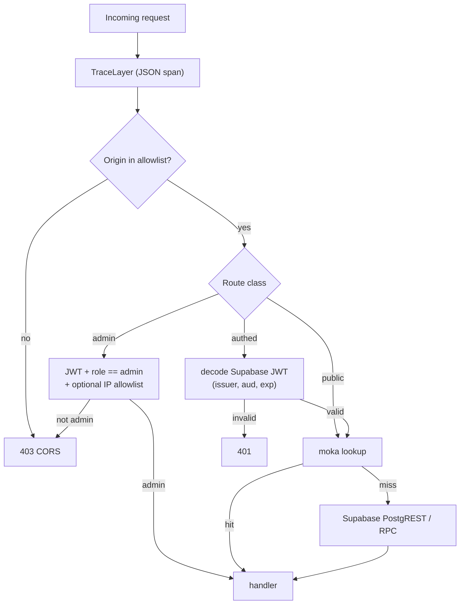
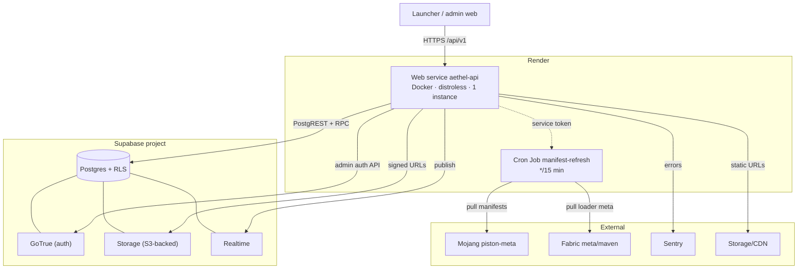

# 09 · Backend

Rust **Axum** service deployed on **Render** (Docker). Talk to **Supabase** (Postgres API + Auth) for all
persistence; only compute/gate/authz logic lives in Axum.

> **Scope of this document.** The complete contract of the hosted platform: the route tree, every endpoint's
> request/response shape, the module layout, the Render deployment (build → distroless runtime → cron),
> rate-limiting/idempotency, the performance/footprint budget that justifies Rust, and observability.
> The data model this service sits on is [10 · Database](./10-database.md); the client that consumes these
> routes is [05 · Launch engine](./05-launch-engine.md) (manifests), [06 · Auth](./06-auth.md) (identity),
> [08 · UI design](./08-ui-design.md) (news/shop), [11 · In-game mods](./11-in-game-mods.md) (skin API),
> [14 · Telemetry](./14-telemetry.md) (ingest) and [15 · Updating & distribution](./15-updating-distribution.md)
> (update-check). The gateway exists precisely so **no DB secret ever ships to clients** (decision D-08 in
> [00 · Overview](./00-overview.md)).

## 1. Route tree

Three classes of route — **public**, **authed** (Supabase JWT), **admin** (`role=admin`) — across 17 handler
groups. The visual guard order is in §1.2; the authoritative list is §1.1.

### 1.1 Route contract table (the authoritative list)

Every row is a typed handler; "Class" maps to the tower middleware stack applied in §3.2. Cache TTLs are the
**locked** `moka` values (15 / 5 / 5 / 15 min for `/versions`, `/modmanifest/*`, `/news`, `/shop`); `/servers`
adds a short 30 s TTL overlaid by Realtime. `—` means "no cache / no idempotency requirement".

| Method | Path | Auth | Class | Cache TTL | Rate limit | Idempotent | Response |
|---|---|---|---|---|---|---|---|
| `GET` | `/api/v1/health` | none | public | — | none | — | `{status, version, uptime_s}` |
| `GET` | `/api/v1/versions` | none | public | 15 min | edge | — | `VersionsResponse` |
| `GET` | `/api/v1/modmanifest/{mc}/{bundle}` | none | public | 5 min | edge | — | `BundleManifest` ([07 §2.1](./07-vulkan-performance.md)) |
| `GET` | `/api/v1/news` | none | public | 5 min | edge | — | `[NewsItem]` |
| `GET` | `/api/v1/servers` | none | public | 30 s + RT | edge | — | `[ServerTile]` |
| `POST` | `/api/v1/launcher/update-check` | none | public | 1 min | per `install_id` | — | `UpdateCheck` ([15 §1.2](./15-updating-distribution.md)) |
| `POST` | `/api/v1/telemetry/crash` | none (anon) | ingest | — | per-IP strict | optional `request_id` | `204` |
| `GET` | `/api/v1/skin-api/textures/player/{username}` | none | public | 5 min | per-IP strict | — | UniSkinAPI JSON |
| `GET` | `/api/v1/shop` | none | public | 15 min | edge | — | `[ShopItem]` |
| `GET` | `/api/v1/me` | JWT | authed | — | profile | — | `MeResponse` |
| `PUT` | `/api/v1/me` | JWT | authed | — | profile | — | `MeResponse` |
| `POST` | `/api/v1/shop/buy` | JWT | authed | — | profile strict | **required `request_id`** | `BuyResult` |
| `POST` | `/api/v1/cosmetics/equip` | JWT | authed | — | profile | — | `204` |
| `GET` | `/api/v1/cosmetics/mine` | JWT | authed | — | profile | — | `[OwnedCosmetic]` |
| `POST` | `/api/v1/admin/news` | admin | admin | invalidates `news` | admin | — | `NewsItem` |
| `PATCH`/`DELETE` | `/api/v1/admin/news/{id}` | admin | admin | invalidates `news` | admin | — | `204` |
| `POST`/`PATCH`/`DELETE` | `/api/v1/admin/shop/items[/{id}]` | admin | admin | invalidates `shop` | admin | — | `ShopItem` |
| `POST`/`PATCH` | `/api/v1/admin/bundles[/{id}]` | admin | admin | invalidates `modmanifest` | admin | — | `Bundle` |
| `POST` | `/api/v1/admin/bundles/refresh` | service token | admin | invalidates all | admin | — | `{refreshed:[...]}` |
| `GET` | `/api/v1/admin/metrics` | admin or IP allowlist | admin | — | admin | — | Prometheus text |

> **Method note.** `/launcher/update-check` is `POST` because the request body carries `{current, channel,
> install_id}` and the rollout decision is per-install ([15 §1.2](./15-updating-distribution.md)); a `GET`
> alias exists only for CDN-cacheable "latest stable" probes.

### 1.2 Auth classes & guard order



| Class | Middleware | Failure code | Notes |
|---|---|---|---|
| public | `TraceLayer`, `CorsLayer`, `CompressionLayer` | — | no identity required |
| authed | `require_jwt` (`jsonwebtoken`) | `401` | claims cached in request extensions |
| admin | `require_admin` (JWT + `role=admin`) + optional `AllowIp` | `403` | destructive ops emit an audit log line |
| ingest | `RateLimitLayer` per-IP + body-size guard | `429` / `413` | telemetry + skin-api only |

## 2. Endpoint contracts (summary)

| Endpoint | Response | Notes |
|---|---|---|
| `/versions` | curated list `[{id, type, recommended, bundleVersion, changelog}]` | merged Mojang + Aethel metadata; cached 15 min |
| `/modmanifest/{mc}/{bundle}` | `{files:[{path,url,sha256,size,class}], rendererMode, optionsGen}` | single source of truth for bundle, tamper pins |
| `/news` | `[{id,title,cover,bodyMarkdown,url}]` | displayed on Home |
| `/servers` | `[{id,name,status,players,max,address}]` | partner quick-join |
| `/launcher/update-check` | `{version, url, sha256, mandatory}` | consumed by `self_update`-style client |
| `/telemetry/crash` | 204 | ingest crash reports (game crash files + consent flag) |
| `/skin-api/textures/player/{username}` | UniSkinAPI JSON `{SKIN:{url,metadata},CAPE:{url}}` | powers CustomSkinLoader; URLs → Supabase Storage |
| `/shop` | `[{id,name,type,cost,image,description}]` | cosmetic catalog |
| `/me` | profile + wallet + owned cosmetics | needs JWT |
| `/shop/buy` | transaction id | RPC → wallet move, item grant |

### 2.1 Concrete payload shapes (v1)

```jsonc
// GET /api/v1/versions  (truncated)
{
  "latest": { "release": "26.2", "snapshot": "26.2-rc2" },
  "versions": [
    { "id": "26.2", "type": "release", "recommended": true,
      "bundleVersion": "3.2.0", "renderer": "sodium-vulkan",
      "changelog": "Sodium native Vulkan path", "releaseTime": "2026-08-14T00:00:00Z" },
    { "id": "1.21.11", "type": "release", "recommended": false,
      "bundleVersion": "3.1.4", "renderer": "vulkanmod", "releaseTime": "2025-12-02T00:00:00Z" }
  ],
  "stale": false, "refreshedAt": "2026-09-21T19:00:00Z"
}
```

```jsonc
// GET /api/v1/skin-api/textures/player/aethel_01  (UniSkinAPI dialect, [11 §3](./11-in-game-mods.md))
{
  "SKIN": { "url": "https://cdn.aethel.app/cosmetics/skins/<sha256>.png", "metadata": { "model": "slim" } },
  "CAPE": { "url": "https://cdn.aethel.app/cosmetics/capes/<sha256>.png" },
  "USERNAME": "aethel_01",
  "LAST_UPDATE": 1726912000,
  "MODEL": "slim"
}
```

```jsonc
// POST /api/v1/shop/buy
{ "itemId": "6f2a…", "requestId": "b7f9…" }
// 200 →
{ "txId": "d41d…", "balance": 850, "itemId": "6f2a…", "duplicate": false }
```

### 2.2 PostgREST requests the service issues (server-side only)

```bash
# catalog read (typed, explicit column selection, RLS bypassed by service key)
curl -s "$SUPABASE_URL/rest/v1/shop_items?select=id,name,type,cost,image_url,description&active=eq.true&order=cost.asc" \
  -H "apikey: $SUPABASE_SERVICE_KEY" -H "Authorization: Bearer $SUPABASE_SERVICE_KEY"

# transactional purchase via Postgres function (single transaction, idempotent on request_id)
curl -s -X POST "$SUPABASE_URL/rest/v1/rpc/shop_buy" \
  -H "apikey: $SUPABASE_SERVICE_KEY" -H "Authorization: Bearer $SUPABASE_SERVICE_KEY" \
  -H "Content-Type: application/json" \
  -d '{"p_profile":"…","p_item":"6f2a…","p_request":"b7f9…"}'
```

```rust
// crates/backend/src/services/supabase.rs — typed client over PostgREST + GoTrue admin API.
// The service key is read from env at boot and NEVER serialized into a response.
pub struct Supabase { base: Url, key: String, http: reqwest::Client }

impl Supabase {
    pub async fn select<T: DeserializeOwned>(&self, table: &str, query: &str) -> Result<Vec<T>, DbError> {
        let res = self.http
            .get(format!("{}/rest/v1/{}?{}", self.base, table, query))
            .header("apikey", &self.key)
            .header("Authorization", format!("Bearer {}", self.key))
            .send().await?
            .error_for_status()?;
        Ok(res.json().await?)
    }

    /// PostgREST RPC → a Postgres function that runs in one transaction (wallet + grant).
    pub async fn rpc<T: DeserializeOwned>(&self, f: &str, args: serde_json::Value) -> Result<T, DbError> {
        let res = self.http
            .post(format!("{}/rest/v1/rpc/{}", self.base, f))
            .header("apikey", &self.key)
            .header("Authorization", format!("Bearer {}", self.key))
            .json(&args).send().await?
            .error_for_status()?;
        Ok(res.json().await?)
    }
}
```

### 2.3 Handler examples (Rust)

```rust
// crates/backend/src/routes/shop.rs — idempotent purchase
#[derive(serde::Deserialize)]
pub struct BuyReq { pub item_id: Uuid, pub request_id: Uuid }

pub async fn buy(
    State(app): State<AppState>,
    AuthUser(user): AuthUser,          // JWT middleware: sub = profile id
    Json(req): Json<BuyReq>,
) -> Result<Json<BuyResult>, ApiError> {
    // request_id is UNIQUE in wallet_moves; a replay returns the prior tx, never double-charges.
    let tx = app.supabase.rpc::<BuyResult>("shop_buy", serde_json::json!({
        "p_profile": user.id,
        "p_item": req.item_id,
        "p_request": req.request_id,
    })).await?;
    app.caches.shop.invalidate_all();
    Ok(Json(tx))
}
```

```rust
// crates/backend/src/middleware/auth.rs — admin gate
pub async fn require_admin(
    State(app): State<AppState>, mut req: Request, next: Next,
) -> Result<Response, ApiError> {
    let token = bearer(&req).ok_or(ApiError::Unauthorized)?;
    let data = decode::<Claims>(token, &app.jwt_decoder, &Validation::new(Algorithm::HS256))?;
    if data.claims.role.as_deref() != Some("admin") {
        metrics::counter!("aethel_admin_rejected_total").increment(1);
        return Err(ApiError::Forbidden);
    }
    req.extensions_mut().insert(data.claims);
    Ok(next.run(req).await)
}
```

## 3. Backend module sketch

```
crates/backend/src/
├── main.rs             # tower + router + state + trace + cors
├── config.rs           # env parsing (SUPABASE_URL, SERVICE_KEY, SENTRY_DSN, JWT_SECRET)
├── routes/
│   ├── health.rs  versions.rs  manifests.rs  news.rs  servers.rs
│   ├── update.rs  telemetry.rs  webfans.rs  shop.rs  admin.rs
├── services/
│   ├── supabase.rs     # typed client over PostgREST + auth admin
│   ├── manifest_refresh.rs  # cron-ish: pull Mojang/Fabric → cache + upsert
│   └── skin_api.rs     # resolve username → equipped cosmetics → storage urls
└── error.rs
```

### 3.1 Module responsibilities

| Module | Owns | Writes to | Reads from |
|---|---|---|---|
| `main.rs` | router assembly, shared `AppState`, graceful shutdown | — | config |
| `config.rs` | env parsing + validation; fails fast if a required secret is absent | — | `std::env` |
| `routes/versions.rs` | curated catalogue + Mojang merge, `recommended` flag | — | `versions` (read-through cache) |
| `routes/manifests.rs` | `modmanifest` projection from `bundles`/`bundle_files` | — | `bundles`, `bundle_files` |
| `routes/update.rs` | channel filter, rollout by `install_id`, mandatory flag | `update_offers` (read) | backend release manifest |
| `routes/telemetry.rs` | size cap, consent echo, multipart attachment | `telemetry_crashes`, `attachments` | — |
| `routes/skin_api.rs` | username → equipped set → storage URLs, UniSkinAPI shaping | — | `cosmetics_owned`, `shop_items`, Storage |
| `routes/shop.rs` | catalog + idempotent purchase | `wallet_moves`, `cosmetics_owned` (via RPC) | `shop_items`, `wallet` |
| `routes/admin.rs` | CRUD + cache invalidation + metrics endpoint | `news`, `shop_items`, `bundles` | — |
| `services/manifest_refresh.rs` | pull Mojang/Fabric on schedule, upsert + bump `bundles` | `versions`, `bundles` | Mojang, Fabric |
| `services/skin_api.rs` | resolution logic shared by the route + Realtime invalidation | — | Storage |
| `error.rs` | `thiserror` → JSON envelope `{error:{code,message,requestId}}` | — | — |
| `cache.rs` | `moka` TTL caches + invalidation hooks (see §6.1) | — | — |

> `webfans.rs` is the legacy name for the **servers/votes** surface ([10 §6](./10-database.md) keeps `votes`);
> the route it backs is `/servers`. Renaming it is tracked but not v1-blocking.

### 3.2 Router assembly (tower stack, real ordering)

```rust
// crates/backend/src/main.rs — reduced; full route set is §1.1
let state = AppState::from_env()?;              // fails fast if SUPABASE_SERVICE_KEY missing

let public = Router::new()
    .route("/api/v1/health", get(routes::health::get))
    .route("/api/v1/versions", get(routes::versions::get_versions))
    .route("/api/v1/modmanifest/:mc/:bundle", get(routes::manifests::get))
    .route("/api/v1/news", get(routes::news::list))
    .route("/api/v1/servers", get(routes::servers::list))
    .route("/api/v1/update", post(routes::update::check))
    .route("/api/v1/telemetry/crash", post(routes::telemetry::crash))
    .route("/api/v1/skin-api/textures/player/:username", get(routes::skin_api::player))
    .route("/api/v1/shop", get(routes::shop::catalog));

let authed = Router::new()
    .route("/api/v1/me", get(routes::me::get).put(routes::me::put))
    .route("/api/v1/shop/buy", post(routes::shop::buy))
    .route("/api/v1/cosmetics/equip", post(routes::shop::equip))
    .route("/api/v1/cosmetics/mine", get(routes::shop::mine))
    .route_layer(middleware::from_fn_with_state(state.clone(), require_jwt));

let admin = Router::new()
    .route("/api/v1/admin/news", post(routes::admin::news_create))
    .route("/api/v1/admin/news/:id", patch(routes::admin::news_update).delete(routes::admin::news_delete))
    .route("/api/v1/admin/shop/items", post(routes::admin::item_create))
    .route("/api/v1/admin/shop/items/:id", patch(routes::admin::item_update).delete(routes::admin::item_delete))
    .route("/api/v1/admin/bundles", post(routes::admin::bundle_create))
    .route("/api/v1/admin/bundles/refresh", post(routes::admin::bundle_refresh))
    .route("/api/v1/admin/metrics", get(routes::admin::metrics))
    .route_layer(middleware::from_fn_with_state(state.clone(), require_admin));

let app = Router::new().merge(public).merge(authed).merge(admin)
    .layer(TraceLayer::new_for_http())
    .layer(CompressionLayer::new())
    .layer(CorsLayer::new().allow_origin(AllowOrigin::list(state.cors_origins.clone())))
    .layer(DefaultBodyLimit::max(5 * 1024 * 1024))     // telemetry attachment cap
    .with_state(state);
```

## 4. Deployment (Render)

- `Dockerfile`: `rust:bookworm` build stage → slim distroless runtime; `EXPOSE 8080`; healthcheck `/api/v1/health`.
- Env (secret): `SUPABASE_URL`, `SUPABASE_SERVICE_KEY`, `JWT_SECRET`, `SENTRY_DSN`, `PUBLIC_BASE_URL`.
- Service: web service (auto-deploy on `main`), instance default; optional **Cron Job** hitting
  `/api/v1/admin/bundles/refresh` with a service token to refresh upstream manifests.
- CORS: allow our future web hosts (forum/admin) + strict allowlist.

### 4.1 Deployment topology



### 4.2 Dockerfile (build → distroless)

```dockerfile
# ---- build stage ----
FROM rust:1.8x-bookworm AS build
WORKDIR /src
COPY . .
RUN cargo build --release --locked -p backend

# ---- runtime stage (no shell, no package manager) ----
FROM gcr.io/distroless/cc-debian12:nonroot
COPY --from=build /src/target/release/backend /usr/local/bin/backend
ENV PORT=8080 RUST_LOG=info
EXPOSE 8080
USER nonroot
ENTRYPOINT ["/usr/local/bin/backend"]
```

### 4.3 Render blueprint (web + cron)

```yaml
services:
  - type: web
    name: aethel-api
    runtime: docker
    dockerfilePath: ./Dockerfile
    healthCheckPath: /api/v1/health
    autoDeploy: true
    envVars:
      - key: SUPABASE_URL
        sync: false            # set in dashboard, never in repo
      - key: SUPABASE_SERVICE_KEY
        sync: false
      - key: JWT_SECRET
        sync: false
      - key: SENTRY_DSN
        sync: false
      - key: PUBLIC_BASE_URL
        value: https://api.aethel.app
  - type: cron
    name: manifest-refresh
    schedule: "*/15 * * * *"
    command: "curl -fsS -X POST $API_BASE/api/v1/admin/bundles/refresh -H \"Authorization: Bearer $SERVICE_TOKEN\""
```

### 4.4 Environment variables (contract)

Cross-referenced with [04 §4](./04-repository.md) — this is the deployment-side view.

| Variable | Required | Consumer | Leaks to client? |
|---|---|---|---|
| `SUPABASE_URL` | yes | `Supabase` client | no (server-only) |
| `SUPABASE_SERVICE_KEY` | yes | `Supabase` client | **never** |
| `SUPABASE_ANON_KEY` | no | admin web (future) | public by design |
| `JWT_SECRET` | yes | `jsonwebtoken` | no |
| `SENTRY_DSN` | no | `sentry` init | DSN is public but kept out of history |
| `PUBLIC_BASE_URL` | yes | absolute URL generation | public |
| `RUST_LOG` | no | `tracing_subscriber` | no |

## 5. Rate limiting & abuse

- `tower_http` `RateLimitLayer` per-IP on telemetry + skin-api (cache in-memory).
- Admin paths: IP allowlist or full JWT `role == admin`.
- `shop/buy`: idempotency key (client-supplied `request_id`) to avoid double-charge.

### 5.1 Limit matrix

| Route class | Key | Steady | Burst | Exceed response |
|---|---|---|---|---|
| `/telemetry/crash` | client IP | 10 / min | 5 | `429` + `Retry-After: 60` |
| `/skin-api/*` | client IP | 60 / min | 20 | `429` + `Retry-After: 30` |
| `/shop/buy` | profile id | 5 / min | 2 | `429` + `Retry-After: 60` |
| authed reads | profile id | 120 / min | 40 | `429` |
| `/launcher/update-check` | `install_id` | 20 / hour | 5 | `429` |
| `/admin/*` | profile id | 60 / min | 10 | `429` + audit log |
| public reads | edge cache | n/a | n/a | served by CDN/moka |

```rust
// per-IP bucket (telemetry + skin-api); tower_http in-memory governor
use tower_http::limit::RateLimitLayer;
use tower::limit::RateLimit;

let ingest = Router::new()
    .route("/api/v1/telemetry/crash", post(routes::telemetry::crash))
    .layer(RateLimitLayer::new(600, Duration::from_secs(60)));   // 10/min/IP after /60 burst math
```

### 5.2 Idempotency (purchase replay)

```sql
-- wallet_moves.request_id is UNIQUE; the RPC is a no-op-returning-prior-tx on replay.
create or replace function shop_buy(p_profile uuid, p_item uuid, p_request uuid)
returns jsonb language plpgsql security definer as $$
declare v_tx wallet_moves; v_price numeric; v_bal numeric;
begin
  select * into v_tx from wallet_moves where request_id = p_request;
  if found then return jsonb_build_object('txId', v_tx.id, 'duplicate', true); end if;
  select cost into v_price from shop_items where id = p_item and active;
  select balance into v_bal from wallet where profile_id = p_profile for update;
  if v_bal < v_price then raise exception 'insufficient_funds'; end if;
  update wallet set balance = balance - v_price where profile_id = p_profile;
  insert into wallet_moves(profile_id,item_id,amount,reason,request_id)
       values (p_profile,p_item,-v_price,'buy',p_request) returning * into v_tx;
  insert into cosmetics_owned(profile_id,item_id) values (p_profile,p_item)
       on conflict do nothing;
  return jsonb_build_object('txId', v_tx.id, 'balance', v_bal - v_price, 'duplicate', false);
end $$;
```

## 6. Performance & resource footprint (why Rust)

| Property | Target | How |
|---|---|---|
| **Memory (RSS)** | ~5–15 MB idle, <50 MB under load | no GC/JVM/Node; async I/O doesn't stack-per-connection; DB is offloaded to Supabase |
| **Startup / cold deploy** | < 300 ms to first request | static binary, no interpreter warmup; readiness = `GET /health` |
| **Throughput** | 10k+ rps on a single instance for cached routes | `tower`/Hyper async runtime, no per-request allocations on hot paths |
| **Latency p50/p95** | hot-cache p50 < 10 ms | in-memory caches + edge CDN; only cold paths touch Supabase |
| **CPU idle** | ~0% | no background jvm/GC threads; only the cron manifest refresh wakes it |

Caching strategy:
- `GET /versions`, `/modmanifest/*`, `/news`, `/shop` → in-memory `moka` cache with TTL (15 min / 5 min / 5 min / 15 min),
  refreshed lazily; responses also tagged for Supabase Realtime invalidation on admin writes.
- Static asset URLs (skins, covers, installer blobs) point to **Supabase Storage/CDN** — the API never
  proxies large files, keeping memory and egress flat.
- `manifest_refresh` (Mojang/Fabric pull) runs on a **schedule only**, never during request serving.

This is why the launcher talks to **Axum, not Supabase directly**: one thin, fast, secure gateway with
typed contracts, rate limits, cache layers, and no DB secrets shipped to clients.

### 6.1 Cache setup (moka, exact TTL legend)

```rust
// crates/backend/src/cache.rs
use std::sync::Arc;
use std::time::Duration;
use moka::future::Cache;

#[derive(Clone)]
pub struct Caches {
    pub versions:    Cache<&'static str, Arc<VersionsResponse>>, // 15 min
    pub modmanifest: Cache<(String, String), Arc<BundleManifest>>, // 5 min, key = (mc, tier)
    pub news:        Cache<&'static str, Arc<Vec<NewsItem>>>,    // 5 min
    pub shop:        Cache<&'static str, Arc<Vec<ShopItem>>>,    // 15 min
    pub servers:     Cache<&'static str, Arc<Vec<ServerTile>>>,  // 30 s + Realtime overlay
}

impl Caches {
    pub fn new() -> Self {
        Self {
            versions: Cache::builder().time_to_live(Duration::from_secs(15 * 60)).max_capacity(8).build(),
            modmanifest: Cache::builder().time_to_live(Duration::from_secs(5 * 60))
                .max_capacity(512)                                  // (#mc × #tier) combos
                .build(),
            news: Cache::builder().time_to_live(Duration::from_secs(5 * 60)).max_capacity(4).build(),
            shop: Cache::builder().time_to_live(Duration::from_secs(15 * 60)).max_capacity(4).build(),
            servers: Cache::builder().time_to_live(Duration::from_secs(30)).max_capacity(4).build(),
        }
    }

    /// Admin write → targeted invalidation (Realtime also fans this out to other instances).
    pub fn invalidate_on_write(&self, surface: Surface) {
        match surface {
            Surface::News  => self.news.invalidate_all(),
            Surface::Shop  => self.shop.invalidate_all(),
            Surface::Bundle => { self.versions.invalidate_all(); self.modmanifest.invalidate_all(); }
        }
    }
}
```

## 7. Observability

- `tower_http` `TraceLayer` → structured logs (JSON); optional `Sentry` DSN for API errors.
- `/api/v1/admin/metrics` exposes the `metrics` facade (request count, p50/p95, error rate, RSS) as
  Prometheus text; Render pulls it for the dashboard.
- Alert thresholds: error rate > 1%, p95 > 250 ms, RSS > 50 MB for 5 min.

### 7.1 Metric catalog (Prometheus names)

| Metric | Type | Labels | Meaning / alert |
|---|---|---|---|
| `aethel_http_requests_total` | counter | `route`, `method`, `status` | volume + error-rate numerator |
| `aethel_http_request_duration_seconds` | histogram | `route`, `method` | p50/p95 budget (§10) |
| `aethel_cache_hits_total` | counter | `route` | hit-ratio (hot target >95%) |
| `aethel_cache_misses_total` | counter | `route` | Supabase load signal |
| `aethel_supabase_errors_total` | counter | `table`, `op` | DB fault alert |
| `aethel_manifest_refresh_age_seconds` | gauge | `source` (`mojang`/`fabric`) | staleness alert > 30 min |
| `aethel_telemetry_ingested_bytes` | counter | `kind` (`crash`/`event`) | abuse / cost |
| `aethel_shop_purchases_total` | counter | `result` (`ok`/`dup`/`insufficient`) | funnel + fraud signal |
| `aethel_admin_rejected_total` | counter | — | authz probing |
| `aethel_process_resident_memory_bytes` | gauge | — | RSS budget alert |

### 7.2 Structured log schema

```jsonc
// one JSON line per request (tracing-subscriber json layer; no secrets, no bodies)
{
  "ts": "2026-09-21T19:12:03.114Z",
  "level": "INFO",
  "span": "http",
  "method": "POST", "route": "/api/v1/shop/buy", "status": 200,
  "latency_ms": 41.2, "profile": "7c9e…", "request_id": "b7f9…",
  "region": "render/oregon", "release": "1.5.0"
}
```

## 8. Edge cases

| Edge case | Behaviour |
|---|---|
| Admin writes while a cached read is in flight | write invalidates then Realtime fans out; a stale response can win one request, next is fresh |
| `mc`/`bundle` params unknown | `404 {error:{code:"manifest_not_found"}}`; never a 200 empty bundle |
| `request_id` reused with a different `item_id` | RPC returns prior tx with `duplicate:true` and the *original* item; mismatch is logged as abuse |
| Two concurrent identical purchases | first wins, second blocks on `for update` then returns the prior tx (idempotent) |
| Crash upload exactly at 5 MB | accepted at `<=`; > 5 MB → `413`, body drained, connection reusable |
| Username with URL-encoded chars in skin-api | strict decode + `[A-Za-z0-9_]{3,16}` validation; invalid → `400` |
| JWT expires mid-request | `401`; client refreshes via GoTrue and retries once |
| Supabase returns `429` | Axum backs off, serves stale cache; `aethel_supabase_errors_total` increments |
| Clock skew between Render and Supabase | JWT `exp` validated with 60 s leeway; timestamps always server-generated |
| `OPTIONS`/`HEAD` preflight | CORS layer answers `OPTIONS`; `HEAD` handled by axum's `get` fallback |
| Non-UTF8 or over-long path | router rejects before handler; no allocation of user bytes into SQL |
| Realtime publishes for an unknown row | listener logs + ignores; cache invalidation is idempotent |
| `manifest_refresh` runs while an admin edits bundles | upsert is last-writer-wins on `(mc, tier)`; audit line records both actors |

## 9. Failure modes & recovery

| Failure | Detection | Behaviour | Recovery |
|---|---|---|---|
| Supabase PostgREST 5xx | `aethel_supabase_errors_total` | serve stale cache; mutations return `503` | retry once with jitter; alert |
| Supabase down entirely | request errors | public reads from cache; authed/admin `503`; launcher play unaffected ([02 §6](./02-architecture.md)) | provider status; cache TTL holds |
| GoTrue (auth) down | JWT admin calls fail | public routes unaffected; platform sign-in blocked | retry; launcher MS/offline unaffected ([06](./06-auth.md)) |
| Mojang/Fabric metadata down | refresh task error | keep last-good `versions`/`bundles`; `refresh_age` gauge climbs | next cron tick |
| Cache stampede at TTL expiry | burst of misses | `get_with` coalesces to one upstream fetch | automatic |
| Render cold start | first request latency | `/health` readiness gates traffic; < 300 ms budget | keep-warm pings optional |
| Sentry unavailable | SDK send errors | events buffered then dropped; never blocks requests | SDK backoff |
| PostgREST schema drift after a bad migration | typed decode errors | `500` on affected route; error isolated per route | roll migration forward/back ([10 §6](./10-database.md)) |
| `JWT_SECRET` rotated without redeploy | all JWTs fail | `401` storm on authed routes | dual-secret verify window (current + previous) |
| Attachment bucket quota exceeded | Storage `4xx` | store crash metadata, drop attachment, still `204` | alert + prune per retention ([14 §5](./14-telemetry.md)) |
| Cron refresh token expired | `401` from refresh route | manifests go stale | rotate service token in Render env |

## 10. Performance budget

| Path | p50 | p95 | p99 | Measurement |
|---|---|---|---|---|
| cached public GET (`/versions`, `/shop`, `/news`) | < 10 ms | < 25 ms | < 40 ms | histogram |
| cached `modmanifest` | < 8 ms | < 20 ms | < 35 ms | histogram |
| cache-miss read (Supabase round trip) | < 60 ms | < 120 ms | < 250 ms | histogram |
| `shop/buy` RPC | < 120 ms | < 250 ms | < 400 ms | histogram |
| `telemetry/crash` (metadata only) | < 40 ms | < 80 ms | < 150 ms | histogram |
| `telemetry/crash` (≤5 MB attachment) | < 200 ms | < 500 ms | < 900 ms | histogram |
| cold start → first `200` | — | — | < 300 ms | deploy log |
| RSS idle / under load | 5–15 MB / < 50 MB | — | — | process gauge |
| cached-route throughput | 10k+ rps single instance | — | — | load test ([16 §5](./16-testing.md)) |
| moka hot hit ratio | > 95% | — | — | counters |

**Budget rules.** No handler may hold a lock across `.await`; no handler may buffer a Storage body (stream
or redirect only); all DB calls are bounded by a 3 s timeout; all upstream calls (Mojang/Fabric) happen on
the cron path, never in a request.

## 11. Acceptance criteria (checklist)

- [ ] `GET /api/v1/health` returns `200` in < 300 ms from a cold distroless container; Render healthcheck green ([00 §Acceptance](./00-overview.md)).
- [ ] Public route set matches §1.1 exactly; every authed/admin route is behind the correct middleware (§1.2).
- [ ] `/shop/buy` replay with the same `request_id` returns `duplicate:true` and never moves the wallet twice ([10 §6](./10-database.md)).
- [ ] Cache TTLs are exactly 15/5/5/15 min and admin writes invalidate the right surfaces (§6.1).
- [ ] Rate limits in §5.1 return `429` + `Retry-After` under a synthetic flood ([16 §5](./16-testing.md)).
- [ ] `SUPABASE_SERVICE_KEY` never appears in a response body, log line, or client payload (grep/CI test, [13 §5](./13-security.md)).
- [ ] `/admin/metrics` exposes every metric in §7.1 and alerts fire on the §7 thresholds.
- [ ] `manifest_refresh` cron runs on schedule and only on schedule; no request path calls Mojang/Fabric ([00 §I-03](./00-overview.md)).
- [ ] Performance budget §10 green under load; RSS stays under 50 MB.
- [ ] CORS allowlist rejects unknown origins with `403`; preflight `OPTIONS` succeeds for allowed ones.
- [ ] Every §9 failure has a proven degraded path (kill Supabase, kill GoTrue, kill cron token).

## Where to go from here

- **Data layer beneath every route:** [10 · Database](./10-database.md) (schema, RLS, RPC, storage, realtime).
- **The client contracts:** [05 · Launch engine](./05-launch-engine.md) (manifests), [07 · Vulkan & performance](./07-vulkan-performance.md) (bundle pins), [11 · In-game mods](./11-in-game-mods.md) (skin API), [14 · Telemetry](./14-telemetry.md) (ingest), [15 · Updating & distribution](./15-updating-distribution.md) (update-check).
- **Hardening:** [13 · Security](./13-security.md) §5 (backend surface) and §3.1 (host allow-list).
