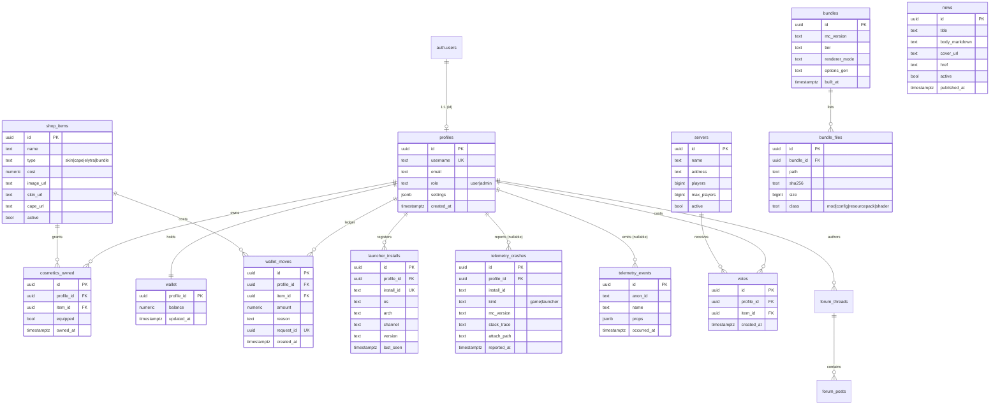

# 10 · Database (Supabase)

Supabase gives us Postgres + Auth + Storage + Realtime + auto REST/RLS. **No SQL server of our own.** This
document is the authoritative data model: the ER sketch, every table's columns and types, the Row-Level
Security policy matrix, the storage buckets and their policies, Realtime channels, GoTrue auth wiring,
migration plan, plus the failure/performance budget. Everything here is consumed through the Rust gateway
in [09 · Backend](./09-backend.md); the client identity flow lives in [06 · Auth](./06-auth.md); what is
allowed to leave the machine is governed by [14 · Telemetry](./14-telemetry.md).

> **Access model.** The launcher **never** gets DB credentials (decision D-08, [00 · Overview](./00-overview.md)).
> It holds only a short-lived, anonymous or user JWT for GoTrue. All reads/writes go through
> `api.aethel.app` ([09 §2.2](./09-backend.md)), except Realtime channels and public Storage object URLs.

## 0. Canonical names (locked sketch ↔ deployed tables)

The architecture notes sketch conceptual entities; the deployed schema is the right-hand column. This table
is the contract that keeps prose and SQL aligned — use both names interchangeably, but **DDL uses the right
column**.

| Conceptual (sketch) | Deployed relation | Notes |
|---|---|---|
| `users` / `profiles` | `auth.users` + `public.profiles` | platform identity lives in `auth`, app fields in `profiles` |
| `wallet` | `public.wallet` (+ `public.wallet_moves`) | balance + the immutable ledger |
| `owned_cosmetics` | `public.cosmetics_owned` | join of `profiles` × `shop_items` |
| `cosmetics_catalog` | `public.shop_items` | storefront + skin/cape assets |
| `shop` | `public.shop_items` | same relation (the route name is `shop`) |
| `crash_reports` | `public.telemetry_crashes` | game/launcher crash ingest |
| `telemetry_events` | `public.telemetry_events` | batched opt-in usage events ([14 §4](./14-telemetry.md)) |
| `bundles` | `public.bundles` + `public.bundle_files` | manifest source of truth ([07 §2.1](./07-vulkan-performance.md)) |
| `forum_*` | `public.forums`, `forum_threads`, `forum_posts` | forum (post-v1, [17 · Roadmap](./17-roadmap.md)) |
| `servers` / `votes` | `public.servers` + `public.votes` | server listing + daily vote |
| `launcher_installs` | `public.launcher_installs` | anonymous install identity (maps to `install_id`) |
| bucket `skins` | `cosmetics` bucket | skin/cape/elytra PNGs |
| bucket `covers` | `news` bucket | article covers |
| bucket `installer-blobs` | `attachments` + Storage/CDN release blobs | crash files + installers |

## 1. Entity-relationship sketch



### 1.1 Relationship cardinality notes

- **`auth.users` 1:1 `profiles`** — `profiles.id` *is* `auth.users.id` (no extra surrogate key). A trigger
  on `auth.users` insert creates the profile + wallet inside one transaction.
- **`profiles` 1:1 `wallet`** — one balance row per profile; the ledger (`wallet_moves`) is 1:N.
- **`shop_items` N:M `profiles`** through `cosmetics_owned`; only one item per `type` may be `equipped`
  (enforced by trigger + partial unique index).
- **`bundles` 1:N `bundle_files`** — the manifest delivered by [09 `/modmanifest`](./09-backend.md).
- **`servers` 1:N `votes`** — votes are per profile/server/day, deduped in the RPC.

## 2. Key tables & RLS policy summary

| Table | RLS |
|---|---|
| `profiles` | user can select/update own row; profile auto-created via trigger on `auth.users` insert |
| `wallet` | admin insert; user select own |
| `wallet_moves` | user insert own (with idempotent `request_id`), admin all |
| `cosmetics_owned` | user select own; `equip` update own (validated trigger) |
| `news`, `shop_items`, `servers` | `select` to anon authenticated; write = admin only |
| `telemetry_crashes` | `insert` anon allowed (rate-limited upstream); select = admin |
| `launcher_installs` | insert via anon key with generated install_id; select own |

Migrations live in `supabase/migrations/*.sql` and are applied with the Supabase CLI (`supabase db push`).

### 2.1 RLS policy matrix (default-deny, full)

`owner` = `auth.uid()`. `admin` = `public.is_admin()` (a `SECURITY DEFINER` predicate reading
`profiles.role`). Every table has `ENABLE ROW LEVEL SECURITY`; absence of a policy = no access.

| Table | `select` | `insert` | `update` | `delete` | Forced RLS |
|---|---|---|---|---|---|
| `profiles` | owner, admin | _trigger only_ | owner (non-privileged cols), admin | admin | yes |
| `wallet` | owner, admin | server (service_role), admin | server/admin only | admin | yes |
| `wallet_moves` | owner, admin | owner via RPC, admin | _never_ (append-only) | admin | yes |
| `cosmetics_owned` | owner, admin | server via RPC | owner `equipped` flag only | admin | yes |
| `shop_items` | anon, authed, admin | admin | admin | admin | yes |
| `news` | anon, authed, admin | admin | admin | admin | yes |
| `servers` | anon, authed, admin | admin | admin | admin | yes |
| `votes` | owner, admin | owner via RPC | _never_ | admin | yes |
| `telemetry_crashes` | admin | anon/authed (service-mediated) | _never_ | admin | yes |
| `telemetry_events` | admin | server (service_role) | _never_ | admin | yes |
| `launcher_installs` | owner, admin | owner/anon | owner `last_seen` only | admin | yes |
| `bundles` / `bundle_files` | anon, authed, admin | admin/cron | admin/cron | admin | yes |
| `forums` / `forum_threads` / `forum_posts` | anon, authed, admin | authed (own), admin | author, admin | author, admin | yes |

### 2.2 Column types & constraints (selected)

| Table | Column | Type | Constraint / default |
|---|---|---|---|
| `profiles` | `id` | `uuid` | PK, FK → `auth.users(id)` `on delete cascade` |
| | `username` | `text` | unique, `~ '^[A-Za-z0-9_]{3,16}$'` |
| | `role` | `text` | default `'user'`, `check (role in ('user','admin'))` |
| | `settings` | `jsonb` | default `'{}'` |
| `wallet` | `balance` | `numeric(12,2)` | default `0`, `check (balance >= 0)` |
| `wallet_moves` | `request_id` | `uuid` | **unique**, idempotency key |
| | `amount` | `numeric(12,2)` | not null |
| | `reason` | `text` | `check (reason in ('buy','grant','refund','vote'))` |
| `cosmetics_owned` | `(profile_id,item_id)` | — | unique |
| | `equipped` | `bool` | default `false` |
| `telemetry_crashes` | `kind` | `text` | `check (kind in ('game','launcher'))` |
| | `attach_path` | `text` | null when attachment dropped |
| `telemetry_events` | `anon_id` | `text` | rotating; never the account id ([14 §4](./14-telemetry.md)) |
| `launcher_installs` | `install_id` | `text` | unique, generated client-side |
| `bundle_files` | `sha256` | `char(64)` | not null, tamper pin ([07 §2.1](./07-vulkan-performance.md)) |

## 3. Storage buckets

| Bucket | Public | Contents | Object key |
|---|---|---|---|
| `cosmetics` | yes (read) | skin/cape/elytra PNGs, item thumbnails | `skins/<sha256>.png`, `capes/<sha256>.png` |
| `news` | yes | cover images | `covers/<uuid>.<ext>` |
| `attachments` | no | crash report files (admin only) | `crashes/<yyyy>/<mm>/<id>.zip` |
| `installer-blobs` | yes (immutable) | launcher installers + signatures ([15](./15-updating-distribution.md)) | `releases/<version>/<os>-<arch>.<ext>` |

- Objects named by content hash so an equipped cosmetic URL is stable and cacheable.
- Signed URLs for admin uploads.
- Public buckets are **read-only to anon**; write policies require the service key or an admin JWT.
- Immutable-cache header (`Cache-Control: public, max-age=31536000, immutable`) on hash-named objects.

### 3.1 Storage policies

```sql
-- public read of cosmetics/news/installer-blobs
create policy "public read cosmetics"  on storage.objects for select using (bucket_id = 'cosmetics');
create policy "public read news"       on storage.objects for select using (bucket_id = 'news');
create policy "public read installers" on storage.objects for select using (bucket_id = 'installer-blobs');

-- only admins upload anything; crash attachments are private (no anon select policy)
create policy "admin write" on storage.objects for insert
  with check (public.is_admin());
```

## 4. Realtime

- Channel `news`: broadcast ID of new article → launcher shows "New post" badge (optional).
- Channel `online`: server player counts pushed from Axum (polled upstream) → Home tiles update live.

### 4.1 Channel contract

| Channel | Table/source | Event payload | Client reaction |
|---|---|---|---|
| `news` | `news` (insert/update where `active`) | `{op,id,published_at}` | Home "New post" badge → refetch `/news` |
| `online` | `servers` (update) or Axum broadcast | `{id,players,max}` | Home tile counts update without refetch |
| `cosmetics:{profile}` | `cosmetics_owned` (own rows) | `{op,item_id,equipped}` | refresh equipped preview ([11 §3](./11-in-game-mods.md)) |

Realtime also drives **cache invalidation** in Axum ([09 §6.1](./09-backend.md)): an admin write fans out
to other instances so every replica drops its stale `moka` entry.

## 5. Auth (GoTrue)

- Providers: email/password + **Discord** OAuth (primary for a game audience).
- JWTs used by Axum middleware (`jsonwebtoken` validates against Supabase JWT secret).
- Roles via custom claim in profiles (`role = 'admin'`).

### 5.1 Identity lifecycle

```mermaid
sequenceDiagram
    participant L as Launcher
    participant GT as GoTrue
    participant DB as Postgres
    L->>GT: signInWithOAuth(discord) / signIn(email)
    GT->>DB: insert auth.users
    DB->>DB: trigger handle_new_user() → profiles + wallet
    GT-->>L: access JWT (short) + refresh token
    L->>L: store refresh token in OS keychain ([06 §4](./06-auth.md))
    L->>GT: refresh before exp
    Note over L,GT: D2 — platform identity is optional;<br/>Minecraft/MS auth still gates the game
```

### 5.2 `handle_new_user` trigger

```sql
create or replace function public.handle_new_user()
returns trigger language plpgsql security definer set search_path = public as $$
begin
  insert into public.profiles (id, username, email)
       values (new.id, coalesce(new.raw_user_meta_data->>'preferred_username',
                                split_part(new.email, '@', 1)), new.email)
  on conflict (id) do nothing;
  insert into public.wallet (profile_id) values (new.id) on conflict do nothing;
  return new;
end $$;

create trigger on_auth_user_created
  after insert on auth.users
  for each row execute function public.handle_new_user();
```

### 5.3 Admin predicate & privilege

```sql
create or replace function public.is_admin()
returns boolean language sql stable security definer set search_path = public as $$
  select exists (select 1 from profiles where id = auth.uid() and role = 'admin');
$$;
```

`role` is **not** client-writable: RLS restricts `profiles.update` to non-privileged columns via a
column-level policy check, and role changes require the service key.

## 6. Migrations checklist (v1)

1. `auth.users` extras: `profiles` + trigger.
2. `news`, `servers`, `shop_items`, `wallet`, `wallet_moves`, `cosmetics_owned`, `telemetry_crashes`, `launcher_installs`, `votes`.
3. Bundle metadata table (`bundles`, `bundle_files` with sha256) — populated by admin refresh job (or static JSON in Supabase storage seeded from `docs/07`).
4. Indexes: `profiles(username)`, `launcher_installs(install_id)`, `telemetry_crashes(reported_at)`, `wallet_moves(request_id)` unique.

### 6.1 Migration set & ordering (v1, applied in order)

| # | File | Adds | Depends on |
|---|---|---|---|
| 0001 | `0001_extensions.sql` | `pgcrypto`, `citext` | — |
| 0002 | `0002_profiles_wallet.sql` | `profiles`, `wallet`, `handle_new_user()`, trigger | 0001 |
| 0003 | `0003_catalog.sql` | `shop_items`, `news`, `servers` | 0002 |
| 0004 | `0004_cosmetics.sql` | `cosmetics_owned`, equip trigger + partial unique | 0003 |
| 0005 | `0005_ledger.sql` | `wallet_moves`, `shop_buy` RPC | 0004 |
| 0006 | `0006_telemetry.sql` | `telemetry_crashes`, `telemetry_events` | 0002 |
| 0007 | `0007_installs_votes.sql` | `launcher_installs`, `votes`, `cast_vote` RPC | 0002, 0003 |
| 0008 | `0008_bundles.sql` | `bundles`, `bundle_files` | 0003 |
| 0009 | `0009_forum.sql` | `forums`, `forum_threads`, `forum_posts` (v1.1) | 0002 |
| 0010 | `0010_rls_policies.sql` | `is_admin()` + all policies in §2.1 | all above |
| 0011 | `0011_storage_buckets.sql` | buckets + storage policies (§3.1) | 0010 |

### 6.2 Core DDL (representative)

```sql
-- 0002: profile is the app-side shadow of auth.users
create table public.profiles (
  id           uuid primary key references auth.users(id) on delete cascade,
  username     citext unique not null check (username ~ '^[A-Za-z0-9_]{3,16}$'),
  email        text,
  role         text not null default 'user' check (role in ('user','admin')),
  settings     jsonb not null default '{}',
  created_at   timestamptz not null default now()
);

create table public.wallet (
  profile_id uuid primary key references public.profiles(id) on delete cascade,
  balance    numeric(12,2) not null default 0 check (balance >= 0),
  updated_at timestamptz not null default now()
);

-- 0005: append-only ledger with idempotency
create table public.wallet_moves (
  id         uuid primary key default gen_random_uuid(),
  profile_id uuid not null references public.profiles(id) on delete cascade,
  item_id    uuid references public.shop_items(id),
  amount     numeric(12,2) not null,
  reason     text not null check (reason in ('buy','grant','refund','vote')),
  request_id uuid unique not null,
  created_at timestamptz not null default now()
);
```

### 6.3 Core RLS (representative, from migration 0010)

```sql
alter table public.profiles        enable row level security;
alter table public.wallet          enable row level security;
alter table public.wallet_moves    enable row level security;
alter table public.cosmetics_owned enable row level security;

create policy "profiles: read own"   on public.profiles for select using (id = auth.uid() or public.is_admin());
create policy "profiles: update own" on public.profiles for update using (id = auth.uid())
  with check (id = auth.uid() and role = (select role from public.profiles p where p.id = auth.uid()));

create policy "wallet: read own"     on public.wallet for select using (profile_id = auth.uid() or public.is_admin());
create policy "wallet_moves: read"   on public.wallet_moves for select using (profile_id = auth.uid() or public.is_admin());
-- inserts only via shop_buy() (security definer); direct anon insert is denied:
revoke insert on public.wallet_moves from anon, authenticated;

create policy "cosmetics: read own"  on public.cosmetics_owned for select using (profile_id = auth.uid() or public.is_admin());
create policy "cosmetics: equip own" on public.cosmetics_owned for update using (profile_id = auth.uid())
  with check (profile_id = auth.uid());

-- one equipped item per type
create unique index one_equipped_per_type on public.cosmetics_owned (profile_id, item_id)
  where equipped;
```

### 6.4 Seed (dev/staging)

```sql
-- catalog + first article; safe to re-run
insert into public.shop_items (name, type, cost, image_url, skin_url, cape_url, active) values
  ('Aethel Gold Skin', 'skin', 500,  'shop/gold.png',  'skins/gold.png',  null, true),
  ('Aethel Cape',      'cape', 750,  'shop/cape.png',  null, 'capes/aethel.png', true),
  ('Elytra — Ember',   'elytra', 1200,'shop/ember.png', null, null, true)
on conflict do nothing;

insert into public.news (title, body_markdown, cover_url, href, active)
values ('Aethel 1.0', 'Welcome to **Aethel**.', 'covers/launch.png', 'https://aethel.app/blog/1-0', true)
on conflict do nothing;

insert into public.servers (name, address, players, max_players, active) values
  ('Aethel Official', 'play.aethel.app', 0, 200, true)
on conflict do nothing;
```

`supabase db reset` replays migrations + seed. Seed files are dev-only and never run in production
(`supabase/seed.sql` is gated by CLI environment).

## 7. Edge cases

| Edge case | Behaviour |
|---|---|
| OAuth user has no email | `profiles.email` nullable; `username` derived from `preferred_username` |
| Two installs across devices, same account | one `wallet`; multiple `launcher_installs` rows, each `last_seen` updated |
| Cosmetic deleted from catalog while owned | `cosmetics_owned` FK is `on delete restrict`; catalog rows are only deactivated (`active=false`), never hard-deleted |
| Equip item that was refunded | equip trigger verifies ownership row exists; else `raise exception 'not_owned'` |
| `request_id` collision across users | unique is global; second insert raises `23505` → RPC treats as duplicate replay |
| Balance would go negative | `check (balance >= 0)` + `for update` lock in `shop_buy` |
| Username case variance | `citext` makes `Bob` = `bob`; display keeps original casing if needed |
| Telemetry insert with unknown `kind` | check constraint rejects; Axum maps to `422` |
| Realtime reconnect storm | client uses exponential backoff; server channel count bounded per project |
| Storage object overwritten with same name | impossible for hash-named objects; cover images use uuid keys |
| `is_admin()` inside RLS recursion | `security definer` + `stable` breaks recursion on `profiles` |
| Long crash stack trace | `text` (unlimited) but Axum caps request body at 5 MB ([09 §5](./09-backend.md)) |

## 8. Failure modes & recovery

| Failure | Blast radius | Detection | Recovery |
|---|---|---|---|
| Postgres primary unavailable | all writes; reads via Axum stale cache | Supabase status + `supabase_errors_total` | Supabase-managed failover; PITR restore |
| Bad migration applied | route-level 500s / schema drift | CI migration diff + smoke tests ([16](./16-testing.md)) | forward-fix migration, or `db reset` on staging |
| RLS policy too broad (e.g. exposing wallet) | cross-user read | review + weekly `pg_policies` audit | immediate policy patch migration |
| Trigger `handle_new_user` errors on signup | new users have no profile | signup error rate | fix trigger; backfill missing profiles |
| `shop_buy` deadlock under load | purchase latency spike | histogram p95 | deterministic lock order (`for update` on wallet then ledger) |
| Storage quota exhausted | crash attachments drop | Storage 4xx + ingest gauge | retention prune ([14 §5](./14-telemetry.md)) |
| Realtime disabled/project paused (free tier) | live tiles/badges stale | missed heartbeats | client falls back to 30 s polling |
| JWT secret rotated | all authed routes 401 | 401 storm | dual-secret verify window in Axum ([09 §9](./09-backend.md)) |
| Seed accidentally run in prod | duplicate/extra catalog | migration/seed audit | seed gated by env; `on conflict do nothing` limits damage |
| Connection exhaustion (too many PostgREST conns) | latency + 5xx | pg conn gauge | Axum connection pooling + request timeout |

## 9. Performance budget

| Operation | Budget | Index / mechanism |
|---|---|---|
| `select shop_items where active` | < 15 ms | partial index on `active` |
| `select news where active order by published_at desc` | < 20 ms | `(active, published_at desc)` |
| `select cosmetics_owned` for one profile | < 10 ms | PK `(profile_id,item_id)` |
| `shop_buy` RPC (lock + insert + upsert) | < 60 ms | `wallet_moves(request_id)` unique, wallet PK lock |
| `profile by username` (skin-api) | < 10 ms | unique `profiles(username)` |
| telemetry insert | < 25 ms | `(reported_at desc)` for admin reads |
| bundle manifest join | < 25 ms | `bundle_files(bundle_id)` |
| votes per server per day | < 40 ms | unique `(profile_id,server_id,day)` |
| DB connections held by Axum | < 10 in pool | PgBouncer transaction mode |

**Budget rules.** Every hot query is covered by an index listed in §6.4/§9; no query does a sequential scan
on a user-facing path; numeric money math is `numeric` (never `float`); all admin list endpoints paginate
(default 50, max 200).

## 10. Acceptance criteria (checklist)

- [ ] `supabase db push` replays migrations 0001–0011 cleanly on an empty project and on staging.
- [ ] RLS matrix in §2.1 is verified by tests: anon cannot read `wallet`; user A cannot read user B's rows; admin can read all ([16 §5](./16-testing.md)).
- [ ] `handle_new_user` creates exactly one `profiles` row and one `wallet` row per signup (idempotent on retry).
- [ ] `role` cannot be escalated by a normal user through any exposed path (column-level policy + RPC review).
- [ ] `wallet_moves.request_id` uniqueness makes `shop_buy` replay-safe under concurrency (10 parallel calls → one charge).
- [ ] `balance >= 0` and one-equipped-per-type partial unique index are enforced by the DB, not the app.
- [ ] Storage buckets exist with the policies in §3.1; hash-named objects return immutable cache headers.
- [ ] Realtime channels `news`/`online` deliver updates and clients degrade to polling when Realtime is unavailable.
- [ ] All §9 queries hit indexes; `EXPLAIN ANALYZE` shows no seq scan on hot paths.
- [ ] Seed is dev-only and cannot run in production; `db reset` is reproducible.
- [ ] PITR/backup restore is documented and rehearsed at least once before v1 ([13 §8](./13-security.md)).

## Where to go from here

- **How these tables are served:** [09 · Backend](./09-backend.md) (PostgREST client, RPC, caching, RLS-bypassing service role).
- **Identity:** [06 · Auth](./06-auth.md) (GoTrue, OAuth, JWT storage, role claim).
- **Consent & retention of the telemetry tables:** [14 · Telemetry](./14-telemetry.md).
- **Manifest tables:** [07 · Vulkan & performance](./07-vulkan-performance.md) §2.1 and [15 · Updating & distribution](./15-updating-distribution.md).
- **Roadmap (forum, votes at scale):** [17 · Roadmap](./17-roadmap.md).
