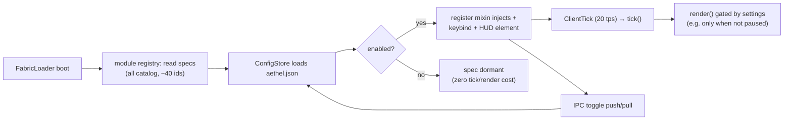
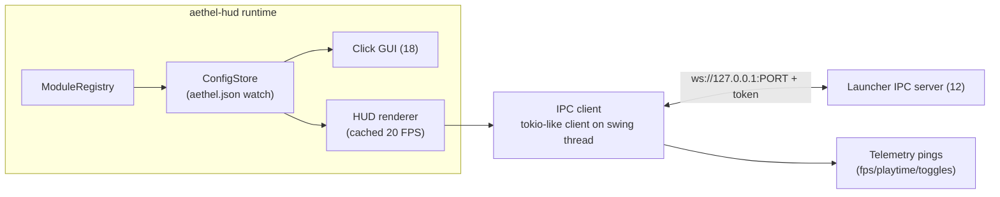
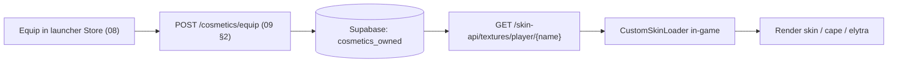
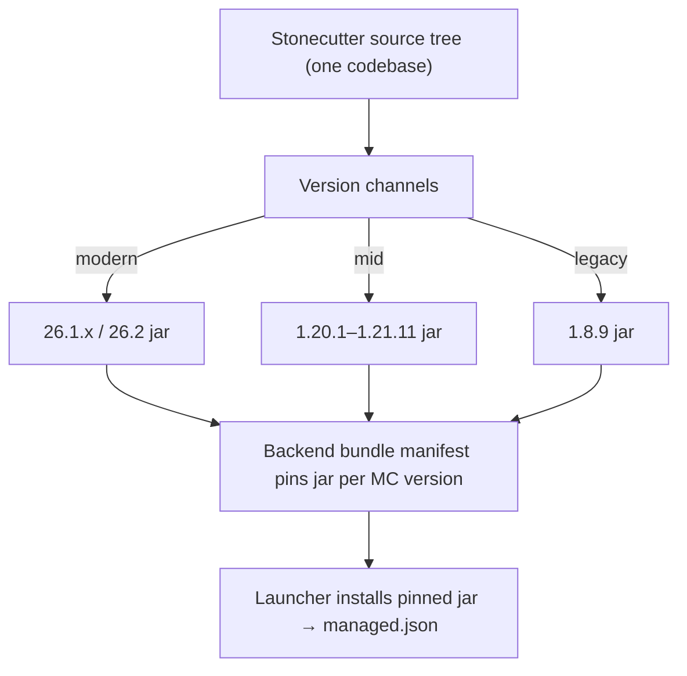

# 11 · In-game Mods (aethel-hud / aethel-cosmetics)

In-game experience is delivered by **our own Fabric mods** plus the pinned performance bundle (see 07).
Built in Kotlin/Java with Fabric + Mixins + Stonecutter (multi-version).

> Terminal line-of-sight: [18 · In-game click GUI](./18-client-gui.md) defines the click GUI that
> *surfaces* these modules; this doc defines the module runtime, config, IPC and cosmetics machinery
> underneath it.

## 1. aethel-hud — modules (v1)

| Module | Description | Default |
|---|---|---|
| **FPS / ms** | FPS + frame-time overlay, corner anchored, color-coded | on |
| **TPS** | server TPS (multiplayer) | off |
| **Coordinates** | XYZ / facing / dimension | on |
| **Keystrokes** | WASD + left/right click overlay | off |
| **CPS** | clicks per second | off |
| **Toggle Sprint / Sneak** | quick binds | off |
| **Zoom** | smooth zoom (like OptiFine) | on (key) |
| **Fullbright** | gamma overlay | off |
| **Freelook** | camera free-look on hold | off |
| **Armor status** | durability bars | off |
| **Potion effects** | remaining durations | off |
| **Item physics** | drop animation toggle | off |
| **Chat tweaks** | shorter timestamps, clickable coords, anti-toast collapse | off |
| **F3+** | extended debug data (mem, fps avg) | on |
| **Hitbox / Reach** | show hitbox + reach indicator (PvP) | off |
| **Crosshair** | custom crosshair styles | off |
| **HUD editor** | drag & place HUD elements, save layout | on |
| **Weather/time override** | client-side toggle | off |

- Implemented as independent Mixin injects behind a config system; each module toggleable per instance
  from the launcher (`Mods` screen) or in-game menu (ModMenu + Cloth Config).
- The in-game **click GUI** that surfaces all of this (Right Shift menu, tabs, per-mod settings, HUD
  editor) is specced fully in [18 · In-game click GUI](./18-client-gui.md).
- Cache the static HUD to ~20 FPS redraw (Lunar-style "HUD caching") for weak laptops.

### 1.1 The full catalog vs the v1 subset

`11` owns the **v1 shipped subset** (table above, 18 modules). `18 §4` owns the **target catalog**
(~40 modules across `HUD / Movement / Visual / Chat / Server info / Misc / Cosmetics / Performance`,
each with default key / default state / deep options). The v1 rows above are exactly the subset that
builds first; every additional catalog row is a tracker item blocked only on its Mixin + config entry
landing — the runtime, click GUI, IPC and config formats are shared by all of them.

Mapping of v1 rows to catalog categories ([18 §4](./18-client-gui.md)):

| Category (18 §4) | v1 modules in 11 |
|---|---|
| HUD | FPS/ms, Coordinates, Keystrokes, CPS, Armor status, Potion effects |
| Movement | Toggle Sprint/Sneak, Zoom, Freelook |
| Visual | Fullbright, Crosshair |
| Chat | Chat tweaks |
| Misc | Hitbox/Reach, Item physics, Weather/time override |
| Server info | TPS |
| Performance | F3+ (indicator data), HUD caching backer |
| Editor | HUD editor |

### 1.2 Module unit contract

Every module is exactly four parts behind one entry in the registry:

| Part | Shape |
|---|---|
| Mixin implementer | one mixin class owning tick/render injects (conditional on enabled) |
| `ModuleSpec` | id, name, category, default keybind, default enabled, options schema |
| HUD element (optional) | render + anchor model `{anchor, offset, scale, visible}` ([18 §5](./18-client-gui.md)) |
| IPC extension (optional) | telemetry/toggle frames ([12 §3](./12-ipc.md)) |

Disabling a module removes **only its** render/tick cost — conditional mixin header (`@Inject(method=…,
at=…)` behind `AethelConfig.get(enabled)`) means a disabled module contributes a single boolean branch,
not a draw call. `FabricLoader` boot registers all specs; the config decides activation.

### 1.3 Module lifecycle and tick pipeline



| Phase | Thread | Frequency | Notes |
|---|---|---|---|
| Register | main (Fabric) | once at boot | all specs register; activation from config |
| Config load | main | once + on file change | `ConfigStore` watches `aethel.json` (launcher edits pre-launch) |
| Tick | client | 20 tps | per-module `tick()` gated by enabled |
| Render | render | per frame | HUD-cached modules draw ≤ 20 FPS ([18 §15](./18-client-gui.md)) |
| IPC | io thread | frames per §2 | handoff via lock-free queue |
| Unregister | main | on `shutdown` | clean socket close + frame `bye` |

### 1.4 Per-module option schema (reference samples)

Same JSON shape as the click GUI reads; codec lives next to each spec.

```jsonc
{
  "zoom":       { "enabled": true,  "options": { "fov": 35,   "smoothMs": 120, "captureOnMouseWheel": true } },
  "chatTweaks": { "enabled": false, "options": { "noCollapse": true, "timestamps": "HH:MM", "clickCoords": true,
                                                 "dateFormat": "dd.MM.yy" } },
  "keystrokes": { "enabled": false, "options": { "showCps": true, "fadeDelayMs": 900, "boxSize": 22,
                                                 "colors": { "key": "#ECEFF4", "active": "#6C5CE7" } } },
  "fullbright": { "enabled": false, "options": { "gamma": 12.0, "smooth": true } },
  "freelook":   { "enabled": false, "options": { "smoothMs": 200, "autoReturn": true, "conflictClear": true } }
}
```

Rule: options are flat JSON scalars where possible (see `keystrokes.colors` exception) and each spec
declares a serde codec for its node — unknown option keys are stored, never dropped (forward compat,
[18 §7](./18-client-gui.md)).

### 1.5 Module semantics reference (v1 behavior contracts)

The exact runtime behavior each v1 module must exhibit — this is the "what does on mean" contract the
click GUI (18 §4) and QA (16 §4) verify against.

| Module | Runtime contract (v1) |
|---|---|
| FPS / ms | sample rolling avg over last 60 frames; color scale good(<0.5 ms spread)/mid/warn; `show ms` adds frame-time line |
| Coordinates | `X Y Z` from `player.getBlockPos()`; facing from yaw (N/NE/E…); dimension from level registry name |
| Keystrokes | track key + click hold/release; boxes fade after `fadeDelayMs`; show CPS toggle |
| CPS | count down + up clicks over `intervalMs` (default 500); style `numbers` or `bars` |
| Toggle Sprint / Sneak | replace hold with sticky toggle; `autoNavigate` keeps vanilla sprinting rule (blocked by hunger) |
| Zoom | FOV lerp to `fov` over `smoothMs`; mouse-wheel zooms in/out ±5% when `captureOnMouseWheel`; resets on release |
| Fullbright | gamma override to `gamma`; `smooth` lerps over 300 ms rather than snapping |
| Freelook | yaw/pitch offset while held; `autoReturn` eases back on release; `conflictClear` offers to re-map camera binds |
| Armor status | armor bar + per-piece icon with durability %; `warn` color under 25% |
| Potion effects | icon + remaining `mm:ss`; `hideAmbient` filters ambient/hidden effects |
| Item physics | drop → item `entity` animation replay + scale option; reverts to vanilla visuals |
| Chat tweaks | collapse-none; timestamps prefix (`HH:MM`, toggleable); coordinate text becomes click-to-TP (MP, permission-gated) |
| F3+ | appends line 3: `mem used/max`, `avg frame ms (60s)`; respects vanilla `F3` secondary keys |
| Hitbox / Reach | boxes entity hitboxes over crosshair-distant target; reach line to block; both toggleable |
| Crosshair | draws style `lunar/plus/dot` scaled by guiScale over vanilla crosshair (hidden) |
| HUD editor | everything in 18 §5 — entry, drag/snap/resize/reset/undo/redo/nudge, save layout |
| Weather/time override | client-side set of weather + day-time; purely visual, resets on world leave |
| TPS | sample `minecraft:registered_count` / tick time over 20 ticks; color >19.5 green, <18 red |

Semantics live with the spec (single `Behavior` docstring) so a module is never re-defined by QA or by
the click GUI in two different ways.

### 1.6 Config precedence (who wins)

| Layer | Source | Precedence |
|---|---|---|
| Built-in default | `ModuleSpec` defaults | lowest |
| First-run preset | tier table (§4.1) | overrides defaults |
| Instance config | `<instance>/config/aethel.json` file | overrides presets |
| Launcher Mods screen | writes the same file pre-launch (08) | equals file layer |
| Live IPC | `setToggles` / `setTheme` during a run | highest, ephemeral (not persisted unless written back) |

Rule: the **file is the truth for next launch**; IPC frames are a session-only overlay. Any IPC-toggle
the user confirms in-game is written back to the file via `ConfigStore.commit()` (debounced 5 s) so
next-launch state matches the last live state.

## 2. IPC client + telemetry

- Reads JVM args (`-Daethel.ipc=ws://127.0.0.1:PORT` and `-Daethel.token=<random>`).
- Connects loopback WebSocket (see 12): sends FPS samples, playtime, world join/leave, module state,
  crash signals; receives toggles, "account switch", "quick join server", "focus".
- Only ever binds loopback; never exposes UI; connection dropped → retries with backoff.



| IPC frame | Sent by | Payload | Direction |
|---|---|---|---|
| `hello` / `welcome` | mod / launcher | handshake + sessionId | handshake |
| `fps` | mod | `{fps, frameTimeMs}` 1 Hz | G→L |
| `playtime` | mod | `{secs}` 60 s (opt-in) | G→L |
| `world` | mod | `{dim, server?}` | G→L |
| `toggle` | mod | `{moduleId, enabled}` | G→L |
| `setToggles` | launcher | `[{id, enabled}]` | L→G |
| `setTheme` | launcher | full `theme.json` payload ([18 §6](./18-client-gui.md)) | L→G |
| `quickJoin` | launcher | `{address, port}` | L→G |
| `focus` | launcher | `{bool}` | L→G |
| `shutdown` | launcher | graceful stop ([05 §7](./05-launch-engine.md)) | L→G |
| `crash` | mod | `{summary, stack}` | G→L |

- The client thread hands frames to the game thread via a lock-free queue; sockets never block render.
- On dropped connection: exponential backoff 250 ms → 5 s, retry until 30 s timeout then IPC-disabled
  silent mode (12 §5). Launcher UI shows “in-game link unavailable”.

### 2.1 IPC client shape (Kotlin)

```kotlin
// gamesupport/aethel-hud/.../ipc/IpcClient.kt — reduced
class IpcClient : Thread("aethel-ipc") {
    private val tx     = MpMcQueue<Outbound>          // G→L frames (lock-free)
    private val rx     = MpMcQueue<Inbound>           // L→G frames
    private var socket: WebSocket? = null
    private val token: String =       // from -Daethel.token (never logged, 13 §2)
        System.getProperty("daethel.token") ?: ""

    override fun run() {
        val uri = System.getProperty("daethel.ipc") ?: return   // ws://127.0.0.1:PORT
        backoffConnect(uri, token, 250L..5000L, timeoutMs = 30_000)  // hello handshake (12 §2)
        while (alive) select {
            tx.receive()  -> socket.sendJson(it)      // fps / playtime / toggle / crash
            socket.read() -> handleInbound(rx)        // setToggles / setTheme / quickJoin / shutdown
        }
    }

    fun handleInbound(f: Inbound) {                    // drain on game thread via ClientTick
        when (f) {
            is ToggleBatch -> ConfigStore.applyToggles(f.toggles)   // live module state
            is ThemeFrame  -> ThemeRegistry.swap(f.theme)           // next frame, no half-theme
            is Shutdown    -> gameSaveAndExit()
            else           -> {}
        }
    }
}
```

Rules: token lives only in memory; frames are validated `schema` first; the socket closes with `bye`
on game exit; launcher-originated frames are rate-limited (max 20/s) to avoid tick storms.

### 2.2 Connection lifecycle

| Phase | Trigger | Behaviour |
|---|---|---|
| `connecting` | JVM start, no socket | read `-Daethel.ipc`/`-Daethel.token`; loop-back bind enforced |
| `handshake` | TCP connect | send `hello{token}`; await `welcome` (constant-time token compare server-side, 12 §2) |
| `live` | welcome | bidirection frames; keepalive ping 5 s (12 §5) |
| `lost` | ping timeout / socket close | backoff 250 ms→5 s, re-connect to same port up to 30 s |
| `disabled` | 30 s elapsed | silent mode: no frames, no retries this launch; UI never shows it |
| `closing` | `shutdown`/game exit | send `bye{code}`, close socket, join io thread, unregister modules |

Every transition is logged redacted (port yes, token never — [13 §2](./13-security.md)) and surfaced on
the launcher's “in-game link unavailable” state (08 §Failure).

## 3. aethel-cosmetics — skins/capes/elytra store

- Ship **CustomSkinLoader** (GPL-3) in the bundle; load list configured to our **UniSkinAPI endpoint**
  (`/api/v1/skin-api/textures/player/{username}`).
- Our backend maps `username → equipped_skins/capes` from `cosmetics_owned` → returns Storage URLs.
- On weak configs, textures downsampled to 64×64 to save VRAM.



| Step | Detail |
|---|---|
| Equip | launcher Store → `POST /api/v1/cosmetics/equip {username, itemId}` (09 §2) |
| Resolve | `GET /skin-api/...` returns `{SKIN:{url},CAPE:{url}}` UniSkinAPI payload ([09 §2](./09-backend.md)) |
| Deliver | URLs point into Supabase Storage `cosmetics` bucket (public read, content-hash names, [10 §3](./10-database.md)) |
| Render | CustomSkinLoader applies to the player + configured sliders (opacity) via cosmetics module ([18 §4](./18-client-gui.md)) |
| Downsample | ≤ 64×64 texture on low tier; cache entries keyed by `{username, itemId, tier}` |

Round-trip acceptance gate tied to `16 §4` (“buy → equip → skin API → CustomSkinLoader”) — see
[00 §Acceptance](./00-overview.md).

### 3.1 Cosmetic cache & render policy

| Policy | Rule |
|---|---|
| Cache | textures keyed by `(url, tier)` in an LRU (default 128 entries); ETag + hash re-check on new session |
| Offline | cached cosmetics render with no network; equipped-but-uncached degrade to default skin |
| Ownership | in-game never requests cosmetics unowned; render list refreshed only from equipped set |
| Opacity | driver slider (0–100%) applied per piece; `Elytra/Cape` respect MC's cape slot |
| Tier | low → 64×64; mid → 128×128; high → native (max 512×512 for badges) |
| Privacy | usernames only ever leave the machine on the equip path with consent ([14 §1](./14-telemetry.md)) |

`aethel-cosmetics` renders *only* the equipped set resolved at world join + on `equip` changes; it adds
zero per-frame cost when nothing is equipped or the player is not in a world.

## 4. QoL default config (first run)

- Instant health + tab compensation; no hidden alpha blend smoke; biome blend off on low tier;
- Render distance preset from settings; entity distance −25%; fullscreen borderless.

### 4.1 First-run preset mapping

| Setting | Low tier | Mid | High |
|---|---|---|---|
| HUD caching redraw | 20 FPS cap | 20 FPS | 20 FPS (Lunar default) |
| Cosmetic downsampling | 64×64 | 128×128 | native |
| Chroma | static hue | cycle | cycle |
| Biomes / particles | biome blend off | default | default |
| Smooth-lighting | fast | fancy | fancy |

Module default states respect the tier: on a "low" graphics preset, HUD caching caps at 20 FPS,
cosmetic textures downsample, and chroma effects reduce to static gradients (motion token
`reducedMotion` path, [18 §13](./18-client-gui.md)).

### 4.2 v1 default keybinds

| Action | Default key | Module |
|---|---|---|
| Open mod menu | `Right Shift` (rebindable) | click GUI ([18 §3](./18-client-gui.md)) |
| HUD editor shortcut | `Right Alt` | click GUI |
| Close / back | `Esc` | click GUI |
| Zoom | `Z` (hold) | zoom |
| Freelook | `C` (hold) | freelook |
| Waypoint add (at feet) | `P` (proposed) | waypoints (catalog) |

All rebinds stored in `aethel.json` `keybinds` and mirrored in the launcher `Mods` screen (08).

### 4.3 First-run onboarding (in-game)

1. First title screen after install: `ConfigStore` has no file → defaults + tier preset merge (§4.1).
2. IPC `welcome` arrives; launcher pushes persisted toggles/theme — these become the session overlay (§1.6).
3. No popup spam: a single toast in the chat (“Aethel is ready — Right Shift for settings”) with a
   persistent dismissal (stored in config `onboarding.dismissed`).
4. HUD editor self-demo: the HUD tab badge pulses (accent) until the user enters edit mode once.
5. Telemetry stays **off** until explicitly enabled in launcher Settings (14 §1) — nothing requests consent twice.

## 5. Multi-version strategy

- Stonecutter with version channels: modern (`26.1.x/26.2`), mid (`1.20.1–1.21.11`), legacy (`1.8.9`, Fabric API if available).
- Per-version jar ABI mismatch risk → bundle manifest pins the correct jar per version; unsupported
  version → HUD disabled but bundle clean mods still apply.



- Fabric API dependency per channel as-required (legacy uses Legacy-Fabric when the channel lacks a
  modern API release).
- ABI break risk (Mixins across versions) is front-loaded to Stonecutter version-gated source; jar
  selection is *always* the manifest's, never the user's guess.

### 5.1 Build & CI matrix

| Channel | Gradle variant | Fabric API | CI smoke |
|---|---|---|---|
| modern `26.2` | `version=26.2` | latest | headless `gradle test` + dev-launch smoke ([16 §3](./16-testing.md)) |
| mid `1.20.1`, `1.21.11` | `1.20.1`/`1.21.11` | matching | same + classpath fixture |
| legacy `1.8.9` | legacy variant | Legacy-Fabric | same, reduced module surface |

Stonecutter keeps `version()` directives in one `.gradle`; the CI matrix compiles each channel and
uploads the jar + `<mc>_<jarsha>` to the bundle manifest for pinning.

| Channel | Publication name | Managed pin |
|---|---|---|
| modern `26.2` | `aethel-hud-26.2.jar` | `<mc>_<sha256>` in bundle manifest → `managed.json` (07 §2) |
| mid `1.20.1` | `aethel-hud-1.20.1.jar` | same |
| mid `1.21.11` | `aethel-hud-1.21.11.jar` | same |
| legacy `1.8.9` | `aethel-hud-1.8.9.jar` | same |

A jar is **never** selected by "latest" at launch; the manifest's explicit pin per MC version is the
only selector, so a regressed channel can be rolled back by a bundle manifest edit (data, not code —
[07 §2](./07-vulkan-performance.md)) without a launcher release.

## 6. Attribution/licensing

- Aethel mods: our code MIT. Bundled mods keep their own licenses (LGPL-3 VulkanMod, GPL-3
  CustomSkinLoader, MIT/AGPL mix of CaffeineMC family). Ship a `LICENSES.txt` in-game (About page) and in `docs/`.

`LICENSES.txt` is versioned alongside the bundle manifest; the About page renders it from the
installed bundle ([07 §3](./07-vulkan-performance.md)) and the launcher Settings → About opens the same
file from disk (08 §4).

## 7. Performance budget

| Budget | Target | Guard |
|---|---|---|
| Disabled module cost | ≈ 0 (one bool branch) | measured per module in CI perf gate (16 §5) |
| Enabled static HUD (cached) | ≤ 20 FPS redraw | 16-gate frame-time check |
| Full HUD uncached worst case | ≤ 1 frame fair share (16.6 ms @60) | degraded → caching rank forced on |
| IPC frames | ≤ 20/s inbound, ≤ 5/s outbound burst | rate-limit + queue cap |
| Cosmetic render | ~0 when unequipped; ≤ 0.5 ms when equipped | tiered texture sizes (§3.1) |
| Click GUI open | < 150 ms to first usable frame ([18 §9](./18-client-gui.md)) | startup pre-warm widget atlas |

## 8. Edge cases

| Case | Behaviour |
|---|---|
| Unsupported MC version | aethel-hud jar absent from manifest → HUD disabled silently; perf bundle still applies ([07 §3](./07-vulkan-performance.md)) |
| `aethel.json` corrupt | schema parse fails → back up `aethel.json.bak-<ts>`, regenerate defaults, log warning; launcher sync re-applies |
| Module spec removed in an update | stale keys preserved via `unknown`; never hard-deleted (forward compat) |
| Keybind conflict (e.g. Zoom Z vs vanilla) | request capture flow rebinds over confirmed conflict ([18 §4](./18-client-gui.md) "conflict-clear" option) |
| IPC token mismatch | drop socket + backoff; never fall back to a fixed token; metric only (12 §5) |
| Cosmetic 404 after re-equip | CustomSkinLoader falls back to default skin; launcher Store re-syncs on next boot |
| HUD flicker under fast resize | layout caches per `(width,height,guiScale)` bucket; redraw on bucket change only |
| Multiplayer tab death / F3 spam | modules render only on client thread; tick cost gated by enabled check |
| Server rejects modified client | clean "Vanilla" launch mode with no bundle (`00` coverage matrix) |
| Config file lock (launcher open) on Linux | flock retry loop 1 s; snapshot edit in memory; write on unlock |
| First-run with no `aethel.json` | default spec ticks immediately; IPC `welcome` may push launcher values within a second |

## 9. Failure modes

| Failure | Detection | Degradation | Recovers |
|---|---|---|---|
| IPC server unreachable | hello timeout 30 s | in-game GUI fully functional locally; launcher shows “in-game link unavailable” | launcher restarts listener → reconnect |
| Mixin target renamed across MC version | jar fails to load (no-op mixin) | module disabled + warning toast; game stays playable | Stonecutter fix + bundle version bump |
| `aethel.json` file lock held by launcher | write error | in-process snapshot edit; sync on next launch | retry write |
| CustomSkinLoader load failure | missing skin render | vanilla skin fallback | re-sync cosmetics |
| GL state churn from uncached HUD | frame-time spike measured | HUD caching rank forces 20 FPS cache | auto; or manual off |
| Bundle jar tampered | launcher verify at launch | auto-restore before game start ([07 §2](./07-vulkan-performance.md)) | self-heal |
| Ip socket OOM (queue overflow) | queue cap hit | drop oldest telemetry frame only; toggles/theme never dropped | drain on next tick |
| Theme swap mid-tick | registry double-buffer | next frame applies cleanly ([18 §6.2](./18-client-gui.md)) | auto |

Never take the game down for a mod-level failure: all degrading paths are module-scoped or silent.

## 10. Testing & acceptance (in-game mods)

Automation lives in `gamesupport/` Gradle workspace (16 §3) + the reference-laptop perf gate (16 §5).

### 10.1 Module unit tests

| Test | What it proves |
|---|---|
| Config round-trip | serialize → deserialize → identical; unknown keys preserved |
| `migrate()` 1→2 | old file migrates, unknown keys survive, `*.bak` created on failure |
| Tick gating | disabled module tick cost ≈ 0 (bytecode inspect / frame measure) |
| Keybind conflict | capture flow resolves; conflict logged once |
| IPC framing golden | encode/decode of every §2 frame type (12 §3) |
| Cosmetic resolution | unauth unowned request rejected; cache LRU eviction correct |

### 10.2 Acceptance criteria

- [ ] All 18 v1 modules listed in §1 toggle live from the click GUI and persist across relaunch.
- [ ] Disabling a module removes its own render/tick cost (measured: disabled module ≈ baseline frame time).
- [ ] `aethel.json` round-trip: launcher Mods screen edit → save → in-game apply without restart.
- [ ] IPC frames flow both ways per §2 table; telemetry frames gated by consent (default off, [14](./14-telemetry.md)).
- [ ] Cosmetic equip round-trip works: store equip → UniSkinAPI payload → CustomSkinLoader visible.
- [ ] HUD caching at ≤ 20 FPS static redraw shows no frame-time regression on the reference laptop.
- [ ] Unsupported version: HUD disabled gracefully, perf bundle applies, no crash, warning visible.
- [ ] `LICENSES.txt` ships with the bundle and renders in About on both frontends.
- [ ] Performance budget (§7) all green on the CI perf gate and reference laptop.
- [ ] Multi-version CI builds all three channels (§5.1); middle-channel fixture classpath matches.

## Related specifications

- Click GUI that surfaces every module → [18 · In-game click GUI](./18-client-gui.md)
- IPC frame schema and handshake → [12 · IPC](./12-ipc.md)
- Perf bundle & renderer pins → [07 · Vulkan & performance](./07-vulkan-performance.md)
- Config/theme sync roots → [08 · UI design](./08-ui-design.md)
- Cosmetic data model → [09 · Backend](./09-backend.md), [10 · Database](./10-database.md)