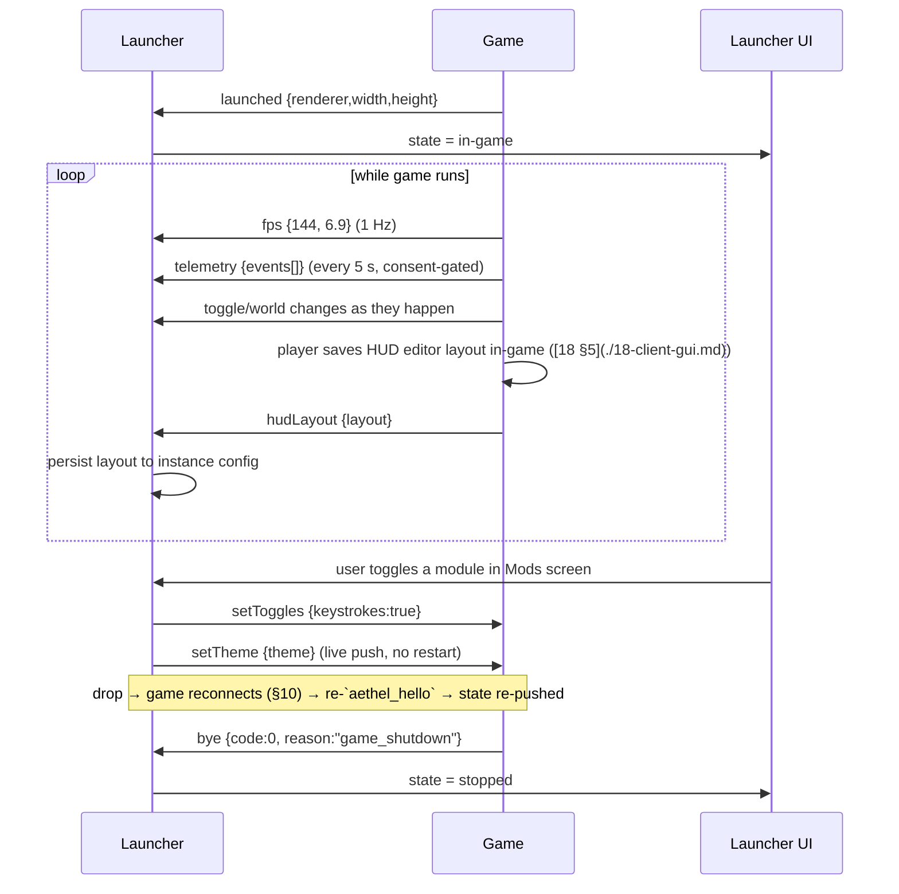

# 12 · IPC (Launcher ↔ Game)

The launcher (Rust) and the game (JVM + Fabric mods) talk over a **loopback-only WebSocket** with a
crypto-random **128-bit per-launch secret**. The launcher is the server, the game connects once,
presents the handshake secret as the sole credential, and then exchanges **typed, versioned JSON
messages**. This file is the protocol spec; the hardening that makes it safe to accept an inbound
connection from a foreign process is in [13 §7](./13-security.md); the mod side that consumes the
protocol is [11 §2](./11-in-game-mods.md).

## 1. Why a WebSocket

- Real-time, incremental messages (FPS at 1 Hz, playtime, toggles, live theme pushes) with no polling.
- Loopback `ws://127.0.0.1:{port}/` gives natural CSWSH protection plus a source-address check; we
  bind only `127.0.0.1` and reject anything else.
- Browsers can't set custom headers → the token lives in the message body after connect, not in a
  preflight CORS-guessable header (the class of bug that bit Lunar's handshake, [01 §7](./01-research.md)).
- Tiny dependency surface: `tokio-tungstenite` (launcher) + a small Java WebSocket lib in the mod
  (e.g. `java-WebSocket`).

### 1.1 Alternatives considered (and rejected)

| Transport | Rejected because |
|---|---|
| stdin/stdout of the game process | Buffered by JVM, no protocol framing, dies with the process; launcher can't send after crash |
| Local HTTP + SSE | Only one-directional friendly; polling again; no server-initiated push symmetry |
| Raw TCP socket | Framing, keepalives, close semantics all hand-rolled; no benefits |
| Named pipes / unix sockets | Windows/macOS/Linux differences, permissions painful, no free TLS-instead-later path |
| `lunarclient://`-style deeplink | **Forbidden**: browser-addressable surface → drive-by RCE risk ([13 §1](./13-security.md)) |
| WebSocket with TLS (`wss`) | Default **off** — localhost is safe and self-signed wss adds cert UI. Kept as a documented harder mode (see §9). |

### 1.2 What rides the pipe

| Direction | Data class | Latency need | Loss tolerance |
|---|---|---|---|
| G→L | `fps`, `playtime`, `world`, `telemetry` | 1–60 s | high (dropped frames harmless) |
| G→L | `toggle`, `hudLayout`, `cosmetics`, `crash*` | sub-second on save | low (state push; resent on reconnect) |
| L→G | `setTheme`, `setToggles`, `hudLayout`, `cosmetics` | sub-second on change | low but retryable |
| L→G | `quickJoin`, `focus`, `exit` | immediate | **none** (acks required) |

Everything is **loopback-only by construction**: the same kernel delivers the frames, so there is no
hop, no router, and no other machine in the path. That's what makes plain `ws://` defensible and the
wss mode a *policy* choice rather than a correctness requirement.

## 2. Handshake

The mod is launched with two JVM args:

- `-Daethel.ipc=ws://127.0.0.1:{port}/` — the loopback URL the launcher bound before spawning the game.
- `-Daethel.ipcToken={hex}` — the **128-bit per-launch secret** (16 bytes → 32 hex chars).

```mermaid
sequenceDiagram
    participant L as Launcher (server)
    participant G as Game (mod client)
    L->>L: bind 127.0.0.1:0 → {port}
    L->>L: token = 16 crypto-random bytes → hex (32 chars)
    L->>G: -Daethel.ipc=ws://127.0.0.1:{port}/ -Daethel.ipcToken={hex}
    G->>L: connect ws://127.0.0.1:{port}/
    L->>L: accept → check peer is loopback (127.0.0.1 / ::1)
    G->>L: {"v":1,"type":"aethel_hello","token":{hex}, ...}
    L->>L: constant-time compare token; mismatch → close(4003) + metric
    alt token ok
        L-->>G: {"v":1,"type":"welcome","sessionId","slot","capabilities"}
        L->>L: mark channel ready (single accepted connection)
    end
    G->>L: {"v":1,"type":"launched",...} → launcher flips to "in-game" UI state
    Note over L,G: steady-state messages (§3)
```

Handshake rules:

- Only **one live connection per launch** (a second connect is rejected with `4004 Too many connections`).
- Token is **regenerated every launch** and **never written to disk** — it exists only in launch-arg
  memory and the game's env. Repeatable randomness from the `getrandom` OS CSPRNG.
- Comparison is **constant-time** (`subtle::ConstantTimeEq`), so a token guesser learns nothing from
  timing; the 128-bit space makes brute force hopeless within the seconds the listener exists.
- The launcher keeps the listener open from bind to game exit; no fixed port is used, so there are
  no port races between concurrent launches (`127.0.0.1:0` ephemeral).

```rust
// crates/launcher-core/src/ipc/server.rs
fn token() -> String {
    let mut buf = [0u8; 16];                 // 128-bit secret
    getrandom::getrandom(&mut buf).expect("csp-rng");
    buf.iter().map(|b| format!("{b:02x}")).collect() // 32 hex chars
}

fn verify(given: &[u8], expected: &[u8]) -> bool {
    // constant-time, no early-exit on prefix match
    given.ct_eq(expected).into()
}
```

## 3. Message schema (`application/json` frames)

Every frame is a single UTF-8 JSON object. Two envelope rules:

1. **`v` is mandatory** (schema version, currently `1`). A frame without `v` is dropped with a
   `1007 Invalid payload` close. A frame with `v >` supported is *ignored* (forward-compatible).
2. `type` selects the handler; **unknown `type` values are ignored** (a `debug.log_ignored` counter
   only) so newer mods never break older launchers or vice-versa.

Full message catalogue (schema `v = 1`):

| Dir | `type` | Wire payload (top-level keys besides `v`/`type`) | Rate cap | Purpose |
|---|---|---|---|---|
| G→L | `aethel_hello` | `token`, `launcher:"aethel"`, `version`, `gamePid`, `mcVersion` | 1 only | handshake (first frame) |
| L→G | `welcome` | `sessionId`, `slot`, `capabilities[]` | 1 only | accept handshake |
| G→L | `launched` | `renderer`, `width`, `height` | 1 only | launch-finished signal → launcher UI "in-game" |
| G→L | `ping` | `seq` | ≤ 1/s | keepalive (5 s idle) |
| L→G | `pong` | `seq` | ≤ 1/s | echo |
| G→L | `fps` | `fps`, `frameTimeMs` | 1/s | FPS overlay + telemetry source |
| G→L | `playtime` | `secs` | 1/60 s | session duration |
| G→L | `world` | `dimension`, `server?`, `players?` | on join/leave | world state |
| G→L | `toggle` | `moduleId`, `enabled` | on change | in-game toggle sync |
| G→L | `hudLayout` | `layout` (anchors/offsets/scale, [18 §5](./18-client-gui.md)) | on save | **HUD layout push** from game editor → launcher persists |
| G→L | `setTheme` | — (launcher-side only) | — | (n/a; theme is L→G) |
| L→G | `setTheme` | `theme` (full token doc, [18 §6](./18-client-gui.md)) | manual/on change | **theme push** live, no restart |
| L→G | `hudLayout` | `layout` | on launcher event | push a saved layout into the game |
| G→L | `telemetry` | `events[]` (batched, consent-aware, [14](./14-telemetry.md)) | ≤ 1 batch/5 s | **telemetry** samples |
| G→L | `crash.handshake` | `reportId` | 1 only | **crash reporter handshake** — mod found/tore a report, launcher prepares capture |
| G→L | `crash` | `summary`, `stack`, `reportId?` | 1 only per crash | crash payload → launcher crash viewer ([14 §3](./14-telemetry.md)) |
| G→L | `cosmetics` | `items[]` (equipped store items) | on equip | **cosmetics** state push |
| L→G | `cosmetics` | `items[]` | on purchase/equip | apply equipped cosmetics immediately |
| L→G | `setToggles` | `toggles[]` `{id,enabled}` | on UI change | toggle modules from launcher Mods screen |
| L→G | `quickJoin` | `address`, `port`? | 1 per intent | server tile click → join in-game |
| L→G | `focus` | `focused` | on window focus | focus click-through / overlay hints |
| G→L | `bye` | `code`, `reason?` | 1 only | graceful close (game exiting) |
| L→G | `exit` | `code`, `reason` | 1 only | launcher telling game to exit (grace period) |

> `exit` (L→G) and `bye` (G→L) are the two halves of the graceful-stop path in
> [05 §7](./05-launch-engine.md): on launcher exit we send `exit {graceMs: 5000}`, wait ≤ 5 s for
> `bye`, then hard-kill.

### 3.1 Example frames (v1)

```jsonc
// handshake
{"v":1,"type":"aethel_hello","token":"9f3a…c2","launcher":"aethel",
 "version":"1.0.0","gamePid":41232,"mcVersion":"1.21.11"}

// fps / telemetry / crash / theme push samples
{"v":1,"type":"fps","fps":144,"frameTimeMs":6.9}
{"v":1,"type":"telemetry","events":[{"kind":"session_start","ts":1726912000,"data":{}}]}
{"v":1,"type":"crash","summary":"java.lang.OutOfMemoryError: Java heap space",
 "stack":"java.base…<full trace>"}
{"v":1,"type":"setTheme","theme":{"schema":1,"colors":{"bg":"#0B0B0F","accent":"#6C5CE7"},"shape":{}}}
{"v":1,"type":"hudLayout","layout":{"anchor":[1.0,0.0],"offset":[−8,8],"scale":1.0,"visible":true}}

// graceful close
{"v":1,"type":"bye","code":0,"reason":"game_shutdown"}
```

### 3.2 Wire enum (launcher side; Java mirror in `aethel-hud`)

```rust
#[derive(Debug, Clone, serde::Serialize, serde::Deserialize)]
#[serde(tag = "type", rename_all = "camelCase", rename_all_fields = "camelCase")]
pub enum IpcMessage {
    #[serde(rename = "aethel_hello")]
    AethelHello { v: u8, token: String, launcher: String, version: String, game_pid: u32, mc_version: String },
    Welcome    { v: u8, session_id: String, slot: String, capabilities: Vec<String> },
    Launched   { v: u8, renderer: String, width: u32, height: u32 },
    Ping       { v: u8, seq: u64 },
    Pong       { v: u8, seq: u64 },
    Fps        { v: u8, fps: f32, frame_time_ms: f32 },
    Playtime   { v: u8, secs: u64 },
    World      { v: u8, dimension: String, server: Option<String>, players: Option<u32> },
    Toggle     { v: u8, module_id: String, enabled: bool },
    HudLayout  { v: u8, layout: serde_json::Value },
    SetTheme   { v: u8, theme: serde_json::Value },
    Telemetry  { v: u8, events: Vec<serde_json::Value> },
    #[serde(rename = "crash.handshake")]
    CrashHandshake { v: u8, report_id: String },
    Crash      { v: u8, summary: String, stack: String, report_id: Option<String> },
    Cosmetics  { v: u8, items: Vec<serde_json::Value> },
    SetToggles { v: u8, toggles: Vec<ToggleState> },
    QuickJoin  { v: u8, address: String, port: Option<u16> },
    Focus      { v: u8, focused: bool },
    Bye        { v: u8, code: i32, reason: Option<String> },
    Exit       { v: u8, code: i32, reason: String, grace_ms: Option<u64> /* wire: graceMs */ },
}
#[derive(Debug, Clone, Serialize, Deserialize)]
pub struct ToggleState { pub id: String, pub enabled: bool }
```

### 3.3 Framing limits

| Limit | Value | Enforcement |
|---|---|---|
| Max frame size | **64 KiB** (text) | reject at frame read (`set_max_message_size`) → close `1009`; log size only, never content |
| Binary frames | rejected | close `1003`; the game must never send binary |
| Message rate | avg **≤ 100 msg/s**, burst ≤ 20/100 ms | token-bucket on the *accepted* connection's receive loop |
| Concurrent connections | **1** | second accept → close `4004` |
| Keepalive idle | 5 s ping, drop at 2× RTT to pong (15 s) | heartbeat task |
| Handshake timeout | 10 s to see `aethel_hello` | else close `4000` and mark IPC unavailable |

### 3.4 Steady-state flow (after handshake)



### 3.5 Payload detail for structured messages

The four rich payloads are defined by their own schemas; only their outer envelope lives in `IpcMessage`.

```jsonc
// hudLayout — persisted and replayed verbatim ([18 §5](./18-client-gui.md))
{ "v":1, "type":"hudLayout",
  "layout": { "anchor":[1.0,0.0], "offset":[-8,8], "scale":1.0, "visible":true,
              "element":"fps", "opts":{ "corner":"tr", "colorScale":[1,0.5,0] } } }

// setTheme — full token document, single source of truth = launcher ([18 §6](./18-client-gui.md))
{ "v":1, "type":"setTheme",
  "theme": { "schema":1, "meta":{ "name":"Aethel Night", "accent":"#6C5CE7", "accent2":"#00D2FF" },
             "colors":{ "bg":"#0B0B0F", "bgRaise":"#15151C", "hover":"#1D1D28",
                        "text":"#ECEFF4", "textDim":"#8A8FA3", "success":"#2ECC71",
                        "warn":"#F39C12", "danger":"#E74C3C" }, "shape":{ "radiusCard":10 } } }

// telemetry.batch — mirrors [14 §4](./14-telemetry.md) rows; never contains tokens
{ "v":1, "type":"telemetry",
  "events":[ { "kind":"session_start", "ts":1726912000, "data":{ "mcVersion":"1.21.11" } },
             { "kind":"module_toggle", "ts":1726912040, "data":{ "module":"zoom","enabled":true } } ] }

// cosmetics — store items equipped on this profile ([11 §3](./11-in-game-mods.md))
{ "v":1, "type":"cosmetics", "items":[ { "itemId":"cape_void", "slot":"cape", "url":"https://cdn…/cape_void.png" } ] }
```

### 3.6 Capability negotiation

`welcome.capabilities[]` is a simple string set the *launcher* sends. The game only emits messages
whose type it announced as supported; the launcher only pushes message types the game listed. For v1:

```
launcher → welcome capabilities: ["theme","hud_layout","toggles","quick_join","cosmetics"]
game     → (implicit) supports: fps, playtime, world, toggle, hud_layout, telemetry, crash, bye, launched
```

A v1 game ignores `setTheme` if it didn't negotiate `theme` — enforcement is per-message "ignore
unknown", so drift is handled by the forward-compat contract in §6 rather than negotiation errors.

## 4. Port & lifecycle

- Launcher binds `127.0.0.1:0` (ephemeral) → actual port written into `-Daethel.ipc`. No fixed port,
  no port races, no cross-instance collisions.
- The port binding + listener are created **before** spawning the game, so the URL is valid the moment
  the JVM boots.
- **Game exit**: player quits → `bye` → launcher stops log streaming and closes listener.
- **Launcher exit** while game running: send `exit {graceMs:5000}` → wait for `bye` → `SIGTERM` →
  `SIGKILL` after grace (see [05 §7](./05-launch-engine.md)).
- **Log redaction**: never log the token, frame bodies, or launch args ([13 §2](./13-security.md)); a
  `Redactor` sits on every tracing sink.

### 4.1 Connection state machine (game side)

```
DISCONNECTED → try_connect → (fail) → BACKOFF (10·2^n s, cap 30 s) → DISCONNECTED
            → (conn) AUTH_PENDING → send aethel_hello → wait welcome (10 s)
AUTH_PENDING → timeout → DISCONNECTED
             → welcome → READY
READY        → transport error → DISCONNECTED   // reconnect policy, §10
READY        → bye → CLOSED (terminal)
READY        → exit received → post bye → CLOSED
```

### 4.2 Port advertisement & arg resolution

The port and token travel only via JVM system properties, read once at mod init:

| Property | Value | Present |
|---|---|---|
| `-Daethel.ipc` | `ws://127.0.0.1:{port}/` | every Aethel launch |
| `-Daethel.ipcToken` | 32 hex chars (16 bytes) | every Aethel launch (when IPC enabled) |

```kotlin
// gamesupport/aethel-hud/src/…/IpcBootstrap.kt
object IpcBootstrap {
    fun endpoint(): String? =
        System.getProperty("aethel.ipc")?.takeIf { it.startsWith("ws://127.0.0.1:") }

    fun token(): String? =
        System.getProperty("aethel.ipcToken")?.takeIf { it.length == 32 && it.all { c -> c in "0123456789abcdef" } }
}
```

Mismatches (either property missing, non-`127.0.0.1` host in `-Daethel.ipc`, token not 32-hex) → mod
stays **silently off** (no game impact). The token is sent only in the `aethel_hello` frame body
([12 §2](./12-ipc.md)) — never in the URL, never written to disk, never logged.

### 4.3 Listen-window rules

- The listener lives from **before spawn** until **game exit** or launcher exit.
- If the game process dies without `bye`, the listener closes when the process handle reports exit.
- If the launcher is force-killed, the OS closes the socket; the OS never leaves an orphan listener
  (no `lunarclient://`-style background process to be weaponized, [13 §1](./13-security.md)).

## 5. Failure modes

| Mode | Behaviour |
|---|---|
| Mod absent (vanilla / clean mode) | IPC disabled silently; launcher shows "in-game link unavailable" pill |
| Mod connects before launcher ready | impossible (listener pre-bound); belt-and-braces: game retries connect with backoff until 30 s timeout |
| Token mismatch | close `4003`, log an unauthenticated-attempt metric, stay listening for the real client |
| Non-loopback peer | close `4007` at accept time (source-address check) |
| Old/new schema (`v` out of range) | unknown ignored; frame without `v` dropped; **never** close on unknown |
| Broken pipe / network stall | 5 s keepalive; drop after 2 missed pongs; launcher continues standalone; game reconnects per §10 |
| Over-frame-size message | close `1009`, drain, let game reconnect |
| Rate-limit tripped | slow internal user? misbehaving mod → drop this message, count metric, keep channel |
| Launcher killed hard (no `exit`) | game detects drop → backoff-reconnect for a bounded window (60 s), then gives up silently |
| Game killed hard (no `bye`) | launcher sees EOF → treats as crash path ([14 §3](./14-telemetry.md)) |

## 6. Message framing & versioning

- **Schema field `v`**: every production frame carries `v:1`. The handshake also advertises the peer's
  `capabilities[]` in `welcome`, so feature-gated messages (e.g. `setTheme` before schema 2) are sent
  only if the peer announced support.
- **Forward compatibility contract**: add fields freely on the envelope (unknown keys preserved);
  add *types* freely; bump `v` only on a breaking change (rename/remove/retcon of semantics). A peer
  seeing `v=2` when it knows `1` ignores the frame and continues — no hard failure.
- **Ack/response pattern**: only `exit`, `quickJoin`, and `crash.handshake` require an ack
  (`bye`, `launched`, `reportId` receipt); everything else is fire-and-forget telemetry/state push.
- Unknown `type` → ignore + `log_ignored` counter. Unknown key → ignore. Malformed JSON → close `1007`
  and let the peer reconnect (safe: the listener survives).

### 6.1 Wire-level details

- Single UTF-8 text frame per message; **no BOM, no length prefix** — the WebSocket frame carries
  length. JSON is the only grammar; numbers stay within i64/f64 safe ranges.
- No message-id is needed for fire-and-forget messages; the three ack-required messages
  (`exit`→`bye`, `launched`→ack-by-UI, `crash.handshake`→`reportId`) are correlated by ordering,
  not ids — there is never more than one in flight.
- Partial reads: `tokio-tungstenite`/`java-WebSocket` both buffer to the 64 KiB ceiling; a frame that
  exceeds it is rejected at the sink, so a corrupted/streaming frame can never be half-validated.
- Shutdown ordering: peers never rely on TCP FIN semantics for state — `bye`/`exit` are the only
  close signals the state machines honor (otherwise both sides see "EOF" and pick the crash path).

## 7. Edge cases

| Edge case | Behaviour |
|---|---|
| Two games somehow on the same ephemeral port | impossible — port is 0 = OS-assigned, unique per process |
| Instance relaunch while old game dying | new launch gets a *new* token + new port; the old listener is closed on its process exit; the 1-connection rule prevents cross-talk |
| Launch-arg sniffing by a local process (± same user) | local attacker with same-user access already owns the box; we only defend *remote* / *other-user* (loopback + token + 0700 perms, §13) |
| Reconnect after drop | game side re-registers as a **new** session: full `aethel_hello` again (token reuse is fine; it's the same launch) |
| `bye` then reconnect | rejected — session is closed; only the game-initiated reconnect policy (§10) opens it |
| High-FPS machines flooding `fps` | 1 Hz cap + token bucket; launcher drops on ingress |
| Wide messages (huge `stack`) | 64 KiB cap; crash stacks larger are truncated on the game side first |

## 8. Threat model (STRIDE)

| Threat | Scenario | Impact | Mitigation |
|---|---|---|---|
| **S**poofing | Random process on the machine pretends to be our mod, sends `aethel_hello` | gains a trusted channel | 128-bit per-launch token + constant-time compare; token never guessable/observable off the launch args |
| **S**poofing | Browser-side page drives a loopback ws from some site (CSWSH) | arbitrary messages | browsers can't set headers + no `Access-Control-Allow-*`, and severes reject non-loopback peers anyway; no `aethel://` deeplinks ([13 §1](./13-security.md)) |
| **T**ampering | Attacker MITMs unencrypted loopback | injected frames | loopback = same kernel, no routable hop; mitigated by 0700 dir + single-user trust; optional wss mode (§9) as the strict setting |
| **R**epudiation | "Launcher told me to quit" vs "game quit" | blame game | `exit`/`bye` frames carry `code`+`reason`; both sides persist an in-memory last-frame proof for telemetry |
| **I**nformation disclosure | Frames logged | theme/layout/HUD privacy | strict logging policy: frames never logged at any level |
| **D**oS | Reconnect storm pegging launcher CPU | UI jank | handshake 10 s timeout, backoff on the game side, token-bucket on accepts |
| **E**levation | Malicious local mod spawning and stealling the channel | RCE-ish trust | same-launch token bound to spawn; if a second connection `aethel_hello`s with the *valid* token, the first is dropped and a `compromised` metric fires — but only same-user processes can read the arg |

## 9. Threat mitigations by layer

| Layer | Countermeasure |
|---|---|
| Network | loopback bind only; source-address allowlist (`127.0.0.1`/`::1`); no external interface |
| AuthN | per-launch 128-bit token, constant-time compare, one-shot session, never persisted |
| App-level | single accepted connection; 64 KiB frame cap; rate-limit bucket; strict JSON schema with ignore-unknown |
| OS | process spawn env-only token; `$AETHEL_HOME` 0700 ([13 §4](./13-security.md)) so cross-user reads fail |
| Optional hardening | **wss over a self-signed cert generated per launch** if a deployment needs strictness (protects against passive same-host sniffing by other users in exotic setups). Default is off — `ws://127.0.0.1` is the safe default (IDE note: localhost is safe; TLS adds cert-handling UX for near-zero real-world benefit) |

## 10. Failure modes & recovery

| Failure | Detection | Recovery |
|---|---|---|
| Socket drop mid-session | keepalive stall / `tungstenite` error | game retries: `min(2^n × 10 s, 30 s)` backoff; launcher never restarts its listener |
| Handshake timeout | no `aethel_hello` in 10 s | launcher closes `4000`; mod may be slow-loading → keep listener up, accept a reconnect |
| Token wrong | constant-time compare fails | close `4003`; request counter `ipc.bad_token`; channel stays open for the real client |
| Game never connects (mod crash on boot) | 60 s no handshake | mark IPC unavailable; UI pill "in-game link unavailable"; game still playable |
| Valentine's reconnection storm | many `aethel_hello` in short window | token-bucket; if valid token, replace session (single-connection rule); if invalid, backoff close codes |
| Launcher crash mid-session | listener gone (TCP RST) | game backoff 60 s then permanize silent; telemetry not sent this session |
| Oversized/overflow messages | read limit | close `1009`, mod reconnects; big payloads are truncated by the *sender* |

## 11. Acceptance criteria (checklist)

- [ ] Token is 128-bit, OS-CSPRNG, per-launch, and absent from disk (`lsof`/audit test in [16](./16-testing.md)).
- [ ] Handshake: valid token → `welcome`; invalid token → close `4003`; second connection → close `4004`;
      non-loopback source → close `4007`.
- [ ] Constant-time compare harness passes timing-flatness fuzz; no early-exit path in `verify`.
- [ ] All §3 messages round-trip with correct `v`; unknown `type`/keys ignored without close.
- [ ] Frame-size > 64 KiB close `1009`; binary frames close `1003`; rate limiter drops/kicks a flooder.
- [ ] Reconnect backoff plateaus at 30 s; a 60 s listener loss ends in graceful semi-silent mode.
- [ ] Theme/HUD-layout/cosmetics pushes apply in-game without restart ([18 §6](./18-client-gui.md)).
- [ ] `exit`→`bye` graceful path completes < 5 s; hard-kill path works at 5 s + timeout.
- [ ] No log line anywhere contains the token or a frame body (golden-redaction test, [13 §2](./13-security.md)).