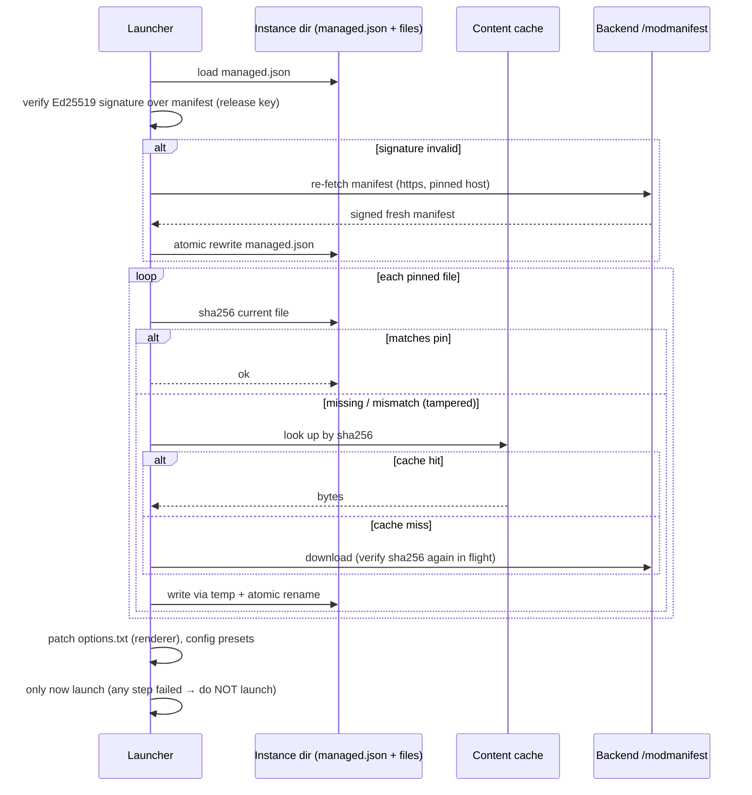
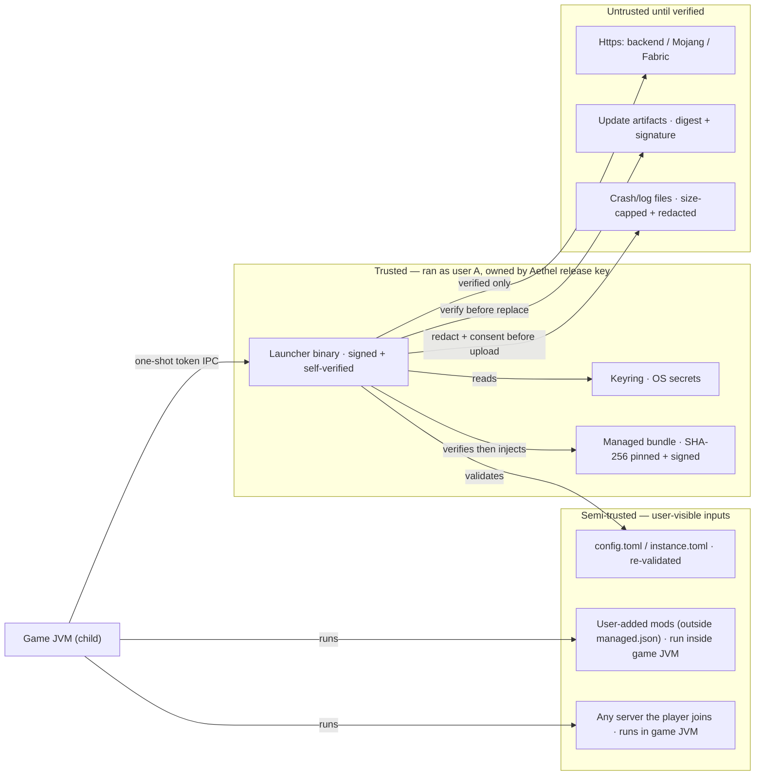

# 13 · Security

Hardening notes — including the lessons learned from the 2026 Lunar Client RCE reviews.

Threat framing: we treat **every input surface around the launch as hostile** — the game process, the
loopback IPC endpoint, the local filesystem, the network, and (critically) any future browser surface
that might creep in. This document is the cross-cutting security spec; per-area details live with the
feature docs and are linked here ([05](./05-launch-engine.md), [06](./06-auth.md), [09](./09-backend.md),
[12](./12-ipc.md), [14](./14-telemetry.md), [15](./15-updating-distribution.md)).

## 1. Treat the launch surface as hostile

- **No browser/JS anywhere.** egui is native; there is no webview → the entire class of
  "drive-by JS RCE" (the root cause of the 2026 Lunar reviews: `nodeIntegration:true` + `lunarclient://`)
  is absent.
- **Loopback-only IPC** ([12](./12-ipc.md)). Bind `127.0.0.1:0`, 128-bit random per-launch token,
  one connection, constant-time compare, strict frame/rate limits.
- **No guessable handshake IDs** like Lunar's `launchId/processId/installationId` — ours is
  OS-CSPRNG entropy, regenerated every launch, never persisted.
- **No custom protocol deeplinks** in v1 (`aethel://` handling, if added later, must be strictly
  parsed with **no path→shell routing** and **no browser-registered handler**; defer until reviewed).

### 1.1 Attack-surface inventory

Every place untrusted input can reach code. Each row is a documented, test-gated boundary.

| # | Surface | Trusted input? | Defended by |
|---|---|---|---|
| 1 | Game process (JVM) | partially — untrusted server code runs inside | bundle pins (§9), allow-list JVM args, no sensitive secrets except one-shot token |
| 2 | IPC loopback socket | hostile — any local process can connect | token + loopback + limits (§8, [12](./12-ipc.md)) |
| 3 | Instance directory + `managed.json` + user mods | hostile (local edits) | SHA-256 pins + signed manifest + atomic restore (§9) |
| 4 | Backend HTTPS responses (jsons) | semi-trusted | HTTPS + host allow-list + strict serde + signatures |
| 5 | Update/installer artifacts | hostile until verified | digest + signature before execution (§10, [15](./15-updating-distribution.md)) |
| 6 | `config.toml`/`instance.toml` | hostile (may be edited) | canonicalized re-validation; args always re-filtered through allow-list |
| 7 | Crash/log files | hostile shapes but no code | redacted before display/upload, size-capped ([14](./14-telemetry.md)) |
| 8 | OS keyring | trusted (OS guarantees) | read-only access pattern; no mirroring |
| 9 | Browser/webview | **eliminated by design** | none needed — no webview in the product ([08 §1](./08-ui-design.md)) |

The 2026 Lunar lesson applied concretely: Lunar's surface #2 was guessable, and #9 existed with full
node access. We remove #9 outright, make #2 unguessable, and add #3 as an entirely new layer.

## 2. Secrets & tokens

| Secret | Storage | Notes |
|---|---|---|
| MS refresh token | OS keyring (`keyring` crate: Secret Service / Keychain / Credential Manager) | never in files; encrypted at rest by the OS ([06 §4](./06-auth.md)) |
| MC access token | memory (process-scoped, `ZeroizeString`) | passed as JVM arg once (what all launchers incl. vanilla do); ~24 h TTL, dies with game; **accepted residual** |
| Supabase platform token | memory | refreshed per session, scoped to Supabase JWT ([10](./10-database.md)) |
| IPC token | memory + JVM arg only | per launch, 128-bit, never written ([12 §2](./12-ipc.md)) |

- **Logs**: `tracing` with a `Redactor`/field-filter layer. The launch command & game console are
  logged redacted (mask `accessToken`, `refresh_token`, `auth_token`, the IPC token, and any
  `Authorization` header). Golden negative tests in [16 §1](./16-testing.md) assert no secret bytes
  survive any sink (console, file, network).
- **Config files**: `config.toml` never holds credentials — only the offline username and the
  *pointer* (account key) to keyring entries.
- **Keyring failure policy**: if the Secret Service is unavailable, the MSA feature is *disabled at
  runtime with a tooltip*. There is **no plaintext fallback, ever** — not even temporary.

```rust
// crates/launcher-core/src/secret.rs — single choke point for secret material.
use zeroize::Zeroize;

#[derive(Clone)]
pub struct ZeroizeString(String);
impl Zeroize for ZeroizeString {
    fn zeroize(&mut self) { self.0.zeroize(); }
}
// Behind this, launch args are built in a Vec<ZeroizeString> that is consumed once and
// zeroized immediately after spawn (never cloned into the args that get logged).
```

## 3. Supply chain & integrity

- All downloads carry **SHA-1 (Mojang)** or **SHA-256 (Aethel bundle)**, verified before use
  ([05 §1](./05-launch-engine.md)).
- Bundle is pinned per version and enforced **every launch** — tamper detection + restore is
  specced in §9 and [07 §2](./07-vulkan-performance.md).
- HTTPS everywhere (`reqwest`/`rustls`); manifest hosts are allow-listed to the known domains
  (`piston-meta.mojang.com`, `meta.fabricmc.net`, `maven.fabricmc.net`, `api.aethel.app`, …).
- Dependency hygiene: `cargo audit` in CI; pinned crates; no `unsafe` in the audit path (see §12).

### 3.1 Host allow-list (enforced at the HTTP client, not just at the cert)

| Host | Purpose | Contents verified by |
|---|---|---|
| `piston-meta.mojang.com`, `resources.download.minecraft.net`, `launchermeta.mojang.com` | Mojang manifests, assets, JREs | SHA-1 from Mojang manifests |
| `meta.fabricmc.net`, `maven.fabricmc.net` | Fabric meta + libraries | SHA-1 from meta files |
| `api.aethel.app` (prod) | all Aethel backend routes | SHA-256 + Ed25519 signatures where provided |
| `*.aethel.app` (assets/CDN redirect target) | skin/cosmetic/installer blobs | allows only `aethel.app` suffixes |
| `github.com`, `objects.githubusercontent.com` (release channel) | update artifacts only | signed manifest's `sha256` |

Anything outside this set → connection refused at the DNS/pinning layer. This kills redirect-based
mitm from unrelated CDNs and means a compromised *logo CDN* can't be used to smuggle a manifest.

## 4. Local process & filesystem

- Instance dirs under a dedicated `$AETHEL_HOME`; `0700` on Linux/macOS, tightened ACL on Windows —
  prevents *other local users* from reading instances, libraries, or launch args ([12 §4](./12-ipc.md)).
- Downloads land in `temp/` then move by **atomic rename** → no partially-written file is ever read
  as valid.
- **Single-instance lock** (`fs2`/lockfile) — two launchers can't fight over one instance; also
  bounds the number of live IPC listeners per instance to one.
- Sensitive game-log redaction is applied *also when writing disk logs* (crash staging in
  `$AETHEL_HOME/crash-reports/`, [14](./14-telemetry.md)).
- `options.txt`/`managed.json` writes use the same temp+rename pattern so a kill mid-write never
  leaves a corrupt manifest (which would otherwise look like tampering in §9).

## 5. Backend surface

- Admin routes: JWT `role=admin` + optional IP allowlist; no default credentials; separate env-scoped
  service token for the manifest-refresh cron ([09 §4](./09-backend.md)).
- `shop/buy`: idempotency key (`request_id`) prevents replay/double-charge; wallet ops run in a
  Supabase RPC transaction ([10](./10-database.md)).
- Telemetry ingest: per-IP rate limit, payload size cap (5 MB), sanitized file names, no HTML/script
  accepted in fields ([14 §5](./14-telemetry.md)).
- Render env vars: secrets only via the Render dashboard env (never in repo, images, or client).
  **No DB secrets ship to clients** — Supabase service key stays server-side; launchers talk to Axum
  only ([09](./09-backend.md)), which is the reason a thin gateway exists at all.

### 5.1 Backend defense matrix

| Endpoint class | Inspection on input | Ops-side control |
|---|---|---|
| Public read (`/versions`, `/modmanifest`, `/news`, `/servers`, `/skin-api`, `/shop`) | strict typed parsers; no HTML/JS reflected | cached (moka), short TTL; signature over manifests |
| Authed (`/me`, `/shop/buy`, `/cosmetics/*`) | Supabase JWT verified (issuer, audience, exp); idempotency key required on mutations | role claim checked; RLS cannot be bypassed via API layer |
| Admin (`/admin/*`) | `role=admin` JWT + optional IP allowlist | secret rotation; audit log on destructive ops |
| Ingest (`/telemetry/crash`) | size cap 5 MB; rate-limit per IP; filename sanitize | storage bucket private (admin-only); retention policy |
| Signing (`/launcher/update-check`, manifests) | response is *verified by the client* with the release key | signer key in CI/HSM, never in the app |

Backend-originated JS (e.g. a malicious news body) is still **rendered as inert text** client-side:
egui has no HTML renderer, so stored-XSS is structurally impossible on the launcher side
([08](./08-ui-design.md)).

## 6. Privacy

- **Telemetry is opt-in** (default off, [14](./14-telemetry.md)); consent stored locally and echoed
  with every payload.
- Crash reports: explicit consent dialog before upload (Sentry desktop crash-reporter pattern).
- We never collect MS tokens, chat content, world files, or any file outside the crash/log scope.
- "Delete my data" via Supabase (profile + telemetry cascade, [10](./10-database.md)).

## 7. Security checklist gates (release)

- [ ] `cargo audit` passes; `cargo clippy -D warnings` clean.
- [ ] No secrets in repo or logs; keyring used for MS tokens.
- [ ] IPC token random & one-shot; loopback bind only.
- [ ] Bundle SHA-256 enforcement active in the released build.
- [ ] Telemetry default-off + consent flow working.
- [ ] Windows: no `lunarclient://` style vuln (no deeplinks); HKCU-only install (no admin).

---

## 8. IPC hardening & remote prevention

The IPC endpoint ([12](./12-ipc.md)) is the only inbound network socket the launcher ever opens, so
it gets its own hardening pass:

| Control | Where | Why |
|---|---|---|
| Loopback bind only | `bind(127.0.0.1)` in the launcher | no remote peer can even reach the socket |
| Source-address check at accept | peer IP ∈ `127.0.0.0/8` or `::1`, else close `4007` | defense-in-depth if bind ever weakens |
| Per-launch 128-bit token | OS CSPRNG, JVM-arg delivery, constant-time compare | unguessable, unobservable off launch args |
| Single connection | close `4004` on second accept | prevents hijack-by-white-noise |
| Frame limits | 64 KiB; binary rejected; rate bucket ≤ 100 msg/s | bounds resource use of a compromised mod |
| Envelope versioning | mandatory `v`, unknown-ignored | protocol drift can't become an attack vector |
| **Remote prevention** | the launcher **never dials out** a ws to a remote host; the *game* dials in to `127.0.0.1` | even a corrupted manifest URL can't turn IPC into a C2 tunnel |

**Remote prevention rules (hard):**

1. The IPC server binds only loopback and only to the argument `-Daethel.ipc` we generated.
2. The launcher never connects *out* to any WebSocket; outbound is HTTPS-only (Axum endpoints).
3. The mod resolves the endpoint from the JVM arg; if the host is not `127.0.0.1`/`localhost`, the
   mod refuses to connect (defense against a tampered launcher arg, though the launcher arg is signed
   by the bundle verificaton in §9 before it runs).
4. No DNS resolution is even consulted for the loopback URL; there is no DNS rebinding surface.

| Failure | Response |
|---|---|
| Non-loopback connect attempt | close at accept; metric `ipc.nonlo_reject` |
| `-Daethel.ipc` pointing off-loopback | mod refuses; IPC unavailable pill |
| Second valid session | replace session, log `ipc.session_stolen` (same-user scenario, [12 §7](./12-ipc.md)) |

## 9. Bundle tamper detection & signature verification

The optimization bundle is data the launcher enforces, not code it trusts. Two complementary layers:

1. **Hash pinning** — `managed.json` (per instance) lists every bundled file, its SHA-256, size, and
   source URL. Verified before every launch; mismatch/missing → restore atomically from the
   content-addressable cache; if the cache is empty, re-download and re-verify.
2. **Signature verification** — the *manifest itself* is signed (Ed25519, Aethel release key). A
   tampered `managed.json` (edited pins, author-added malicious mod) fails signature check and
   triggers a **full re-fetch of the manifest from the backend**, not a launch.



Notes:

- The signer key is **only** used by the release pipeline ([15](./15-updating-distribution.md)); the
  runtime verifier embeds the public key. If the key leaks server-side we rotate via a signed
  `key-rollover` manifest before the old key is removed.
- "Functionally undeletable": verification runs pre-launch; a missing/malicious renderer
  (VulkanMod/Sodium) is restored before the game boots ([07 §2](./07-vulkan-performance.md)).
- User-added mods are *outside* `managed.json`; they are never verified (that is the documented
  advanced-user escape hatch) but they can never overwrite a pinned bundle file because pinned
  writes always replace unconditionally.

## 10. Installer & update signing

Every artifact the user can run or install is signed and hash-verified. Detail in
[15](./15-updating-distribution.md); the trust chain here:

```mermaid
sequenceDiagram
    participant L as Launcher
    participant API as Backend /launcher/update-check
    participant CDN as GitHub Releases / CDN
    participant OS as OS (Win code-sign, mac notarize)

    L->>API: GET /launcher/update-check {version, channel}
    API-->>L: {version, url, sha256, signature(ed25519), mandatory}
    L->>L: verify signature over (version|url|sha256) — release key
    L->>CDN: download archive → temp
    L->>L: verify sha256 matches signed value
    alt pass
        L->>L: self_replace (backup prev binary 7 days, [15 §6](./15-updating-distribution.md))
    else fail any check
        L->>L: refuse; keep current binary; log + alert
    end
    Note over OS: Windows: EV/OV code-sign (defeats SmartScreen)<br/>macOS: Developer ID + notarization<br/>Linux: AppImage detached sig + SHA256SUMS
```

- Installers too: NSIS/dmg/AppImage signed at build time; `SHA256SUMS` published per release.
- The *installed* launcher self-verifies its own binary hash at startup against the last-known-good
  manifest (cheap, catches bit-rot or on-disk tampering before the UI even shows).
- Updates are channeled (`stable`/`beta`) and mandatory-updates auto-install only after a countdown
  when the backend flags them mandatory ([15 §5](./15-updating-distribution.md)).

## 11. Runtime injection mitigations

The game runs with our mods; the boundary between "our code" and "random Fabric mod / server code"
is genuinely inside the JVM, so the *mitigations* are about not making things worse and about
containing the launcher's own exposure:

| Vector | Mitigation |
|---|---|
| JVM startup flags injection | JVM args are built from a strict allow-list builder ([05 §4](./05-launch-engine.md)); user free-text args are append-only and warned in UI; nothing user-controlled can set `-javaagent` unless explicitly typed |
| `-agentlib:jdwp=transport=dt_socket` in the wild | default args never include debug agents; we scan the final arg list for `jdwp`/`javaagent` starts and drop/flag them except an explicit dev mode |
| Unsigned mods already in instance | user-mod jars are *not* auto-loaded outside Fabric — Fabric itself enforces its own manifest mixin rules; the bundle pins are what we control |
| Process memory | MC access token in the child is inherited JVM arg (accepted residual, §2); nothing else sensitive reaches the child; IPC token is the only other secret and it's one-shot |
| DLL/dylib side-loading | native libs come only from pinned, hash-verified jars/natives ([05 §1](./05-launch-engine.md)); the game dir is 0700 so an attacker writing a fake `.dll` requires same-user access |
| Mixin injection from a compromised bundle | defeated upstream: version-verified, signed manifest, per-file SHA-256 + restore (§9) |
| LiteLoader-style legacy injection on old versions | legacy path ([05 §6](./05-launch-engine.md)) runs vanilla or OptiFine only — no JS/scripting node; nothing to inject into |

Note on anti-cheat: we do **not** attempt to fortify the game against servers' anti-cheat in either
direction (see non-goals in [00](./00-overview.md)); "Vanilla clean" mode ships no bundle if a user
needs to pass a strict environment.

## 12. Dependency supply chain

| Stage | Control |
|---|---|
| Manifest | `Cargo.lock` committed; CI `cargo audit` fails on any advisory; `cargo deny` license/dupe policy |
| Source | crates.io only (no git deps in release build); pinned exact versions in lockfile |
| Posture | no `unsafe` allowed in crates we audit-path depends on (enforced by `cargo geiger` gate on the hot path); `unsafe` in transitive deps is reviewed and listed |
| Java side | bundle jars pinned + the Aethel mods built from our own Gradle workspace; mod versions from upstream pinned in the manifest and re-pinned on bundle bump |
| Nightly toolchain | release builds pin the exact `rust-toolchain.toml` revision; MSRV enforced |
| Rotation | any backend dependency with CVEs published mid-cycle → `cargo audit` blocks merge; PATCH bumps are routine |

## 13. Threat model (STRIDE)

Applies to the whole launcher lifecycle (install → update → launch → game session → telemetry).

| Threat | Scenario | Impact | Mitigation |
|---|---|---|---|
| **Spoofing** | Rogue process fakes the game in IPC, or fakes the update manifest | run arbitrary signed-looking code / exfil | per-launch token (§8), signed manifests with public-key verify (§9-§10), HTTPS to pinned hosts |
| **Spoofing** | Fake backend on the network (DNS/CA trickery) | serve poisoned manifests/modules | rustls + host allow-list; signature chain independent of TLS (Ed25519) |
| **Tampering** | Bundle files re-written by another app/user | Vulkan removed or extra malicious mod loaded | SHA-256 pins + atomic self-heal before every launch (§9) |
| **Tampering** | `config.toml`, `instance.toml`, `managed.json` edited | args/manifest poisoning | files are canonicalized and re-verified; manifest is signed; instance args validated against allow-list |
| **Repudiation** | user claims update caused a crash / abuse via telemetry | disputes | signed payloads + install `install_id` + server-side audit of admin ops |
| **Information disclosure** | tokens/logs/paths leak to logs, Sentry, or telemetry | identity theft, account abuse | `Redactor` layer + golden tests; consent-gated telemetry; crash reports stripped of tokens |
| **DoS** | flood the IPC listener / backend telemetry | UI jank, supabase abuse | loopback + 1 conn + rate caps on socket; per-IP rate limits + size caps on backend |
| **Elevation of privilege** | local user B breaks out of a launcher sandbox via IPC or temp files | access to instance/keys of user A | 0700 dirs, single-user trust model, loopback-only, no admin install path on Windows ([15 §1](./15-updating-distribution.md)) |

## 14. Threat mitigations by layer

| Layer | Assets | Controls |
|---|---|---|
| **Network** | IPC endpoint, backend TLS, update downloads | loopback bind + source check; rustls pinned hosts; signed download chain |
| **Process** | launcher memory, child game args | `ZeroizeString`, one-shot injection, allow-list JVM arg builder |
| **Local FS** | `$AETHEL_HOME`, instances, keyring entries | 0700 perms; temp+atomic rename; single-instance lock; no plaintext secrets |
| **Keyring/OS** | MSA refresh token | OS Secret Service / Keychain / Credential Manager; no fallback |
| **Backend** | DB, admin, shop, telemetry, manifests | JWT+role admin, IP allowlist, idempotency keys, rate limits, no DB secrets client-side |
| **Delivery** | installer, updates, bundle | code-signing + notarization, Ed25519 manifests, sha256 checksums, rollback backup |

### 14.1 Trust boundaries



The graph is the enforcement model: **nothing crosses from the untrusted box into the trusted region
without a verification step in `L`** (hash, signature, allow-list, or structural parse), and the only
write from the game JVM into the trusted zone is the single loopback IPC channel with its own
one-shot credential.

## 15. Residual risk (accepted)

| Risk | Accepted? | Why / compensating control |
|---|---|---|
| MC access token visible in child process args | ✅ | universal to all launchers incl. vanilla; 24 h TTL; game-exit kills it |
| Same-user local attacker reads launch args IPC token | ✅ | same-user already owns the machine; loopback+0700 stop *other users* only |
| Offline login has no server-side identity | ✅ | inherent to offline mode; documented in [06 §7](./06-auth.md) |
| Secret Service absence disables MSA on some Linux setups | ✅ | prefer-disabled over insecure; offline works |
| Self-signed wss not enabled by default for IPC | ✅ | localhost safety; wss documented as strict-mode option ([12 §9](./12-ipc.md)) |
| JS-class threats eliminated by no-webview | ✅ | structural guarantee; no webview can be added without this doc's review |
| Update signature key compromise | ⚠️ partially | key in release-only HSM/CI secret; rotating-key manifest path defined (§9) |

## 16. Edge cases

| Edge case | Behaviour |
|---|---|
| Keyring locked at first run | MSA tab disabled with tooltip; offline launches fine; no crash |
| `managed.json` deleted | signed-reverify triggers full re-fetch; instance state preserved by files (`managed.json` is regenerated, files re-hashed in place) |
| Both cache *and* network down with tampered bundle | launch is **blocked** — this is a security-required failure, never a silent bypass |
| User puts their own `managed.json` (knowledgeable user) | it isn't signed → network re-fetch overwrites; documented, no workaround (matches "Vulkan can't be deleted" goal) |
| Two launcher instances, same machine | single-instance lock wins; second instance shows "already running" |
| Signed update newer than installer's embedded key | key-rollover chain: new manifest signed by current active key contains the *new* key fingerprint; rollback path keeps old key valid for 90 days |
| Telemetry consent off but crash reporting on | crash consent is its own separate opt-in; both must be on to upload ([14 §1](./14-telemetry.md)) |
| A CVE opens in a pinned bundle mod | bundle version bump (signed, hot-swapped, never silent — [07 §3](./07-vulkan-performance.md)); users get the fixed jar on next launch |

## 17. Failure modes & recovery

| Failure | Detection | Recovery |
|---|---|---|
| Bundle verify fails for one file | pre-launch hash scan | self-heal from cache / re-download; record `security.heal` metric |
| Signature invalid on manifest | pre-launch verify | full manifest re-fetch; if backend also invalid → **blocked launch**, error screen |
| Code-signing can't verify on Windows | SmartScreen on first-run only | signed EV install; dev builds explicitly unsigned + HKCU-only |
| Update signature mismatch | during update check | refuse install, keep current, alert dashboard |
| Keyring unavailable | entry get/put error | disable MSA, no fallback |
| IPC flood | token bucket trip | drop + metric; never crash the listener |
| Backend down at launch | HTTPS error | read-only launch with cached manifests; store/news blocked (per [02 §6](./02-architecture.md)) |
| CVE in a bundled crate | `cargo audit` blocks CI | hotfix release; manifest channel bumps |

## 18. Acceptance criteria (checklist)

- [ ] Fresh install on all 3 OS leaves **zero** plaintext secrets in `$AETHEL_HOME` (grep audit in [16](./16-testing.md)).
- [ ] `managed.json` tamper test: edit a bundle jar → relaunch → file restored, game boots, Vulkan active ([07 §2](./07-vulkan-performance.md)).
- [ ] Manifest signature test: re-sign with wrong key → launch blocked with clear error, no partial install.
- [ ] Update test: tampered `sha256` in update manifest → refused, previous binary intact ([15](./15-updating-distribution.md)).
- [ ] IPC: remote connect attempt, non-loopback source, oversized frame, rate flood, wrong token — all rejected with correct close codes ([12 §11](./12-ipc.md)).
- [ ] Log-redaction golden tests pass for launch args, IPC frames, and crash payloads (no token substring).
- [ ] `cargo audit` + `cargo clippy -D warnings` green in CI; `cargo geiger` gate on the audit path clean.
- [ ] Telemetry default-off with separate crash consent; opt-in payloads contain only the consent-scoped fields ([14](./14-telemetry.md)).
- [ ] Windows install runs HKCU-only without elevation; no deeplink handler registered ([15 §1](./15-updating-distribution.md)).
- [ ] Backend: admin role checks, idempotent `shop/buy`, per-IP telemetry limits — verified by integration tests ([09 §5](./09-backend.md)).