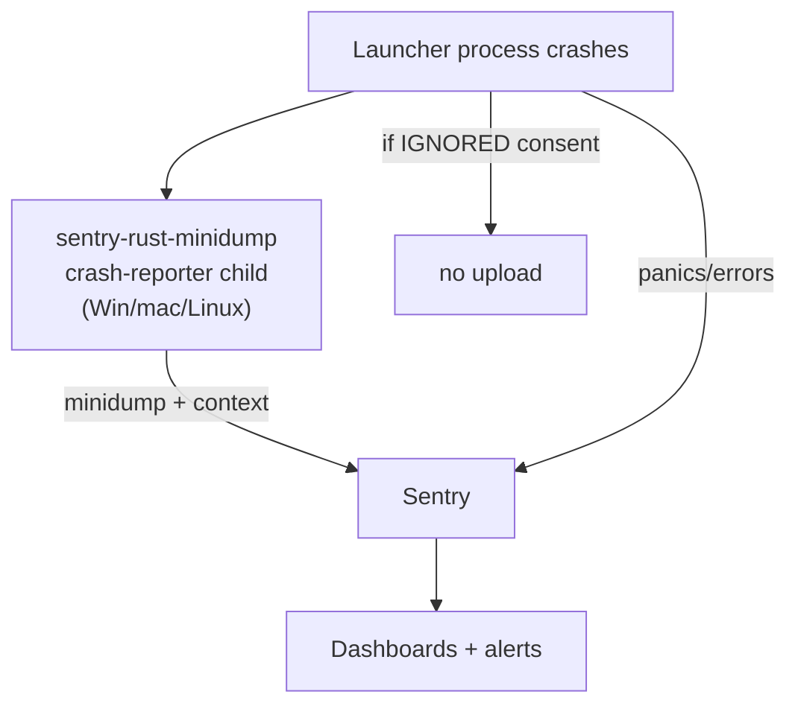
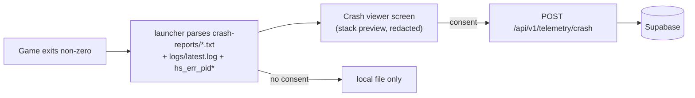
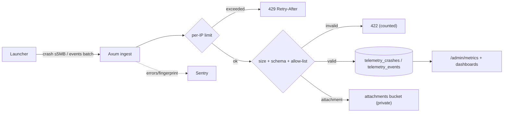

# 14 · Telemetry

Privacy-first, **offline-by-default** telemetry. Nothing leaves the machine unless the user opts in, and the
payloads are designed so that even opted-in data cannot identify a person or a world. This document defines
what is collected, the consent model, the launcher and game crash paths, the opt-in usage event catalog,
retention, the backend ingest contract, and the operating budget. It is the client half of the ingest routes
in [09 · Backend](./09-backend.md) and the tables in [10 · Database](./10-database.md). The privacy rules
here are enforced by [13 · Security](./13-security.md) and the offline-first invariant in
[00 · Overview](./00-overview.md).

## 1. Scope & consent

- **Default: off.** First run shows an explicit consent screen (send anonymous crash + optional usage).
- Consent stored locally and echoed in every upload payload.
- Never collects: MS/MC tokens, chat, world data, usernames (unless consented & needed for cosmetics).

### 1.1 Consent model

Three independent switches, all default **off**, each persisted in `config.toml` and shown on the
"Privacy" pane. Changing any switch takes effect on the **next** upload (no retroactive sending).

| Switch | Key | Default | What it enables | Can be revoked? |
|---|---|---|---|---|
| Crash reports | `telemetry.crash` | off | §2 + §3 uploads | yes (stops future sends; local files remain) |
| Usage analytics | `telemetry.usage` | off | §4 batched events | yes |
| Server-list latency probes | `telemetry.netprobe` | off | anonymous ping RTT to `servers` endpoints | yes |

### 1.2 Consent matrix (what can be sent when)

| Data | crash=off | crash=on | usage=off | usage=on |
|---|---|---|---|---|
| Launcher minidump | — | ✓ | — | — |
| Game crash log text | — | ✓ | — | — |
| `install_id` | — | ✓ (hashed) | — | ✓ (hashed) |
| `os`/`arch`/`version` | — | ✓ | — | ✓ |
| Session start/end | — | — | — | ✓ |
| Playtime seconds | — | — | — | ✓ |
| Module toggles | — | — | — | ✓ |
| MS/MC token, chat, world, screenshots | never | never | never | never |
| Username | — | — | — | only if the user also enables cosmetics ([11 §3](./11-in-game-mods.md)) |

### 1.3 First-run consent screen

```text
┌─ Help make Aethel better (optional) ─────────────────────────┐
│ ☐  Send anonymous crash reports                              │
│      Minidumps + crash logs. No world/chat/account data.     │
│ ☐  Send anonymous usage analytics                            │
│      Launch counts, versions, playtime, mod toggles.         │
│ ☐  Probe server latency                                     │
│                                                              │
│  [ See exactly what's sent ]   [ Decline all ]   [ Save ]    │
└──────────────────────────────────────────────────────────────┘
```

- "See exactly what's sent" opens a live preview built from the same serializers used for upload, so the
  screen can never drift from reality.
- Declining is a first-class path: one click, no dark patterns, no re-prompt more than once per major version.
- The consent state is hashed into every payload as `consent: {crash, usage, netprobe}` so the server can
  audit that it only ever stored what was authorized at send time.

### 1.4 Local-only guarantees

- All telemetry data is written to `logs/telemetry/` **before** any upload attempt; a crash offline still
  produces a local report.
- Local crash history is bounded to the last 20 entries ([§3](#3-game-crash-path)); telemetry spool bounded
  to 50 MB, oldest-first eviction.
- The network layer refuses to attach the `Authorization` header to telemetry endpoints — these are
  anonymous uploads even when signed in ([06 §4](./06-auth.md)).

## 2. Launcher crash path



- Capture: minidump, `release`, `os`, `arch`, `backend env`, breadcrumbs (window, last action).
- A separate `sentry-desktop-crash-reporter`-style UI lets the user see "Aethel crashed" + send/decline.

### 2.1 Crash report fields (launcher)

| Field | Example | Redaction |
|---|---|---|
| `release` | `1.5.0+9f2a1b` | — |
| `os` / `arch` | `windows` / `x86_64` | — |
| `os_version` | `10.0.22631` | coarse build string |
| `backend_env` | `wayland` / `x11` / `winit` | — |
| `gpu` | `vendor:driver` bucket | coarse, never serial |
| `breadcrumbs` | last N UI actions (no input text) | input values stripped |
| `minidump` | binary | admin-only attachment |
| `install_id` | hashed | salted hash, rotated when consent toggled |
| `consent` | `{crash:true,usage:false,...}` | — |

## 3. Game crash path



- Home screen keeps last 20 crash entries with timestamps; "Restart in safe (OpenGL) mode" button.

### 3.1 What the parser collects

| Source | Extracted | Notes |
|---|---|---|
| `crash-reports/crash-*.txt` | exception class, top stack frames, mod list | Java crash anchor |
| `logs/latest.log` | tail (last 200 lines) + `ERROR`/`FATAL` lines | truncated, no full log |
| `hs_err_pid*.log` | JVM signal, failing frame | native crash |
| Launcher boot table | mc version, loader, bundle version, renderer mode | from [05](./05-launch-engine.md)/[07](./07-vulkan-performance.md) |
| IPC snapshot | last active screen, mod toggles ([12 §3](./12-ipc.md)) | no chat/content |

### 3.2 Game crash request body

```jsonc
// POST /api/v1/telemetry/crash
{
  "install_id": "sha256:9f2a…",          // hashed client-side
  "kind": "game",
  "consent": { "crash": true, "usage": false, "netprobe": false },
  "context": {
    "launcher_version": "1.5.0",
    "mc_version": "26.2",
    "loader": "fabric",
    "bundle_version": "3.2.0",
    "renderer_mode": "sodium-vulkan",
    "os": "linux", "arch": "x86_64"
  },
  "exception": "java.lang.NoSuchMethodError",
  "frames": ["net.caffeinemc…:123", "…"],
  "log_tail": "…redacted, ≤ 200 lines…",
  "attachment": { "name": "crash-2026-09-21_19.10.22-client.txt", "sha256": "…" }
}
```

Response is always `204 No Content` (even if the attachment was dropped), so the client never retries a
successful metadata write because of a storage hiccup.

### 3.3 Redaction pipeline (client-side, before spool)

1. Strip absolute user paths → `<home>/…`.
2. Strip MS/MC account names and UUIDs matched by regex.
3. Strip chat-like lines (`[CHAT]`, `<player>`) even inside `log_tail`.
4. Drop any line containing a token-ish `Bearer`/`eyJ` fragment.
5. Replace world names with `<world>`.
6. The redacted text is what the user previews in the crash viewer **and** what is uploaded — one artifact,
   no divergence.

### 3.4 Safe mode

The crash viewer offers "Restart in safe (OpenGL) mode": the launcher relaunches with the OpenGL renderer
and mods off ([07 §5](./07-vulkan-performance.md)). The *choice* is a usage event only if usage consent is
on; the crash itself does not force any upload.

## 4. Usage telemetry (opt-in)

| Signal | Payload | Frequency |
|---|---|---|
| install | `install_id, os, arch, launcher_version, channel` | 1× / session |
| session start/end | `install_id, game_version, bundle_version, renderer_mode` | session |
| playtime | seconds (from IPC `playtime`) | every 60s |
| module toggles | enabled/disabled ids | on change |
| update result | `installed_version, ok/err` | on event |
| crash | as §3 | event |

- Deterministic `install_id` (random, persisted in `config.toml`); hashed when stored.

### 4.1 Event catalog (allow-list, versioned)

Only these `name`s are accepted by ingest; unknown names are dropped and counted. Adding an event requires a
doc change (this table) plus a server allow-list entry.

| Event | `name` | Props (allow-listed) | Sampling |
|---|---|---|---|
| Install seen | `install` | `os, arch, launcher_version, channel` | 100% |
| Session start | `session_start` | `game_version, bundle_version, renderer_mode` | 100% |
| Session end | `session_end` | `duration_s` | 100% |
| Heartbeat | `heartbeat` | `playtime_s` | 100% |
| Mod toggled | `mod_toggle` | `mod_id, enabled` | 100% (no paths) |
| Update result | `update_result` | `installed_version, ok` | 100% |
| Crash (usage mirror) | `crash` | `kind, exception_class` | 100% |
| First run | `first_run` | `channel` | 100% |
| Daily active | `daily_active` | — | 100%, deduped server-side per `anon_id`/day |

### 4.2 Event envelope & batching

```jsonc
// POST /api/v1/telemetry/events   (batched; max 50 events or 30 s, whichever first)
{
  "install_id": "sha256:9f2a…",
  "anon_id": "daily-2026-09-21-8c1d",   // rotates daily; unlinkable across days
  "consent": { "crash": true, "usage": true, "netprobe": false },
  "launcher_version": "1.5.0",
  "events": [
    { "name": "session_start", "ts": "2026-09-21T19:00:00Z",
      "props": { "game_version": "26.2", "bundle_version": "3.2.0", "renderer_mode": "sodium-vulkan" } },
    { "name": "heartbeat", "ts": "2026-09-21T19:01:00Z", "props": { "playtime_s": 60 } }
  ]
}
```

- `anon_id` rotates **daily** and is derived as `HMAC(salt_day, install_id_hash)`; the server can count DAU
  without linking a user across days.
- Batches are spooled to disk first ([§1.4](#14-local-only-guarantees)); upload uses exponential backoff
  (1 s → 2 s → 4 s → … cap 5 min) and gives up after 24 h, dropping oldest.
- No mobile-style "track everything": a fixed, documented catalog is the entire surface.

### 4.3 Anonymization

```text
install_id  = random(32 bytes)                 # stored in config.toml, never derived from hardware
install_hash= sha256("aethel-telemetry-v1:" || install_id)
anon_id(day)= hex(HMAC_SHA256(daily_salt, install_hash))[..16]
             where daily_salt rotates at 00:00 UTC and is never persisted with events
```

Hardware fingerprints (MAC, disk serial, CPU id) are **never read**. The only stable machine identifier is
the random `install_id`, and it is one-way hashed before it leaves the device.

## 5. Backend ingest

- `POST /api/v1/telemetry/crash` → validates size (< 5 MB), rate-limits per IP, writes to
  `telemetry_crashes`; files to `attachments` bucket (admin-only).
- Optional Sentry ingestion for the tail; keep both paths cheap.

### 5.1 Pipeline



### 5.2 Ingest contract

| Endpoint | Auth | Cap | Rate limit | Response |
|---|---|---|---|---|
| `POST /api/v1/telemetry/crash` | none (anon) | 5 MB body | 10/min/IP, burst 5 | `204` / `413` / `422` / `429` |
| `POST /api/v1/telemetry/events` | none (anon) | 50 events, 256 KB | 20/min/IP | `204` / `413` / `422` / `429` |

- Consent is **re-checked server-side**: if `consent.crash` is false, the body is discarded with `204`
  (no error leak) and `aethel_telemetry_consent_mismatch_total` increments.
- `kind` must be `game|launcher`; `name` must be in the §4.1 allow-list ([10 §2.2](./10-database.md)).
- Attachments are stored privately; only metadata (hash, size, path) is queryable by admins.
- The endpoint is deliberately **cheap**: parse → validate → insert; no enrichment, no joins on the hot path
  ([09 §10](./09-backend.md)).

### 5.3 Data written

| Field set | Table | Retention |
|---|---|---|
| crash metadata + stack | `telemetry_crashes` | 90 days rolling |
| crash attachment | `attachments` bucket | 30 days rolling |
| usage events | `telemetry_events` | 180 days aggregate-only after 30 days raw |
| install identity | `launcher_installs` | while installed + 90 days |

Deletion is automated by a scheduled job; a user can purge their install data via "Delete my telemetry"
which deletes by `install_hash`, not just opt-out.

### 5.4 Validation rules (server-side, applied before insert)

| Field | Rule | On violation |
|---|---|---|
| `kind` | in `{game, launcher}` | `422`, counted |
| `name` (per event) | in §4.1, versioned allow-list | event dropped, rest of batch kept |
| `install_id` | `sha256:<64 hex>` | `422` |
| `consent` | all three keys present, boolean | `422` (client must send explicit consent) |
| `consent.crash`/`usage` | must be `true` for the matching payload | `204`, `consent_mismatch_total++` |
| `ts` | parses ISO-8601; clamped to `received_at ± 24 h` | clamp + `ts_clamped_total++` |
| batch size | ≤ 50 events, ≤ 256 KB | `413` |
| crash body | ≤ 5 MB; attachment optional | `413` (metadata-only retry allowed) |
| `frames` | ≤ 64 entries, each ≤ 512 chars | truncate + flag |
| `log_tail` | ≤ 200 lines after redaction | truncate + flag |

### 5.5 Offline spool format (client)

```text
spool/
├── 2026-09-21T19-00-00Z-events.json   # ≤50-event batch, append-only
├── 2026-09-21T19-10-22Z-crash/        # one crash report, redacted before write
│   ├── meta.json                      # §3.2 fields
│   ├── crash-….txt                    # redacted crash text
│   └── minidump                       # optional; launcher crashes only
└── index.json                         # queue order + retry state (attempts, next_at)
```

- Append-only; `index.json` is the only mutable file (atomic replace) so a crash mid-write cannot corrupt
  the queue.
- Bounded to 50 MB with oldest-first eviction; a 24 h undeliverable batch is dropped and a local
  `dropped` counter records the loss.
- Deleting the spool in the Privacy pane both purges local files and issues the server purge by `install_hash`.

## 6. Alerts & ownership

- Sentry issue alerts → Discord webhook (email on critical).
- Weekly active users + crash-free-rate metric in admin dashboards (`GET /admin/metrics`).

### 6.1 Metric & alert catalog

| Metric | Source | Alert threshold | Owner |
|---|---|---|---|
| `crash_free_sessions` | sessions with no `crash` event / total | < 98% over 24 h | Client team |
| `launcher_crash_rate` | Sentry events / install base | > 0.5% / day | Client team |
| `telemetry_ingest_errors_total` | Axum | > 100 / 5 min | Backend |
| `telemetry_consent_mismatch_total` | Axum | > 0 sustained | Privacy/Backend |
| `crash_signature_new` | Sentry fingerprint | any *new* top frame | Client team |
| `manifest_refresh_age_seconds` | Axum | > 30 min | Backend ([09 §7.1](./09-backend.md)) |
| `storage_attachments_bytes` | Supabase | > 80% quota | Backend |
| `dau` (dashboard) | `telemetry_events` | info only | Product |

### 6.2 Ownership & escalation

- **Client team** owns minidump/crash quality and the crash-free KPI.
- **Backend** owns ingest availability, rate limits, retention jobs, and storage.
- **Privacy owner** owns the consent text, the allow-list, and reviews any new event before it ships; a
  non-empty `telemetry_consent_mismatch_total` pages them directly.
- Critical regressions: new crash signature affecting > 1% of sessions → Discord + email within one
  business day; a privacy violation (data above the allow-list) → immediate send-site disable + incident
  writeup.

## 7. Edge cases

| Edge case | Behaviour |
|---|---|
| Consent toggled off while a batch is in flight | in-flight upload completes; next spool is dropped and spool file deleted |
| Crash at first launch, before consent chosen | local file only; viewer re-offers consent, never auto-sends |
| Upload fails 24 h straight | batch dropped oldest-first; a single meta-event notes the drop count |
| Crash log > 5 MB | tail truncated to fit; attachment preserved separately if it can be compressed under cap |
| `install_id` missing/corrupt in `config.toml` | regenerate, start a new hash lineage; old data ages out by retention |
| Same `install_id` on shared machine profile | treated as one install; no attempt to detect multiple humans |
| Consent screen dismissed without choosing | remains **off**; no implicit opt-in |
| Game crash without any crash file | synthesize from launcher's exit code + IPC last-state snapshot |
| Clock is wrong / offline | events timestamped with monotonic-with-UTC-correction; server stores both client `ts` and `received_at` |
| Server returns 422 for an unknown event | client drops that event silently and records it locally for diagnosis |
| User asks to see/delete their data | "Privacy" pane shows spooled + last-uploaded previews and a delete-by-install action |
| Sentry down but Axum up | crash metadata still lands in Supabase; only the Sentry tail is lost |
| Realtime/dashboard outage | metrics remain scrapable at `/admin/metrics`; dashboards catch up |

## 8. Failure modes & recovery

| Failure | Impact | Detection | Recovery |
|---|---|---|---|
| Ingest endpoint 5xx | events/crashes delayed | `telemetry_ingest_errors_total` | client backoff; spool survives restarts |
| Storage quota full | attachments dropped, metadata kept | `storage_attachments_bytes` | retention prune; alert backend |
| Consent misconfiguration (client sends without consent) | privacy incident | `telemetry_consent_mismatch_total`, audit | disable send site, patch, notify privacy owner |
| Retention job fails | tables/buckets grow | dashboard + row-count metric | re-run job; manual prune; alert |
| Sentry quota exhausted | minidump tail lost | Sentry usage | metadata path unaffected; raise quota or sample |
| `install_id` collision (astronomically unlikely) | merged data | integrity check on hash | rotate lineage; no user-visible impact |
| Clock skew makes `ts` future-dated | skewed analytics | server-side clamp | clamp to `received_at ± 24 h` |
| Redaction regex misses a token | sensitive data uploaded | periodic audit + canary tests ([16 §6](./16-testing.md)) | rotate leaked secret, fix regex, purge rows |
| Backend ingest route down but launcher works | no telemetry | health probe | offline-first means gameplay is unaffected ([00 §I-07](./00-overview.md)) |
| User revokes consent but server still has rows | stale personal-ish data | purge request | delete-by-`install_hash` job within 30 days |

## 9. Performance budget

| Concern | Budget | Mechanism |
|---|---|---|
| Client CPU for redaction | < 5 ms / crash report | compiled regex set, single pass |
| Spool write per event batch | < 2 ms | append-only file, fsync on flush |
| Upload payload size | ≤ 256 KB events, ≤ 5 MB crash | enforced both ends |
| Ingest server latency (metadata) | p95 < 80 ms | [09 §10](./09-backend.md) |
| Ingest server latency (≤5 MB attachment) | p95 < 500 ms | streamed to Storage, no in-memory buffer |
| Telemetry network usage | < 1 MB / session | batching + 60 s heartbeat |
| DAU/retention queries | < 200 ms | pre-aggregated daily rollups |
| Crash-free-rate query | < 1 s | materialized view refreshed hourly |
| Storage growth | < 5 GB / month at v1 scale | 30-day attachment retention |
| Client disk (spool) | ≤ 50 MB, oldest-first eviction | bounded queue |

**Budget rules.** Telemetry must never block gameplay or the launch path ([00 · invariant I-07](./00-overview.md));
all uploads happen on a background task with a hard 10 s timeout. A failed upload is never surfaced as an
error to the user.

## 10. Acceptance criteria (checklist)

- [ ] Fresh install has **all telemetry off**; a crash with consent off uploads nothing and is viewable locally ([00 §I-07](./00-overview.md)).
- [ ] Every payload echoes `consent`; the server discards any data whose switch is off and increments `telemetry_consent_mismatch_total`.
- [ ] The consent screen's "See exactly what's sent" preview is produced by the production serializer (no divergence test).
- [ ] Redaction removes paths, account names, UUIDs, chat lines, and token-like strings; canary tests pass ([16 §6](./16-testing.md)).
- [ ] Event names/props are constrained to the §4.1 allow-list; unknown events are dropped and counted, never stored.
- [ ] `install_id`/`anon_id` derivation matches §4.3; no hardware fingerprint is ever read (grep/CI test).
- [ ] Ingest honors §5.2 caps/limits and returns `204`/`413`/`422`/`429` exactly as specified.
- [ ] Retention jobs delete crashes at 90 d and attachments at 30 d; "Delete my telemetry" purges by `install_hash`.
- [ ] Ingest p95 stays within §9; telemetry never blocks launch or gameplay.
- [ ] Alerts in §6.1 fire in a synthetic test; ownership/escalation is documented and staffed.
- [ ] A user can inspect and delete their local spool from the Privacy pane without network access.

## Where to go from here

- **Server side of ingest & caching:** [09 · Backend](./09-backend.md) (routes, limits, metrics).
- **Tables, consent columns, retention:** [10 · Database](./10-database.md).
- **Identity & what the client may hold:** [06 · Auth](./06-auth.md); **hardening:** [13 · Security](./13-security.md).
- **Crash sources:** [05 · Launch engine](./05-launch-engine.md), [07 · Vulkan & performance](./07-vulkan-performance.md), [12 · IPC](./12-ipc.md).
- **Testing the privacy guarantees:** [16 · Testing](./16-testing.md).
