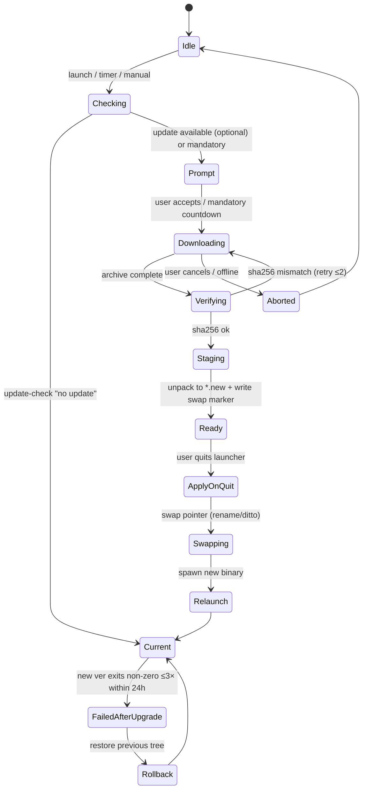
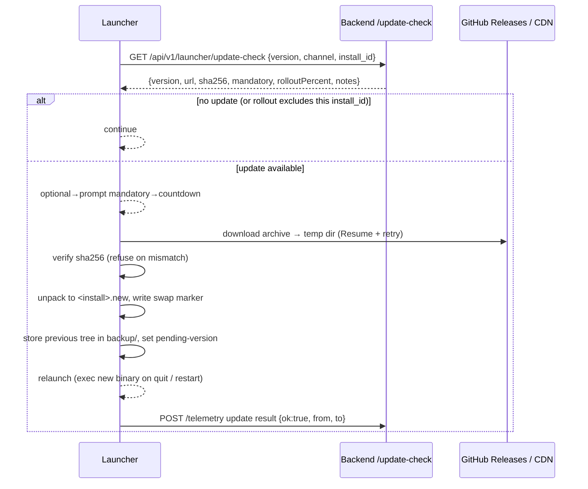

# 15 · Updating & Distribution

How Aethel binaries reach machines, how installers are generated and signed per OS, how the launcher
self-updates (`self_update`-style), and how bad releases are rolled back. The **installer stays small** —
Minecraft jars, runtimes and bundles are never embedded; they are fetched from Mojang/backend on demand
(05/07). `install_id + channel` telemetry lives in [14 · Telemetry](./14-telemetry.md).

## 1. Release artifacts per OS

| OS | Format | Notes |
|---|---|---|
| Windows | `Aethel-<ver>-x64-setup.exe` (NSIS) + portable `.zip` | per-user (HKCU) install, no admin; Wix/appx evaluated during M6 |
| macOS | `Aethel-<ver>-universal.dmg` (x64+arm64) at root: `Aethel.app` | ad-hoc codesign for dev; Developer ID + notarization for release |
| Linux | `Aethel-<ver>-x86_64.AppImage` + `Aethel-<ver>-x86_64.tar.gz` | `.deb` (amd64/arm64) planned v1.1; Flatpak considered post-GA |

- Build via GitHub Actions `release.yml` on `v*` tags; `cargo-dist`-style matrix; artifacts + `SHA256SUMS`
  + `update manifest` published to GitHub Releases behind a permissive CDN (Render/Cloudflare) or the
  backend bucket for non-GitHub mirrors.
- Bundle jars/runtimes are **not** shipped in the installer — they are fetched from the backend/Mojang on
  demand. Installer stays `< 15 MB`.

### 1.1 Install directory policy

| OS | Install dir | Upgrade atomicity | Permissions |
|---|---|---|---|
| Windows | `%LOCALAPPDATA%\Aethel\` (HKCU, no admin) | install to `Aethel.ver-prev` then swap with reflink/copy + rename | user |
| macOS | `/Applications/Aethel/` (or `~/Applications` per user) | `.app` is a dir: replace via `ditto` to `Aethel.app.new` then rename swap | sparkle-idiom |
| Linux | `~/.local/share/aethel/` (AppImage: self-mount) | tarball extracted to `app.new/` + symlink swap | user |

All platforms follow the same invariant: **write the new tree to a sibling directory, atomically swap the
pointer, keep the previous tree on disk for 7 days**. The running process never overwrites its own
executable — the *next* launch uses the swap pointer, exactly what `self_replace`-style crates model.



### 1.2 Update-check contract

`POST /api/v1/launcher/update-check` (see [09 · Backend](./09-backend.md)):

```jsonc
{
  "current": "1.4.2",
  "channel": "stable",
  "check": {
    "update": true,
    "version": "1.5.0",
    "url": "https://cdn.../Aethel-1.5.0-x86_64.AppImage",
    "sha256": "9f86d081…",
    "size": 14_284_911,
    "mandatory": false,
    "notes": "Fixes Vulkan fallback on Intel iGPUs",
    "publishedAt": "2026-09-18T00:00Z",
    "rolloutPercent": 25
  }
}
```

Client behaviour by `mandatory` + `rolloutPercent`:

- **optional** → badge + "Update available" row in Settings; user-triggered.
- **mandatory** → countdown (30 s) overlay; the update downloads in background first so the swap is
  instant; channel `stable` cannot opt out of security patches.
- **rolloutPercent < 100** → launcher hashes `install_id` into the 0–99 space and only offers the update
  if `hash % 100 < rolloutPercent` (deterministic A/B, no server-side session needed).

```rust
// crates/launcher-core/src/update/policy.rs
pub struct UpdatePolicy {
    pub channel: Channel,
    pub current: Version,
    pub install_id: Uuid,
}

impl UpdatePolicy {
    /// Deterministic A/B rollout: the same install always lands on the same side
    /// of the threshold, so a given machine either sees an update or never sees it.
    pub fn rollout_includes(&self, rollout_percent: u8) -> bool {
        let bucket = u64::from_le_bytes(*self.install_id.as_bytes()[..8].try_from().unwrap()) % 100;
        bucket < u64::from(rollout_percent.min(100))
    }

    pub fn allow(&self, offered: &Version, max: Option<&Version>) -> bool {
        // channel already filtered server-side; here we guard against
        // forward-downgrades across majors (see §4).
        self.current.major() == offered.major()
            || max.is_some_and(|m| offered <= m)
    }
}
```

## 2. Auto-update (self_update)



- `self_update`-style manifest backend; `channel` (stable/beta/nightly from Settings, see §5) filters
  `version`; the backend never serves an older major to a newer client (server-side guard).
- Archive is the **same artifact** the installer would install; the updater reuses the platform "swap"
  routine, so installer and updater can never disagree about layout.
- Download uses the shared downloader (05 §3.2): `Range` resume, retries, progress surfaced on the
  Settings row.
- Verifies `sha256` **before** acting and refuses mismatched payloads; a mismatch is treated as a supply
  chain event (alert, [13 · Security](./13-security.md)) and the old package is purged.

### 2.1 Update manifest schema (what CI publishes)

```jsonc
{
  "schema": 1,
  "product": "aethel",
  "platforms": {
    "windows-x64":  { "artifact": "Aethel-1.5.0-x64-setup.exe", "url": "…", "sha256": "…", "size": 14_210_000 },
    "windows-x64-portable": { "url": "…/Aethel-1.5.0-x64.zip", "sha256": "…", "size": 9_100_000 },
    "macos-universal":      { "url": "…/Aethel-1.5.0-universal.dmg", "sha256": "…", "size": 21_300_000 },
    "linux-x86_64":    { "url": "…/Aethel-1.5.0-x86_64.AppImage", "sha256": "…", "size": 17_900_000 },
    "linux-x86_64-tar": { "url": "…/Aethel-1.5.0-x86_64.tar.gz", "sha256": "…", "size": 11_200_000 }
  }
}
```

CI (`release.yml`) generates this from the built artifacts, uploads GH release, then POSTs the manifest
URL to the backend `update-check` table so `GET /launcher/update-check` is DB-backed with a CDN file URL.

### 2.2 Swap routine (shared by installer + updater, pseudo-script)

```sh
# install-tree-helper.sh — POSIX core the Rust updater drives via `cmd` subprocess
# Invariants: never modify the live tree in place; always sibling + rename.

set -eu
APP_HOME="${1:?app home}"
NEW_TREE="${APP_HOME}/app.$$"          # unpack target (temp, same filesystem)
BACKUP="${APP_HOME}/backup"            # previous run kept 7 days

# 1. unpack (tarball) to NEW_TREE
mkdir "${NEW_TREE}"
tar -xzf "$2" -C "${NEW_TREE}"

# 2. sanity: the payload carries a marker file with the expected version + sha
test -f "${NEW_TREE}/.aethel-version"
grep -qx "$3" "${NEW_TREE}/.aethel-version"   # abort on mismatch

# 3. swap: move the live tree aside, promote the new one
if [ -d "${APP_HOME}/app" ]; then
  rm -rf "${BACKUP}.old"
  mv "${APP_HOME}/app" "${BACKUP}"        # becomes rollback source
fi
mv "${NEW_TREE}" "${APP_HOME}/app"

# 4. pointer: `app` is now the real install dir; relink the platform symlink
ln -sfn "${APP_HOME}/app/aethel" "${APP_HOME}/aethel"
printf '%s\n' "$3" > "${APP_HOME}/pending-version"   # cleared by the new process on ready

# 5. prune backups older than 7 days
find "${APP_HOME}" -maxdepth 1 -name 'backup*' -mtime +7 -exec rm -rf {} +
```

Windows uses the same steps backed by `xcopy /s /e /h /q` into `Aethel.<ver>` then `move` swap (atomic
on the same volume); macOS uses `ditto` which preserves exec flags + symlinks inside `.app`. The Rust
layer wraps whichever primitive and treats any nonzero exit as a failed swap (old tree stays live).

### 2.3 Rust model (updater)

```rust
// crates/launcher-core/src/update/mod.rs
#[derive(Debug, Clone, Deserialize, Serialize)]
#[serde(rename_all = "camelCase")]
pub struct UpdateCheck {
    pub current: String,
    pub channel: Channel,
    pub check: Option<UpdateOffer>,
}

#[derive(Debug, Clone, Deserialize, Serialize)]
#[serde(rename_all = "camelCase")]
pub struct UpdateOffer {
    pub version: String,
    pub url: String,
    pub sha256: String,
    pub size: u64,
    pub mandatory: bool,
    pub notes: Option<String>,
    pub rollout_percent: u8,
    pub signed_by: Option<String>,   // minClient/maxClient exchange (see §4)
}

#[derive(Debug, Clone, Copy, Default, Deserialize, Serialize, PartialEq, Eq)]
#[serde(rename_all = "lowercase")]
pub enum Channel { #[default] Stable, Beta, Nightly }

pub enum UpdateAction {
    UpToDate,
    Offer(UpdateOffer),      // non-mandatory, rollout-included
    Mandatory(UpdateOffer),  // force after countdown
    Refused(UpdateRefusal),  // MajorGate | ChannelMismatch | AlreadyPending
}

pub async fn check_for_update(state: &AppState) -> Result<UpdateAction, UpdateError> {
    let resp = state.client
        .post(format!("{}/api/v1/launcher/update-check", state.api_base))
        .json(&UpdateCheck { current: env!("CARGO_PKG_VERSION").into(), channel: state.settings.channel })
        .send().await?;
    apply_rollout_and_policy(resp.json::<UpdateCheck>().await?)
}
```

`update-check` failures are **non-fatal**: a 4xx/5xx or offline state resolves to `UpToDate` with a
cached `last-gated-version`, so a dead backend can never wedge launches (matches 02 §6 failure table).

### 2.4 Telemetry of updates

| Event | Payload | Purpose (14) |
|---|---|---|
| `update_offered` | `{from,to,channel,mandatory,rollout}` | funnel for release sanity |
| `update_started` | `{from,to,size}` | track download health |
| `update_result` | `{from,to,ok,errorClass}` | success/rollback attribution |
| `update_rolled_back` | `{from,to,reason:"3-crash"}` | auto-rollback alert |

## 3. Signing & verification

| OS | Dev | Release | Notes |
|---|---|---|---|
| Windows | unsigned | EV/OV code-sign cert (purchase) | required to avoid SmartScreen; NSIS builds signed via `signtool` |
| macOS | ad-hoc `codesign -s -` | Developer ID Application + `notarytool` + staple | hardened runtime on; universal binary (x86_64+arm64) |
| Linux | none (checksum only) | AppImage detached sig (optional) + all `SHA256SUMS` | PGP ASCII-detached optional |

- Artifacts ship `SHA256SUMS` (+ ASCII-detached PGP); the launcher's updater validates `sha256` itself
  (never trusts the downloaded file's own metadata).
- macOS notarization ticket is **stapled** so offline machines still pass Gatekeeper (`xcrun stapler staple`).
- Windows SmartScreen notes: per-user HKCU layout + valid signature avoid most warnings; unsigned dev
  builds show the expected "Unknown publisher" which is fine pre-GA.
- Apple notarization and Windows signing happen in CI (`release.yml`) with secrets in the repo's GitHub
  environment, never in the Docker image.

```sh
# packaging/windows-sign.sh (run inside `release.yml`, cert from GH secrets)
# 1) demonstrate integrity: signtool verify the NSIS exe after build
signtool verify /pa "${ARTIFACT}"   || exit 1
# 2) sign installer + portable zip payload in a single batch
signtool sign /fd SHA256 /tr http://timestamp.digicert.com /td SHA256 \
  /a "${ARTIFACT}" "${PORTABLE_ZIP}" \
  && signtool verify /pa /v "${ARTIFACT}"
```

```sh
# packaging/macos-notarize.sh
codesign --force --options runtime --timestamp --deep \
  --sign "${DEV_ID_APPLICATION}" "${AETHEL_APP}"
ditto -c -k --keepParent "${AETHEL_APP}" "${AETHEL_APP}.zip"
xcrun notarytool submit "${AETHEL_APP}.zip" \
  --apple-id "${APPLE_ID}" --team-id "${APPLE_TEAM_ID}" \
  --password "${APPLE_APP_SPECIFIC_PASSWORD}" --wait
xcrun stapler staple "${AETHEL_APP}"
hdiutil create -volname "Aethel ${VER}" -srcfolder "${AETHEL_APP}" \
  -ov -format UDZO "${DMG}"
xcrun stapler staple "${DMG}"
```

### 3.1 CI release matrix (`release.yml`)

```yaml
name: release
on:
  push: { tags: ['v*'] }
env:
  CARGO_TERM_COLOR: always
jobs:
  build:
    strategy:
      matrix:
        include:
          - os: windows-latest
            target: x86_64-pc-windows-msvc
            artifact: Aethel-${{ github.ref_name }}-x64-setup.exe
            sign: true
          - os: macos-14
            target: x86_64-apple-darwin
            artifact: Aethel-${{ github.ref_name }}-universal.dmg
            sign: true
          - os: macos-14
            target: aarch64-apple-darwin
            arm-only: true
          - os: ubuntu-latest
            target: x86_64-unknown-linux-gnu
            artifact: Aethel-${{ github.ref_name }}-x86_64.AppImage
    steps:
      - uses: actions/checkout@v4
      - uses: dtolnay/rust-toolchain@stable
        with: { target: ${{ matrix.target }} }
      - run: cargo build --release --target ${{ matrix.target }}
      - run: packaging/build-${RUNNER_OS}.sh      # NSIS / dmg+notary / AppImage
        env:
          APPLE_ID: ${{ secrets.APPLE_ID }}
          APPLE_TEAM_ID: ${{ secrets.APPLE_TEAM_ID }}
          WINDOWS_CERT: ${{ secrets.WINDOWS_CERT }}
      - run: sha256sum Aethel-${{ github.ref_name }}* > SHA256SUMS
      - uses: softprops/action-gh-release@v2
        with:
          files: 'Aethel-*;SHA256SUMS;update-manifest.json'
          generate_release_notes: true
```

### 3.2 Build provenance (`cargo-dist` vs hand-rolled)

- v1 uses **hand-rolled `packaging/` scripts** (three small per-OS scripts + the shared swap helper)
  because the project needs signed + notarized + stapled artifacts and the HKCU Windows layout — each a
  known `cargo-dist` gap unless extra steps are added.
- `cargo-dist` may become the orchestrator later; the swap helper and manifest schema are kept
  orchestrator-agnostic so the backend contract never changes.
- Every release **records provenance** in the update manifest: `{ commit, trigger, builtBy: "gha", runner }`.

### 3.3 Reproducible build container

Artifacts are built inside a pinned container so local and CI produce byte-identical binaries:

```dockerfile
FROM rust:1.8x-bookworm AS build
RUN apt-get update && apt-get install -y --no-install-recommends \
    build-essential pkg-config libssl-dev libxcb1-dev libxcb-shape0-dev \
    libxcb-xfixes0-dev libxkbcommon-dev libgtk-3-dev libwebkit2gtk-4.1-dev \
    clang mold zip unzip && rm -rf /var/lib/apt/lists/*
WORKDIR /src
COPY . .
# reproducible: fixed rust-toolchain.toml, `--remap-path-prefix`, deterministic ar
RUN cargo build --release --locked
RUN sha256sum target/release/aethel > /src/build-version.sha
```

- CI runs `docker build --cache-from …` for the **Linux** target; Windows/macOS are native runners and
  only pin the exact `rust-toolchain.toml` (17 §M0) + a lockfile (`--locked`) to reduce drift.
- The container itself is tagged `aethel/build:bookworm-rust<ver>` — bump = documented toolchain change,
  never silent.
- Determinism checks run in a `repro` job: two identical tags built twice → `cmp` of build-version.sha.

## 4. Versioning

- SemVer `MAJOR.MINOR.PATCH` (+`-beta.N`, +`-nightly.YYYYMMDDHHMM`).
- Bundle versions are separate (per MC version) so mod-set updates hot-swap without launcher release —
  a bundle bump is a backend-manifest change, not a launcher update (07 §3.1).
- Compatibility matrix: a `1.y` client will refuse a `2.y` **updater payload** unless a migration shim
  is declared in the manifest (`minClient`/`maxClient` fields), preventing accidental forward-downgrades.
- Telemetry stores `launcher_version + channel` for every event so support can bisect on version (14).

| Major bump | Breaking change? | `minClient` rule | Example |
|---|---|---|---|
| `MAJOR+0.MINOR+0.PATCH+1` | no | any ≥ same major | `1.4.2 → 1.4.3` |
| `MAJOR+0.MINOR+1` | no (features) | same major | `1.4.3 → 1.5.0` |
| `MAJOR+0.MINOR+0-beta.N` | maybe | same major, beta allowed | `1.5.0-beta.1` |
| `MAJOR+1` | yes | migration shim required | `1.5.0 → 2.0.0` (blocked until shim declared) |

## 5. Update channels

| Channel | Who | Behaviour |
|---|---|---|
| stable | default | manifest `channel=stable`, 1–2 week lag after beta soak |
| beta | opt-in | `channel=beta`, newer crates; same binaries promoted shortly after |
| nightly | opt-in (devs / testers) | every successful CI commit to `main`; unsigned, no notarization; may break |

- Channel is stored in `config.toml`; switching is a Settings row (`08`), switching **up** a channel is
  immediate, switching **down** is allowed only to the newest release of the lower channel (rollback
  follows the same rule).
- The backend rejects a request whose `version` is newer than what `channel` allows.

### 5.1 Channel transitions

| From → To | Allowed | Notes |
|---|---|---|
| stable → beta | yes | immediate |
| stable → nightly | yes | dev/test only, UI warns "unstable builds" |
| beta → stable | yes | takes newest stable; beta backup kept 7 d |
| nightly → beta/stable | yes | takes newest of target channel |
| any → downgrade within same channel | no | update tends upward only; manual full install for downgrades |

## 6. Rollout & rollback

- Slow roll via manifest (phase %0→100 by version, folded into `rolloutPercent`, see §1.2) for major
  changes; watchdog re-checks each launch — a client that crossed over the threshold previously will
  also see it now (idempotent).
- Keep previous binary in `backup/` for **7 days**; "Restore previous version" button on Settings
  (08 Settings → General). Restore follows the same swap semantics: copy old tree → swap → relaunch.
- Rollback trigger is automatic: if the **new** launcher exits non-zero within 3 runs × 24 h
  (crash early-boot), the next launch auto-restores the previous version and shows a one-time notice.
- The update job writes `pending-version` before swap and clears it after the new process reports
  `ready` over the boot channel (see telemetry `update result` events, 14).

### 6.1 Upgrade failure matrix

| Failure | Detection | Behaviour | User-facing |
|---|---|---|---|
| sha256 mismatch at download | verify before apply | refuse, purge, retry once, then keep current | "Download corrupted — retry" |
| Disk full during staging | `fs::write` ENOSPC | abort swap, keep old tree | warning + cleanup hint |
| Swap rename fails (AV) | rename error | retry after 2 s; then keep old | "Update blocked — try again" |
| New version crashes early | exit-code watchdog | auto-rollback to `backup/` after 3 bad starts | "Update rolled back" |
| Downstream breakage (bundle backward-incompatible) | client refuses bundle | stop at update-check; manifest `minClient` blocks | "Launcher requires restart" |
| Offline during renew of mandatory | countdown stalls | keep current; mark "pending" | banner re-checks next launch |
| Signature/notarization absent | platform gate (macOS Gatekeeper, Windows SmartScreen) | user may still install dev builds; release must be signed | expected OS dialog |
| Payload missing marker file (`.aethel-version`) | swap helper `test -f` | abort swap; old tree live | "Package invalid" |
| Backup dir unwritable | swap helper `mv` fails | reachable tree falls back to `backup.{ts}` | none (logged) |
| Update completes but bundle CDN is dead | post-update health check | version change fine; instances warn about bundle only | badge only |

## 7. Edge cases

| Case | Handling |
|---|---|
| Two instances of Aethel running during an update | single-instance lock (13 §4) refuses the second; update only initiated by first |
| User deletes `backup/` before 7 days | rollback opportunity gone; next update writes fresh backup |
| Install dir permissions broken (mac/Linux) | fall back to `~/Applications` / `~/.local/share/aethel`; surfaced in Settings |
| AppImage on a read-only mount | Flatpak/tarball install path selected instead; detect at first run |
| Windows uninstaller removes `%LOCALAPPDATA%` | we never touch user data in the uninstaller; instances live in `%APPDATA%/aethel` |
| Beta user downgrades to stable | fresh beta backup kept 7 days separate from stable backup |
| Machine offline at swap moment | swap is local-only; the countdown just postpones |
| Mandatory update published days before vacation (offline user) | pending flag persists; updates on first reconnect |
| Signing cert expires mid-week | release blocked until re-key; update-check marks cert status in notes |
| Corporate proxy blocks CDN but not API | download retries honor proxy env; falls back to GH releases mirror |
| Existing install is older than one full backup window | updater performs a **full** re-install-in-place instead of swap | preserves data dirs, swaps only binaries |
| Two different channels point at the same version | manifest stubs deduplicate identical `sha256` | single download, telemetry reports channel |
| Update interrupts the first launch of a fresh install | bootstrap runs before any update (splash) | update only offered after first successful boot |

## 8. Rollout playbook

1. Tag `v1.5.0` → `release.yml` builds + signs + notarizes all four platforms.
2. Manifest published with `rolloutPercent: 5`, `channel: beta`. Beta group gives feedback (14 funnels).
3. Watch `update_result` error-rate and `update_rolled_back` counts (alert thresholds in 09 §7).
4. Day 2: `rolloutPercent: 25` on stable; Day 5: `50`; Day 7–10: `100`.
5. A mandatory/hotfix path is always available: `mandatory: true` bypasses rollout for security fixes.
6. If error-rate > 1% or rollback-rate > 0.5%: set `rolloutPercent: 0` (people stuck on previous) and
   publish a hotfix; nightly already carries the fix.

## 9. Acceptance criteria (checklist)

- [ ] `release.yml` on tag produces signed Windows exe, notarized+stapled macOS dmg, Linux AppImage + tar.gz, all with `SHA256SUMS` and a valid `update-manifest.json`.
- [ ] Fresh install on all 3 OS without admin; installer < 15 MB; HKCU-only on Windows.
- [ ] Self-update: optional flow, mandatory countdown flow, beta/nightly channels, rollout gate by `install_id`.
- [ ] sha256 mismatch is refused and the binary stays on the current version.
- [ ] Auto-rollback triggers on 3 early crashes of the new version within 24 h and restores `backup/`.
- [ ] Bundle updates flow independently of launcher version (07 §3.1) with no launcher restart required.
- [ ] Uninstaller leaves instances/data intact; re-install over existing layout preserves `config.toml`.
- [ ] `pending-version` is cleared on first successful `ready`; stale pending is used as rollback trigger.
- [ ] The produced `update-manifest.json` parses with the same serde types as the updater (golden test, 16).