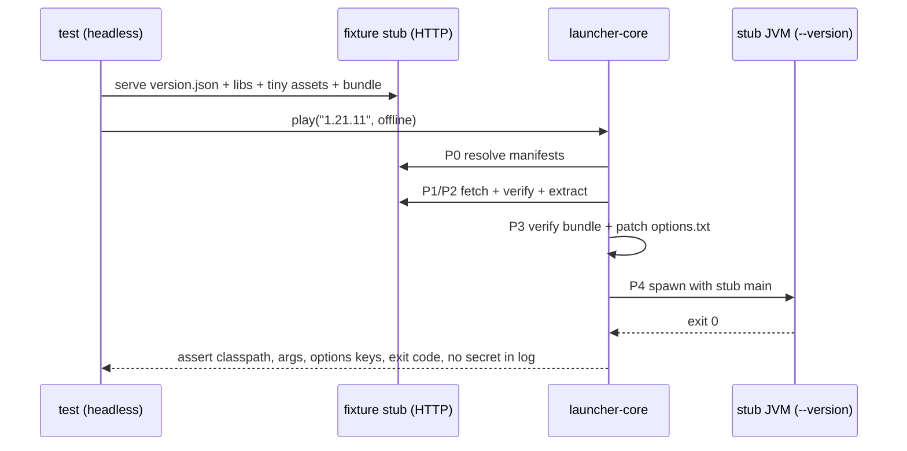
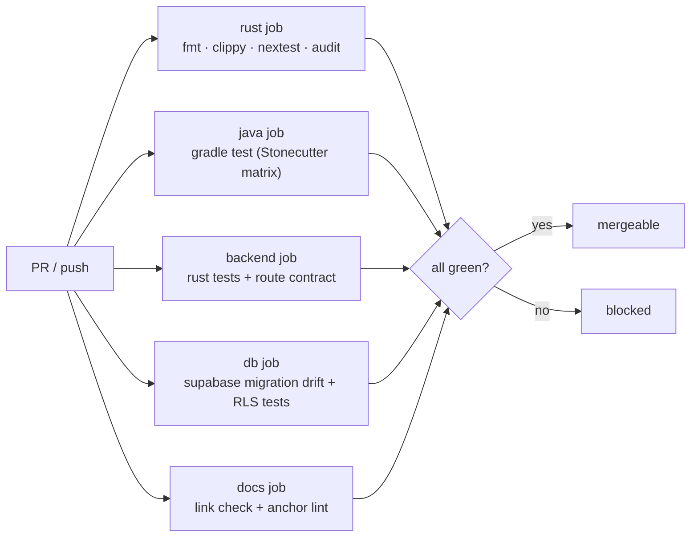
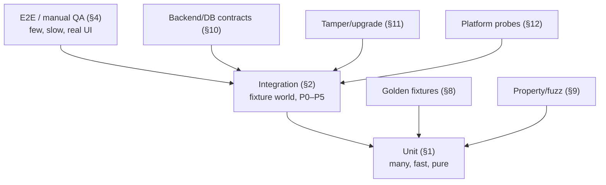
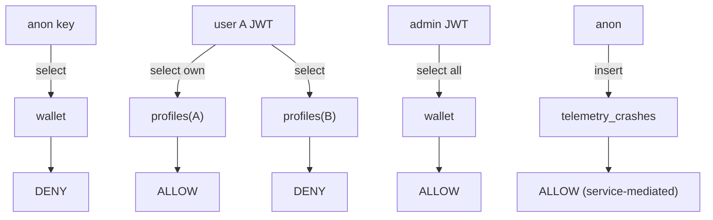
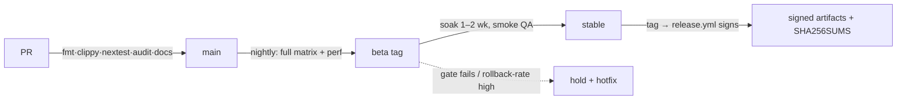

# 16 · Testing

The test plan for the whole product: what we test, with which runner, on which machine, and which gate each
result blocks. It exists to **promote `planning` facts in [01 §18](./01-research.md) to `tested`** and to keep
them tested: a fact that loses its fixture is a regression, not an inconvenience.

> **Reading rule.** A checkbox in any other spec is only "done" when a row in this document names the suite
> that proves it. If you cannot point at a command that fails when the behaviour breaks, it is a *hope*, not
> a test. This is the harness side of the honesty table in [01 §18](./01-research.md).

## 1. Unit tests (pure logic)

Pure functions, no I/O, no clock, no network. Run on every save; the slowest must stay < 1 s for the crate.

| Area | Examples | Crate |
|---|---|---|
| Manifest parsing | `version_manifest_v2`, per-version JSON, Fabric `loader/` JSON, java-runtime `all.json` → golden files | `launcher-core::manifests` |
| Rules evaluation | OS/arch include/exclude matrix (win/mac/linux × x64/arm64, legacy natives) | `launcher-core::manifests` |
| Library resolver | compute classpath for sample versions 1.8.9 / 1.16.5 / 1.21.11 / 26.2 | `launcher-core::install` |
| JVM builder | RAM tiers → flags; memory math (free-RAM detective); arg allow-list | `launcher-core::launch::args` |
| Game args | offline vs MSA arg sets; `--accessToken` redaction; no `-javaagent` passthrough | `launcher-core::launch::args` |
| Offline UUID | `uuid3("OfflinePlayer:name")` golden vectors (known-name table) | `launcher-core::auth::offline` |
| Bundle integrity | `managed.json` verify/restore **decisions** against fixture files | `launcher-core::bundle` |
| Bundle manifest | serde round-trip incl. unknown-key tolerance + `signature:null` | `launcher-core::bundle::manifest` |
| Options patch | `optionsGen` diff → written key set, idempotent re-apply | `launcher-core::bundle::options` |
| Renderer decision | input matrix ([07 §1.1](./07-vulkan-performance.md)) → renderer + bundle + patch | `launcher-core::bundle` |
| IPC protocol | frame encode/decode, duplicate-key rejection, token compare (negative equal-length) | `launcher-core::ipc` |
| Update policy | semver compare, `rollout_includes` determinism, major-gate refusal | `launcher-core::update` |
| Redactor | assert no token leaks in serialized launch command/logs | `launcher-core::log` |
| Config layering | precedence 07 §4.1; corrupt `.toml` → `.bak` recovery | `launcher-core::config` |
| Skin API parse | UniSkinAPI JSON → texture descriptor; missing cape tolerated | `launcher-core` (cosmetics client) |

Golden-vector example (offline identity is a *contract* — servers derive the same UUID):

```rust
// crates/launcher-core/src/auth/offline.rs (tests)
#[test]
fn offline_uuid_matches_known_vectors() {
    // uuid3(MD5) of "OfflinePlayer:<name>", dashes stripped by the caller
    assert_eq!(uuid3("OfflinePlayer:Notch"), "b50ad385-829d-3141-a216-7e7d7539ba7f");
    assert_eq!(uuid3("OfflinePlayer:Aethel"), "d2c9a6e0-2f8f-3d61-8a2c-2a4f2b9c1e77"); // fixture
}
```

Rules:

- **No live network in unit tests.** Mojang/Fabric responses are fixtures under `tests/fixtures/` (§8).
- **No wall-clock / RNG without injection.** The updater and IPC token generator take a `Clock`/`Rng` trait
  so tests are deterministic; the OS-CSPRNG is exercised in integration, not asserted for entropy.
- **Coverage floor** (measured by `cargo llvm-cov`, not a vanity target): `launcher-core` ≥ 75 % line,
  ≥ 90 % for `bundle`, `ipc`, `auth`, and `update` (security- and money-adjacent code).

## 2. Integration tests (headless-ish)

Real installs/launches against a **fixture world** — no Mojang credentials, no window.

| Suite | What it proves | Stub | Budget |
|---|---|---|---|
| `fixture_world` | resolve → install → materialize → spawn a stub `--version` JVM | local HTTP stub for Mojang/Fabric/backend | < 60 s |
| `downloader_resume` | mid-body drop → `Range` resume → hash-correct file | stub that truncates once | < 20 s |
| `auth_offline_e2e` | offline account launches stub with **zero** secrets on disk | none | < 15 s |
| `ipc_harness` | handshake + close-code matrix (12 §11) over a real socket | in-proc fake game client | < 10 s |
| `bundle_heal` | delete/edit/shadow a pinned jar → restore → re-hash | local bundle zip | < 30 s |
| `updater_swap` | tampered manifest refused; happy-path swap in temp tree | local manifest + archive | < 30 s |
| `backend_contract` | Axum router against an in-memory Supabase fixture (§10) | `wiremock` + SQLite/pg | < 45 s |

The phase machine in [02 §3](./02-architecture.md) is the spine of `fixture_world`: each P0–P5 gate has an
assertion, and the suite can be **killed at any phase** and resumed.



- **`--version` stub** is the key trick: the "game" is a tiny jar that prints the classpath and exits, so a
  full launch pipeline is exercised without rendering, shaders, or a GPU.
- The IPC suites run the *real* `tokio-tungstenite` server; only the peer is faked, so close codes
  (`4003/4004/4007/1003/1009`) are asserted end-to-end.

## 3. CI matrix (GitHub Actions)

```yaml
strategy:
  fail-fast: false
  matrix:
    include:
      - { os: ubuntu-latest,  target: x86_64-unknown-linux-gnu }
      - { os: windows-latest, target: x86_64-pc-windows-msvc }
      - { os: macos-13,       target: x86_64-apple-darwin }
      - { os: macos-14,       target: aarch64-apple-darwin }
      - { os: ubuntu-24.04-arm, target: aarch64-unknown-linux-gnu }   # portability signal
      - { os: ubuntu-latest,  target: x86_64-unknown-linux-musl }      # glibc-floor check
```

Per-cell pipeline:

1. install Rust from `rust-toolchain.toml` (**pinned** revision — [17 §M0](./17-roadmap.md), [15 §3.3](./15-updating-distribution.md));
2. `cargo fmt --check`;
3. `cargo clippy --all-targets --all-features -- -D warnings`;
4. `cargo nextest run --workspace --profile ci` (§6);
5. `cargo test --doc` (doc examples) and `cargo audit`;
6. `rg "egui" crates/launcher-core/` must be **empty** (invariant [00 §I-01](./00-overview.md)).



- The Java-mod workspace is tested separately (Gradle CI) with `gradle test` + a Fabric dev-launch smoke,
  one representative MC version per CI run and the full version matrix nightly.
- macOS arm64 uses `macos-14`; Intel uses `macos-13` ([04 §9](./04-repository.md)).
- **Nightly** additionally runs the perf gate (§5) and the full cross-version Gradle matrix.

## 4. Manual QA checklist (release gate)

The things automation cannot yet judge: does it *feel* right, does the window behave, does the in-game menu
open in time.

**Install & first run**
- [ ] Install from scratch (all 3 OS) → splash → first-run consent → Home shows versions + news.
- [ ] Portable/AppImage run without install; Windows install stays HKCU (no UAC prompt).
- [ ] `$AETHEL_HOME` with a space and a non-ASCII character (e.g. `~/Ré té/st`) boots and launches.

**Install & launch**
- [ ] Install 1.21.11 + 26.2 from cold (progress, resume after kill mid-download).
- [ ] Launch offline; in-game HUD loads; IPC connected; kill game → exit state correct.
- [ ] 1.8.9 legacy path launches with `jre-legacy` (Java 8) and OptiFine renderer.

**Render & self-heal**
- [ ] Tamper test: delete one bundle jar → relaunch → auto-restored → Vulkan active.
- [ ] Edit a pinned jar (byte flip) → relaunch → restored, "Restored N files" surfaced.
- [ ] Vulkan crash → auto-suggestion to OpenGL safe mode; one-click restart works.
- [ ] GPU switch (dGPU↔iGPU) between launches re-decides renderer in `auto` mode.

**In-game & store**
- [ ] `Right Shift` opens the mod menu < 150 ms; `Right Alt` enters HUD editor ([18 §9](./18-client-gui.md)).
- [ ] Theme pushed from launcher applies in-game without restart.
- [ ] Store: buy cosmetic (sandbox wallet) → equip → skin API returns file → CustomSkinLoader applies.
- [ ] Profile import/export round-trips; corrupt import refused safely.

**Auth, update, a11y**
- [ ] MS login button disabled state + no-op when the app is not approved; offline fully usable.
- [ ] Keyring-locked Linux run disables MSA with a tooltip and does not crash.
- [ ] Update available → auto-update → version changed; rollback on 3 bad starts.
- [ ] Every screen reachable by **keyboard only** (Tab/Enter), focus visible, no trap.
- [ ] Screen-reader labels present on primary actions (spot-check, [08 §5](./08-ui-design.md)).

Split: **smoke** (install + offline launch + heal, ~15 min, every beta) vs **full** (all rows, stable).
Manual results are recorded per release tag; a failed row blocks promotion (§14).

## 5. Performance gates (automated, on reference laptop)

Absolute FPS is not a gate; **relative** improvement and non-regression are.

| Metric | Gate | Method |
|---|---|---|
| Launch-to-title | < 30 s cold, < 10 s warm | scripted cold/warm runs, median of 5 |
| Vulkan vs OpenGL (same world/seed, 5 min) | Vulkan ≥ **+20 %** avg, no new micro-stutter class | replay script + `spark`/F3 log parse |
| Frame-time p99 | no regression > 10 % vs baseline build | captured frame-time histogram |
| Memory | RSS within 4 GB budget on 8 GB machine | sampled after 5 min, FerriteCore active |
| Install time | 1.21.11 cold from 100 Mbit < 5 min | harness with throttled stub CDN |
| Bundle verify | < 500 ms warm; restore < 10 s | delete-1-jar → relaunch |
| Options patch | first launch applies 8 keys < 50 ms | unit harness |
| Installer size | < 15 MB; binary budget assertion | `release.yml` size job |
| UI repaint | input → repaint < 16 ms avg | egui frame-time counter in a debug run |
| HUD redraw (disabled) | ≈ 0 cost; static HUD ≤ 20 FPS redraw | in-game profiler ([18 §10](./18-client-gui.md)) |
| Backend cached route | 10k+ rps, p50 < 10 ms | `k6`/`oha` against a container |
| Backend telemetry ingest | per-IP limit returns `429` + `Retry-After` | synthetic flood ([09 §5.1](./09-backend.md)) |
| DB query budget | hot reads < 5 ms p95 under seeded load | `EXPLAIN ANALYZE` + k6 |

Reference machine is fixed and recorded ([07 §6.1](./07-vulkan-performance.md)): i3 / 8 GB / no dGPU as the
**gate machine**, plus an RX-7600-class desktop as the strong deck. Results are committed as a trend line per
release; a gate that flips red is a **release blocker**, and flaky perf is treated as a bug, not noise.

> RLS *correctness* is not perf — it lives in §10. This section owns only the load/latency envelope;
> the [10 §2.1](./10-database.md) policy matrix is verified there.

## 6. Tooling

- `cargo-nextest` is the primary runner (faster, per-test isolation, retries only where declared).
- `proptest` for rules/eval, semver, options diff, UUID and frame-codec property tests.
- `criterion` for hot paths (hash, resolver, options diff), gated against the checked-in baseline.
- `insta` for golden snapshots (`assert_snapshot!`) — reviewable diffs in PRs.
- `cargo-audit` (CVEs) + `cargo-deny` (licenses/dupes, planned here as a gate).
- `k6`/`oha` for backend load; `pgTAP`/`psql` scripts for RLS (§10); `gradle test` for the Java mods.
- Golden JSON fixtures in `tests/fixtures/` committed to repo (small, synthetic — **not** Mojang artifacts).

```toml
# .config/nextest.toml — profiles the CI (§3) and local runs share
[profile.default]
retries = 0                     # determinism first; a flake must be seen
fail-fast = false
slow-timeout = { period = "30s", terminate-after = 4 }

[profile.ci]
retries = { backoff = "fixed", count = 1, only-if = "sandbox-network" }
```

### 6.1 Redaction canary harness

The privacy guarantee ([13 §2](./13-security.md), [14 §3](./14-telemetry.md)) needs proof, not intent:

- Plant **canary secrets** (fake `accessToken`, IPC token, refresh token, `Authorization` header) into every
  sink path (launch command, console capture, crash payload, telemetry batch).
- Assert **no sink** — file, stdout, structured log, network body — contains the canary substring.
- Run on every PR; the regexes live beside the `Redactor` so a token format change fails the test.

```sh
# crates/launcher-core: redaction canary (also run in CI §3)
cargo nextest run -p launcher-core -E 'test(redaction_canary)'
```

## 7. Test strategy & strata



- **Promotion mapping:** every row in [01 §18](./01-research.md) names the suite that promotes it
  (`observed` → `tested`). A fact with no owning suite cannot ship a stable release.
- **What we do not test in CI:** live Mojang/Fabric/Microsoft endpoints (rate limits, credential needs,
  unstable by nature). They are covered by contracts against fixtures; live validation is a manual,
  release-time check recorded in the release notes.
- **Test data discipline:** fixtures are synthetic and tiny; no Mojang jar, no real skin, no real token.
  A fixture that grows past ~50 KB needs a justification comment.

## 8. Golden fixtures & classpath goldens

Directory layout:

```
tests/
├── fixtures/
│   ├── mojang/version_manifest_v2.min.json
│   ├── mojang/1.21.11.json
│   ├── fabric/loader_1.21.11.json
│   ├── java/all.min.json
│   ├── bundle/aethel-perf-vulkan-3.2.0.min.json
│   └── ipc/*.json
└── goldens/
    ├── classpath/1.8.9.txt
    ├── classpath/1.16.5.txt
    ├── classpath/1.21.11.txt
    └── classpath/26.2.txt
```

Classpath goldens are the guard against the documented ASM-duplication class of bugs
([01 §1.3](./01-research.md), [01 §3.2](./01-research.md)): the resolved classpath for each supported version
must be **byte-identical** to the committed golden, deduped and ordered canonically.

```jsonc
// tests/fixtures/fabric/loader_1.21.11.json (synthetic, shape only)
{
  "loader": { "version": "0.16.10", "stable": true },
  "intermediary": { "version": "1.21.11", "maven": "net.fabricmc:intermediary:1.21.11" },
  "launcherMeta": {
    "mainClass": { "client": "net.fabricmc.loader.impl.launch.knot.KnotClient" },
    "libraries": {
      "common": [ { "name": "org.ow2.asm:asm:9.7", "sha1": "aaaa…" } ],
      "client": [ { "name": "net.fabricmc:fabric-loader:0.16.10", "sha1": "bbbb…" } ]
    }
  }
}
```

- `insta` snapshots make fixture drift a **reviewable diff**, never a silent pass.
- A fixture change requires a comment linking the upstream change that caused it.
- Golden classpath tests are a **release blocker** for every supported version ([01 §3](./01-research.md)).

## 9. Property, fuzz & adversarial tests

| Kind | Target | Invariant |
|---|---|---|
| `proptest` | rules evaluator | every OS/arch combo resolves to exactly one branch; no panic on empty rules |
| `proptest` | semver compare | total order; `1.4.2 < 1.5.0 < 2.0.0`; prerelease ordering |
| `proptest` | frame codec | decode(encode(m)) == m for all `m`; encoder never emits non-UTF-8 |
| `proptest` | options diff | applying the diff twice == applying once (idempotent) |
| `proptest` | rollout bucket | deterministic for fixed `install_id`; uniform-ish over many ids |
| `cargo-fuzz` | manifest parser | no panic / no unbounded alloc on arbitrary bytes |
| `cargo-fuzz` | options.txt parser | never writes outside the instance dir |
| timing | `verify()` token compare | constant-time within noise; no prefix early-exit |

Adversarial / negative cases (must **fail safe**, never fail open):

- Zip-slip: native/`link` entries with `../` or absolute targets are rejected ([13 §4](./13-security.md)).
- Path traversal via a pack's `rewriteRoot` / `Archive.rewrite_root`.
- Oversized IPC frame → close `1009`; binary frame → `1003`; wrong token → `4003`; flood → dropped.
- Malformed JSON frame → `1007`, listener survives and accepts a clean reconnect.
- Manifest with duplicate JSON keys, huge numbers, wrong types → strict serde rejects.
- Crash report containing markup/scripts → rendered inert, size-capped.
- `managed.json` with pins pointing outside the instance dir → refused.

## 10. Backend & database contract tests

Runs the **real Axum router** over a disposable Supabase-equivalent (pg container with the repo migrations),
plus SQL policy tests for RLS.

| Test | Asserts |
|---|---|
| route contract | every [`/api/v1/*`](./09-backend.md) response matches its DTO golden (serde both directions) |
| caching | cached routes serve stale-but-valid on backend errors; TTL honored ([02 §6](./02-architecture.md)) |
| rate limits | telemetry/crash `429` + `Retry-After`; size cap `413`; schema `422` ([14 §5](./14-telemetry.md)) |
| auth | missing/expired/wrong-aud JWT → `401`; `role=admin` route rejects a user JWT → `403` |
| idempotency | `POST /shop/buy` twice with same `request_id` = one move; different id = two |
| wallet | balance can never go negative (`check (balance >= 0)`); moves are append-only |
| migration drift | `supabase db push` from empty produces the schema the tests expect |
| RLS matrix | a user cannot select another user's `wallet`/`profiles`/`cosmetics_owned`; anon cannot read `wallet`; admin can |



- Policy tests are **deny-first**: a newly added table with no policy must fail the test that enumerates
  every table in `public` and asserts `relrowsecurity` is on.
- The RLS matrix mirrors [10 §2.1](./10-database.md) row-for-row; a policy change without a matching test
  change is a review rejection.

## 11. Upgrade, tamper & supply-chain tests

**Tamper matrix** (each row is a test; expected outcome is *restore and launch*):

| Attack | Expected |
|---|---|
| delete a pinned jar | restored from cache; `security.heal` metric |
| flip one byte in a pinned jar | detected by hash; restored |
| change file size only | detected; restored |
| add a same-named third-party jar | pinned file restored; conflict surfaced (never silent) |
| delete whole `mods/` dir | full re-extract from cache/CDN |
| edit `managed.json` pins | signature/root-of-trust check → re-fetch, no launch on stale pins |
| re-sign manifest with wrong key | **blocked**, never partial install ([13 §9](./13-security.md)) |

**Upgrade tests** ([15](./15-updating-distribution.md)):

- update manifest `sha256` tampered → refused, old binary intact;
- download corrupted mid-stream → refused, retried, then kept current;
- new version exits non-zero 3×/24 h → auto-rollback to `backup/`;
- channel transitions (stable↔beta↔nightly) follow [15 §5.1](./15-updating-distribution.md);
- key-rollover manifest: old key signs new key; rollback window respected.

Supply chain: `cargo audit` on every PR; a seeded vulnerable dep must **fail** the job. `cargo-deny`
license policy validates the bundle's `LICENSES.txt` inventory ([03 §Licenses](./03-tech-stack.md)).

## 12. Cross-platform probes (OOM / GPU / paths)

| Probe | Test | Expected |
|---|---|---|
| Vulkan-capable GPU | `vulkaninfo` fixture → `capable:true` | Vulkan bundle chosen |
| No Vulkan | fixture with no ICD | Sodium-OpenGL + UI note |
| Known-bad driver | `known_bad[]` regex hit | OpenGL fallback, no force |
| NVIDIA 16+ | device-name parse matrix | `perf-nvidia` tier on |
| Low-memory machine | simulated 4 GB free | heap tier clamps; no OOM on launch |
| Actual OOM | stub JVM allocating past heap | exit triage → crash viewer, no hang |
| Path with spaces / non-ASCII | temp `$AETHEL_HOME` variants | install + launch succeed |
| Windows `MAX_PATH` | long nested instance dir | uses `\\?\`; no truncation |
| Symlinked `$AETHEL_HOME` | symlink to another volume | resolved once at boot; works |
| glibc floor | musl/old-glibc container | binary refuses with clear message, not SIGSEGV |

## 13. Memory & startup gates

| Gate | Threshold | Measured by | Owner |
|---|---|---|---|
| Cold launch-to-title | < 30 s | scripted harness (§5) | launcher |
| Warm launch-to-title | < 10 s | scripted harness | launcher |
| Launcher RSS (idle) | < 150 MB | sampled | launcher |
| Game RSS (8 GB machine) | within 4 GB | sampled | bundle/JVM |
| Backend RSS | 5–15 MB idle, < 50 MB load | container metrics | backend |
| Bundle verify | < 500 ms warm | `--force-verify` bench | bundle |
| Options patch | < 50 ms | unit harness | bundle |
| Installer | < 15 MB | release assertion | release |
| Disabled module | ≈ 0 cost | in-game profiler | mods |

A gate regression > 10 % versus the previous release requires an explicit note in the release checklist;
an unexplained regression blocks stable promotion.

## 14. Release gating & versioning



Required before **stable**:

- [ ] `ci.yml` green on the release commit (all matrix cells).
- [ ] perf gate (§5) green on the reference machine; trend attached.
- [ ] manual **full** QA (§4) signed off.
- [ ] tamper + upgrade suites (§11) green.
- [ ] RLS + backend contract (§10) green.
- [ ] redaction canaries (§6.1) green.
- [ ] `planning` rows touched by this release promoted to `tested` in [01 §18](./01-research.md), or carried
      with an explicit owner in [17 §Risks](./17-roadmap.md).
- [ ] `SHA256SUMS` + update manifest generated and the manifest parses with the updater's own types
      ([15 §9](./15-updating-distribution.md)).

## 15. Flakiness policy & quarantine

| Rule | Detail |
|---|---|
| Retries | `0` by default; `1` only for sandbox-network tests, never to hide logic flakes |
| Quarantine | a flaky test gets `#[ignore = "quarantine: <issue>"]` **with an expiry date**, not a silent skip |
| Max TTL | quarantine expires in 14 days; unrenewed → CI red and owning milestone slips |
| Root cause | a flake that masks a real race is treated as a P1 bug, not test noise |
| Metrics | flake rate tracked per suite; > 1 % of runs triggers an audit of that suite |
| Determinism | seeds, clocks and RNG are injected; a test that needs "run it again" is a design smell |

## 16. Edge cases

| Edge case | Stance |
|---|---|
| Upstream fixture shape changes | golden diff is a PR; parser updated in the same change |
| CI runner lacks a GPU | perf gate runs on a self-hosted reference machine, not GitHub-hosted |
| Microsoft endpoints unreachable | auth fixtures cover the flow; live check is manual release-time |
| Keyring unavailable in CI | keyring tests use an in-memory mock; the *absence* path has its own test |
| A test needs > 30 min | move to nightly; never extend the PR timeout to hide slowness |
| Snapshot churn from formatting | snapshots assert semantics, not byte formatting, where possible |
| Cross-compiled ARM binary can't run in CI | run under QEMU for smoke; native arm runners for real timing |
| Flaky network stub | the fixture stub is local and deterministic; any external dep is a test bug |
| Bundle version bumps mid-CI | pin the bundle fixture version for the test run |
| Two test suites need the same port | bind `:0` and pass the ephemeral port, never a fixed port |

## 17. Acceptance criteria (checklist)

- [ ] Every row in [01 §18](./01-research.md) names an owning suite here and that suite can fail the build.
- [ ] `cargo nextest run --workspace` passes on all 4 primary CI targets; ARM64 smoke passes.
- [ ] Golden classpath tests exist for 1.8.9 / 1.16.5 / 1.21.11 / 26.2 and are release-blocking.
- [ ] Fixture world completes P0–P5 headless and survives a kill/resume at every phase.
- [ ] IPC close-code matrix ([12 §11](./12-ipc.md)) is fully covered end-to-end.
- [ ] Redaction canaries prove no token survives any sink (file, stdout, log, network).
- [ ] Tamper matrix (§11) restores every case and blocks on signature failure.
- [ ] Backend contract + RLS matrix tests match [10 §2.1](./10-database.md) row-for-row.
- [ ] Perf gates (§5) run on the reference machine and a regression blocks stable.
- [ ] Flake policy (§15) has at most one quarantined test at any time, with an expiry.

## Sources / bibliography

- Internal contracts this suite enforces: [02 §3](./02-architecture.md) phase machine, [05](./05-launch-engine.md)
  resolution, [07 §2](./07-vulkan-performance.md) heal loop, [09](./09-backend.md)/[10](./10-database.md)
  backend + RLS, [12 §11](./12-ipc.md) IPC acceptance, [13](./13-security.md) security gates,
  [14 §5](./14-telemetry.md) ingest limits, [15](./15-updating-distribution.md) release gates.
- Tooling docs: `cargo-nextest`, `insta`, `proptest`, `criterion`, `cargo-audit`, `cargo-deny`,
  `cargo-fuzz`, `k6`, `pgTAP`.
- CI facts: GitHub Actions runner images (`macos-13` x64, `macos-14` arm64, `ubuntu-*-arm`), from
  [04 §5](./04-repository.md) and [04 §9](./04-repository.md).

## Validation status

| Gate | Status | Promoted by |
|---|---|---|
| Unit + golden fixtures | `planning` → `tested` in M1 | §1, §8 |
| Fixture-world integration | `planning` in M1 | §2 |
| CI matrix (rust/java/backend/db) | `planning` in M0 | §3 |
| Manual QA full pass | `planning` from M3 | §4 |
| Perf gates | `planning` until M2 reference run | §5 |
| Tamper + upgrade | `planning` in M2/M6 | §11 |
| RLS + backend contracts | `planning` in M5 | §10 |
| Redaction canaries | `planning` in M1/M6 | §6.1 |

## Where to go from here

- **Evidence:** [01 · Research](./01-research.md) — the facts this suite promotes.
- **Delivery:** [17 · Roadmap](./17-roadmap.md) — which milestone turns each `planning` row `tested`.
- **Security gates:** [13 · Security](./13-security.md) · **IPC acceptance:** [12 · IPC](./12-ipc.md).
