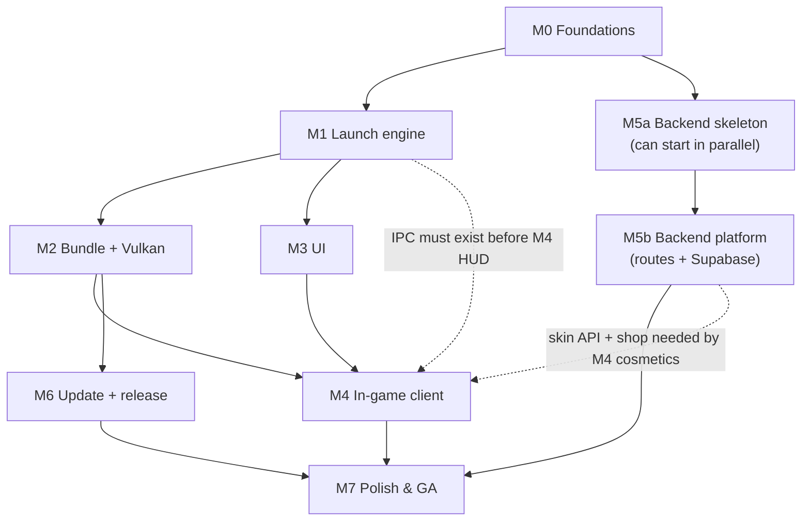
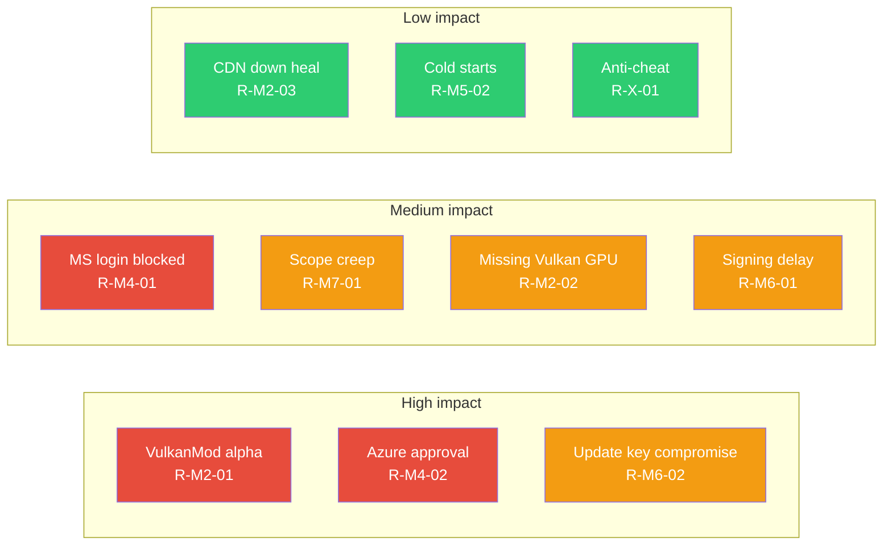

# 17 · Roadmap

Ordered so each milestone is independently runnable and verifiable. Progress tracked here + in `docs/`.

> **Reading rule.** A milestone is not "done" when the code merges — it is done when its **exit criteria**
> below pass *and* every [01 §18](./01-research.md) `planning` row in its scope is promoted or explicitly
> carried with an owner. This document is the delivery half of the honesty table; [16 · Testing](./16-testing.md)
> is the harness half.

## Milestone map

### Dependency graph (what can start when)

**Hard dependencies** (cannot reorder): `M0 → M1 → M2`; `M1 → M4` (IPC); `M2 → M4` (bundle + boot mod);
`M5b → M7` (shop + news). **Soft/parallelizable:** `M5a` (backend skeleton, routes with fixtures) can run
alongside M1–M3; `M3` (UI) only needs M1's `Command`/`UiState` façade ([02 §1](./02-architecture.md)).

### Effort, ownership & sizing

Story points are **relative** (fibonacci); a point is a normal day for one engineer. Owned areas follow
[04 §12](./04-repository.md).

| Milestone | Scope | Points | Primary owner | Can slip into |
|---|---|---|---|---|
| M0 Foundations | repo, CI, docs, toolchain | 8 | platform | — (gates everything) |
| M1 Launch engine | resolve → install → launch offline | 34 | launcher | M2 |
| M2 Bundle + Vulkan | pin manifest, heal loop, renderer | 34 | bundle | M7 (risk) |
| M3 UI | screens, theme, a11y | 26 | UI | M4 |
| M4 In-game client | HUD, click GUI, cosmetics, IPC | 40 | mods | M7 |
| M5 Backend + Supabase | routes, schema, RLS, deploy | 34 | backend | M6 |
| M6 Update + release | self-update, signing, channels | 26 | release | M7 |
| M7 Polish & GA | soak, shop, admin, GA gates | 34 | product | v1.1 |

## M0 — Foundations (week 1)

- `git init`, MIT LICENSE, README, push to `aethelreborn/AethelLauncher`.
- Cargo workspace + CI (`ci.yml`) green: fmt/clippy/test on 3 OS.
- This `docs/` folder finalized + linked from README.

**Deliverables**
- `Cargo.toml` workspace with `launcher-core`/`launcher-ui`/`launcher-bin`/`backend` members ([04 §1](./04-repository.md)).
- `rust-toolchain.toml` pinned (reproducibility contract referenced by [15 §3.3](./15-updating-distribution.md)).
- `.github/workflows/ci.yml` implementing the [16 §3](./16-testing.md) matrix.
- `docs/` index in [README](./README.md) with all 19 files linked and anchored.

**Exit criteria**
- CI green on all matrix cells; a deliberately broken branch is blocked.
- `cargo run -p launcher-bin` opens an empty egui window on all 3 OS.
- No secrets, `.env`, or bundled jars in `git history`.

**Risks** · toolchain drift → pin exact revision; runner availability → document macOS-13/14 split.
**Deferred** · release signing keys, packaging scripts.
**Effort** · 8 SP — [16 §3](./16-testing.md) CI artifacts are the proof.

## M1 — Launch engine (weeks 1–3)

- `launcher-core`: manifest fetch, library/asset/native install, JRE from Mojang runtime manifest,
  offline auth, JVM/GC arg builder, process spawn + log capture, instance store (SQLite).
- Stub backend manifest (local JSON) so no network dependency.
- Smoke: `cargo run -p launcher-bin -- play vanilla 1.21.11` launches vanilla offline on dev machine.

**Deliverables**
- `manifests/{mojang,fabric,java_runtime}.rs`, `install/{plan,downloader,verifier,natives,assets}.rs`,
  `auth/offline.rs`, `launch/{args,process,ipc}.rs`, `store/*` ([04 §2](./04-repository.md)).
- Offline UUID + game args as golden-vector tests ([16 §1](./16-testing.md)).
- IPC server (loopback + one-shot token) shipped early because M4 depends on it ([12 §2](./12-ipc.md)).
- P0–P5 phase machine reproducible headless against the fixture world ([16 §2](./16-testing.md)).

**Exit criteria**
- Vanilla offline launch works headless on Linux dev box, and on Win/mac CI smoke.
- Install is resumable: kill mid-download → resume → hash-correct.
- No secret on disk; redaction canaries green ([16 §6.1](./16-testing.md)).
- Golden classpath for 1.21.11 committed.

**Risks** · Mojang manifest shape change → strict serde + fixtures; JRE hash rotation → refresh path +
system fallback ([05 §7.1](./05-launch-engine.md)).
**Deferred** · Microsoft auth (M4), Fabric loader (M2), bundle (M2).
**Effort** · 34 SP.

## M2 — Bundle + Vulkan (weeks 3–5)

- Bundle manifest + installer: Sodium/VulkanMod/Nvidium tiering, Fabric loader install, CSPInternal.
- `managed.json` SHA-256 enforcement + self-heal; `options.txt` Vulkan patch; renderer fallback.
- JVM RAM tiers finalized.
- Perf gate scripted ([16 §5](./16-testing.md)).

**Deliverables**
- `bundle/{manifest,heal,options}.rs`; backend `modmanifest` fixture + signed-manifest groundwork ([07 §2](./07-vulkan-performance.md)).
- `aethel-boot` mixin that forces/checks `gfxApi` ([07 §1.3](./07-vulkan-performance.md)).
- Renderer decision matrix implemented and unit-tested ([07 §1.1](./07-vulkan-performance.md)).
- Tamper matrix suite green ([16 §11](./16-testing.md)).

**Exit criteria**
- 1.21.11 launches **with mods on Vulkan**, tamper test passes, FPS gate green on the reference laptop.
- Delete/edit/shadow a pinned jar → restored before spawn.
- GPU probe picks VulkanMod vs Sodium-OpenGL correctly for 3 GPU classes.

**Risks** · VulkanMod alpha per version → feature-detect + OpenGL fallback, pinned tested versions;
unknown GPU → default OpenGL; CDN down → cache-first heal.
**Deferred** · Ed25519 manifest signing (compatibility release, M6), Iris/shaders tier (v2), Nvidium→default.
**Effort** · 34 SP — see [07 §9](./07-vulkan-performance.md) acceptance checklist.

## M3 — UI (weeks 4–6)

- Splash, Home, Library (instances), Downloads, Mods, Account(offline), Settings(+theme editor).
- Visual identity tokens ([08](./08-ui-design.md)) + frameless window; news carousel wired to backend stub.
- Accessibility basics + keyboard nav.

**Deliverables**
- `launcher-ui` screens + `ThemeDoc` token set (`#0B0B0F` / `#6C5CE7` / `#00D2FF`).
- Theme editor remapping at runtime ([08 §2](./08-ui-design.md)); token export used by M4's in-game sync.
- Download/progress UI bound to `ActiveTransfer` ([02 §1](./02-architecture.md)).
- Keyboard traversal for every screen; focus visible.

**Exit criteria**
- Full launcher usable by mouse + keyboard; screens match [08](./08-ui-design.md) spec.
- `Right Shift`/`Right Alt` documented handoff points exist in UI even before the mod ships.
- UI input → repaint < 16 ms avg on the reference laptop ([16 §5](./16-testing.md)).

**Risks** · egui minor-version breaking changes → pin + smoke; widget churn → wrap in our own helpers ([01 §6.1](./01-research.md)).
**Deferred** · full animation polish, store screens (M5), crash viewer (M6).
**Effort** · 26 SP — sourced from [08 §10](./08-ui-design.md).

## M4 — In-game client (weeks 5–8)

- `gamesupport/`: Stonecutter workspace; `aethel-hud` modules (HUD editor first); IPC client; config sync.
- `aethel-cosmetics` + CustomSkinLoader skin-API client; equip from backend.
- MS auth (device code) behind feature flag once app-registration approved.

**Deliverables**
- `aethel-hud` Kotlin: `HudClient.kt`, `ipc/IpcClient.kt`, `click-gui/` (Right Shift menu, Right Alt HUD editor), `config/AethelConfig.kt` ([04 §2](./04-repository.md)).
- Click GUI + HUD editor spec implemented ([18](./18-client-gui.md)); theme push (`setTheme`) applies live ([12 §3](./12-ipc.md)).
- `aethel-cosmetics` skin-api client → CustomSkinLoader round-trip ([11 §3](./11-in-game-mods.md)).
- MSA device-code flow, feature-flagged, disabled button until `aka.ms/mce-reviewappid` approval ([06 §3](./06-auth.md)).

**Exit criteria**
- HUD visible in-game, IPC live (FPS → launcher), cosmetics apply from local endpoint.
- `Right Shift` opens menu < 150 ms; `Right Alt` enters HUD editor ([18 §9](./18-client-gui.md)).
- Theme/HUD-layout/cosmetics pushes apply without restart.
- Offline account path unaffected by MSA flag; no tokens leave the machine.

**Risks** · Azure approval delayed → MSA stays flagged, offline unaffected (R-M4-02); IPC stress under high
FPS → rate caps; mod conflicts → surfaced, never silently patched ([01 §14.2](./01-research.md)).
**Deferred** · SkinShuffle-style presets; rich presence; deeplinks (v2).
**Effort** · 40 SP — Gradle matrix smoke per [16 §3](./16-testing.md).

## M5 — Backend + Supabase (weeks 6–9)

- Supabase migrations ([10](./10-database.md)) + seeds; Axum routes ([09](./09-backend.md)):
  health/versions/news/servers/update-check/telemetry/skin-api/shop/me/admin.
- Manifest refresh job; Render Dockerfile + deploy; Sentry ingestion.

**Deliverables**
- `crates/backend` routes + services + `moka` caches ([04 §2](./04-repository.md)).
- `supabase/migrations/*.sql` with RLS policies matching [10 §2.1](./10-database.md).
- `GET /modmanifest/{mc}/{bundle}` serving the exact pin document M2 consumes ([07 §2.1](./07-vulkan-performance.md)).
- `shop/buy` idempotent via `request_id`; wallet transactional ([10 §6](./10-database.md)).
- Route contract + RLS test suites ([16 §10](./16-testing.md)).

**Exit criteria**
- Backend live on Render (distroless, healthcheck); launcher pulls live manifest; cosmetic shop round-trip works.
- 10k+ rps cached route, p50 < 10 ms ([16 §5](./16-testing.md)).
- RLS matrix verified: no cross-user reads; anon cannot read `wallet`.

**Risks** · service-key leak → server-only + RLS (residual low); Render cold starts → cache + keep-warm;
migration ordering conflicts → additive numbered migrations ([04 §9](./04-repository.md)).
**Deferred** · forum, votes-at-scale, admin web UI (M7), real payments (sandbox wallet only).
**Effort** · 34 SP.

## M6 — Update & release (weeks 9–11)

- `self_update` + update-check; channels stable/beta.
- packaging: NSIS, dmg(+notarization), AppImage; release.yml tag → artifacts + checksums.
- Sentry minidump reporter + consent UI.

**Deliverables**
- `update/{mod,policy}.rs`; backend `update-check` DB-backed ([15 §2](./15-updating-distribution.md)).
- `packaging/` NSIS / dmg+notarize / AppImage + shared swap helper ([15 §2.2](./15-updating-distribution.md)).
- `release.yml` signing + `SHA256SUMS` + `update-manifest.json`.
- Ed25519 manifest signing + key-rollover path ([13 §9](./13-security.md)); crash reporter + consent ([14](./14-telemetry.md)).

**Exit criteria**
- Tag → release artifacts download/install/self-update on all 3 OS without admin.
- sha256 mismatch refused; auto-rollback on 3 early crashes within 24 h.
- Bundle updates flow without a launcher release.

**Risks** · signing cert acquisition lead time → start early; notarization quota → staple + retry;
unsigned dev builds expected pre-GA.
**Deferred** · `cargo-dist` orchestration, `.deb`/Flatpak, HSM key service.
**Effort** · 26 SP — gate list in [15 §9](./15-updating-distribution.md).

## M7 — Polish & GA (weeks 11–14)

- Buy flow + wallet, votes, news push, admin panel (web, later M8).
- Beta soak (discord), then stable channel.
- Docs: fill `01`, `07`, `16` acceptance tables with real data.

**Deliverables**
- Store buy flow end-to-end (sandbox → optional real later); wallet UI.
- Admin panel (web) for news/shop/bundles; `GET /admin/metrics` dashboards ([10 §4](./10-database.md)).
- Beta soak report; support runbooks; onboarding doc.
- All `planning` rows in [01 §18](./01-research.md) promoted or carried with owner.

**Exit criteria**
- Stable release; onboarding + Day-1 hotfix path documented.
- KPIs instrumented ([00 §KPIs](./00-overview.md)); crash-free session rate ≥ 99 % launcher.
- Full manual QA ([16 §4](./16-testing.md)) signed off; perf trend attached.

**Risks** · beta feedback expands scope → freeze rule below; Day-1 hotfix pressure → mandatory-update path
tested in M6.
**Deferred** · forum, cosmetic enforcement, Forge/NeoForge manager, Bedrock (v2/v3, [00 §Non-goals](./00-overview.md)).
**Effort** · 34 SP.

## Release cadence & channels

| Channel | Source | Cadence | Quality bar | Rollout |
|---|---|---|---|---|
| **nightly** | every green `main` commit | automatic | CI only; unsigned; may break | 100 % (opt-in testers) |
| **beta** | tagged `v*-beta.N` | weekly-ish | CI + smoke QA + perf signal | 5 %→25 % by install_id |
| **stable** | promoted from beta | every 1–2 weeks | full QA + all gates ([16 §14](./16-testing.md)) | 25 %→50 %→100 % |

- Stable promotion requires the [16 §14](./16-testing.md) gate list plus a **feature freeze** 48 h before tag.
- Mandatory/security updates bypass rollout (`mandatory: true`) and are the only forced channel move.
- Downgrades follow [15 §5.1](./15-updating-distribution.md) (upward only within a channel; manual reinstall
  for real downgrades).

## Risk register

Owner = the area owner from [04 §12](./04-repository.md); trigger = the observable that fires the mitigation.

| ID | Risk | L | I | Trigger | Mitigation | Owner | Milestone |
|---|---|---|---|---|---|---|---|
| R-M1-01 | Mojang manifest shape change | M | M | fixture fails | strict serde + stale cache + fixture refresh | launcher | M1 |
| R-M1-02 | JRE hash rotation 404 | M | M | JRE fetch 404 | pinned hash list + system-JRE fallback | launcher | M1 |
| R-M2-01 | VulkanMod alpha instability per version | H | H | boot crash / init missing | feature-detect + OpenGL fallback + pinned tested versions | bundle | M2 |
| R-M2-02 | Unknown/old GPU lacks Vulkan | M | M | probe fail | auto Sodium-OpenGL + UI note | bundle | M2 |
| R-M2-03 | Bundle CDN unavailable at heal | M | M | sha fetch fail | cache-first restore; launch OpenGL-lite + notice | bundle | M2 |
| R-M4-01 | MS login blocked by Mojang approval | H | M | step-4 `403` | button disabled; offline fully works | mods | M4 |
| R-M4-02 | Azure approval past M4 | H | M | approval pending | MSA feature-flagged; roadmap slip explicit | product | M4 |
| R-M4-03 | IPC stress / reconnect storm | L | M | CPU jank | token bucket + backoff + 1-conn rule | mods | M4 |
| R-M5-01 | Supabase service-key leak | L | H | secret scan / alert | server-only key; RLS; rotation runbook | backend | M5 |
| R-M5-02 | Render cold starts hurt UX | M | L | p95 > target | moka cache + client retry/stale badge | backend | M5 |
| R-M6-01 | Signing cert procurement delay | M | H | cert not ready | start procurement in M5; dev unsigned builds | release | M6 |
| R-M6-02 | Update key compromise | L | H | signature alert | HSM/CI-only key + rollover manifest | release | M6 |
| R-M7-01 | Beta scope creep | H | M | freeze missed | 48 h freeze + deferral list | product | M7 |
| R-X-01 | Anti-cheat rejects mods | M | M | server kick reports | "Vanilla clean" mode | mods | M7 |
| R-X-02 | Mod licensing/attribution gap | L | M | license audit | `LICENSES.txt` in archive; MIT model | release | M2 |

L = likelihood, I = impact (L/M/H).

### Risk heatmap

## Risks & mitigations (tracked)

| Risk | Mitigation |
|---|---|
| VulkanMod alpha instability per version | Feature-detect + OpenGL fallback toggle; pinned tested versions |
| MS login blocked by Mojang approval | Button disabled until approved; offline fully works |
| Bundle mod licensing/attribution | Ship `LICENSES.txt`; keep Aethel MIT; document in 11 |
| Servers with anti-cheat reject mods | "Vanilla clean" mode (no bundle) |
| Old Intel/AMD GPUs lack Vulkan | Auto fallback Sodium-OpenGL |
| Render costs for skin/image hosting | Supabase free tier generous; CDN later |

## Definition of Done (per milestone)

- Code merged on `main`, CI green, docs updated, acceptance check in `16` passed for the milestone's scope.
- Additionally, for **every** milestone:
  - [ ] Owned `planning` rows in [01 §18](./01-research.md) promoted to `tested` or carried here with an owner.
  - [ ] New IPC messages / DB tables / env vars reflected in [12](./12-ipc.md) / [10](./10-database.md) / [04 §4](./04-repository.md).
  - [ ] No new `planning` fact introduced without a risk register row.
  - [ ] Release notes / changelog entry written for anything user-visible.

## Edge cases

| Edge case | Roadmap stance |
|---|---|
| Milestone slips | dependent milestone starts on its soft edges (see §Dependency graph); the *hard* edge is protected |
| A `planning` fact proved false | the owning design changes and [01 §17](./01-research.md) decision table is updated in the same PR |
| Azure approval arrives mid-M5 | MSA flag flips on; M4 exit criteria already permit it disabled |
| New MC version ships mid-run | bundle manifest is data → hotfix without forcing a launcher release ([07 §2](./07-vulkan-performance.md)) |
| VulkanMod dies upstream | Sodium-OpenGL becomes the ≤26.1 default; manifest hotfix, no code release |
| Beta finds a launch-blocking bug | mandatory hotfix path (M6) is the escape hatch; stable rollout is paused |
| Key compromise in M6 | rollover manifest path; rotate before old key removed ([13 §9](./13-security.md)) |
| A milestone's exit criteria can't be met in-scope | explicitly defer the criterion to the next milestone and record it in the risk register — never mark it green |
| Team capacity halves | re-cut scope, not quality: M7 store/admin are the first to move to v1.1 |
| Docs drift at release | docs job ([16 §3](./16-testing.md)) and the [04 §3](./04-repository.md) drift rule block the tag |

## Acceptance criteria (checklist)

- [ ] Every milestone M0–M7 has deliverables, exit criteria, risks, deferrals and an SP estimate (this file).
- [ ] The dependency graph admits no cycle; hard edges are respected by the actual schedule.
- [ ] Each release-cadence channel (nightly/beta/stable) has a defined quality bar and rollout rule.
- [ ] Every risk above has an owner and an observable trigger, not just a mitigation.
- [ ] M2 exit includes a reproduced Vulkan ≥ +20 % gate on the reference laptop.
- [ ] M4 exit leaves MSA correctly disabled if approval is pending (offline path unaffected).
- [ ] M5 exit verifies the RLS matrix by tests ([16 §10](./16-testing.md)).
- [ ] M6 exit proves update refusal on tamper + auto-rollback.
- [ ] M7 exit promotes every remaining [01 §18](./01-research.md) `planning` row or carries it with an owner.
- [ ] Definition of Done is applied per milestone, including the four invariant checks.

## Sources / bibliography

- Research evidence & status roll-up: [01 · Research](./01-research.md) (§17 decisions, §18 verification status).
- Harness and gates: [16 · Testing](./16-testing.md) (CI matrix, perf gates, release gating).
- Delivery mechanics: [15 · Updating & distribution](./15-updating-distribution.md) (channels, rollback),
  [04 · Repository](./04-repository.md) (CI, release flow, owners).
- Security gates: [13 · Security](./13-security.md) (signing, tamper, residual risk).
- Platform: [09 · Backend](./09-backend.md) (routes, Render), [10 · Database](./10-database.md) (RLS, migrations).

## Validation status

| Claim | Status | Evidence / promotion |
|---|---|---|
| M0–M7 ordering + dependencies | `planning` | this doc; reviewed at each milestone exit |
| SP estimates | `planning` | recalibrated after M1 and M4 actuals |
| Release cadence (nightly/beta/stable) | `planning` | enabled by [15 §5](./15-updating-distribution.md) in M6 |
| Risk register | `planning` | reviewed monthly; rows close with an [01 §18](./01-research.md) promotion |
| Definition of Done | `planning` | enforced from M1 onward by PR checklist |

## Where to go from here

- **Why these milestones exist:** [01 · Research](./01-research.md) (evidence) and [00 §Decision log](./00-overview.md)
  (locked v1 decisions).
- **How each is proven:** [16 · Testing](./16-testing.md) — every exit criterion maps to a suite there.
- **How it ships:** [15 · Updating & distribution](./15-updating-distribution.md) and [04 §5](./04-repository.md).
