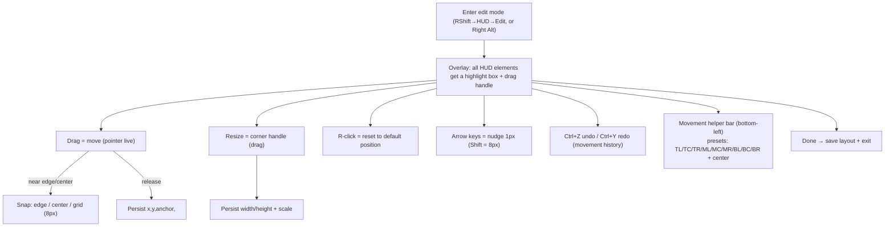

# 18 · In-game Click GUI (Client UI) & Unified Rust Frontend

> The deepest spec in this set: how Aethel's two frontends look identical.
> **Frontend #1 = launcher (100% Rust / egui, see 08). Frontend #2 = in-game click GUI (Java, inside Minecraft).**
> This doc defines #2 in full and the protocol that unifies both.

## 1. Why the in-game GUI must be Java (not Rust)

```
Minecraft Java process
  ├─ OpenGL/Vulkan surface (LWJGL) — Rust cannot draw into it
  ├─ GUI = Java classes (Screen, DrawContext) — must be subclassed/Mixed in
  └─ Input pipeline (Mouse/Keyboard events) — Java-only hooks
```
- The launcher (Rust) draws its own window; the game draws its own.
- Any in-game UI must be **a Fabric mod** (`aethel-hud`) using Minecraft's rendering + Mixins.
- **What we unify instead:** theme tokens, font sizing, accent color, blur, naming → both frontends
  feel like one product (Section 6).

## 2. Reference behavior (researched from Lunar / Feather / Meteor / Kuzi)

| Feature | Lunar | Feather | Meteor (ref) | Planning choice |
|---|---|---|---|---|
| Open in-game menu | **Right Shift** | Right Shift | Right Shift | **Right Shift** (+ rebindable) |
| HUD reposition | In RShift menu, drag | **Right Alt** drag | HUD tab → Edit | **Right Shift → HUD tab → Edit mode** (also Right Alt shortcut toggle) |
| Toggle style | Red "Disabled" → green "Enabled" | toggle chips | checkbox | pill toggle (accent on / dim off) |
| Tab structure | Mods / Settings / Cosmetics / Theme | toggles screen | GUI / Config / HUD | **Mods / HUD / Appearance / Cosmetics / Settings / Profiles** |
| Per-mod settings | gear → panel | inline | right-click | **gear (or R-click) → settings panel** |
| Move helpers | movement helper L-corner, Ctrl+Y redo, right-click reset, arrow nudge | — | — | same |
| Color | picker + chroma cycle | monochrome | picker | **picker + chroma + Aethel presets** |
| Search | yes | no | yes | **yes, + "enabled" filter** |
| Profiles / export | profiles | — | Ctrl+C/V copy | **profiles + JSON import/export + IPC sync** |

## 3. Screen & input spec

### 3.1 Opening
| Context | Action |
|---|---|
| Main menu | Click gear/logo button (`aethel set` button bottom-left) |
| In-game | Press **Right Shift** (default) → opens over gameplay |
| Editor shortcut | Press **Right Alt** → instantly enter HUD edit mode |

### 3.2 Closing / layering
- `ESC` closes the topmost screen. In singleplayer, opening the GUI **pauses** (show game menu);
  in multiplayer, keep game running & auto-switch back.
- Only one Aethel screen at a time; nested dialogs stack (settings, picker).
- **Blur:** use MC's built-in blur (renders depth-buffer blur) behind the panel, amount = theme token.

**Layering & pause matrix:**

| State | GUI open? | Game input | Paused? | Notes |
|---|---|---|---|---|
| Gameplay | no | full | no | — |
| Mod menu (SP) | yes | none | **yes** | pause screen behind (blur) |
| Mod menu (MP) | yes | none | no | world keeps ticking; auto-switch back on close |
| HUD edit mode | overlay only | none | same as parent | HUD boxes are non-interactive with world |
| Nested dialog | yes (stack) | none | inherits | settings/picker sit above the panel |

### 3.3 Layout wireframe (in-game)
```
+------------------------------------------------------+
| ⌕ search [enabled|off|all ▾]        [Profiles ▾] [⚙] |
+------------------------------------------------------+
|  MODS | HUD | APPEARANCE | COSMETICS | SETTINGS       |  ← tab bar
+------------------------------------------------------+
|                                                       |
|  ┌─ HUD (15) ──────────────────────────────────────┐  |
|  │ ▶ FPS           [on ▤]   gear→pos/color/scale   │  |
|  │ ▷ Coordinates   [off ▤]  sub-cats expand        │  |
|  │ ▶ Keystrokes     [on] (search filters)          │  |
|  │  …                                              │  |
|  └─────────────────────────────────────────────────┘  |
|  Category filters: HUD|Movement|Visual|Chat|...       |
+------------------------------------------------------+
|  HUD EDITOR: [done]  Movement helper ▸ presets        |
+------------------------------------------------------+
```
- Rows: `name + one-line desc` · toggle pill · **gear** (or right-click) opens the settings mini-panel.
- Enabled count badge on each category header.

**Row interaction table (single module row):**

| Action | Result |
|---|---|
| Click pill | toggle enabled (120 ms accent-fill anim), IPC `toggle` frame |
| Gear / right-click | open per-mod settings panel (slide in from right, blur persists) |
| Double-click name | jump to HUD tab and select that element's box in edit mode |
| Hover | row bg-hover + secondary action reveal (gear) |
| Search match highlight | matched substring in `accent2` italic |

**Empty / error states of the list:**

| State | Render |
|---|---|
| No modules match filter | centered glyph + “No modules match ‘query’” + clear-search button |
| Search with 0 enabled | banner: “N modules hidden by filter” + one-click “show enabled only” |
| Category with 0 modules visible | collapsed header with `text-dim` “0 enabled” |
| Catalog fetch missing (unsupported version) | full-panel “In-game mods unavailable on this version” + link to perf bundle note ([11 §5](./11-in-game-mods.md)) |

### 3.4 Tabs

| Tab | Content | Notes |
|---|---|---|
| Mods | module list (§4) + category filters | primary tab on open |
| HUD | element list + edit entry point | gear row = edit position; see §5 |
| Appearance | theme picker (Aethel Night / dracula-equivalent presets), chroma toggles, blur amount, font scale | writes only the *local overlay*—launcher is source of truth (§6) |
| Cosmetics | equipped items (Cape/Elytra/Skin), opacity | powered by `aethel-cosmetics` (11 §3) |
| Settings | keybinds, per-instance toggles mirror ([11 §1.2](./11-in-game-mods.md)), misc | mirrors the launcher `Mods` screen |
| Profiles | save/load/import/export (§17) | layout + module sets |

## 4. Module catalog (complete Aethel v1 set)

Categories → module → default key / default state / options.

| Category | Module | Key | Default | Options (deep) |
|---|---|---|---|---|
| **HUD** | FPS / frame-time | — | on | corner, color scale (good/mid/bad), show ms, font, scale, bg |
| | Coordinates | — | on | format `X Y Z` + facing + dim, color, decimals |
| | Keystrokes | — | off | WASD/LMB/RMB/space boxes, show CPS, fade delay, box size, colors, chroma |
| | CPS counter | — | off | interval 500ms avg, style numbers/bars |
| | Ping | — | off | color by latency (0-50/150/250/…), ms shown |
| | Armor status + durability | — | off | show prot line, durability %, warn color <25% |
| | Potion effects | — | off | icons + time left, hide ambient |
| | Clock / timer | — | off | system time or session stopwatch |
| | Server address + version | — | off | show `server:port`, joined version |
| | Memory | — | off | used/max, auto mem-fit |
| **Movement** | Toggle sprint | — | off | indicator HUD element, auto-navigate |
| | Toggle sneak | — | off | indicator, auto-navigate |
| | Zoom | Z (hold) | on(hold) | FOV %, smoothness ms, keybind capture |
| | Freelook | C (hold) | off | smooth rotate, auto-return; conflict-clear on others |
| | Snaplook | — | off | directional snap angles = key mid |(optional)|
| **Visual** | Fullbright | — | off | night-vision gamma value |
| | FOV changer | — | off | fixed fov override |
| | Hurt cam | — | off | intensity % |
| | Damage tint | — | on | color + intensity |
| | Fog | — | off | disable fog options |
| | Motion blur | — | off | strength |
| | Block hitbox / overlay | — | off | color, line width, fill alpha |
| | Crosshair | — | off | style (lunar/plus/dot), gap, color, chroma |
| | 1.7 visual style | — | off | old swing/block hit visuals (where supported) |
| **Chat** | Chat tweaks | — | off | no-message-collapse, timestamps (HH:MM), clean coords click-to-tp |
| | Kill sounds | — | off | custom sound per kill |
| | Name chat color | — | off | render names colored |
| **Server info** | Tab editor | — | off | custom tab header/footer formatting |
| | Scoreboard | — | on | format, hide numbers, sidebar scale |
| **Misc** | Hitbox / reach display | — | off | reach line + entity hitbox toggle |
| | Item physics | — | off | drop animation + scale |
| | Waypoints | — | off | create/edit waypoints (x,y,z,label,color, render line/beam) |
| | Screenshot (auto) | — | off | auto-save path, watermark |
| | Discord/status report | — | off | (optional IPC → launcher rich presence) |
| **Cosmetics** | Cape / Elytra / Skin | — | on | equipped items from store; opacity; see 11 |
| | Name badge/emote | — | off | render emotes/name flair |
| **Performance** | HUD caching | — | on | throttle static HUD redraw to N fps (default 20) |
| | Reduce entity distance | — | track 07 | -% slider |
| | Renderer tier indicator | — | on | tiny "Vulkan" badge on F3+ (see 07) |

> v1 builds ~20 modules (marked in 11); the catalog above is the target set. Each module = one Mixin implementer + one config entry; disabling a module removes only its render/tick cost.

## 5. HUD editor — full interaction spec


- **Anchoring model:** each element stores `{anchor: (0..1, 0..1), offset: (i32,i32), scale, visible}`.
  Layout is resolution-independent (scale by `guiScale`).
- Live preview renders the element at its real position/state so WYSIWYG.
- Profiles can store a **layout only** (import/export).

### 5.1 Anchor math

Screen-space position is derived, never stored:

```
x = anchor.x * screenW + offset.x * guiScaleFactor
y = anchor.y * screenH + offset.y * guiScaleFactor
```

- `anchor` is a unit-space point (0..1, 0..1); `offset` is integer px relative to it.
- Resolution independence comes from recomputing on every frame against the *current*
  `(width, height, guiScale)`; a layout authored at 1920×1080 guiScale 2 renders identically at
  1280×720 guiScale 1 (same proportion, same px offset).
- `scale` is an additional text/sprite multiplier clamped `0.5–2.0`; changed only by `Resize`.

```kotlin
// gamesupport/aethel-hud/.../hud/HudElement.kt — serialization anchor
@Serializable
data class HudElement(
    val anchor: TwoFloats,            // "0.0,0.0" .. "1.0,1.0"
    val offset: TwoInts,              // integer px
    val scale: Float = 1.0f,
    val visible: Boolean = true,
) {
    fun topLeft(w: Int, h: Int, gs: Int): Pair<Int, Int> =
        ((anchor.x * w + offset.x) * gs).toInt() to ((anchor.y * h + offset.y) * gs).toInt()
}
```

### 5.2 Snap & nudge rules

| Input | Effect | Threshold / amount |
|---|---|---|
| Drag near screen edge | snap to edge | ≤ 6 px of edge → snap x or y to 0/width/height |
| Drag near edge centers | snap to center of that edge | mid-point ±12 px |
| Drag near screen center | snap to exact center point | within 12 px box |
| Grid snap (always active) | element edges align to 8 px grid | quantization = round(px / 8) * 8 |
| Arrow keys | nudge 1 px | 1 px per keypress |
| Shift + Arrows | nudge 8 px | 8 px (grid step) |
| Corner drag | resize (scale) | live; commit on release |
| R-click on element | reset to default position | restores launcher default entry |
| Ctrl+Z / Ctrl+Y | undo / redo | history of position+scale changes this session |

Movement history is a bounded stack (64 ops); `Ctrl+Z` restores the prior `(anchor, offset, scale)`
triple. Selection has `Tab`+`Shift+Tab` order = module list order; `Esc` deselects then exits edit mode
on second `Esc`.

### 5.3 HUD editor empty/overshoot states

| Case | Behaviour |
|---|---|
| No visible elements in edit mode | helper bar shows “nothing to move” text; exit allowed |
| Element dragged fully off-screen | keep 4 px minimum on-screen clamp + `warn` outline |
| Screen resized mid-edit | chose resolution bucket; layout recomputed per §5.1; no corruption |
| guiScale changes mid-edit | same anchor math; offsets scaled by new factor (WYSIWYG retained) |

## 6. Unified Theming Protocol (Rust launcher ↔ in-game GUI)

The launcher writes **`theme.json`** (and pushes live over IPC):
```jsonc
{
  "schema": 1,
  "meta": { "name": "Aethel Night", "accent": "#6C5CE7", "accent2": "#00D2FF" },
  "colors": { "bg": "#0B0B0F", "bgRaise": "#15151C", "hover": "#1D1D28",
              "text": "#ECEFF4", "textDim": "#8A8FA3",
              "success": "#2ECC71", "warn": "#F39C12", "danger": "#E74C3C" },
  "shape": { "radiusCard": 10, "radiusPill": 20, "spacing": 8 },
  "font": { "family": "Inter", "sizes": { "caption": 10, "body": 14, "title": 20, "display": 28 },
            "weight": { "body": 500, "title": 800 } },
  "effects": { "blurRadius": 12, "chroma": { "sat": 100, "bri": 100, "speed": 2 } },
  "toggles": { "glowHover": true, "animations": true, "reducedMotion": false }
}
```
- **Source of truth = launcher UI (08).** In-game GUI consumes the same JSON; the two never drift.
- **Live update:** changing a theme token in the launcher Settings → IPC `setTheme` → game applies without restart.
- **Font caveat:** Minecraft uses its own bitmap font. We approximate ours by mapping MC font `size * guiScale`;
  optionally ship a pixel-faithful MC-compatible TTF for the in-game GUI (planned later).

### 6.1 Full schema (every field a stored token)

```jsonc
{
  "schema": 1,
  "meta": { "name": "Aethel Night", "version": "0.9.4", "accent": "#6C5CE7", "accent2": "#00D2FF" },
  "colors": {
    "bg": "#0B0B0F", "bgRaise": "#15151C", "hover": "#1D1D28",
    "accent": "#6C5CE7", "accent2": "#00D2FF",
    "success": "#2ECC71", "warn": "#F39C12", "danger": "#E74C3C",
    "text": "#ECEFF4", "textDim": "#8A8FA3"
  },
  "shape": { "radiusCard": 10.0, "radiusPill": 20.0, "spacing": 8.0 },
  "font": {
    "family": "Inter",
    "sizes": { "caption": 10, "body": 14, "title": 20, "display": 28 },
    "weights": { "caption": 400, "body": 500, "title": 800, "display": 800 }
  },
  "effects": {
    "blurRadius": 12.0,
    "chroma": { "sat": 100, "bri": 100, "speed": 2.0 }
  },
  "toggles": { "glowHover": true, "animations": true, "reducedMotion": false },
  "motion": {
    "fastMs": 120, "baseMs": 180, "slowMs": 320, "glowMs": 2400, "spinnerMs": 640,
    "easeFast": "easeOut", "easeBase": "easeInOut", "easeSlow": "easeOut"
  }
}
```

Field-by-field consumption:

| Section | Consumed by |
|---|---|
| `colors.*` | every widget fill/stroke on both frontends (08 §2 token wiring, in-game renderer §8) |
| `shape.radius*` | card/pill rounding; pill = `radiusPill`, card = `radiusCard` |
| `shape.spacing` | item spacing on both frontends |
| `font.*` | launcher directly; in-game approximated as MC font `size * guiScale` |
| `effects.blurRadius` | MC depth-buffer blur amount behind panels (§3.2) |
| `effects.chroma` | chroma picker sat/bri/speed offsets (§8) |
| `toggles.*` | animation gates; `reducedMotion` cascades to §13 |

### 6.2 Theme propagation flow

```mermaid
sequenceDiagram
    participant U as User
    participant L as Launcher (egui, 08)
    participant IPC as IPC channel (12)
    participant G as In-game GUI (this doc)

    U->>L: edits token in Settings / Theme editor
    L->>L: write theme.json (source of truth, §6)
    alt game running
        L->>IPC: setTheme { full theme.json }
        IPC->>G: apply theme (swap-token atomically, next frame)
        G-->>U: repaint with new tokens; no restart
    else game not running
        L->>L: persists to instance config dir
        G-->>G: loads theme.json at boot (before title screen)
    end
    G-->>IPC: ack { applied, appliedTokens, errors }
    IPC-->>L: log + surface "theme applied in game"
```

Boot order in-game: `ConfigStore` reads `<instance>/config/aethel.json` → theme filename → load
`theme.json` → register into `ThemeRegistry`. A later `setTheme` replaces the registry wholesale
(`swap`), so a frame is never half-themed.

## 7. Config & serialization

- File: `<instance>/config/aethel.json` (versioned, `schema` first).
- Sections: `{ schema, theme, keybinds, modules:{enabled,options...}, hud:{layout...}, profiles:[] }`
- **Migration:** `schema` bump → `migrate()` chain; unknown keys preserved (forward-compat).
- **Sync:** profiles export = that JSON; launcher "Mods" screen edits same file pre-launch; IPC pushes live.

`migrate()` rules: run only forward (`n → n+1`), never downgrade; each step is a pure function
`(JsonObject) -> JsonObject`; unknown keys ride through untouched; a step failure keeps the old file
plus a `*.bak-<ts>` and logs the missing-keys diff (see §14).

## 8. Implementation notes (Fabric + Mixins)

| Need | Approach |
|---|---|
| Overlay screen | `Screen` subclass; `render(DrawContext, ...)` drawing via `Texture`/`tessellator`, blur via `GuiGraphics` blur shader |
| In-game HUD hook | Mixin `GameRenderer`/`InGameHud#render` to draw Aethel elements last |
| Input | Mixin `Keyboard`/`Mouse` or `Screen#keyPressed/mouseClicked` for menu; `ClientTickEvents` for keybinds |
| Sliders/toggles/pills | Our own widget set (small, cached textures) — avoids per-frame GL state churn |
| Virtualized lists | Search + categories; cap visible rows to `height/rowH`, reuse render |
| Chroma | RGB cycle from `Util.getMeasuringTimeMs()*speed % 255` in OKLAB-ish lerp; sat/bri offsets |
| Perf | Static-layout elements cached to a render target at N fps (HUD caching, 07/11); GUI closes = zero draw cost |

### 8.1 Widget pseudocode (pill + panel)

```kotlin
// gamesupport/aethel-hud/.../gui/AethelPill.kt — reference widget behavior
class AethelPill(
    val id: String,
    var enabled: Boolean,
    val onChange: (Boolean) -> Unit,
) {
    fun render(ctx: DrawContext, x: Int, y: Int, w: Int, h: Int, theme: ThemeRegistry) {
        val fill  = if (enabled) theme.colors.accent else theme.colors.bgRaise
        val round = theme.shape.radiusPill                       // 999px pill
        // cached texture blit (no per-frame GL state churn, §8)
        renderRoundedRect(ctx, x, y, w, h, fill, round)
        renderPillKnob(ctx, enabled, theme)
    }
}

fun onPointer(x: Int, y: Int) {
    when (state) {
        Idle   -> if (hit(x, y)) state = Hover
        Hover  -> if (held)      state = Press
        Press  -> if (releasedIn) { onChange(!enabled); state = Triggered; animate(120ms) }
                     else if (!releasedIn) state = Idle
        Triggered -> state = Idle
    }
}
```

Focus reachability: every widget exposes `focusable()`/`onKey(...)` so Tab traversal works; the pill
toggles on Space/Enter (§11).

## 9. Acceptance criteria (in-game GUI)

- [ ] `Right Shift` opens menu < 150 ms; no input piped to game while open (pause rules per 3.2).
- [ ] Every module listed in §4 (v1 subset) toggles live; settings persist across relaunch.
- [ ] HUD editor: drag/snap/resize/reset/undo/redo/nudge all work; layout survives window resize.
- [ ] Theme from launcher applies in-game without restart; chroma/presets work.
- [ ] Search + enabled filter instant on 100+ modules.
- [ ] HUD caching active: static HUD redraw ≤ 20 FPS, no measurable frame-time regression.
- [ ] All text/layout consistent at guiScale 2/3/4.

## 10. Edge cases

| Case | Behaviour |
|---|---|
| `Right Shift` conflicts with a vanilla bind | rebind via Settings; conflict-clear prompt (mirror Freelook) |
| `Right Alt` pressed while a dialog is open | ignored unless topmost is the HUD tab (no double open) |
| Module added by IPC with unknown id | config `unknown` passthrough; module stays disabled until a build with the spec lands |
| `setTheme` arrives mid-`render` | swap enqueued to next frame boundary (double-buffer registry) |
| Theme JSON malformed | fall back to previous registry + warning; never null-theme render |
| HUD element for a *disabled* module | still editable in edit mode (position persists); visibility governed by module |
| Two games / launcher instances | single-instance lock + one IPC token per launch ([13 §4](./13-security.md)); no cross-talk |
| guiScale 0 (auto) changes on resize | recompute all elements from anchors; history kept in anchor-space |
| Waypoint coordinates cross dimension | store dim-tagged; render only in current dim unless "show-all" |
| Focus stolen by vanilla `F3` screen | F3 is *not* an Aethel screen; Aethel menu never opens over F3 (global key handler re-arms after) |
| Unicode keybind names | keymap resolves GLFW key names; display via i18n map (§15) |

## 11. Focus & keyboard navigation

In-game GUI is fully keyboard-operable (mirrors 08 §5.1 on the launcher side; same keys = same muscle
memory across the product).

| Key | Scope | Behaviour |
|---|---|---|
| `Tab` / `Shift+Tab` | panel | next/prev focus, traversal order = visual order (tab bar → list → footer) |
| `Enter` / `Space` | widget | activate (button, pill, row) |
| `Esc` | panel | close topmost; second Esc exits HUD edit mode; in MP returns to gameplay |
| `←`/`→` | tabs | switch tab; in color picker moves hue |
| `↑`/`↓` | list | move selection |
| `⌕` type-ahead | list | when typed with no focused widget, routes to search box |
| `Right Shift` | global | open/close menu (rebindable) |
| `Right Alt` | global | toggle HUD edit mode (rebindable) |
| `Ctrl+Z` / `Ctrl+Y` | editor | undo / redo |
| Arrows / `Shift`+Arrows | editor | nudge 1 px / 8 px |
| `R` | editor (focused element) | reset to default position |

Focus ring: 2px `accent2` outline, always rendered (independent of pointer proximity). Focused list row
drawn with `bg-hover` + ring; the search box keeps a caret + `text` hint text. All widgets reachable by
keyboard, including slider values via `←`/`→` and `PgUp`/`PgDn` for coarse ±(10%).

## 12. Accessibility

### 12.1 Contrast (in-game palette on MC volumetric fog)

| Pair | Ratio (≈) | In-game verdict |
|---|---|---|
| `text` `#ECEFF4` on `bg` `#0B0B0F` | 16.8 : 1 | AAA |
| `text` `#ECEFF4` on `bgRaise` `#15151C` | 13.9 : 1 | AAA |
| `textDim` `#8A8FA3` on `bg` `#0B0B0F` | 6.1 : 1 | AA |
| ink `#0B0B0F` on `success` `#2ECC71` | 9.4 : 1 | AAA (status text policy from §2 / 08 §5.2) |
| ink on `warn` `#F39C12` | 8.8 : 1 | AAA |
| ink on `danger` `#E74C3C` | 5.1 : 1 | AA |
| ink on `accent2` `#00D2FF` | 10.9 : 1 | AAA |
| `text` on `accent` `#6C5CE7` | 4.8 : 1 | AA (normal) — white-on-accent only in-game |

HUD text over a bright world: `FPS/Coordinates/etc.` render with a `~2px` `bg`-opacity 60% backing
rect (like Lunar), so contrast never depends on the world behind. `Damage tint` and `Fullbright`
change world color, never HUD color.

### 12.2 In-game-specific a11y

| Setting | Default | Why |
|---|---|---|
| HUD text scale (guiScale-independent slider) | 1.0 | readably large HUD for tv screens |
| `reducedMotion` (from theme) | from launcher | kills chroma cycling → static gradient, glow pulse off |
| Chat scale follows MC chat settings | system | never overrides vanilla acc config |
| Fullscreen vs windowed keyboard hints | hover-based tooltips | captions on focus only |
| Screen-reader | N/A in-game (visual game) | launcher uses AccessKit (08 §5); in-game relies on MC's own overlay |

## 13. Animation & motion mapping

Timing/easing tokens come from the same `theme.json` (§6.1 `motion`) so both frontends run the same
clock. In-game renderer uses `ClientTick`-driven interpolators (fixed 20 tps * time-based, never
frame-count-based).

| Animation | Token | Easing | Behaviour |
|---|---|---|---|
| Pill toggle fill | `fastMs 120ms` | easeOut | accent sweep on enable, fade to bgRaise on disable |
| Panel slide-in (settings) | `baseMs 180ms` | easeInOut | 12 px translate + fade |
| Menu open (Right Shift) | `slowMs 320ms` | easeOut | fade + slight scale 0.98→1.0 |
| Menu close | `fastMs 120ms` | easeOut | fade out (fast, non-blocking) |
| HUD element drag | 0 ms (direct) | — | element follows pointer `1:1` (no lag) |
| Chroma cycle | `speed*` (section 8) | linear | OKLAB-ish lerp through preset hues |
| Glow pulse (Play/HUD accent) | `glowMs 2400ms` | linear infinite | disabled when `reducedMotion` |
| Error shake (bad keybind) | `fastMs * 2 240ms` | easeInOut | ±2 px x shake, 2 cycles |
| Undo/redo jump | `fastMs 120ms` | easeOut | element lerps to restored position |

`reducedMotion = true` collapses all durations to 0 ms (instant) except the panel fade (120 ms) — and
chroma becomes a static single hue. The flag cascades from the launcher via `setTheme` (§6.2).

## 14. Localization plan

Single catalogue shared with the launcher (`i18n::L` on both sides; the launcher owns authoring, the
game ships a compiled copy refreshed over IPC).

| Key | Value (en) |
|---|---|
| `mods.title` | “Mods” |
| `mods.search.placeholder` | “Search modules…” |
| `mods.filter.enabled` | “enabled” |
| `hud.edit` | “Edit” |
| `hud.editor.done` | “Done” |
| `settings.rebind` | “Press a key…” |
| `profiles.import.conflict` | “Import conflicts with an existing profile” |
| `appearance.chroma` | “Chroma” |
| `cosmetics.opacity` | “Opacity” |

Rules:
- All user-facing strings route through `L.get(key, locale)`, never hard-coded (mirrors 08 §8 “language
  switch mid-session”).
- Fallback chain `en → source string`; missing keys render English and log once.
- Locale from the launcher Settings is pushed with `setTheme` metadata or a dedicated `setLocale` frame.
- Bidirectional text + CJK use MC's built-in font fallback; numbers are locale-formatted.
- First localized set: `en`, `de`, `fr`, `es`, `pt-BR`, `ru`, `ja`, `zh-CN`, `vi`.

## 15. HUD caching details

Goal: static HUD costs *zero* on weak laptops; Lunar-style render-target caching, specced for our
six HUD-cached modules.

| Aspect | Rule |
|---|---|
| Cache target | off-screen `RenderTarget` (width/height = element bbox × `uiscale` + 2× shadow pad) |
| Redraw throttle | default 20 FPS (configurable N via `HUD caching` options) |
| Invalidation | only when (a) element moved/resized/scale-changed, (b) theme token changed, (c) module options changed, (d) guiScale bucket changed |
| Frame cost when idle | one blit + zero draw calls for changed-scene parts |
| Text ticking | `Clock/timer` and `Ping` are **excluded** from the cache (self-invalidating at 1 Hz) — cache the static frame-under, redraw text each frame |
| FPS counter | FPS value refreshes 1 Hz; background rect cached 20 FPS |
| Cache key | `(moduleId, bucket(w,h,guiScale), themeVersion)` — theme bump invalidates once |
| VRAM bounds | cache ≤ 4096×4096 total; > 4 caches LRU-evict back to per-frame draw |
| Failure | cache alloc fails (low VRAM) → graceful fallback to per-frame draw + one-off `warn` logger line |

Acceptance: static HUD redraw ≤ 20 FPS with no measurable frame-time regression (16 §5) — mirrors
11 §9 and 18 §9.

## 16. Profiles: import & conflict rules

Profiles store **layout + module sets** (enabled + options); cosmetics/theme stay out of profiles
(theme is launcher-global).

| Operation | Behaviour |
|---|---|
| Save | capture current config → named entry in `profiles[]` |
| Load | atomically swap config sections; HUD layout + module states applied |
| Export | single profile → `aethel.profile.<name>.json` (via clipboard or file picker) |
| Import | validate schema + parse; see conflict rules below |
| IPC sync | launcher `Mods` import/export mirrors the same file (12 `setToggles` + `setTheme`) |

Conflict rules on import:

| Conflict | Resolution |
|---|---|
| Name already exists | suffix ` (2)`; never silent overwrite; `warn` toast “profile X already exists — saved as X (2)” |
| Schema older | `migrate()` chain up; keep original unknown keys |
| Schema newer than app | **refuse** import with explainer “profile is from a newer Aethel” |
| Unknown module ids | preserved under `unknown`; new modules adopt their defaults |
| Tile anchors out of `0..1` | clamp to `[0,1]`, offset clamped to `±(screen/2)`, note in log |
| Imported file corrupt | parse error → reject with toast + never touch current profile |
| Import size > 1 MB | reject (zip-bomb guard) |

## 17. Failure modes

| Failure | Detection | Degradation | Recovers |
|---|---|---|---|
| `theme.json` missing at boot | file probe | built-in fallback = default tokens (§6) | launcher push on first IPC “welcome” |
| IPC down / token mismatch | hello timeout (30 s) | GUI works standalone; launcher features hidden | re-handshake on next launch |
| Blur shader missing on old GPU | shader compile fail | render panels with `bg` 92% opaque (no blur) | auto; tracked once |
| Chroma per-frame cost on weak GPU | measured frame time | `HUD caching` + reduced `speed`; user slider | toggle off |
| Font bitmap missing glyph | glyph probe | MC default font glyph | next MC TTF pass (planned) |
| guiScale 0 + 4K resize storm | layout thrash | bucket cache absorbs; no anchor changes | auto |
| Import from newer schema | schema gate (§16) | refuse import; current profile intact | update launcher/mod |
| Right Shift hijacked by OS IME | no open signal | Settings shows “key not captured” hint | rebind |

No failure removes the ability to **play** — every degraded path is surface-only.

## 18. Cross-brand parity notes

Intent is *familiarity without cloning*: a Lunar/Feather refugee recognizes the muscle memory, and we
documented where we deliberately diverge.

| Interaction | Lunar | Feather | Aethel choice | Rationale |
|---|---|---|---|---|
| Menu open | RShift | RShift | RShift + rebindable | same, plus accessibility |
| HUD edit entry | within RShift menu | Right Alt | RShift→HUD→Edit (Right Alt as **shortcut**) | fewer accidental opens |
| Pause behavior SP | pauses | pauses | pauses (== pause screen) | vanilla-compatible |
| Pause behavior MP | live | live | live + auto-switch back | no ghosting death |
| Toggle visuals | red/green text | chips | accent pill | matches launcher tokens |
| Search | yes | no | yes + enabled filter | beats both |
| Chroma | cycle | none | OKLAB lerp with sat/bri/speed | tasteful, controllable |
| Profiles | named | none | named + JSON import/export + IPC | back up / share |
| Per-mod panel | gear | inline | gear **or** right-click | discoverable + power |

Known intentionally-absent surface: Lunar's always-on overlay widgets (notifications bar), Feather's
per-server mod memory, Meteor's scriptable API — all out of scope v1 (00 non-goals / deferred).

## 19. Acceptance criteria (extended)

Everything in §9 holds; these extend it into the depth added above.

- [ ] Widget state machine (§10) passes for every widget type; keyboard-only traversal of all 6 tabs passes audit.
- [ ] Focus ring visible pre-hover; `reducedMotion` from launcher flips in-game instantly.
- [ ] Anchor math: layout authored at 1920×1080/gs2 renders identically at 1280×720/gs1 and 2560×1440/gs3.
- [ ] Theme `setTheme` mid-render shows no half-themed frame (swap-on-frame-boundary verified).
- [ ] HUD caching: any 5+ cached modules stay ≤ 20 FPS redraw; `Clock/timer` invalidation path tested.
- [ ] Profile import: all §16 conflict rules verified; corrupt/newer/unbounded imports refused safely.
- [ ] Localization: `en` + 1 non-Latin locale render; missing key falls back to English with single log line.
- [ ] Blur-less fallback verified on a device with no blur shader support.
- [ ] Full catalog (§4) — non-v1 rows — toggle without crash on a current version build.

## Related specifications

- Token source & launcher design system → [08 · UI design](./08-ui-design.md)
- Module runtime, config ownership, cosmetics → [11 · In-game mods](./11-in-game-mods.md)
- IPC frames (`setTheme`, `setToggles`, handshake) → [12 · IPC](./12-ipc.md)
- Performance bundle & renderer badge → [07 · Vulkan & performance](./07-vulkan-performance.md)
- Acceptance gates + QA list → [16 · Testing](./16-testing.md), [17 · Roadmap](./17-roadmap.md)